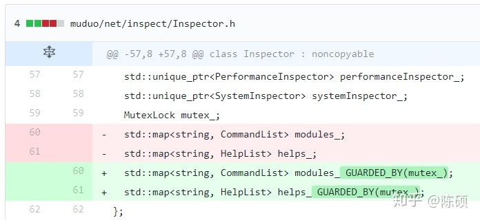
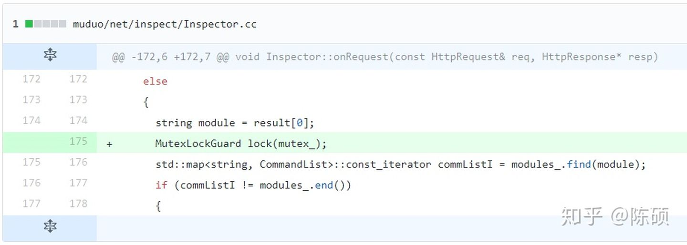

## C++11 并发指南一(C++11 多线程初探)

### **引言**

C++11 自2011年发布以来已经快两年了，之前一直没怎么关注，直到最近几个月才看了一些 C++11 的新特性，今后几篇博客我都会写一些关于 C++11 的特性，算是记录一下自己学到的东西吧，和大家共勉。

相信 Linux 程序员都用过 Pthread, 但有了 C++11 的 std::thread  以后，你可以在语言层面编写多线程程序了，直接的好处就是多线程程序的可移植性得到了很大的提高，所以作为一名 C++ 程序员，熟悉 C++11  的多线程编程方式还是很有益处的。

如果你对 C++11 不太熟悉，建议先看看维基百科上关于 C++11 新特性的介绍，[中文C++11介绍](http://zh.wikipedia.org/zh-cn/C%2B%2B0x)，[英文C++11介绍](https://en.wikipedia.org/wiki/C%2B%2B11) ，另外C++之父 [Bjarne Stroustrup](http://www.stroustrup.com/index.html) 的关于 [C++11 的 FAQ](http://www.stroustrup.com/C++11FAQ.html) 也是必看的，我也收集了一些关于C++11的资料，供大家查阅：

### **资料汇**

http://www.open-std.org/jtc1/sc22/wg21/

C++0x/C++11 Support in GCC：http://gcc.gnu.org/projects/cxx0x.html

What is C++0x：https://www2.research.att.com/~bs/what-is-2009.pdf

 Overview of the New C++：http://www.artima.com/shop/overview_of_the_new_cpp

Overview of the New C++ (C++0x).pdf：http://ishare.iask.sina.com.cn/f/20120005.html?from=like

A Brief Look at C++0x：http://www.artima.com/cppsource/cpp0x.html

Summary of C++11 Feature Availability in gcc and MSVC：http://www.aristeia.com/C++11/C++11FeatureAvailability.htm

C++ 11: Come Closer：http://www.codeproject.com/Articles/344282/Cplusplus-11-Come-Closer

C++11 threads, locks and condition variables： http://www.codeproject.com/Articles/598695/Cplusplus11-threads-locks-and-condition-variables

Move Semantics and Perfect Forwarding in C++11：http://www.codeproject.com/Articles/397492/Move-Semantics-and-Perfect-Forwarding-in-Cplusplus

http://solarianprogrammer.com/categories/C++11/

C++11 Concurrency：http://www.baptiste-wicht.com/2012/03/cpp11-concurrency-part1-start-threads/

http://www.hpl.hp.com/personal/Hans_Boehm/misc_slides/sfacm-cleaned.pdf

http://en.cppreference.com/w/cpp/thread

http://isocpp.org/blog/2012/12/c11-a-cheat-sheet-alex-sinyakov

The Biggest Changes in C++11：http://blog.smartbear.com/c-plus-plus/the-biggest-changes-in-c11-and-why-you-should-care/

Ten C++11 Features Every C++ Developer Should Use：http://www.codeproject.com/Articles/570638/Ten-Cplusplus11-Features-Every-Cplusplus-Developer

 C++11 – A Glance [part 1 of n]：http://www.codeproject.com/Articles/312029/Cplusplus11-A-Glance-part-1-of-n

 C++11 – A Glance [part 2 of n]：http://www.codeproject.com/Articles/314415/Cplusplus11-A-Glance-part-2-of-n

C++11（及现代C++风格）和快速迭代式开发：http://mindhacks.cn/2012/08/27/modern-cpp-practices/

Lambda Functions in C++11 - the Definitive Guide：http://www.cprogramming.com/c++11/c++11-lambda-closures.html

Better types in C++11 - nullptr, enum classes (strongly typed enumerations) and cstdint：http://www.cprogramming.com/c++11/c++11-nullptr-strongly-typed-enum-class.html

Rvalue-references-and-move-semantics-in-c++11：http://www.cprogramming.com/c++11/rvalue-references-and-move-semantics-in-c++11.html

http://www.gotw.ca/publications/index.htm

http://www.devx.com/SpecialReports/Door/38865

Multi-threading in C++0x：http://accu.org/index.php/journals/1584

C++ 0X feature summary cheat sheat：http://www.iesensor.com/blog/2011/05/31/c-0x-feature-summary-cheat-sheat/

Multithreading in C++0x part 1: Starting Threads：http://www.justsoftwaresolutions.co.uk/threading/multithreading-in-c++0x-part-1-starting-threads.html

http://en.cppreference.com/w/cpp/thread

http://www.cplusplus.com/reference/multithreading/

好了，下面来说正题吧 ;-)

### **与 C++11 多线程相关的头文件**

C++11 新标准中引入了四个头文件来支持多线程编程，他们分别是`<atomic>` ,`<thread>`,`<mutex>`,`<condition_variable>`和`<future>`。

- `<atomic>`：该头文主要声明了两个类, `std::atomic `和 `std::atomic_flag`，另外还声明了一套 C 风格的原子类型和与 C 兼容的原子操作的函数。
- `<thread>`：该头文件主要声明了` std::thread `类，另外 `std::this_thread `命名空间也在该头文件中。
- `<mutex>`：该头文件主要声明了与互斥量(`mutex`)相关的类，包括 `std::mutex` 系列类，`std::lock_guard`, `std::unique_lock`, 以及其他的类型和函数。
- `<condition_variable>`：该头文件主要声明了与条件变量相关的类，包括` std::condition_variable `和` std::condition_variable_any`。
- `<future>`：该头文件主要声明了 `std::promise, std::package_task` 两个 `Provider` 类，以及 `std::future` 和 `std::shared_future`两个 `Future ` 类，另外还有一些与之相关的类型和函数，`std::async()` 函数就声明在此头文件中。

### **std::thread "Hello world"**

下面是一个最简单的使用 std::thread 类的例子：

```c++
#include <stdio.h>
#include <stdlib.h>

#include <iostream> // std::cout
#include <thread>   // std::thread

void thread_task() {
    std::cout << "hello thread" << std::endl;
}

/*
 * ===  FUNCTION  =========================================================
 *         Name:  main
 *  Description:  program entry routine.
 * ========================================================================
 */
int main(int argc, const char *argv[])
{
    std::thread t(thread_task);
    t.join();

    return EXIT_SUCCESS;
}  /* ----------  end of function main  ---------- */
```

Makefile 如下：

```c++
all:Thread

CC=g++
CPPFLAGS=-Wall -std=c++11 -ggdb
LDFLAGS=-pthread

Thread:Thread.o
    $(CC) $(LDFLAGS) -o $@ $^

Thread.o:Thread.cc
    $(CC) $(CPPFLAGS) -o $@ -c $^


.PHONY:
    clean

clean:
    rm Thread.o Thread
```

注意在 Linux GCC4.6 环境下，编译时需要加 -pthread，否则执行时会出现：

```shell
$ ./Thread
terminate called after throwing an instance of 'std::system_error'
  what():  Operation not permitted
Aborted (core dumped)
```

原因是 GCC 默认没有加载 pthread 库，据说在后续的版本中可以不用在编译时添加 -pthread 选项。

## C++11 并发指南二(std::thread 详解)

上一篇博客`C++11 并发指南一(C++11 多线程初探)`中只是提到了 `std::thread` 的基本用法，并给出了一个最简单的例子，本文将稍微详细地介绍 `std::thread` 的用法。

`std::thread `在 `<thread>` 头文件中声明，因此使用` std::thread `时需要包含 `<thread> `头文件。

### std::thread 构造


| default (1)        | `thread() noexcept; `                                        |
| ------------------ | ------------------------------------------------------------ |
| initialization (2) | `template <class Fn, class... Args> ; `<br />`explicit thread (Fn&& fn, Args&&... args)` |
| copy [deleted] (3) | `thread (const thread&) = delete; `                          |
| move (4)           | `thread (thread&& x) noexcept;`                              |

- (1). 默认构造函数，创建一个空的` thread `执行对象。
- (2). 初始化构造函数，创建一个 `thread`对象，该 `thread`对象可被 `joinable`，新产生的线程会调用` fn` 函数，该函数的参数由` args` 给出。
- (3). 拷贝构造函数(被禁用)，意味着` thread` 不可被拷贝构造。
- (4). `move` 构造函数，`move `构造函数，调用成功之后 `x `不代表任何` thread `执行对象。
- 注意：可被` joinable` 的 `thread `对象必须在他们销毁之前被主线程 `join`或者将其设置为 `detached`.

std::thread 各种构造函数例子如下（[参考](http://en.cppreference.com/w/cpp/thread/thread/thread)）：

```c++
#include <iostream>
#include <utility>
#include <thread>
#include <chrono>
#include <functional>
#include <atomic>
 
void f1(int n)
{
    for (int i = 0; i < 5; ++i) {
        std::cout << "Thread " << n << " executing\n";
        std::this_thread::sleep_for(std::chrono::milliseconds(10));
    }
}
 
void f2(int& n)
{
    for (int i = 0; i < 5; ++i) {
        std::cout << "Thread 2 executing\n";
        ++n;
        std::this_thread::sleep_for(std::chrono::milliseconds(10));
    }
}
 
int main()
{
    int n = 0;
    std::thread t1; // t1 is not a thread
    std::thread t2(f1, n + 1); // pass by value
    std::thread t3(f2, std::ref(n)); // pass by reference
    std::thread t4(std::move(t3)); // t4 is now running f2(). t3 is no longer a thread
    t2.join();
    t4.join();
    std::cout << "Final value of n is " << n << '\n';
}
```

### move 赋值操作

| move (1)           | `thread& operator= (thread&& rhs) noexcept; ` |
| ------------------ | --------------------------------------------- |
| copy [deleted] (2) | `thread& operator= (const thread&) = delete;` |

- (1). `move` 赋值操作，如果当前对象不可` joinable`，需要传递一个右值引用(`rhs`)给 `move` 赋值操作；如果当前对象可被` joinable`，则 `terminate() `报错。
- (2). 拷贝赋值操作被禁用，`thread` 对象不可被拷贝。

请看下面的例子：

```c++
#include <stdio.h>
#include <stdlib.h>

#include <chrono>    // std::chrono::seconds
#include <iostream>  // std::cout
#include <thread>    // std::thread, std::this_thread::sleep_for

void thread_task(int n) {
    std::this_thread::sleep_for(std::chrono::seconds(n));
    std::cout << "hello thread "
        << std::this_thread::get_id()
        << " paused " << n << " seconds" << std::endl;
}

/*
 * ===  FUNCTION  =========================================================
 *         Name:  main
 *  Description:  program entry routine.
 * ========================================================================
 */
int main(int argc, const char *argv[])
{
    std::thread threads[5];
    std::cout << "Spawning 5 threads...\n";
    for (int i = 0; i < 5; i++) {
        threads[i] = std::thread(thread_task, i + 1);
    }
    std::cout << "Done spawning threads! Now wait for them to join\n";
    for (auto& t: threads) {
        t.join();
    }
    std::cout << "All threads joined.\n";

    return EXIT_SUCCESS;
}  /* ----------  end of function main  ---------- */
```

### 其他成员函数

- [**get_id**](http://www.cplusplus.com/reference/thread/thread/get_id/)

  获取线程 ID。

- [**joinable**](http://www.cplusplus.com/reference/thread/thread/joinable/)

  检查线程是否可被 join。

- [**join**](http://www.cplusplus.com/reference/thread/thread/join/)

  Join 线程。 

- [**detach**](http://www.cplusplus.com/reference/thread/thread/detach/)   分离

  Detach 线程 

- [**swap**](http://www.cplusplus.com/reference/thread/thread/swap/)

  Swap 线程 。 

- [**native_handle**](http://www.cplusplus.com/reference/thread/thread/native_handle/)

  返回 native handle。 

- **hardware_concurrency [static\]**

  检测硬件并发特性。


# Clang Thread Safety Analysis

是在Clang Thread Safety Analysis（线程安全分析）中定义的属性，Clang Thread Safety Analysis是C ++语言扩展，它警告代码中潜在的竞争条件。分析是完全静态的（即编译时）；没有运行时开销。该分析仍在积极开发中，但已经足够成熟，可以在工业环境中进行部署。它是由Google与CERT / SEI合作开发的，并广泛用于Google的内部代码库中。

```c++
...
static ListenerList& listener_list GUARDED_BY(listener_list_mutex) = *new ListenerList();
...
static void listener_disconnect(void* arg, atransport*) EXCLUDES(listener_list_mutex) {
...
}
```


EXCLUDES(mutex_);

EXCLUDES是函数或方法的属性，该属性声明调用方不拥有给定的功能。该注释用于防止死锁。许多互斥量实现都不是可重入的，因此，如果函数第二次获取互斥量，则可能发生死锁。
在上面代码中的EXCLUDES表示的意思是：调用listener_disconnect()函数的调用用不能拥有listener_list_mutex锁。

GUARDED_BY(mutex_)

GUARDED_BY是数据成员的属性，该属性声明数据成员受给定功能保护。对数据的读操作需要共享访问，而写操作则需要互斥访问。
该 GUARDED_BY属性声明线程必须先锁定listener_list_mutex才能对其进行读写listener_list，从而确保增量和减量操作是原子的。


当然，**还有其他的属性**，已经有官方文档，我就不多赘述，有需要的请访问  

CLANG的文档-线程安全分析

https://clang.llvm.org/docs/ThreadSafetyAnalysis.html


# 【C++11高性能服务器】Thread Safety Analysis，概念，用法详解

https://blog.csdn.net/weixin_42157432/article/details/115939656

总览

线程安全分析的工作原理非常类似于多线程程序的类型系统。除了声明数据类型(例如int、float等)之外，程序员还可以(选择性地)声明如何在多线程环境中控制对数据的访问。例如，如果`foo`是由互斥锁`mu`保护的，那么当一段代码在没有首先锁定`mu`的情况下对`foo`进行读写时，分析就会发出警告。类似地，如果有一些特定的例程应该只由GUI线程调用，那么分析将在其他线程调用这些例程时发出警告。


## 主要宏一览

除`NO_THREAD_SAFETY_ANALYSIS`需放在定义，其余均放于声明处！

|                           |                                                              |
| ------------------------- | ------------------------------------------------------------ |
| GUARDED_BY(mu)            | 数据成员收到mu保护，读共享，写排他（即写前锁）               |
| REQUIRES(mu)              | 调用函数或方法前，需要mu,即函数进入前已持有，退出后仍持有    |
| ACQUIRE(mu)               | 调用函数或方法时，持有mu,即函数进入时才持有，退出后不释放    |
| RELEASE(mu)               | 调用函数或方法时，释放mu,即函数进入前已持有，退出前释放      |
| EXCLUDES(mu)              | 调用函数或方法时，不需mu,即函数进入前不能持有，退出后自然不能释放 |
| NO_THREAD_SAFETY_ANALYSIS | 调用函数或方法时，关闭对其线程安全检查                       |
| RETURN_CAPABILITY(mu)     | **声明函数返回对给定能力的引用，**用于注释返回互斥对象的getter方法。 |
| CAPABILITY(<string>)      | 指定**类的对象（this）**可以作为能力使用，配合无参数ACQUIRE和RELEASE使用 |
| SCOPE_CAPABILITY          | 实现RAII-style锁的类的一个属性，其功能在构造函数中获得，在析构函数中释放 |
| TRY_ACQUIRE<bool,mu>      | 试图获得给定的功能，并返回一个指示成功或失败的布尔值         |
| ASSET_CAPABILITY(mu)      | 试图获得给定的功能，并返回一个指示成功或失败的布尔值         |


​	其余关键组合词（如ACQUIRE与ACQUIRE_SHARED）   

- `PT` pointer
- `SHARED` 支持共享访问
- `GENERIC` 支持独占和共享访问

## 入门实操

通过代码注解（annotations）告诉编译器哪些成员变量和成员函数受mutex保护，若忘记加锁，编译器给出警告。
目的：
他人后续维护代码时，特别容易遗漏线程安全的假设。此工具能将原作者设计意图以代码注解清楚地写出来并让编译器【自动检查】！
注意：

- GUARDED_BY 表明哪个成员变量被mutex保护
- clang-Wthead-safety编译代码

```c++
#include "mutex.h"

class BankAccount {
private:
  Mutex mu;
  int   balance GUARDED_BY(mu);

  void depositImpl(int amount) {
    balance += amount;       // WARNING! Cannot write balance without locking mu.
  }

  void withdrawImpl(int amount) REQUIRES(mu) {
    balance -= amount;       // OK. Caller must have locked mu.
  }

public:
  void withdraw(int amount) {
    mu.Lock();
    withdrawImpl(amount);    // OK.  We've locked mu.
  }                          // WARNING!  Failed to unlock mu.

  void transferFrom(BankAccount& b, int amount) {
    mu.Lock();
    b.withdrawImpl(amount);  // WARNING!  Calling withdrawImpl() requires locking b.mu.
    depositImpl(amount);     // OK.  depositImpl() has no requirements.
    mu.Unlock();
  }
};
```

​	

**编译方式：`-Wthread-safety`**
 `clang -c -Wthread-safety example.cpp`

代码解析

`GUARDED_BY(mu)`:对于`balance`读写之前，必须对`mu`上锁，保证增减操作原子性。
`REQUIRES(mu)`: 表示调用函数前“【假定】保证对`mu`上锁，此为前提”，故函数内操作balance是线程安全的。
在`withdraw`中报错`WARNING! Failed to unlock mu.`说明`REQUIRES`可检测锁的解锁操作；
在24行报错`WARNING! Calling withdrawImpl() requires locking b.mu.`，说明线程分析可理解不同的锁。






## 基本概念:功能

线程安全分析提供了 **一种用保护资源的能力**。资源可以是数据成员，也可以是提供对底层资源访问的函数/方法。分析确保调用线程不能访问资源(即调用函数，或读写数据)，除非它有能力这样做。
能力与已命名的c++对象相关联，这些对象声明特定的方法来获取和释放能力。对象的名称用于识别功能，最常见的例子是互斥锁。例如，如果mu是一个互斥锁，那么调用mu. lock()会使调用线程获得访问受mu保护的数据的能力。类似地，调用mu.Unlock()会释放该能力。
一个线程的能力可共享、可独占。 比如说多读单写模式，就包含了读能力共享，写能力独占。
程序运行的任意时刻，线程均有用一组特定的能力，可访问给定资源。线程仅能与其他线程互相释放能力或获取能力，而不能拷贝能力，亦或是摧毁。【注解】假设底层实现以适当方式切换，而不知用于获取和释放的具体机制。

## 参考指南

线程安全分析使用属性来声明线程约束。属性必须附加到命名声明，如类、方法和数据成员。强烈建议用户为各种属性定义宏;示例定义可以在下面的mutex.h中找到。下面的文档假设使用宏。
这些属性只控制线程安全分析做出的假设和它发出的警告。它们不会影响生成的代码或运行时的行为。

## 属性示例
### `GUARDED_BY(c) `and `PT_GUARDED_BY(c)` ： 数据成员

`GUARDED_BY`是数据成员上的一个属性，它声明数据成员受到给定能力的保护。对数据的读操作需要共享访问，而写操作需要排他访问。
`PT_GUARDED_BY`与上述，但用于指针和智能指针。数据成员本身没有约束，但是它所指向的数据受到给定能力的保护。

```c++
GUARDED_BY(mu)能力：
能力为mu，为数据成员p1提供mu的保护，即对数据的读操作需要共享访问，而写操作需要排他访问。
```

```c++
Mutex mu;
int p1             GUARDED_BY(mu);
int *p2             PT_GUARDED_BY(mu);
unique_ptr<int> p3  PT_GUARDED_BY(mu);

void test() {
  p1 = 0;             // Warning!

  *p2 = 42;           // Warning!
  p2 = new int;       // OK.

  *p3 = 42;           // Warning!
  p3.reset(new int);  // OK.
}
```

### `REQUIRES(…)`, `REQUIRES_SHARED(…)` ：函数或方法

`REQUIRES`是函数或方法上的一个属性，它声明调用线程必须独占访问给定的能力。可以指定多个功能。功能必须**在函数进入前持有，退出时后必须持有。**
 `REQUIRES_SHARED` 类似，但仅支持共享访问

```c++
REQUIRES(mu1, mu2)能力解释：
能力为mu1,mu2,在函数进入前持有，退出时后必须持有
```

```c++
Mutex mu1, mu2;
int a GUARDED_BY(mu1);
int b GUARDED_BY(mu2);

void foo() REQUIRES(mu1, mu2) {
  a = 0;
  b = 0;
}

void test() {
  mu1.Lock();
  foo();         // Warning!  Requires mu2.
  mu1.Unlock();
}
```

### `ACQUIRE(…)`, `ACQUIRE_SHARED(…)`, `RELEASE(…)`,`RELEASE_SHARED(…)`,`RELEASE_GENERIC(…)`

```c++
适用于函数或方法
```

#### 有参数

`ACQUIRE`和`ACQUIRE_SHARED`是函数或方法上的属性，声明函数获得能力，但不释放它。该能力进入前不持有，但在退出后持有(`SHARED`区别同上)。
`RELEASE`则相反，声明函数释放能力，即能力在进入前持有，退出前释放

- SHARED：共享
- GENERIC：支持独占与共享

    ACQUIRE(mu)能力解释：
    能力为mu，在进入lockAndInit后持有，退出后持有
```c++
Mutex mu;
MyClass myObject GUARDED_BY(mu);

void lockAndInit() ACQUIRE(mu) {
  mu.Lock();		
  myObject.init();
}

void cleanupAndUnlock() RELEASE(mu) {
  myObject.cleanup();
}                          // Warning!  Need to unlock mu.

void test() {
  lockAndInit();
  myObject.doSomething();
  cleanupAndUnlock();
  myObject.doSomething();  // Warning, mu is not locked.
}
```

#### 无参数

如果没有传递参数给`ACQUIRE`或`RELEASE`，则假定参数为`this`，分析不会检查函数体。这个模式的目的是让那些将**锁细节隐藏在抽象接口**后面的类使用，代码如下：

```c++
template <class T>
class CAPABILITY("mutex") Container {
    /* 指定类的对象可作为能力使用 */
private:
  Mutex mu;
  T* data;

public:
  // Hide mu from public interface.
  void Lock()   ACQUIRE() { mu.Lock(); }
  void Unlock() RELEASE() { mu.Unlock(); }

  T& getElem(int i) { return data[i]; }
};

void test() {
  Container<int> c;
  c.Lock();			
  int i = c.getElem(0);
  c.Unlock();		
}
```

需配合`CAPABILITY`使用，将`Container`转为能力

### `EXCLUDES(…)`： 函数或方法，用于防止死锁（针对不可重入锁）

exclude是函数或方法上的一个属性，声明**调用者**在调用之前不能持有给定能力。此注释用于防止死锁。许多互斥锁的实现都不是可重入的，所以如果函数第二次获得互斥锁，就会发生死锁。

```c++
EXCLUDES(mu)：线程在调用clear时不能持有mu，否则会发生死锁
```

```c++
Mutex mu;
int a GUARDED_BY(mu);

void clear() EXCLUDES(mu) {
  mu.Lock();
  a = 0;
  mu.Unlock();
}

void reset() {
  mu.Lock();	
  clear();     // Warning!  Caller cannot hold 'mu'.
  mu.Unlock();
}
/* 注释11与13行,则无警告 */
```

与`require`不同，`exclude`是可选的。如果属性缺失，分析将不会发出警告，这在某些情况下可能导致假否定。【在[Negative Capabilities](https://clang.llvm.org/docs/ThreadSafetyAnalysis.html#negative)中继续讨论该问题】


### `NO_THREAD_SAFETY_ANALYSIS`：函数或方法，关闭线程安全检查，放在定义中！

`NO_THREAD_SAFETY_ANALYSIS`是函数或方法的一个属性，它关闭该方法的线程安全检查。
 它为

- 故意使用线程不安全的函数或
- 线程安全的函数
   提供了一个安全出口，但分析起来太复杂而无法理解。

```c++
class Counter {
  Mutex mu;
  int a GUARDED_BY(mu);

  void unsafeIncrement() NO_THREAD_SAFETY_ANALYSIS { a++; }
};

/* 由unsateIncrement() 被该属性绑定，故编译时无警告。 */
```

与其他属性不同，`NO_THREAD_SAFETY_ANALYSIS`不是函数接口的一部分，**因此应该放在函数定义中(在.cc或.cpp文件中)**，而不是放在函数声明中(在头文件中)。

### `RETURN_CAPABILITY(c)`： 函数或方法，注释返回互斥对象的`getter`方法

`RETURN_CAPABILITY`是函数或方法的一个属性，它**声明函数返回对给定能力的引用**。它用于注释返回互斥对象的`getter`方法。

```c++
class MyClass {
private:
  Mutex mu;
  int a GUARDED_BY(mu);

public:
  Mutex* getMu() RETURN_CAPABILITY(mu) { return &mu; }

  // analysis knows that getMu() == mu
  void clear() REQUIRES(getMu()) { a = 0; }
};
```

### `ACQUIRED_BEFORE(…)`, `ACQUIRED_AFTER(…)` : 类成员声明，指定顺序，

```c++
未生效，需改进
```

`ACQUIRED_BEFORE`和`ACQUIRED_AFTER`是施加于类成员声明的属性，特别是互斥锁或其他功能的声明。为了防止死锁，这**些声明强制按照特定的顺序获取互斥锁**。

```c++
Mutex m1;
Mutex m2 ACQUIRED_AFTER(m1);

// Alternative declaration
// Mutex m2;
// Mutex m1 ACQUIRED_BEFORE(m2);

void foo() {
  m2.Lock();
  m1.Lock();  // Warning!  m2 must be acquired after m1.
  m1.Unlock();
  m2.Unlock();
}
```

经测试，上述代码并不触发warning,很奇怪，未找到原因；请找到原因的知会我一下，谢谢！

### `CAPABILITY(<string>)`

`CAPABILITY`是类的一个属性，它指定类的对象可以作为能力使用。string参数指定错误消息中的功能类型，例如:“`mutex`”。

```c++
#include "mutex.h"
template <class T>
class CAPABILITY("mutex") Mutex_lock {
private:
  Mutex mu;
  T* data;

public:
  void Lock()   ACQUIRE() { mu.Lock(); }   
   //'acquire_capability' attribute without capability arguments refers to 'this', 
   //but 'Mutex_lock' isn't annotated with 'capability' or 'scoped_lockable' attribute
  void Unlock() RELEASE() { mu.Unlock(); } //'release_capability' attribute without capability arguments refers to 'this', but 'Mutex_lock' isn't annotated with 'capability' or 'scoped_lockable' attribute

  T& getElem(int i) { return data[i]; }
};

void test() {
  Mutex_lock<int> c;
  c.Lock();
  int i = c.getElem(0);
  c.Unlock();
}
```

如上测试，若删除`CAPABILITY("mutex")`，则会在L10和L11报warning，意思为：
 类未用`capability`或`scoped_lockable`注解，故`this`非能力参数，不能作为属性参数使用

### `SCOPED_CAPABILITY`：类，RAII锁

`SCOPED_CAPABILITY`是实现`RAII-style`锁定的类的一个属性，在这些类中，功能在构造函数中获得，在析构函数中释放。
 这样的类需要特殊的处理，因为构造函数和析构函数通过不同的名称引用功能

### `TRY_ACQUIRE(<bool>, …)`, `TRY_ACQUIRE_SHARED(<bool>, …)`

它们是**函数或方法上**的属性，试图获得给定的功能，**并返回一个指示成功或失败的布尔值**。第一个参数必须为true或false，以指定哪个返回值表示成功，其余参数以与ACQUIRE相同的方式(持有不释放)解释。

```c++
Mutex mu;
int a GUARDED_BY(mu);

void foo() {
  bool success = mu.TryLock();
  a = 0;         // Warning, mu is not locked.
  if (success) {
    a = 0;       // Ok.
    mu.Unlock();
  } else {
    a = 0;       // Warning, mu is not locked.
  }
}
```

### `ASSERT_CAPABILITY(…)` and `ASSERT_SHARED_CAPABILITY(…)`

这些是函数或方法上的属性，它断言调用线程已经拥有给定的能力。例如，通过执行一个运行时测试，并在能力未被持有时终止。这种注释的存在会导致分析假定在调用注释的函数后保留该功能。

### 警告标志

`-Wthread-safety`: Umbrella flag which turns on the following three:

- `-Wthread-safety-attributes`: 检查属性语法的完整性
- `-Wthread-safety-analysis`: 核心分析法
- `-Wthread-safety-precise`: 要求互斥量表达式精确匹配。对于有很多别名的代码，可以禁用此警告。
- `-Wthread-safety-reference`: 检查当被保护的成员通过引用传递。

### Negative Capabilities

线程安全分析旨在防止竞争条件和死锁。`GUARDED_BY`和`REQUIRES`属性通过确保在读取或写入受保护的数据之前持有某个能力来防止竞争条件，而`EXCLUDES`属性通过确保没有持有互斥锁来防止死锁。
然而，`EXCLUDES`是一个可选属性，不提供与要求相同的安全保证。特别是:

- 获得某种能力的函数并不一定要排除它
- 如果A函数调用了B函数，B函数排除了某个能力，A函数就不能递归排除该功能。

因此，`EXCLUDES`很容易产生错误否定:

```c++
class Foo {
  Mutex mu;

  void foo() {
    mu.Lock();
    bar();           // No warning.
    baz();           // No warning.
    mu.Unlock();
  }

  void bar() {       // No warning.  (Should have EXCLUDES(mu)).
    mu.Lock();
    // ...
    mu.Unlock();
  }

  void baz() {
    bif();           // No warning.  (Should have EXCLUDES(mu)).
  }

  void bif() EXCLUDES(mu);
};

/* 调用baz()应该会触发warning，但实际并没有，*/
/* 故baz()调用了bif()，bif()排除了mu，baz()并没有拍出mu */
```

### `Negative requirements`

```c++
为EXCLUDES提供了更强的安全保证
```

采用`REQUIRES`属性，链接`！`，表示不应拥有某种能力

```c++
class FooNeg {
  Mutex mu;

  void foo() REQUIRES(!mu) {   // foo() now requires !mu.
    mu.Lock();
    bar();
    baz();
    mu.Unlock();
  }

  void bar() {
    mu.Lock();       // WARNING!  Missing REQUIRES(!mu).
    // ...
    mu.Unlock();
  }

  void baz() {
    bif();           // warning: calling function 'bif' requires holding  '!mu' 
  }

  void bif() REQUIRES(!mu);
};
```

Negative requirements是一个实验性的特性，默认情况下是关闭的，因为它会在现有代码中产生许多警告。它可以通过传递`-Wthread-safety-negative`来启用。

### 常见问题

Q.Should I put attributes in the header file, or in the .cc/.cpp/.cxx file?
(A) Attributes are part of the formal interface of a function, and should always go in the header, where they are visible to anything that includes the header. Attributes in the .cpp file are not visible outside of the immediate translation unit, which leads to false negatives and false positives.

Q.“Mutex is not locked on every path through here?” What does that mean?
A.See No conditionally held locks., below.

### 已知限制（自查，比较简单）

https://clang.llvm.org/docs/ThreadSafetyAnalysis.html#known-limitations

### mutex.h

```c++
#ifndef THREAD_SAFETY_ANALYSIS_MUTEX_H
#define THREAD_SAFETY_ANALYSIS_MUTEX_H

// Enable thread safety attributes only with clang.
// The attributes can be safely erased when compiling with other compilers.
#if defined(__clang__) && (!defined(SWIG))
#define THREAD_ANNOTATION_ATTRIBUTE__(x)   __attribute__((x))
#else
#define THREAD_ANNOTATION_ATTRIBUTE__(x)   // no-op
#endif

#define CAPABILITY(x) \
  THREAD_ANNOTATION_ATTRIBUTE__(capability(x))

#define SCOPED_CAPABILITY \
  THREAD_ANNOTATION_ATTRIBUTE__(scoped_lockable)

#define GUARDED_BY(x) \
  THREAD_ANNOTATION_ATTRIBUTE__(guarded_by(x))

#define PT_GUARDED_BY(x) \
  THREAD_ANNOTATION_ATTRIBUTE__(pt_guarded_by(x))

#define ACQUIRED_BEFORE(...) \
  THREAD_ANNOTATION_ATTRIBUTE__(acquired_before(__VA_ARGS__))

#define ACQUIRED_AFTER(...) \
  THREAD_ANNOTATION_ATTRIBUTE__(acquired_after(__VA_ARGS__))

#define REQUIRES(...) \
  THREAD_ANNOTATION_ATTRIBUTE__(requires_capability(__VA_ARGS__))

#define REQUIRES_SHARED(...) \
  THREAD_ANNOTATION_ATTRIBUTE__(requires_shared_capability(__VA_ARGS__))

#define ACQUIRE(...) \
  THREAD_ANNOTATION_ATTRIBUTE__(acquire_capability(__VA_ARGS__))

#define ACQUIRE_SHARED(...) \
  THREAD_ANNOTATION_ATTRIBUTE__(acquire_shared_capability(__VA_ARGS__))

#define RELEASE(...) \
  THREAD_ANNOTATION_ATTRIBUTE__(release_capability(__VA_ARGS__))

#define RELEASE_SHARED(...) \
  THREAD_ANNOTATION_ATTRIBUTE__(release_shared_capability(__VA_ARGS__))

#define RELEASE_GENERIC(...) \
  THREAD_ANNOTATION_ATTRIBUTE__(release_generic_capability(__VA_ARGS__))

#define TRY_ACQUIRE(...) \
  THREAD_ANNOTATION_ATTRIBUTE__(try_acquire_capability(__VA_ARGS__))

#define TRY_ACQUIRE_SHARED(...) \
  THREAD_ANNOTATION_ATTRIBUTE__(try_acquire_shared_capability(__VA_ARGS__))

#define EXCLUDES(...) \
  THREAD_ANNOTATION_ATTRIBUTE__(locks_excluded(__VA_ARGS__))

#define ASSERT_CAPABILITY(x) \
  THREAD_ANNOTATION_ATTRIBUTE__(assert_capability(x))

#define ASSERT_SHARED_CAPABILITY(x) \
  THREAD_ANNOTATION_ATTRIBUTE__(assert_shared_capability(x))

#define RETURN_CAPABILITY(x) \
  THREAD_ANNOTATION_ATTRIBUTE__(lock_returned(x))

#define NO_THREAD_SAFETY_ANALYSIS \
  THREAD_ANNOTATION_ATTRIBUTE__(no_thread_safety_analysis)


// Defines an annotated interface for mutexes.
// These methods can be implemented to use any internal mutex implementation.
class CAPABILITY("mutex") Mutex {
public:
  // Acquire/lock this mutex exclusively.  Only one thread can have exclusive
  // access at any one time.  Write operations to guarded data require an
  // exclusive lock.
  void Lock() ACQUIRE();

  // Acquire/lock this mutex for read operations, which require only a shared
  // lock.  This assumes a multiple-reader, single writer semantics.  Multiple
  // threads may acquire the mutex simultaneously as readers, but a writer
  // must wait for all of them to release the mutex before it can acquire it
  // exclusively.
  void ReaderLock() ACQUIRE_SHARED();

  // Release/unlock an exclusive mutex.
  void Unlock() RELEASE();

  // Release/unlock a shared mutex.
  void ReaderUnlock() RELEASE_SHARED();

  // Generic unlock, can unlock exclusive and shared mutexes.
  void GenericUnlock() RELEASE_GENERIC();

  // Try to acquire the mutex.  Returns true on success, and false on failure.
  bool TryLock() TRY_ACQUIRE(true);

  // Try to acquire the mutex for read operations.
  bool ReaderTryLock() TRY_ACQUIRE_SHARED(true);

  // Assert that this mutex is currently held by the calling thread.
  void AssertHeld() ASSERT_CAPABILITY(this);

  // Assert that is mutex is currently held for read operations.
  void AssertReaderHeld() ASSERT_SHARED_CAPABILITY(this);

  // For negative capabilities.
  const Mutex& operator!() const { return *this; }
};

// Tag types for selecting a constructor.
struct adopt_lock_t {} inline constexpr adopt_lock = {};
struct defer_lock_t {} inline constexpr defer_lock = {};
struct shared_lock_t {} inline constexpr shared_lock = {};

// MutexLocker is an RAII class that acquires a mutex in its constructor, and
// releases it in its destructor.
class SCOPED_CAPABILITY MutexLocker {
private:
  Mutex* mut;
  bool locked;

public:
  // Acquire mu, implicitly acquire *this and associate it with mu.
  MutexLocker(Mutex *mu) ACQUIRE(mu) : mut(mu), locked(true) {
    mu->Lock();
  }

  // Assume mu is held, implicitly acquire *this and associate it with mu.
  MutexLocker(Mutex *mu, adopt_lock_t) REQUIRES(mu) : mut(mu), locked(true) {}

  // Acquire mu in shared mode, implicitly acquire *this and associate it with mu.
  MutexLocker(Mutex *mu, shared_lock_t) ACQUIRE_SHARED(mu) : mut(mu), locked(true) {
    mu->ReaderLock();
  }

  // Assume mu is held in shared mode, implicitly acquire *this and associate it with mu.
  MutexLocker(Mutex *mu, adopt_lock_t, shared_lock_t) REQUIRES_SHARED(mu)
    : mut(mu), locked(true) {}

  // Assume mu is not held, implicitly acquire *this and associate it with mu.
  MutexLocker(Mutex *mu, defer_lock_t) EXCLUDES(mu) : mut(mu), locked(false) {}

  // Release *this and all associated mutexes, if they are still held.
  // There is no warning if the scope was already unlocked before.
  ~MutexLocker() RELEASE() {
    if (locked)
      mut->GenericUnlock();
  }

  // Acquire all associated mutexes exclusively.
  void Lock() ACQUIRE() {
    mut->Lock();
    locked = true;
  }

  // Try to acquire all associated mutexes exclusively.
  bool TryLock() TRY_ACQUIRE(true) {
    return locked = mut->TryLock();
  }

  // Acquire all associated mutexes in shared mode.
  void ReaderLock() ACQUIRE_SHARED() {
    mut->ReaderLock();
    locked = true;
  }

  // Try to acquire all associated mutexes in shared mode.
  bool ReaderTryLock() TRY_ACQUIRE_SHARED(true) {
    return locked = mut->ReaderTryLock();
  }

  // Release all associated mutexes. Warn on double unlock.
  void Unlock() RELEASE() {
    mut->Unlock();
    locked = false;
  }

  // Release all associated mutexes. Warn on double unlock.
  void ReaderUnlock() RELEASE() {
    mut->ReaderUnlock();
    locked = false;
  }
};


#ifdef USE_LOCK_STYLE_THREAD_SAFETY_ATTRIBUTES
// The original version of thread safety analysis the following attribute
// definitions.  These use a lock-based terminology.  They are still in use
// by existing thread safety code, and will continue to be supported.

// Deprecated.
#define PT_GUARDED_VAR \
  THREAD_ANNOTATION_ATTRIBUTE__(pt_guarded_var)

// Deprecated.
#define GUARDED_VAR \
  THREAD_ANNOTATION_ATTRIBUTE__(guarded_var)

// Replaced by REQUIRES
#define EXCLUSIVE_LOCKS_REQUIRED(...) \
  THREAD_ANNOTATION_ATTRIBUTE__(exclusive_locks_required(__VA_ARGS__))

// Replaced by REQUIRES_SHARED
#define SHARED_LOCKS_REQUIRED(...) \
  THREAD_ANNOTATION_ATTRIBUTE__(shared_locks_required(__VA_ARGS__))

// Replaced by CAPABILITY
#define LOCKABLE \
  THREAD_ANNOTATION_ATTRIBUTE__(lockable)

// Replaced by SCOPED_CAPABILITY
#define SCOPED_LOCKABLE \
  THREAD_ANNOTATION_ATTRIBUTE__(scoped_lockable)

// Replaced by ACQUIRE
#define EXCLUSIVE_LOCK_FUNCTION(...) \
  THREAD_ANNOTATION_ATTRIBUTE__(exclusive_lock_function(__VA_ARGS__))

// Replaced by ACQUIRE_SHARED
#define SHARED_LOCK_FUNCTION(...) \
  THREAD_ANNOTATION_ATTRIBUTE__(shared_lock_function(__VA_ARGS__))

// Replaced by RELEASE and RELEASE_SHARED
#define UNLOCK_FUNCTION(...) \
  THREAD_ANNOTATION_ATTRIBUTE__(unlock_function(__VA_ARGS__))

// Replaced by TRY_ACQUIRE
#define EXCLUSIVE_TRYLOCK_FUNCTION(...) \
  THREAD_ANNOTATION_ATTRIBUTE__(exclusive_trylock_function(__VA_ARGS__))

// Replaced by TRY_ACQUIRE_SHARED
#define SHARED_TRYLOCK_FUNCTION(...) \
  THREAD_ANNOTATION_ATTRIBUTE__(shared_trylock_function(__VA_ARGS__))

// Replaced by ASSERT_CAPABILITY
#define ASSERT_EXCLUSIVE_LOCK(...) \
  THREAD_ANNOTATION_ATTRIBUTE__(assert_exclusive_lock(__VA_ARGS__))

// Replaced by ASSERT_SHARED_CAPABILITY
#define ASSERT_SHARED_LOCK(...) \
  THREAD_ANNOTATION_ATTRIBUTE__(assert_shared_lock(__VA_ARGS__))

// Replaced by EXCLUDE_CAPABILITY.
#define LOCKS_EXCLUDED(...) \
  THREAD_ANNOTATION_ATTRIBUTE__(locks_excluded(__VA_ARGS__))

// Replaced by RETURN_CAPABILITY
#define LOCK_RETURNED(x) \
  THREAD_ANNOTATION_ATTRIBUTE__(lock_returned(x))

#endif  // USE_LOCK_STYLE_THREAD_SAFETY_ATTRIBUTES

#endif  // THREAD_SAFETY_ANALYSIS_MUTEX_H
```

