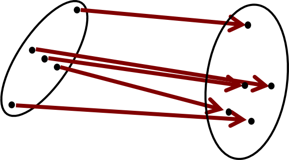
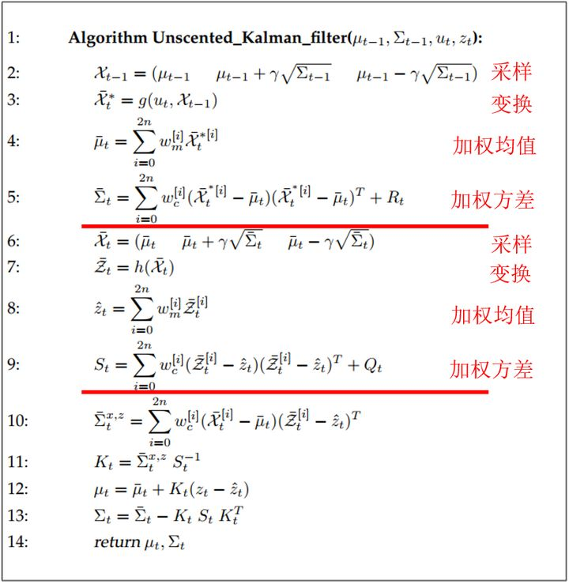

现总结kalman_filter文件夹涉及到的主要功能：

【1】kalman_filter/gaussian_distribution.h

GaussianDistribution定义了多个变量的高斯分布。构造函数是N1的均值矩阵和NN的协方差矩阵

    数据成员:
        Eigen::Matrix<T, N, 1> mean_; //N*1，均值
        Eigen::Matrix<T, N, N> covariance_; //N*N。协方差
    
    构造函数
    
    GaussianDistribution(const Eigen::Matrix<T, N, 1>& mean, const Eigen::Matrix<T, N, N>& covariance) 初始化均值和协方差
    
    全局函数
        重载"+"加号操作符 * GaussianDistribution<T, N> operator+(const GaussianDistribution<T, N>& lhs, const GaussianDistribution<T, N>& rhs) 高斯+高斯=对应均值+均值,对应协方差+协方差 返回值：新高斯对象 .
    
    重载乘法运算符 * GaussianDistribution<T, N> operator*(const Eigen::Matrix<T, N, M>& lhs, const GaussianDistribution<T, M>& rhs) 1,矩阵NM 2,高斯分布MM 返回值:高斯分布：N*N

【2】 unscented_kalman_filter.h

UnscentedKalmanFilter类是根据《Probabilistic Robotics》实现的无损卡尔曼滤波的算法，并且根据论文 A Quaternion-based Unscented Kalman Filter for Orientation，Kraft ,E.中的算法，扩展到了处理非线性噪声和传感器。卡尔曼滤波器的操作包括两个阶段：预测与更新。在预测阶段，滤波器使用上一状态的估计，做出对当前状态的估计。在更新阶段，滤波器利用对当前状态的观测值优化在预测阶段获得的预测值，以获得一个更精确的新估计值。

相关公式推导：

# 线性代数和概率论准备知识：

$$
A = \begin{bmatrix}
a_{11} & a_{12} & \cdots & a_{1m}\\
a_{21} & a_{22} & \cdots & a_{2m}\\
\vdots & \vdots & \ddots & \vdots\\
a_{n1} & a_{n2} & \cdots & a_{nm}
\end{bmatrix} = \begin{bmatrix}
A_1 \\
A_2 \\
\vdots \\
A_n
\end{bmatrix}\\
\\
X = \begin{bmatrix}
x_{11} & x_{12} & \cdots & x_{1s}\\
x_{21} & x_{22} & \cdots & x_{2s}\\
\vdots & \vdots & \ddots & \vdots\\
x_{m1} & x_{m2} & \cdots & x_{ms}
\end{bmatrix} = \begin{bmatrix}
X_1 \\
X_2 \\
\vdots \\
X_m
\end{bmatrix} \\
\\
\mu = E(X) = \begin{bmatrix}
E(X_1) \\
E(X_2) \\
\vdots\\
E(X_m)
\end{bmatrix} = \begin{bmatrix}
\mu_1 \\
\mu_2 \\
\vdots \\
\mu_m
\end{bmatrix} \\
\\
\overbrace{\sum}^{\text{X}} =E[(X - E[X])(X - E[X]^T)] = \begin{bmatrix}
cov(X_1,X_1) & cov(X_1,X_2) & \cdots & cov(X_1,X_m) \\
cov(X_2,X_1) & cov(X_2,X_2) & \cdots & cov(X_2,X_m) \\
\vdots & \vdots & \ddots & \vdots \\
cov(X_m,X_1) & cov(X_m,X_2) & \cdots & cov(X_m,X_m)
\end{bmatrix} \\
= \begin{bmatrix}
E[(X_1-\mu_1)(X_1-\mu_1)^T] & E[(X_1-\mu_1)(X_2-\mu_2)^T] & \cdots & E[(X_1-\mu_1)(X_m-\mu_m)^T] \\
E[(X_2-\mu_2)(X_1-\mu_1)^T] & E[(X_2-\mu_2)(X_2-\mu_2)^T] & \cdots & E[(X_2-\mu_2)(X_m-\mu_m)^T]\\
\vdots & \vdots & \ddots & \vdots \\
E[(X_m-\mu_m)(X_1-\mu_1)^T] & E[(X_m-\mu_m)(X_2-\mu_2)^T] & \cdots & E[(X_m-\mu_m)(X_m-\mu_m)^T]
\end{bmatrix} \\
\\
Y_{n*s} = Ax = \begin{bmatrix}
A_1X \\
A_2X \\
\vdots \\
A_nX
\end{bmatrix} = \begin{bmatrix}
Y_1 \\
Y_2 \\
\vdots \\
Y_n
\end{bmatrix} \\
\\
E[Y] = \begin{bmatrix}
E[A_1X] \\
E[A_2X] \\
\vdots \\
E[A_nX] 
\end{bmatrix} = \begin{bmatrix}
A_1E[X] \\
A_2E[X] \\
\vdots \\
A_nE[X] 
\end{bmatrix} = \begin{bmatrix}
A_1\mu \\
A_2\mu \\
\vdots \\
A_n\mu
\end{bmatrix} = A\mu  \\
\\
\overbrace{\sum}^{\text{Y}} = \begin{bmatrix}
E[(A_1X-A_1\mu)(A_1X-A_1\mu)^T] & E[(A_1X-A_1\mu)(A_2X-A_2\mu)^T] & \cdots & E[(A_1X-A_1\mu)(A_nX-A_n\mu)^T] \\
E[(A_2X-A_2\mu)(A_1X-A_1\mu)^T] & E[(A_2X-A_2\mu)(A_2X-A_2\mu)^T] & \cdots & E[(A_2X-A_2\mu)(A_nX-A_n\mu)^T] \\
\vdots & \vdots & \ddots & \vdots \\
E[(A_nX-A_n\mu)(A_1X-A_1\mu)^T] & E[(A_nX-A_n\mu)(A_2X-A_2\mu)^T] & \cdots & E[(A_nX-A_n\mu)(A_nX-A_n\mu)^T]
\end{bmatrix} \\ = \begin{bmatrix}
E[A_1(X-\mu)(X-\mu)^TA_1^T] & E[A_1(X-\mu)(X-\mu)^TA_2^T] & \cdots & E[A_1(X-\mu)(X-\mu)^TA_n^T] \\
E[A_2(X-\mu)(X-\mu)^TA_1^T] & E[A_2(X-\mu)(X-\mu)^TA_2^T] & \cdots & E[A_2(X-\mu)(X-\mu)^TA_n^T] \\
\vdots & \vdots & \ddots & \vdots \\
E[A_n(X-\mu)(X-\mu)^TA_1^T] & E[A_n(X-\mu)(X-\mu)^TA_2^T] & \cdots & E[A_n(X-\mu)(X-\mu)^TA_n^T]
\end{bmatrix} \\ = \begin{bmatrix}
A_1E[(X-\mu)(X-\mu)^T]A_1^T & A_1E[(X-\mu)(X-\mu)^T]A_2^T & \cdots & A_1E[(X-\mu)(X-\mu)^T]A_n^T \\
A_2E[(X-\mu)(X-\mu)^T]A_1^T & A_2E[(X-\mu)(X-\mu)^T]A_2^T & \cdots & A_2E[(X-\mu)(X-\mu)^T]A_n^T \\
\vdots & \vdots & \ddots & \vdots \\
A_nE[(X-\mu)(X-\mu)^T]A_1^T & A_nE[(X-\mu)(X-\mu)^T]A_2^T & \cdots & A_nE[(X-\mu)(X-\mu)^T]A_n^T
\end{bmatrix}\\ = 
A\overbrace{\sum}^{\text{X}}A^T
$$
# 卡尔曼滤波推导预测：

$$
\hat{X_k} = \begin{bmatrix}
position \\
velocity
\end{bmatrix} , \qquad P_k = \begin{bmatrix}
\sum_{pp} & \sum_{pv} \\
\sum_{vp} & \sum_{vv}
\end{bmatrix} \\
\\
预测矩阵： \qquad \hat{X_k} = \begin{cases}
\begin{aligned}
p_k = p_{k-1} + \Delta t v_{k-1}\\
v_k = \qquad  \qquad \thinspace v_{k-1}
\end{aligned}
\end{cases} = \begin{bmatrix}
1 & \Delta t \\
0 & 1 
\end{bmatrix} \hat{X_{k-1}} = F_k\hat{X_{k-1}} \\
\\
\hat{X_k} = F_k\hat{X_{k-1}}  , \qquad P_k = F_kP_{K-1}F_k^T \\
\\
外部影响： \qquad  \hat{X_k} = \begin{cases}
\begin{aligned}
p_k &= p_{k-1} + \Delta tv_{k-1} + \frac{1}{2}a\Delta t^2\\
v_k &= \qquad  \qquad \thinspace  v_{k-1} \thinspace +  \quad a \Delta t
\end{aligned}
\end{cases} = \begin{bmatrix}
1 & \Delta t \\
0 & 1 
\end{bmatrix} \hat{X_{k-1}} + \begin{bmatrix}
\frac{\Delta t^2}{2} \\
\Delta t
\end{bmatrix} a = F_k\hat{X_{k-1}} + B_k\overrightarrow{U_k} \\

注： \qquad B_k是控制矩阵，\overrightarrow{U_k}是控制向量 \\
\\
\hat{X_k} = F_k\hat{X_{k-1}} + B_k\overrightarrow{U_k}, \qquad P_k = F_kP_{K-1}F_k^T  + Q_k\\
\large \textcolor{#FF00FF}{新的最佳估计} 
\normalsize 是基于 
\large  \textcolor{BLUE}{原最佳估计} 
\normalsize和 
\large  \textcolor{#FFD700}{已知外部影响}
\normalsize校正后得到的预测。\\

\large \textcolor{#FF00FF}{新的不确定性} 
\normalsize 是基于 
\large  \textcolor{BLUE}{原不确定性} 
\normalsize和 
\large  \textcolor{#FFD700}{外部环境的不确定性}
\normalsize得到的预测。
$$
# 观测细化预测(通过测量来细化估计值)：

我们可能有好几个传感器，它们一起提供有关系统状态的信息。传感器的作用不是我们关心的重点，它可以读取位置，可以读取速度，重点是，它能告诉我们关于状态的间接信息——它是状态下产生的一组读数。

请注意，读数的规模和状态的规模不一定相同，所以我们把传感器读数矩阵设为H_k。
$$
\overrightarrow{\mu_{expected}} = H_k \hat{X_k}, \qquad  \sum_{expected} = H_kP_kH_k^T
$$

卡尔曼滤波的一大优点是擅长处理传感器噪声。

换句话说，由于种种因素，传感器记录的信息其实是不准的，一个状态事实上可以产生多种读数。

我们将这种不确定性（即传感器噪声）的协方差设为 R_k，读数的分布均值设为 Z_k。

现在我们得到了两块高斯分布，一块围绕预测的均值，另一块围绕传感器读数。

如果要生成靠谱预测，模型必须调和这两个信息。也就是说，对于任何可能的读数 (Z_1, Z_2)，

这两种方法预测的状态都有可能是准的，也都有可能是不准的。重点是我们怎么找到这两个准确率。

最简单的方法是两者相乘：

两块高斯分布相乘后，我们可以得到它们的重叠部分，这也是会出现最佳估计的区域。

换个角度看，它看起来也符合高斯分布：

事实证明，当你把两个高斯分布和它们各自的均值和协方差矩阵相乘时，你会得到一个拥有独立均值和协方差矩阵的新高斯分布。

最后剩下的问题就不难解决了：我们必须有一个公式来从旧的参数中获取这些新参数！
$$
\mathcal{N}\left(x, \mu_{0}, \sigma_{0}\right) \cdot \mathcal{N}\left(x, \mu_{1}, \sigma_{1}\right) \stackrel{?}{=} \mathcal{N}\left(x, \mu^{\prime}, \sigma^{\prime}\right)
\\
\\
\begin{flalign}
&\text{一维:}&
\end{flalign}  \\
\mathcal{N}(x, \mu, \sigma)=\frac{1}{\sigma \sqrt{2 \pi}} e^{-\frac{(x-\mu)^{2}}{2 \sigma^{2}}}\\ 
\\
\begin{aligned}
\mu^{\prime} &=\mu_{0}+\frac{\sigma_{0}^{2}\left(\mu_{1}-\mu_{0}\right)}{\sigma_{0}^{2}+\sigma_{1}^{2}} \\
\sigma^{\prime 2} &=\sigma_{0}^{2}-\frac{\sigma_{0}^{4}}{\sigma_{0}^{2}+\sigma_{1}^{2}}
\end{aligned}\\

\begin{aligned}
\mathbf{k} &=\frac{\sigma_{0}^{2}}{\sigma_{0}^{2}+\sigma_{1}^{2}} \\
\mu^{\prime} &=\mu_{0}+\mathbf{k}\left(\mu_{1}-\mu_{0}\right) \\
\sigma^{\prime 2} &=\sigma_{0}^{2}-\mathbf{k} \sigma_{0}^{2}
\end{aligned}\\
\\
多维空间: \\
\\
\begin{array}{l}
\mathbf{K}=\Sigma_{0}\left(\Sigma_{0}+\Sigma_{1}\right)^{-1} \\
\vec{\mu}^{\prime}=\overrightarrow{\mu_{0}}+\mathbf{K}\left(\overrightarrow{\mu_{1}}-\overrightarrow{\mu_{0}}\right) \\
\Sigma^{\prime}=\Sigma_{0}-\mathbf{K} \Sigma_{0}
\end{array}
$$
截至目前，我们有用矩阵 $(\mu_0,\sum_0) = (H_k\hat{X_k}, H_kP_kH_k^T)$预测的分布，有用传感器读数 $(\mu_1,\sum_1) = (\hat{Z_k}, R_k)$预测的分布。
$$
\begin{array}
\mathbf{H}_{k} \hat{\mathbf{X}}_{k}^{\prime} &= &\mathbf{H}_{k} \hat{\mathbf{X}}_{k} &+ &\mathbf{K}\left(\overrightarrow{z_{k}}-\mathbf{H}_{k} \hat{\mathbf{X}}_{k}\right) 
\\
\mathbf{H}_{k} \mathbf{P}_{k}^{\prime} \mathbf{H}_{k}^{T} &= &\mathbf{H}_{k} \mathbf{P}_{k} \mathbf{H}_{k}^{T} &- &\mathbf{K} \mathbf{H}_{k} \mathbf{P}_{k} \mathbf{H}_{k}^{T} \\
\end{array}
$$
相应的，卡尔曼增益就是：
$$
\mathbf{K}=\mathbf{H}_{k} \mathbf{P}_{k} \mathbf{H}_{k}^{T}\left(\mathbf{H}_{k} \mathbf{P}_{k} \mathbf{H}_{k}^{T}+\mathbf{R}_{k}\right)^{-1}
$$
考虑到 ![[公式]](https://www.zhihu.com/equation?tex=K) 里还包含着一个 ![[公式]](https://www.zhihu.com/equation?tex=H_k) ，我们再精简一下上式：
$$
\mathbf{K}^{\prime} = \mathbf{P}_{k} \mathbf{H}_{k}^{T}\left(\mathbf{H}_{k} \mathbf{P}_{k} \mathbf{H}_{k}^{T}+\mathbf{R}_{k}\right)^{-1} \\

\begin{array}
\hat{\mathbf{x}}_{k}^{\prime} &= &\hat{\mathbf{x}}_{k} &+ &\mathbf{K}^{\prime}\left(\overrightarrow{\mathbf{z}_{k}} - \mathbf{H}_{k} \hat{\mathbf{x}}_{k}\right) 
\\
\mathbf{P}_{k}^{\prime} &= &\mathbf{P}_{k} &- &\mathbf{K}^{\prime} \mathbf{H}_{k} \mathbf{P}_{k} 
\\
\end{array}
$$
最后, $\hat X_k^{\prime}$ 是我们的最佳估计值，我们可以把它继续放进去做另一轮预测：

无迹卡尔曼滤波（UKF:

我们先来简单看一下蒙特卡洛估方法。还是下面这张图，在原高斯分布中采样，很多采样点（该图中是500000个画出来的），将采样点通过非线性变换，再统计变换后的结果的均值与方差，近似用一个高斯分布表示。这种方法的缺点很明显，计算量巨大，特别是在高维时。

而在UKF的无迹变换中我们不再进行如此大量的采样，而只选取有限的采样点（下图中为3个），还是将其经过非线性变换，最后加权统计变换后结果的均值和方差，从下图中可以看到其估计结果与蒙特卡洛相差不大。

总结来说，无迹变换分为三个步骤：

- 原高斯分布中按一定规则采样：

- 采样点经过非线性变换：

- 加权统计变换结果：

那接下来的问题就是如何采样，分配权值呢？

我们先举一个一维的简单例子：

$\mathbf{\mathcal{X}} \sim \mathcal{N}(\mu, \sigma^2), \quad \mathbf {\mathcal{Y}} = sin(\mathbf{\mathcal{X}})$ 这里是一维的情况，$\mathbf{\mathcal{X}}$属于高斯分布，我们来估计 $\mathbf{\mathcal{Y}}$，在一维情况下，我们选择三个点，称作 $\sigma$点：
$$
x_{0}=\mu, \quad x_{1}=\mu+\sigma, \quad x_{2}=\mu-\sigma
$$
再选择合适的权重，使其满足：
$$
\mu=\sum_{i} W_{i} x_{i}, \qquad \sigma^{2}=\sum_{i} W_{i}\left(x_{i}-\mu\right)^{2}
$$
因此我们可以计算y的均值和方差：
$$
\mu_{y}=\sum_{i} W_{i} \sin \left(x_{i}\right), \qquad \sigma_{y}^{2}=\sum_{i} W_{i}\left(\sin \left(x_{i}\right)-\mu\right)^{2}
$$
现在我们可以推广到更一般的N维:  $\mathbf{\mathcal{X}} \sim \mathcal{N}(\mu, \sigma^2), \quad \mathbf {\mathcal{Y}} = g(\mathbf{\mathcal{X}})$

现在我们选择 $2n + 1$个 $\sigma$点: $\mathcal{X}^{[i]}$, 以及其权重: $w^{[i]}$

仍然使其满足条件：
$$
\begin{aligned}
\mu &=\sum_{i} w^{[i]} \mathcal{X}^{[i]} \\
\Sigma &=\sum_{i} w^{[i]}\left(\mathcal{X}^{[i]}-\mu\right)\left(\mathcal{X}^{[i]}-\mu\right)^{T}
\end{aligned}
$$
当然对采样与权值如何分配会有不同的方法，在这里只介绍一种比较常见的：

对于采样点集:  $\mathcal{X}^{[i]}$
$$
\begin{aligned}
\mathcal{X}^{[0]} &=\mu \\
\mathcal{X}^{[i]} &=\mu+(\sqrt{(n+\lambda) \Sigma})_{i} \quad \text { for } i=1, \ldots, n \\
\mathcal{X}^{[i]} &=\mu-(\sqrt{(n+\lambda) \Sigma})_{i-n} \quad \text { for } i=n+1, \ldots, 2 n
\end{aligned}
$$
其中：

$\lambda = \alpha^2(n + k) - n$, 表示 $\sigma$点距离均值多远， $i - n$表示取矩阵的第 $i - n$列

对于权值分配: $w_{[i]}$: （这里用来计算均值和方差的权重略有不同）
$$
\begin{aligned}
\text{计算均值:} \qquad &w_{m}^{[0]} &= \qquad &\frac{\lambda}{n+\lambda} \\
\text{计算方差:} \qquad &w_{c}^{[0]} &= \qquad &w_{m}^{[0]}+\left(1-\alpha^{2}+\beta\right) \\
\text{计算均值，计算方差:} \qquad w_{m}^{[i]} = 
 &w_{c}^{[i]} &= \qquad &\frac{1}{2(n+\lambda)} \text { for } i=1, \ldots, 2 
\end{aligned}
$$
其中：
$$
\begin{array}{l}
\kappa \geq 0 \\
\alpha \in(0,1] \\
\lambda=\alpha^{2}(n+\kappa)-n \\
\beta=2
\end{array}
$$
这里的 $\mathcal{k}, \thinspace \alpha$越多表示了采样点距离均值越远。可以对比一下几种参数的采样结果：

现在我们可以获得估计结果：
$$
\begin{aligned}
\mu^{\prime} &=\sum_{i=0}^{2 n} w_{m}^{[i]} g\left(\mathcal{X}^{[i]}\right) \\
\Sigma^{\prime} &=\sum_{i=0}^{2 n} w_{c}^{[i]}\left(g\left(\mathcal{X}^{[i]}\right)-\mu^{\prime}\right)\left(g\left(\mathcal{X}^{[i]}\right)-\mu^{\prime}\right)^{T}
\end{aligned}
$$

现在我们只需要把无迹变换带入到卡尔曼滤波中便可以获得无迹卡尔曼滤波：

可以对比EKF的算法，形式都是一样的，就不详细解释了，只补充以下算法中的两个简单的变换步骤:
$$
\begin{aligned}
K_{t} &= \overbrace{\bar{\Sigma_{t}} H_t^T}^{\bar{\Sigma}_{t}^{x, z}} \overbrace{(H_t\bar{\Sigma_{t}} H_t^T + Q_t)^{-1}}^{S_{t}}  \\
\\
\Sigma_{t} &=\left(I-K_{t} H_{t}\right) \bar{\Sigma}_{t} \\
&=\bar{\Sigma}_{t}-K_{t} H_{t} \bar{\Sigma}_{t} \\
&=\bar{\Sigma}_{t}-K_{t}\left(\Sigma^{x, z}\right)^{T} \\
&=\bar{\Sigma}_{t}-K_{t}\left(\Sigma^{x, z} S_{t}^{-1} S_{t}\right)^{T} \\
&=\bar{\Sigma}_{t}-K_{t}\left(K_{t} S_{t}\right)^{T} \\
&=\bar{\Sigma}_{t}-K_{t} S_{t}^{T} K_{t}^{T} K_{t}^{T}
\end{aligned}
$$
UKF相比于EKF的精度更高一些，其精度相当于二阶泰勒展开，但速度会略慢一点。UKF另一个巨大优势是不需要计算雅克比矩阵。

，而有些时候雅克比矩阵也确实的我们无法获得的。

另外UKF与PF(粒子滤波)也有相似之处，只是无迹变换中选择的 粒子是明确的，而粒子滤波中的粒子是随机的。随机的好处是可以用于任意分布，但也具有其局限性。因此对于分布近似为高斯分布的，采用UKF将更有效。对粒子滤波的详细介绍：

    全局函数:
    
    constexpr FloatType sqr(FloatType a) 
    求平方
    
    Eigen::Matrix<FloatType, N, N> OuterProduct( const Eigen::Matrix<FloatType, N, 1>& v) ；
    求 N1× 1N -> 外积,N*N
    
    void CheckSymmetric(const Eigen::Matrix<FloatType, N, N>& A) ；
    检查A是否是对称矩阵,A减去A的转置~=0
    
    Eigen::Matrix<FloatType, N, N> MatrixSqrt(const Eigen::Matrix<FloatType, N, N>& A) 
    返回对称半正定矩阵的平方根B,M=B*B

. UnscentedKalmanFilter类

    使用2个别名
    
    using StateType = Eigen::Matrix<FloatType, N, 1>; 
    //状态矩阵N*1
    
    using StateCovarianceType = Eigen::Matrix<FloatType, N, N>;
    //协方差矩阵N*N

    数据成员
    
    GaussianDistribution<FloatType, N> belief_; 
    N*1矩阵，对N个变量的估计
    
    const std::function<StateType(const StateType& state, const StateType& delta)> add_delta_;
    加法操作
    
    const std::function<StateType(const StateType& origin,const StateType& target)> compute_delta_;
    计算偏差操作
    
    构造函数
    explicit UnscentedKalmanFilter( const GaussianDistribution<FloatType, N>& initial_belief, //参数1
    
    std::function<StateType(const StateType& state, const StateType& delta)>  //参数2
      add_delta =  { return state + delta; },
                     
    std::function<StateType(const StateType& origin, const StateType& target)> //参数3
      compute_delta =
           
          
    参数1,N*1矩阵,
    参数2,stl函数对象 add_delta(默认),
    参数3,stl函数对象 compute_delta(默认),
    
    私有的成员函数:
    
    StateType ComputeWeightedError(const StateType& mean_estimate, const std::vector& states)；
    //计算带权重的偏差
    
    StateType ComputeMean(const std::vector& states) ;
    计算均值
    
    公有成员函数:
        void Predict(std::function<StateType(const StateType&)> g, const GaussianDistribution<FloatType, N>& epsilon) ；
        预测，在预测阶段，滤波器使用上一状态的估计，做出对当前状态的估计。
    
        void Observe( std::function<Eigen::Matrix<FloatType, K, 1>(const StateType&)> h, const GaussianDistribution<FloatType, K>& delta) ；
        测量/观察，滤波器利用对当前状态的观测值优化在预测阶段获得的预测值，以获得一个更精确的新估计值。
    
    对UnscentedKalmanFilter类的理解最好通过写一些test函数用于理解。
    
        比如在test.cc中按照给定的g和h，运行500次循环后
        为何state[0]和state[1]均为5？
    
        运行unscented_kalman_filter_le_test.cc:
    
         before:0 42 #滤波前
         Predict:0 0 # 执行预测
         Observe:4.995 4.995 # 执行校正
    
         before:4.995 4.995 #第二次滤波前
         Predict4.995 4.995 # 执行预测
         Observe: 4.9975 4.9975 # 执行校正
        可见经过2次迭代就已经较为准确了。 

【3】pose_tracker.h

pose_tracker.h定义了根据UKF对位姿的滤波后的估计PoseTracker类

    全局定义
    
    typedef Eigen::Matrix3d Pose2DCovariance; 
    //3*3矩阵
    
    typedef Eigen::Matrix<double, 6, 6> PoseCovariance;
    // 6*6 矩阵
    
    struct PoseAndCovariance { transform::Rigid3d pose; PoseCovariance covariance; //6*6 };
    
    PoseAndCovariance operator*(const transform::Rigid3d& transform, const PoseAndCovariance& pose_and_covariance);
    
    PoseCovariance BuildPoseCovariance(double translational_variance, double rotational_variance);
    
    PoseTracker类:
    
    类内数据结构: - enum { 
        kMapPositionX = 0,//位置信息{X,Y,Z} 
        kMapPositionY, 
        kMapPositionZ, 
        kMapOrientationX,//方向信息,3 
        kMapOrientationY, 
        kMapOrientationZ, 
        kMapVelocityX, //速度信息,6
        kMapVelocityY, 
        kMapVelocityZ, 
        kDimension 
        //9, We terminate loops with this. 只追踪9个维度 };
    
        类内别名: 
        using KalmanFilter = UnscentedKalmanFilter<double, kDimension>;//9维的卡尔曼滤波 
    
        using State = KalmanFilter::StateType; //N1矩阵 
    
        using StateCovariance = Eigen::Matrix<double, kDimension, kDimension>;//99 
        
        using Distribution = GaussianDistribution<double, kDimension>;
    
    .lua配置信息:
        trajectory_builder_3d.lua: 
        pose_tracker = { orientation_model_variance = 5e-3,
         position_model_variance = 0.00654766, 
         velocity_model_variance = 0.53926, 
         -- This disables gravity alignment in local SLAM. imu_gravity_time_constant = 1e9, 
         imu_gravity_variance = 0, 
         num_odometry_states = 1, 
         },
    
    数据成员:
    const proto::PoseTrackerOptions options_; 
    //用于位姿估计的传感器特性
    
    common::Time time_; //测量时间
    
    KalmanFilter kalman_filter_; //卡尔曼滤波
    
    mapping::ImuTracker imu_tracker_; //imu跟踪
    
    mapping::OdometryStateTracker odometry_state_tracker_;
    //里程计跟踪
    
    私有的成员函数:
    static Distribution KalmanFilterInit()
    返回初始状态的状态变量的高斯分布
    
    const Distribution BuildModelNoise(double delta_t) const;
    建立零均值噪声模型
    
    void Predict(common::Time time);
    根据当前状态预测time时刻的状态
    
    transform::Rigid3d RigidFromState(const PoseTracker::State& state); 
    结合imu_tracker_和state,计算位姿pose的旋转变换。
    
    构造函数
    PoseTracker(const proto::PoseTrackerOptions& options, common::Time time);
    在给定的time时刻初始化卡尔曼滤波参数
    
    公有的成员函数:
        GetPoseEstimateMeanAndCovariance();
        通过指针获取pose的旋转参数和covariance方差
    
        AddImuLinearAccelerationObservation();
        根据imu观测值更新
    
        AddPoseObservation(); 
        根据map-frame的位姿估计更新
    
        AddOdometerPoseObservation();
        根据里程计的map-like frame位姿估计更新
    
        common::Time time() ;
        最新有效时间
    
        GetBelief(common::Time time);
        未来某一时刻的状态估计值
    
        Eigen::Quaterniond gravity_orientation()；
        imu的重力方向

关于kalman_filter文件夹的源码分析已经完毕，更详细细节可https://github.com/learnmoreonce/cartographer 查看注释版源码。

本文发于：

    http://www.jianshu.com/u/9e38d2febec1
    https://zhuanlan.zhihu.com/learnmoreonce
    http://blog.csdn.net/learnmoreonce
    slam源码分析微信公众号:slamcode
