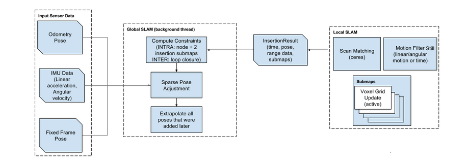

在[Global SLAM的核心——PoseGraph2D](http://gaoyichao.com/Xiaotu/?book=Cartographer源码解读&title=Global_SLAM的核心_PoseGraph2D)中，我们已经研究了后端优化问题的数学形式。    PoseGraph2D通过对象optimization_problem_，    使用一种[SPA(Sparse Pose Adjustment)](http://gaoyichao.com/Xiaotu//papers/2010 - Efficient Sparse Pose Adjustment for 2D Mapping - Konolige et al.pdf)的技术进行优化

现在让我们再次祭出Global SLAM的框图，如下所示，后端优化器是通过一种称为SPA(Sparse Pose Adjustment)的技术，根据路径节点与子图之间的约束关系，优化路径节点与子图的世界坐标。    约束的构建由[约束构建器](http://gaoyichao.com/Xiaotu/?book=Cartographer源码解读&title=约束构建器_constraint_builder_)通过[分支定界](http://gaoyichao.com/Xiaotu/?book=Cartographer源码解读&title=分支定界闭环检测的原理和实现)的方法进行扫描匹配得到。而所谓的SPA技术，本质上还是通过LM(Levenberg-Marquardt)方法进行非线性寻优。由于并不是所有的子图和路径节点之间都有约束，    以至于LM的增量方程中的*H*矩阵是一个稀疏的矩阵，所以可以使用一些优化手段来降低对内存的需求，提高解算效率。所以才说是Sparse的位姿修正。

