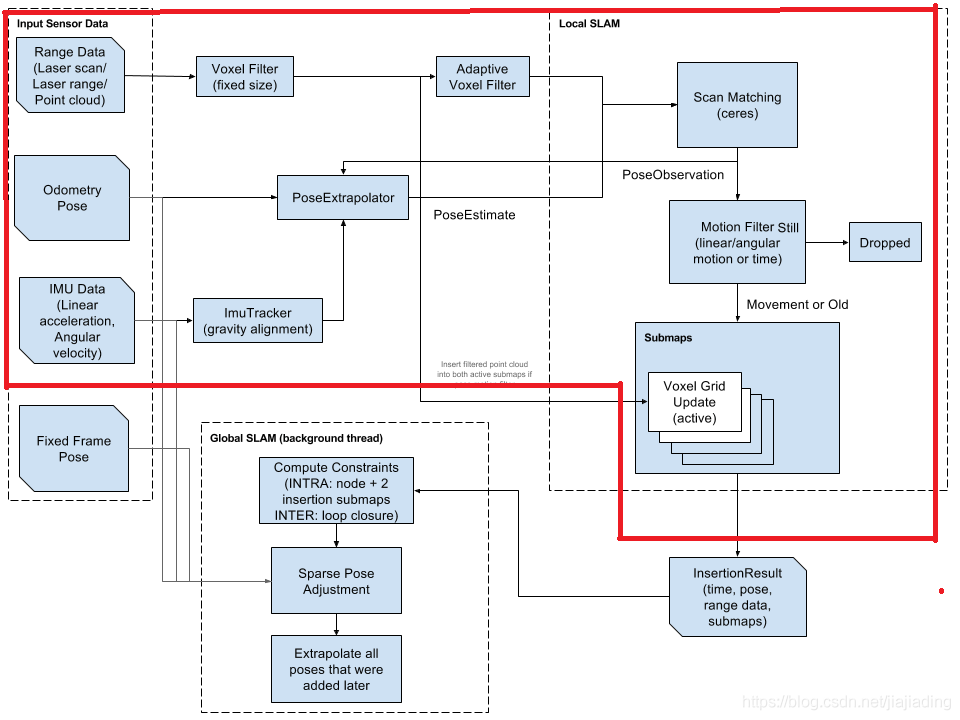

首先，我们来做一个整体上的理解，TrajectoryBuilder是用来创建一个trajectory的。所以，该类首先要保存trajectory上的传感器数据，从一个连续的多帧传感器数据中会抽取若干关键帧。<font color=red>一帧关键帧数据被称为trajectory上的一个节点</font>(注意与ROS中的节点概念相区分)，一条trajectory由一串儿节点组成，<font color=red>所以TrajectoryBuilder要维护一个[节点列表](https://www.zhihu.com/search?q=节点列表&search_source=Entity&hybrid_search_source=Entity&hybrid_search_extra={"sourceType"%3A"article"%2C"sourceId"%3A48790984})</font>.

1、每一帧的传感器数据相对于该Submap的局部坐标变换要已知；

2、该类要创建并维护一个栅格化的Submap列表，以便在MapBuilder中对所有的submap进行优化，形成一个总的Map。

3、每个Submap相对于世界坐标系的位姿要估计出来。

这样PoseGraph才能依据不同的submap各自的位姿变换矩阵把他们tie在一起并做全局优化。


LocalTrajectoryBuilder2D类即为cartographer的前端核心流程和调用接口，即local slam。完成了传感器预处理、scanmatch、位置估计、submap构建及更新调用。其代码目录：
cartographer/mapping/internal/2d/local_trajectory_builder_2d.cc
https://blog.csdn.net/jiajiading/article/details/108880342


# local_trajectory_builder_2d处理流程



其中红色框圈起来的则是local_trajectory_builder_2d所处理的所有内容和流程，其输入仅为激光数据（点云）、odometry，Imu DATA。而经过一系列处理后输出结果为cartographer定义的InsertionResult结果类，包含了时间戳、当前机器人位置、submap及在世界坐标的位置、激光点云结合等。即经过前端处理可以得到一系列的submap，如此后续其他模块可将submap进行后端处理拼接形成整个地图。


参考定义见：

backpack_3d.lua

```c++
options = {
  map_builder = MAP_BUILDER,
  trajectory_builder = TRAJECTORY_BUILDER,
  map_frame = "map",
  tracking_frame = "base_link",
  published_frame = "base_link",
  odom_frame = "odom",
  provide_odom_frame = true,
  use_odometry = false,
  use_laser_scan = false,
  use_multi_echo_laser_scan = false,
  num_point_clouds = 2,
  lookup_transform_timeout_sec = 0.2,
  submap_publish_period_sec = 0.3,
  pose_publish_period_sec = 5e-3,
  trajectory_publish_period_sec = 30e-3,
}
```


 Local map frame是一次slam过程中的原点。但是现在cartographer支持Incremental mapping。global map是整个地图的原点，local map是每一次建图的原点。
   map_frame = “map”：cartographer中使用的全局坐标系，最好保持默认，否则ROS的Rviz不认识其它的定义，导致无法可视化建图过程。
    tracking_frame=”base_link”：机器人中心坐标系，其它传感器数据都是以这个为基础进行插入的，它是整个SLAM系统的核心坐标系；cartographer_ros里面有个tf_bridge的类就是专门用来查询其它坐标系到此坐标系的转换关系。
   published_frame = “base_link”
   odom_frame = “odom”  ：published_frame与odom_frame配合使用，如果参数provide_odom_frame = true  那么最后可视化时，发布的转换消息是从 published_frame->odom_frame->map_frame,  也即cartographer内部计算出了未经回环检测的局部图坐标到优化后的全局图坐标之间的转换关系并发布了出来。在跑官网的二维背包例子时，在map坐标周围一直跳动的odom就是这个玩意。


整体处理流程如下：
1.激光原始数据预处理融合转换成cartographer使用的点云格式；
2.激光点云数据经过两次滤波后进行真正使用；
3.odometry、imu及其匹配后的精确位置构建位置估计器实时估计下刻位置；
4.根据预估位置和点云数据进行scan match获取优化后更精确的位置；
5.经过运动滤波器（目的是降采样）后的位置及其对应的点云进行维护和更新submap；
6.当submap满足一定数量的激光帧时，输出MatchingResult类型结果；

***注意：
 1.其中Fixed Frame Pose在2DSLAM中暂未找到传入接口。
 2.Extrapolator为ImuTracker、OdometryStateTracker，后来的版本使用抽象工厂实现PoseExtrapolator***

