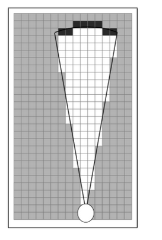
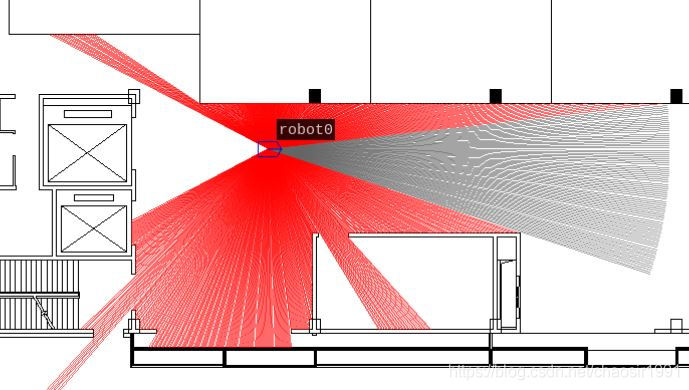
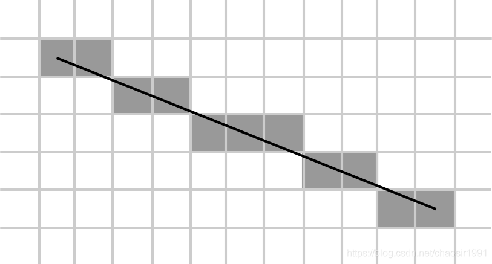
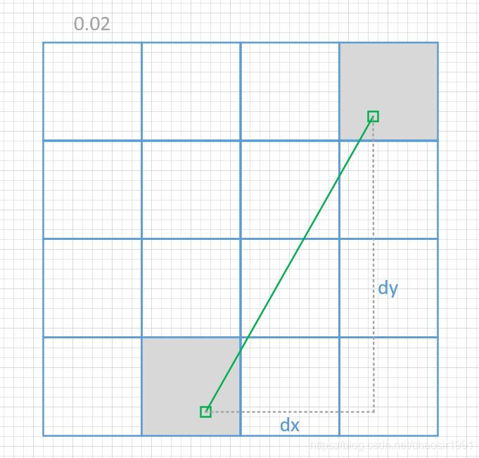
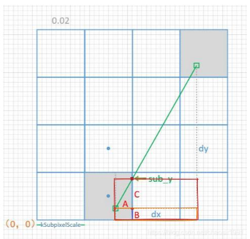
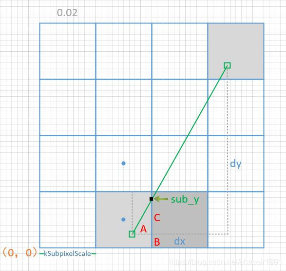
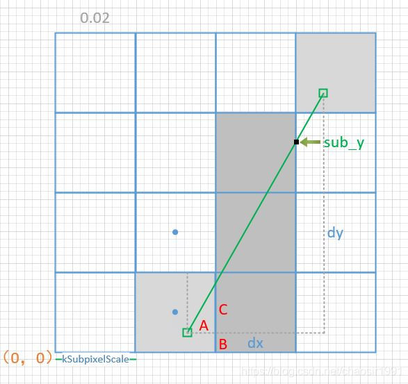
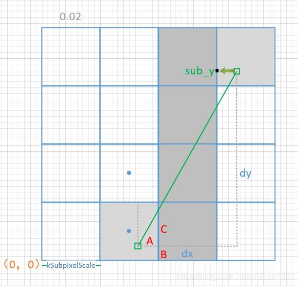
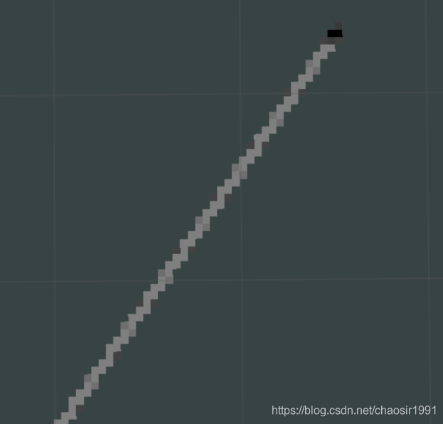
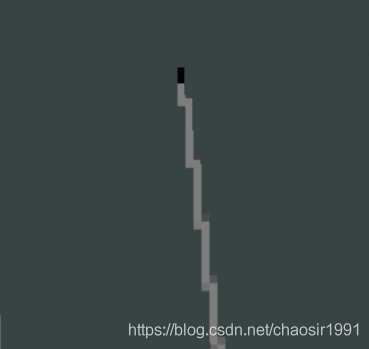

https://blog.csdn.net/chaosir1991/article/details/109561010

前言：
本文主要对google的开源SLAM框架 Cartographer 建图过程中的激光雷达对栅格地图的更新模型CastRay进行详细讲解。目前网上对这部分的讲解比较少，只是大致提一下其使用的是 <font color=red>Bresenham快速画直线算法</font>。本质上是没有问题的，但是 Cartographer 的具体实现上还是有一些变化。之前我直接结合Bresenham和源码对照看，就越看越晕，比较难看懂，后面自己推导了一遍才完全明白，借此做个记录分享。


激光雷达更新栅格地图的目的： 根据最新采集到的雷达点，在与地图匹配后，把雷达点插入到当前地图中，其本质是对栅格地图概率的更新。这里的更新包括两部分，其一是对hit点的概率更新，其二是对CastRay完成激光射线状地图更新，即对一条直线所经过的栅格进行概率值更新。

地图更新的方式：

    计算hit点的索引值，并直接调用ApplyLookupTable更新对应栅格概率。
    采用Bresenham算法思想对雷达射线扫过miss的点进行概率更新。

如下所示是雷达扫描的模型仿真：




其中红色线是雷达的miss部分，线段的端点就是hit点。在更新过程中，hit点更新比较简单，可直接计算对应的栅格坐标并更新；而对于红线的miss部分，则需要根据红线的起始点和终止点计算所经过的栅格才能更新，这里先看看文件 **ray_casting.cc** 的实现：

```c++
// ray_casting.cc
// 传入雷达点，子图大小信息，hit和miss的更新函数指针
void CastRays(const sensor::LaserFan& laser_fan, const MapLimits& limits,
              const std::function<void(const Eigen::Array2i&)>& hit_visitor,
              const std::function<void(const Eigen::Array2i&)>& miss_visitor) {
  // 这里把要更新的子图的分辨率再缩小1000倍，用于再精细化起始点和终止点的坐标
  const double superscaled_resolution = limits.resolution() / kSubpixelScale;
  // 注意这里为更新子图重新构建一个信息结构，地图的limits.max()没有变化
  const MapLimits superscaled_limits(
      superscaled_resolution, limits.max(),
      CellLimits(limits.cell_limits().num_x_cells * kSubpixelScale,
                 limits.cell_limits().num_y_cells * kSubpixelScale));
  // 获取雷达在map坐标系中的坐标作为雷达更新的起始点
  const Eigen::Array2i begin =
      superscaled_limits.GetXYIndexOfCellContainingPoint(laser_fan.origin.x(),
                                                         laser_fan.origin.y());

  // Compute and add the end points.
  // 更新所有hit点的概率值，直接调用hit_visitor即可
  std::vector<Eigen::Array2i> ends;
  ends.reserve(laser_fan.point_cloud.size());
  for (const Eigen::Vector2f& laser_return : laser_fan.point_cloud) {
    ends.push_back(superscaled_limits.GetXYIndexOfCellContainingPoint(
        laser_return.x(), laser_return.y()));
    hit_visitor(ends.back() / kSubpixelScale);
  }

  // Now add the misses. 更新miss射线部分的概率栅格
  for (const Eigen::Array2i& end : ends) {
    CastRay(begin, end, miss_visitor);
  }

  // Finally, compute and add empty rays based on missing echos in the scan.
  // 更新无反馈的雷达射线，借用miss模型
  for (const Eigen::Vector2f& missing_echo :
       laser_fan.missing_echo_point_cloud) {
    CastRay(begin, superscaled_limits.GetXYIndexOfCellContainingPoint(
                       missing_echo.x(), missing_echo.y()),
            miss_visitor);
  }
}
```

可以明确看出，更新hit点的概率很简单，直接调用 hit_visitor(ends.back() / kSubpixelScale); 即可，但更新miss部分则调用了 CastRay(begin, end, miss_visitor); 为每条射线进行单独更新，这也是本篇博文主要想讲的部分。

-> 该问题的核心是求出直线所经过的所有栅格。

在介绍如何快速计算该栅格时，我们需要先介绍一下在计算机图形图像学中的经典算法：Bresenham算法，它是一种典型的直线光栅化算法，也显示器中显示直线的实现形式。其核心思想是：已知当前点坐标及曲（直）线方程，递推下一个（x+1）点的y坐标（或者（y+1）点的x坐标）。如下是显示器显示直线的离散图：



Cartographer中的具体实现方式如下：

```c++
// Factor for subpixel accuracy of start and end point.
constexpr int kSubpixelScale = 1000;

// We divide each pixel in kSubpixelScale x kSubpixelScale subpixels. 'begin'
// and 'end' are coordinates at subpixel precision. We compute all pixels in
// which some part of the line segment connecting 'begin' and 'end' lies.
void CastRay(const Eigen::Array2i& begin, const Eigen::Array2i& end,
             const std::function<void(const Eigen::Array2i&)>& visitor) {
  // For simplicity, we order 'begin' and 'end' by their x coordinate.
  // 保证dx > 0，方便后面计算
  if (begin.x() > end.x()) {
    CastRay(end, begin, visitor);
    return;
  }

  CHECK_GE(begin.x(), 0);
  CHECK_GE(begin.y(), 0);
  CHECK_GE(end.y(), 0);

  // Special case: We have to draw a vertical line in full pixels, as 'begin'
  // and 'end' have the same full pixel x coordinate.
  // 处理当射线为一条竖线的情况
  if (begin.x() / kSubpixelScale == end.x() / kSubpixelScale) {
    Eigen::Array2i current(begin.x() / kSubpixelScale,
                           std::min(begin.y(), end.y()) / kSubpixelScale);
    const int end_y = std::max(begin.y(), end.y()) / kSubpixelScale;
    for (; current.y() <= end_y; ++current.y()) {
      visitor(current);
    }
    return;
  }

  const int64 dx = end.x() - begin.x();
  const int64 dy = end.y() - begin.y();
  // (begin.y() % kSubpixelScale) + 1/2，起始点中心距离所在栅格x边的距离
  // 乘以2 * dx，即矩形面积
  const int64 denominator = 2 * kSubpixelScale * dx;

  // The current full pixel coordinates. We begin at 'begin'.
  Eigen::Array2i current = begin / kSubpixelScale;

  // To represent subpixel centers, we use a factor of 2 * 'kSubpixelScale' in
  // the denominator.
  // +-+-+-+ -- 1 = (2 * kSubpixelScale) / (2 * kSubpixelScale)
  // | | | |
  // +-+-+-+
  // | | | |
  // +-+-+-+ -- top edge of first subpixel = 2 / (2 * kSubpixelScale)
  // | | | | -- center of first subpixel = 1 / (2 * kSubpixelScale)
  // +-+-+-+ -- 0 = 0 / (2 * kSubpixelScale)

  // The center of the subpixel part of 'begin.y()' assuming the
  // 'denominator', i.e., sub_y / denominator is in (0, 1).
  // (begin.y() % kSubpixelScale) + 1/2，起始点中心距离所在栅格x边的距离
  // 乘以2 * dx，即矩形面积
  int64 sub_y = (2 * (begin.y() % kSubpixelScale) + 1) * dx;

  // The distance from the from 'begin' to the right pixel border, to be divided by 2 * 'kSubpixelScale'.
  // 起始点中心距离所在栅格y边的距离，扩大了2倍
  const int first_pixel = 2 * kSubpixelScale - 2 * (begin.x() % kSubpixelScale) - 1;
  // The same from the left pixel border to 'end'.
  // 终点中心距离所在栅格y边的距离，扩大了2倍
  const int last_pixel = 2 * (end.x() % kSubpixelScale) + 1;

  // The full pixel x coordinate of 'end'.
  const int end_x = std::max(begin.x(), end.x()) / kSubpixelScale;

  // Move from 'begin' to the next pixel border to the right.
  sub_y += dy * first_pixel;
  if (dy > 0) {
      // 下面详细介绍
      return;
  }
}
```

Cartographer中为了提升地图更新的精度，把起始点和终止点都放在了更细的分辨率上，这样一来，就需要考虑起始点和终止点相对于所占栅格的偏移，这也是该算法与经典Bresenham算法的差别。如下，我们对该问题进行抽象：



现在问题变成了问题：已知起始点和终止点坐标（1000倍细分），求该两点连线经过的栅格？

```c++
  const int64 dx = end.x() - begin.x();
  const int64 dy = end.y() - begin.y();
  const int64 denominator = 2 * kSubpixelScale * dx;
```

这里首先计算了 $dx$和 $dy$，$denominator$是用于 $Bresenham$算法的避免了浮点运算的因子，提前计算好。  $denominator$的本质上本质上是x轴扩大两倍，一个栅格的面积，即 $kSubpixelScale \times（2 \times dx），这里是 $kSubpixelScale = 1000$；为了更好的解释如下计算，我们把  $$2*dx$除去，便得:

$$
\frac{denominator}{2 \times dx} = kSubpixelScale
$$
后面的  $sub\_y $，其中 $(begin.y() \mod kSubpixelScale) + \frac{1}{2}$，起始点中心距离所在栅格x边的距离, 再乘以2 * dx，即对应下图中橘色矩形面积，则可以很容易得出如下示意：

$$
sub\_ y = 2 \times B \times dx \\
\\ 
first\_pixel = 2 \times A
$$
是后面递推更新栅格的核心，如下对其进行详细解读。

```c++
// sub_y的初始化
sub_y += dy * first_pixel;
```

我们把 $sub\_y$的全等式写出来，对应上图红色矩形的面积

等腰三角形 $\frac{A}{dx} = \frac{C}{dy}$
$$
\begin{aligned}
sub\_y &= sub\_y + dy \times first\_pixel \\
       &= 2 \times B \times dx + 2 \times A \times dy \\
       &= 2 \times B \times dx + 2 \times C \times dx \\
       &= (B + C) \times (2 \times dx)
\end{aligned}
$$
如下开始进行栅格概率更新，主要是用  $sub\_y $与  $denominator$进行比较，而其实际上是 $B+C$ 与 $ kSubpixelScale$进行对比。


```c++
  // Move from 'begin' to the next pixel border to the right.
  sub_y += dy * first_pixel;
  if (dy > 0) {
    while (true) {
      visitor(current);
      while (sub_y > denominator) {
        sub_y -= denominator;
        ++current.y();
        visitor(current);
      }
      ++current.x();
      if (sub_y == denominator) {
        sub_y -= denominator;
        ++current.y();
      }
      if (current.x() == end_x) {
        break;
      }
      // Move from one pixel border to the next.
      sub_y += dy * 2 * kSubpixelScale;
    }
    // Move from the pixel border on the right to 'end'.
    sub_y += dy * last_pixel;
    visitor(current);
    while (sub_y > denominator) {
      sub_y -= denominator;
      ++current.y();
      visitor(current);
    }
    CHECK_NE(sub_y, denominator);
    CHECK_EQ(current.y(), end.y() / kSubpixelScale);
    return;
  }
```

1.当 $sub\_y > denominator $，取当前点上方的点；
2.当 $sub\_y = denominator $取当前点右上方的点；
3.当 $sub\_y < denominator $，取当前点右方的点；

注意：这里需注意起点和终止点的处理，cartographer是以栅格的中心来处理的，因此 $sub\_y$是在与两栅格的中间点进行比较。

如下我们开始更新地图，第一步$sub\_y < denominator $, 取当前点右方的点；




这里需重新计算  $sub\_y = sub\_y + dy \times 2 \times kSubpixelScale$，加了一个斜率单位的高度。
这里会连续出现多次 $sub\_y > denominator$。




如此到达x的终点，需要再次更新 $sub\_y = sub\_y + dy \times laset\_pixel$



最终完成此条射线的栅格更新。

这里我们只讲解了$dy>0$的情况，其实当 $dy<0$时，只是方向变了，其他更新方式都一样。

我们再次对 **Cartographer** 的实际建图过程进行了分析，与我们的理解一致。






到此，CastRay算子的实现算是基本上理解了。
