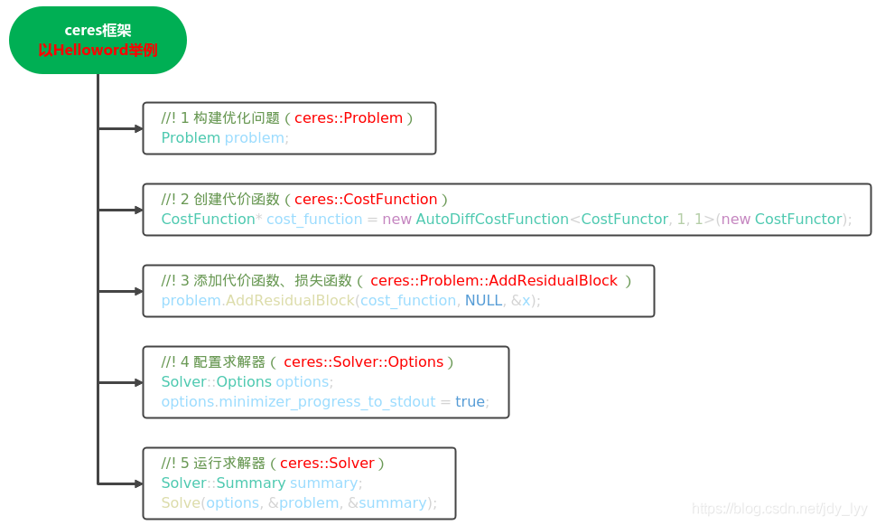
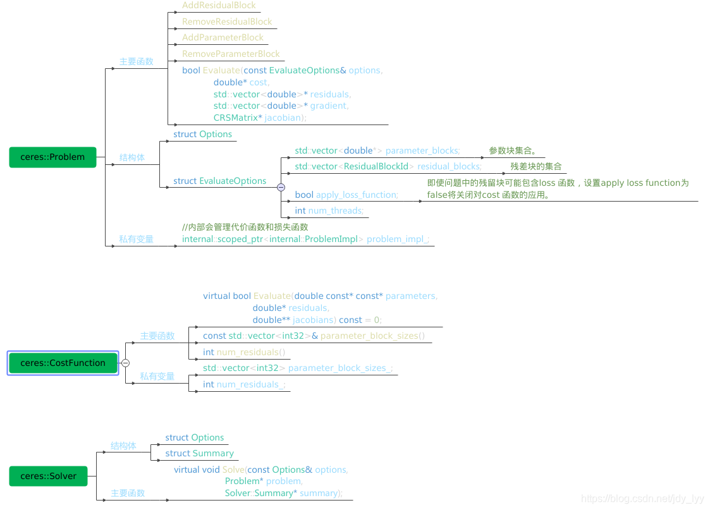
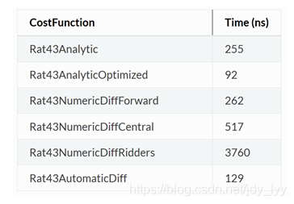
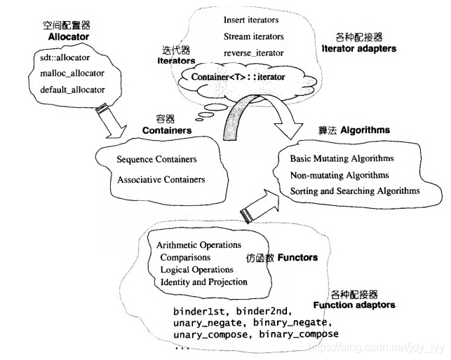
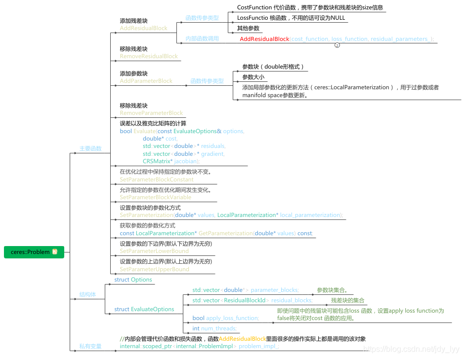
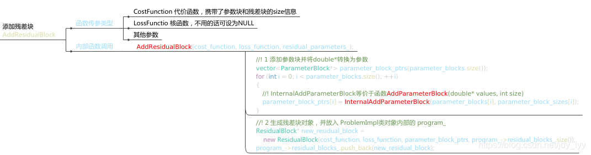

官方文档最好用

http://ceres-solver.org/nnls_modeling.html#autodifflocalparameterization

[Ceres Covariance Estimation](http://ceres-solver.org/nnls_covariance.html#_CPPv2N5ceres10Covariance7OptionsE)

 [1] [ceres-solver](http://ceres-solver.org)
 [2]《A Tutorial on Graph-Based [SLAM](https://so.csdn.net/so/search?q=SLAM)》
 [3]《流形与几何初步》
 [4]《Quater[nio](https://so.csdn.net/so/search?q=nio)n kinematics for the error-state Kalman filter》

[1] [Sola, Joan. "Quaternion kinematics for the error-state Kalman filter." arXiv preprint arXiv:1711.02508 (2017).](https://arxiv.org/pdf/1711.02508.pdf)

[2] [VINS-Mono:  A Robust and Versatile Monocular Visual-Inertial State Estimator, Tong  Qin, Peiliang Li, Zhenfei Yang, Shaojie Shen, IEEE Transactions on  Robotics.](https://arxiv.org/pdf/1708.03852.pdf)


# 基于Ceres库的扫描匹配器
http://gaoyichao.com/Xiaotu/?book=Cartographer%E6%BA%90%E7%A0%81%E8%A7%A3%E8%AF%BB&title=%E5%9F%BA%E4%BA%8ECeres%E5%BA%93%E7%9A%84%E6%89%AB%E6%8F%8F%E5%8C%B9%E9%85%8D%E5%99%A8

 流型空间参考：[ceres教程（2）ceres::LocalParameterization](https://www.guyuehome.com/34727)

通过分析[Local SLAM的业务主线](http://gaoyichao.com/Xiaotu/?book=Cartographer源码解读&title=Loca_SLAM的业务主线_AddRangeData)，我们发现Cartographer主要使用一种基于Ceres库的扫描匹配器，    完成激光扫描数据与地图之间的匹配工作，输出最可能的机器人位姿。    该扫描匹配器在[LocalTrajectoryBuilder2D](http://gaoyichao.com/Xiaotu/?book=Cartographer源码解读&title=Local_SLAM的核心_LocalTrajectoryBuilder2D)中以对象ceres_scan_matcher_的形式存在，    其数据类型为[CeresScanMatcher2D](https://github.com/googlecartographer/cartographer/blob/1.0.0/cartographer/mapping/internal/2d/scan_matching/ceres_scan_matcher_2d.h)。

本文中，将简单介绍一下Ceres库，然后详细分析类CeresScanMatcher2D。


## 1. Ceres库

[Ceres库](http://www.ceres-solver.org/)主要用于求解无约束或者有界约束的最小二乘问题。其数学形式如下：
$$
\begin{equation}
	\begin{split}
        \min_{\boldsymbol{x}} &\quad \frac{1}{2}\sum_{i} \rho_i\left(\left\|f_i\left(x_1, \cdots ,x_k\right)\right\|^2\right) \\
        \text{s.t.}           &\quad l_j \le x_j \le u_j
    \end{split}
\end{equation}
$$
我们的任务就是找到一组满足约束 $l_j \le x_j \le u_j$的 $x_1, \cdots, x_k$， 使得优化目标函数 $\begin{split}\frac{1}{2}\sum_{i} \rho_i\left(\left\|f_i\left(x_1, \cdots ,x_k\right)\right\|^2\right)\end{split}$取值最小。在Ceres库中，优化参数  $x_1, \cdots, x_k$被称为**参数块(ParameterBlock)**，它们的取值就是我们要寻找的解。 $l_j, u_j$分别是第*j*个优化参数 $x_j$的下界和上界。表达式 $\rho_i\left(\left\|f_i\left(x_1, \cdots ,x_k\right)\right\|^2\right)$被称为**残差项(ResidualBlock)**。    其中，是 $f_i(\cdot)$**代价函数(CostFunction)**，

> a CostFunction is responsible for computing a vector of residuals and Jacobian matrices
>
> CostFunction is responsible for computing the vector $f_i\left(x_1, \cdots ,x_k\right)$ and the Jacobian matrices
>
> $\mathcal{J}_i = \frac{\partial}{\partial x_i} f_i\left(x_1, \cdots ,x_k\right) \qquad \forall i \in {1,\cdots,k}$

 $\rho_i(\cdot)$则是关于代价函数平方的**核函数(LossFunction)**。    核函数存在的意义主要是为了降低野点(outliers)对于解的影响。

很多时候我们说最小二乘都是拿来做曲线拟合的，实际只要能够把问题描述成式(1)的形式，就都可以使用Ceres来求解。使用起来也比较简单， 只要按照[教程](http://www.ceres-solver.org/tutorial.html)介绍的套路，提供CostFunction的计算方式，描述清楚每个ResidualBlock以及LossFunction即可。    如下边的示例代码所示，一般我们需要定义三个对象，problem用于描述将要求解的问题，options提供了很多配置项，而summary用于记录求解过程。

```c++
ceres::Problem problem;
ceres::Solver::Options options;
ceres::Solver::Summary summary;
```

Ceres的求解过程包括构建最小二乘和求解最小二乘问题两部分，其中构建最小二乘问题的相关方法均包含在`Ceres::Problem`类中，涉及的成员函数主要包括`Problem::AddResidualBlock()`和`Problem::AddParameterBlock()`。

https://blog.csdn.net/weixin_43991178/article/details/100532618

### 1.1 ceres使用流程

原文：[优化库——ceres（一）快速概览](https://blog.csdn.net/jdy_lyy/article/details/119336403)






<font color = 'Blue'> Ceres Solver 只接受最小二乘优化，也就是 $\min r^{T} r$；若要对残差加权重，使用马氏距离，即 $\min r^{T} P^{-1} r$ ，则要对 信息矩阵  $ P^{-1} $ 做 Cholesky分解，即 $ L L^{T} = P^{-1}$， 则 $ d = r^{T} (L L^{T}) r = (L^T r)^T (L^T r)$ ，令 $r^{'} = L^T r$ ，最终 $\min r^{'T} r^{'}$.</font>

#### 1.1.1 求导方法：构建代价函数（STEP2）

在SLAM中，使用的一般都是解析求导（自定义），这种方法需要自己填入雅克比函数

> **求导方法**
>
> Ceres提供了三种求导方法，分别是：**解析求导、数值求导与自动求导**。

##### 1.1.1.1 解析求导（自定义求导）

**解析求导**–Analytic Derivatives（在一些博客中还有人说为 **自定义**）

下面以最小二乘 $ \underset{x}{\min} \frac{1}{2}(10-x)^{2} $ 为例解析求导。解析求导需要自行定义迭代求导时的雅克比矩阵jacobians和残差。显然残差为 $(10−x)$ ，而雅可比矩阵维度为 $1∗1$ 且为常数-1。在求导的Evaluate函数中定义残差和雅克比如下：

> - 构建一个 继承自 ceres::SizedCostFunction<1,1> 的类，同样，对于模板参数的数字，第一个为残差的维度，后面几个为待优化状态量的维度
>
>
> - 重载 虚函数virtual bool Evaluate(double const* const* parameters, double *residuals, double **jacobians) const，根据 待优化变量，实现 残差和雅克比矩阵的计算
>
> 在ceres中的代价函数里面 Evaluate采用的是纯虚函数
>
> ```c++
> //虚函数的作用是允许在派生类中重新定义与基类同名的函数，并且可以通过基类指针或引用来访问基类和派生类中的同名函数。 
> virtual bool Evaluate(double const* const* parameters,
>                      double* residuals,
>                      double** jacobians) const = 0;
> ```
>
> 

eg:

```c++
class SimpleCostFunctor : public ceres::SizedCostFunction<1,1> {
public:
virtual ~SimpleCostFunctor() {};

virtual bool Evaluate(
double const* const* parameters, double *residuals, double** jacobians) const {
   const double x = parameters[0][0];

   residuals[0] = 10 - x; // r(x) = 10 - x
   
     if(jacobians != NULL && jacobians[0] != NULL) {
      jacobians[0][0] = -1; // r'(x) = -1
     }
     return true;
   }
};
```


##### 1.1.1.2 **数值求导**–Numeric derivatives

> 数值求导核心思想是，当增量很小时，可以采用 $\underset{\Delta x \to 0}{\lim} \frac{f(x+\Delta x)-f(x)}{\Delta x} $ 近似求导，由此我们不需要实际计算导数的表达式，也可以从数值上进行近似。为此，求导方式的代码只需要写清楚残差怎么计算即可：
>
> - **数值求导法** 也是构造 **代价函数结构体**，但在重载 括号`()` 时**没有用模板**
>
> ```c++
> //仿函数
> struct CostFunctorNum {
> bool operator()(const double *const x, double *residual) const {
>   residual[0] = 10.0 - x[0]; // r(x) = 10 - x
>   return true;
> }
> };
> 
> // 在实例化代价函数时也稍微有点区别，多了一个模板参数 ceres::CENTRAL
> ceres::CostFunction *cost_function;
> cost_function =
> new ceres::NumericDiffCostFunction<CostFunctorNum, ceres::CENTRAL, 1, 1>(new CostFunctorNum);
> ```
>
> 数值求导方法又具体分为：前向求导、中心求导和Ridders方法，对应的精度和耗时依次增加。官方建议在不考虑时间约束时采用Ridders方法，中心求导是一个均衡的选择。


##### 1.1.1.3 **自动求导**–Automatic Derivatives

> 自动求导是Ceres很神奇的一个功能，能够对于一些数据形式较为基础的表达式，自动求解出导数形式（注意这里不是数值解）。采用的原理是对偶数（dual numbers）和Jets格式实现的，不理解意具体方法也不影响使用。代价函数编写时和数值方式接近，采用类模板形式。注意采用自动求导时即使是整数也要写成浮点型，否则会报错Jet类型匹配错误。
>
> - 构造 **代价函数结构体**（例如：`struct CostFunctor`），在其结构体内对 **模板**括号`()` 重载，定义残差
> - 在重载的 `()` 函数 形参 中，**最后一个为残差，前面几个为待优化状态量**
>
> ```c++
> struct CostFunctor {
> template<typename T>
> bool operator()(const T *const x, T *residual) const {
>   residual[0] = 10.0 - x[0]; // r(x) = 10 - x
> return true;
> }
> };
> //创建代价函数的实例，对于模板参数的数字，第一个为残差的维度，后面几个为待优化状态量的维度
> ceres::CostFunction *cost_function;
> cost_function = new ceres::AutoDiffCostFunction<CostFunctor, 1, 1>(new CostFunctor);
> ```
>
> 


##### 1.1.1.4 求导方法的选择

求导方法的选择的依据是多方面的，一方面是精度和速度，另一方面是使用的便捷性。毫无疑问，在代码优化的情况下，解析求导方式求解速度最快，但缺点是需要人工计算雅克比矩阵，失去了便捷性。数值求导几乎是万能的，只是时间稍慢。而自动求导，虽然较为方便，但也存在问题，例如传入的变量类型若不是较为基础的数据格式则不可用自动求导。

官方给出了几种方法的计算时间如下：


（多种求导方法耗时比较。从上到下：解析求导、优化后的解析求导、向前数值求导、中心数值求导、Ridders数值求导、自动求导）

可以看出，代码优化较好的解析法求导速度最快，其次是自动求导，数值求导相对较慢。

#### 1.1.2  构建优化问题并求解(STEP3\4\5)

**构建优化问题**

- 声明 `ceres::Problem problem;`

- 通过 `AddResidualBlock` 将 **代价函数(cost function)、损失函数(loss function) 和 待优化状态量** 添加到 `problem`

  调用`AddResidualBlock`函数添加残差块，这个函数里面直接调用函数`InternalAddParameterBlock`，对比上面内容，事实上会调用`AddParameterBlock(double* values, int size)`函数，而`AddParameterBlock`函数里面实际上会调用`SetParameterization`函数。

  <font color='Blue'>也就是说如果我们的参数属于正常的plus更新的话，也就是没有过参数（LocalParameterization），没有manifold space，那么就完全不需要调用AddParameterBlock或者SetParameterization函数</font>

  **如果我们的参数需要自定义更新方式，我们可以调用AddParameterBlock或者SetParameterization函数任何一个都可以**，调用方式如下

  ```c++
  // 方法1
  void AddParameterBlock(double* values, int size,  LocalParameterization* local_parameterization);
  // 方法2
  void SetParameterization(double* values, LocalParameterization* local_parameterization);
  ```

  这里提一下既然程序中给了默认的参数化方法，我们自己添加的话，程序就会调用我们的自定义方法。
   还有一个比较有意思的地方是程序虽然反复调用了`AddParameterBlock`，但是参数并不会添加重复，因为内部使用map管理，每次添加的时候，都会保证地址不重复。

```c++
ceres::CostFunction *cost_function;
cost_function = new ceres::AutoDiffCostFunction<CostFunctor, 1, 1>(new CostFunctor);

ceres::Problem problem;
problem.AddResidualBlock(cost_function, NULL, &x);
```

**配置求解器，并计算，输出结果**

```c++
ceres::Solver::Options options;
options.max_num_iterations = 25;
options.linear_solver_type = ceres::DENSE_QR;
options.minimizer_progress_to_stdout = true;

ceres::Solver::Summary summary;
ceres::Solve(options, &problem, &summary);
std::cout << summary.BriefReport() << "\n";
```

**总结一下**

- 参数正常更新，只需要调用AddResidualBlock
- 参数自定义更新，需要调用AddParameterBlock或者SetParameterization，要注意，数量一定要添加对，因为比如vins-mono里面参数非常多，搞不清楚参数维度就会很容易出错。

### 1.2  Problem类函数总览

整个Problem函数内部的核心操作实际上是由类对象内部的`internal::scoped_ptr<internal::ProblemImpl> problem_impl_;`操作的，这层关系就好比STL 提供的 queue 和stack和deque的关系，queue 和stac的内部实际上都是deque实现的专业术语叫做配接器 (adapters)

>- 容器 (containers) : 各种数据结构，如 vector, list, deque, set, map, 用来存放数据
>
>- 算法 (algorithms) : 各种常用算法如 sort, search, copy, erase···
>
>- 迭代器 (iterators) : 扮演容器与算法之间的胶合剂，是所谓的＂泛型指针" 章。共有五种类型，以及其它衍生变化。从实现的角度来看，迭代器是一种将 operator*, operator->, operator++, operator-- 等指针相关操作予以重载的 class template 。所有 STL 容器都附带有自己专属的迭代器—一是的，只有容器设计者才知道如何遍历自己的元素。
>
>- 仿函数 (functors) : 行为类似函数，可作为算法的某种策略 (policy)
>
>
>- 配接器 (adapters) : 一种用来修饰容器 (containers) 或仿函数 (functors)或迭代器 (iterators) 接口的东西。
>
>例如， STL 提供的 queue 和stack, 虽然看似容器，其实只能算是一种容器配接器，因为它们的底部完全借助 deque, 所有操作都由底层的 deque 供应。改变 functor 接口者，称为function adapter; 改变 container 接口者，称为 container adapter; 改变 iterator接口者，称为 iterator adapter 。
>
>- 配置器 (allocators): 负责空间配置与管理。从实现的角度来看，配置器是一个实现了动态空间配置、空间管理、空间释放的 class template 。
>
>

**ceres::Problem主要函数如下**



重点看一下函数`AddResidualBlock`



#### 1.2.1 Problem::AddResidualBlock( )

`AddResidualBlock()`顾名思义主要用于向`Problem`类传递残差模块的信息，函数原型如下，传递的参数主要包括代价函数模块、损失函数模块和参数模块。

关于cost_function，除了要提供代价函数的计算方法之外，还要明确其求导方法。求导方法我们完全可以以仿函数的形式自己定义一个，但更多的时候都在使用Ceres提供的AutoDiffCostFunction进行求导。    所以，我们经常能够看到类似下面示例的调用方法。

```c++
problem.AddResidualBlock(new ceres::AutoDiffCostFunction<CostFunction, m, n>(new CostFunction(/* 构造参数 */)),loss_function, params);

ResidualBlockId Problem::AddResidualBlock(CostFunction *cost_function, LossFunction *loss_function, const vector<double *> parameter_blocks)
										  
ResidualBlockId Problem::AddResidualBlock(CostFunction *cost_function,  LossFunction *loss_function, double *x0, double *x1, ...)
```

类AutoDiffCostFunction是一个模板类，其模板参数列表中的CostFunction是计算残差项代价的仿函数类型，m是CostFunction所提供的残差项数量，n则是优化参数的数量。

1. 代价函数：包含了参数模块的维度信息，内部使用仿函数定义误差函数的计算方式。AddResidualBlock( )函数会检测传入的参数模块是否和代价函数模块中定义的维数一致，维度不一致时程序会强制退出。代价函数模块的详解参见Ceres详解（二） CostFunction。
2. 损失函数：用于处理参数中含有野值的情况，避免错误量测对估计的影响，常用参数包括HuberLoss、CauchyLoss等（完整的参数列表参见Ceres API文档）；该参数可以取NULL或nullptr，此时损失函数为单位函数。
3. 参数模块：待优化的参数，可一次性传入所有参数的指针容器vector<double*>或依次传入所有参数的指针double*。

代价函数本身的计算，要求我们以仿函数的形式，提供一个重载了运算符"()"的类，并在该重载中完成代价的计算。所以，我们会看到类似下侧示例代码的定义。    重载的运算符"()"有两个输入参数，其中params是优化的参数值，cost则记录了各个残差项中代价函数的输出。

```c++
class CostFunction {
public:
    template <typename T>
    bool operator()(const T* const params, T* cost) const {
        // 必要的运算之后，更新各个cost
        cost[0] = value_n;
        ...
            cost[m] = value_m;
        return true;
    }
}
```


正如上面AutoDiffCostFunction类型的模板参数m那样，一个CostFunction可能提供了多个残差项的代价，我们需要保证在重载的运算符"()"中更新的cost数量与模板参数m一致。

CostFunction只是提供代价函数的计算方式，而残差的计算则有Ceres根据核函数的选择自己计算了。核函数并不是必须提供的，当不需要的时候可以空指针(nullptr)来代替，    此时残差项为  $\rho_i\left(\left\|f_i\left(x_1, \cdots ,x_k\right)\right\|^2\right) = \left\|f_i\left(x_1, \cdots ,x_k\right)\right\|^2$。

####  1.2.2 Problem::AddParameterBlock( )

用户在调用AddResidualBlock( )时其实已经隐式地向Problem传递了参数模块，但在一些情况下，需要用户显示地向Problem传入参数模块（通常出现在需要对优化参数进行重新参数化的情况）。Ceres提供了Problem::AddParameterBlock( )函数用于用户显式传递参数模块：

```c++
void Problem::AddParameterBlock(double *values, int size)

void Problem::AddParameterBlock(double *values, int size, LocalParameterization *local_parameterization)
```

##### 1.2.2.1 LocalParameterization

LocalParameterization类的作用是解决非线性优化中的过参数化问题。所谓过参数化，即待优化参数的实际自由度小于参数本身的自由度。例如在SLAM中，当采用四元数表示位姿时，由于四元数本身的约束（模长为1），实际的自由度为3而非4。此时，若直接传递四元数进行优化，冗余的维数会带来计算资源的浪费，需要使用Ceres预先定义的QuaternionParameterization对优化参数进行重构：

```c++
problem.AddParameterBlock(quaternion, 4);// 直接传递4维参数

ceres::LocalParameterization* local_param = new ceres::QuaternionParameterization();
problem.AddParameterBlock(quaternion, 4, local_param)//重构参数，优化时实际使用的是3维的等效旋转矢量
```


原文：[LocalParameterization参数化](https://blog.csdn.net/hzwwpgmwy/article/details/86490556?spm=1001.2014.3001.5502)

 [1] [ceres-solver](http://ceres-solver.org)
 [2]《A Tutorial on Graph-Based [SLAM](https://so.csdn.net/so/search?q=SLAM)》
 [3]《流形与几何初步》
 [4]《Quater[nio](https://so.csdn.net/so/search?q=nio)n kinematics for the error-state Kalman filter》

然后在ceres里面，如果使用的是自动求导，然后再结合爬山法，那么每步迭代中都会产生一个四维的delta(迭代的增量，参考LM等算法)，那么根据常规的爬山法，这样就仅仅需要将 原四元数“加上”这个迭代产生的delta就能够得到新的四元数了，这里问题就来了，直接加上以后这个四元数就不再是一个单位四元数了，就没有意义了，如果非得这么用的话就得每次迭代过后都将这个四元数进行一个归一化处理。

**解决方案**：

对于四元数或者旋转矩阵这种使用过参数化表示旋转的方式，它们是不支持广义的加法（因为使用普通的加法就会打破其 constraint，比如旋转矩阵加旋转矩阵得到的就不再是旋转矩阵），所以我们在使用ceres对其进行迭代更新的时候就需要自定义其更新方式了，具体的做法是实现一个参数本地化的子类，需要继承于LocalParameterization，LocalParameterization是纯虚类，所以我们继承的时候要把所有的纯虚函数都实现一遍才能使用该类生成对象.

除了不支持广义加法要自定义参数本地化的子类外，如果你要对优化变量做一些限制也可以如法炮制，比如ceres中slam2d example中对角度范围进行了限制.


 流型空间原文：[ceres教程（2）ceres::LocalParameterization](https://www.guyuehome.com/34727)

对应官网http://www.ceres-solver.org/nnls_modeling.html#localparameterization的介绍

在许多优化问题中，尤其是传感器融合问题，必须对存在于称为流形的空间中的数量进行建模，例如由四元数表示的传感器的旋转/方向。其中流型中的加法用 $\boxplus$ 表示。以旋转矩阵更新为例：

设旋转向量为 $ \phi = [p,q,r]$ ，其中 $\theta=\sqrt{p^{2}+q^{2}+r^{2}}$ ，是 $\phi$ 的模， $||a^{\wedge}|| = 1$，是 $\phi$ 的方向向量， 即 $\phi = \theta a^{\wedge}$。

向量到旋转矩阵的指数映射为：
$$
\textcolor{#00ff00}{
\operatorname{Exp}(\theta a^{\wedge}) = cos(\theta)\mathcal{I} + \Big(1-cos(\theta)\Big)\mathcal{a}\mathcal{a^T} + sin(\theta) \mathcal{a^{\wedge}}
}
$$
即：
$$
\operatorname{Exp}([p, q, r])=\left[\begin{array}{ccc}
\cos \theta+c p^{2} & -s r+c p q & s q+c p r \\
s r+c p q & \cos \theta+c q^{2} & -s p+c q r \\
-s q+c p r & s p+c q r & \cos \theta+c r^{2}
\end{array}\right]
$$
where,
$$
\theta=\sqrt{p^{2}+q^{2}+r^{2}}, s=\frac{\sin \theta}{\theta}, c=\frac{1-\cos \theta}{\theta^{2}}
$$
then,
$$
\boxplus(x, \Delta)=x \operatorname{Exp}(\Delta)
$$
LocalParameterization 接口允许用户定义参数块并与它们所属的流形相关联。它通过定义  $Plus(\boxplus)$ 运算及其在 $\Delta = 0$ 处相对于 $\Delta$ 的导数来实现。

```c++
class LocalParameterization {
 public:
  virtual ~LocalParameterization() {}
  // 流型空间中的加法
  virtual bool Plus(const double* x,   
                    const double* delta,
                    double* x_plus_delta) const = 0;
  // 计算雅克比矩阵
  virtual bool ComputeJacobian(const double* x, double* jacobian) const = 0;
  // local_matrix = global_matrix * jacobian
  virtual bool MultiplyByJacobian(const double* x,
                                  const int num_rows,
                                  const double* global_matrix,
                                  double* local_matrix) const;
  virtual int GlobalSize() const = 0; // 参数块 x 所在的环境空间的维度。
  virtual int LocalSize() const = 0; // Δ 所在的切线空间的维度
};
```

#####  1.2.2.2 自定义LocalParameterization

`LocalParaneterization`本身是一个虚基类，详细定义如下。用户可以自行定义自己需要使用的子类，或使用Ceres预先定义好的子类。

```c++
class LocalParameterization {
 public:
  virtual ~LocalParameterization() {}
  //
  virtual bool Plus(const double* x,
                    const double* delta,
                    double* x_plus_delta) const = 0;//参数正切空间上的更新函数
  virtual bool ComputeJacobian(const double* x, double* jacobian) const = 0; //雅克比矩阵
  virtual bool MultiplyByJacobian(const double* x,
                                  const int num_rows,
                                  const double* global_matrix,
                                  double* local_matrix) const;//一般不用
  virtual int GlobalSize() const = 0; // 参数的实际维数
  virtual int LocalSize() const = 0; // 正切空间上的参数维数
};
```

上述成员函数中，需要我们改写的主要为`GlobalSize()`、`ComputeJacobian()`、`GlobalSize()`和`LocalSize()`，这里我们以ceres预先定义好的`QuaternionParameterization`为例具体说明，类声明如下。


##### 1.2.2.3 `QuaternionParameterization`

原文：[LocalParameterization参数化](https://blog.csdn.net/hzwwpgmwy/article/details/86490556?spm=1001.2014.3001.5502)

 [1] [ceres-solver](http://ceres-solver.org)
 [2]《A Tutorial on Graph-Based [SLAM](https://so.csdn.net/so/search?q=SLAM)》
 [3]《流形与几何初步》
 [4]《Quater[nio](https://so.csdn.net/so/search?q=nio)n kinematics for the error-state Kalman filter》

> 注意:
>
> - 在 ceres 源码中没有明确说明之处都认为矩阵 raw memory 存储方式是 Row Major 的，这与 Eigen 默认的 Col Major 是相反的。
>
> - ceres 默认的 `Quaternion raw memory` 存储方式是 w, x, y, z，而 `Eigen Quaternion` 的存储方式是 x, y, z, w，这就导致在 ceres 代码中除`ceres::QuaternionParameterization` 之外还有`ceres::EigenQuaternionParameterization`。
>
>   > `Eigen Quaternion`指的是eigen库中的函数`Eigen::Quaternion(w,x,y,z)`函数中，实数w在首；但是实际上它的内部存储顺序是[x y z w]，对其访问的时候最后一个元素才是w
>   >
>   > 对三个函数内部存储顺序总结
>   >
>   > `ceres::QuaternionParameterization`：内部存储顺序为<font color='#ff0000'>(w,x,y,z)</font>
>   >
>   > `ceres::EigenQuaternionParameterization`：内部存储顺序为<font color='#ff0000'>(x,y,z,w)</font>
>   >
>   > `Eigen::Quaternion(w,x,y,z)`：内部存储顺序为<font color='#ff0000'>(x,y,z,w)</font>（与构造函数没有保持一致）
>
> - ceres 中 Quaternion 是 Hamilton Quaternion，遵循 Hamilton 乘法法则。
>
> - 在 ceres 源码中没有明确说明之处都认为矩阵 raw memory 存储方式是 Row Major 的，这与 Eigen 默认的 Col Major 是相反的。

下面就以`QuaternionParameterization`为例子说明，如下：

四元数的微分参考《ceres_scan_matcher.md》

<font color = '#ff0000'>`QuaternionParameterization`四元数的流型:</font>

$\textcolor{#00ff00}{\boxplus(x,\Delta) = \Big[cos(|\Delta|), \frac{sin(|\Delta|)}{|\Delta|}\Delta \Big] * x}$

```c++
class CERES_EXPORT QuaternionParameterization : public LocalParameterization {
 public:
  virtual ~QuaternionParameterization() {}
  //重载的Plus函数给出了四元数的更新方法，接受参数分别为优化前的四元数【x】，用旋转矢量表示的增量【delta】，以及更新后的四元数【x_plus_delta】。
  //函数首先将增量【delta】由旋转矢量转换为四元数，随后采用标准四元数乘法对四元数进行更新。
  virtual bool Plus(const double* x,
                    const double* delta,
                    double* x_plus_delta) const;
  virtual bool ComputeJacobian(const double* x,
                               double* jacobian) const;
  //GlobalSize 返回值为4，即四元数本身的实际维数。由于在内部优化时，ceres采用的是旋转矢量，维数为3，因此LocalSize()的返回值为3。
  //GlobalSize 就是表示他真正的维数是一个4维的
  virtual int GlobalSize() const { return 4; }
  //LocalSize是告诉Ceres他表示的东西是一个三维的
  virtual int LocalSize() const { return 3; }
};
```

1. `GlobalSize()`

   表示参数 $x$ 的自由度（可能有冗余），比如四元数的自由度是4，旋转矩阵的自由度是9

2. `LocalSize()`

   表示 $\Delta x$ 所在的正切空间（tangent space）的自由度，那么这个自由度是多少呢？下面进行解释，
   正切空间是流形（manifold）中概念，对流形感兴趣的可以参考[2]，参考论文[3]，我们可以这么理解manifold：

    [2]《A Tutorial on Graph-Based [SLAM](https://so.csdn.net/so/search?q=SLAM)》
    [3]《流形与几何初步》

   > A manifold is a mathematical space that is not necessarily Euclidean on a global scale, but can be seen as Euclidean on a local scale

   上面的意思是说，$\mathcal{SO3}$ 空间是属于非欧式空间的，但是没关系，我们只要保证旋转的局部是欧式空间，就可以使用流形进行优化了. 比如用四元数表示的3D旋转是属于非欧式空间的，那么我们取四元数的向量部分作为优化过程中的微小增量（因为是小量，所以不存在奇异性）. 为什么使用四元数的向量部分？这部分可以参考[4]或者之前写的关于四元数的博客. 这样一来，向量部分就位于欧式空间了，也就得到了正切空间自由度是3.

    [4]《Quater[nio](https://so.csdn.net/so/search?q=nio)n kinematics for the error-state Kalman filter》

3. `Plus()`

   实现了优化变量的更新，即使用GN法得到的 $\Delta \tilde {\mathbf{x}}^{*}$ 更新原来优化变量 $ \breve {\mathbf {x } } $ ，使用的是 $\boxplus$ 广义加法运算符.

   $\mathbf{x^{*}} = \breve{\mathbf{x}} \boxplus \mathbf{\Delta \tilde{x} ^{*}} $

   $\boxplus$ 运算符，首先将四元数的向量部分（与旋转向量相差一个系数2）变成一个完整的四元数（纯虚四元数的指数），即得到过参数化的增量，然后将该增量应用到待估计变量上.

   ```c++
   //重载的Plus函数给出了四元数的更新方法，接受参数分别为优化前的四元数【x】，用旋转矢量表示的增量【delta】，以及更新后的四元数【x_plus_delta】。
   //函数首先将增量【delta】由旋转矢量转换为四元数，随后采用标准四元数乘法对四元数进行更新。
   bool QuaternionParameterization::Plus(const double* x,
                                         const double* delta,
                                         double* x_plus_delta) const {
     // 将旋转矢量转换为四元数形式
     const double norm_delta =
         sqrt(delta[0] * delta[0] + delta[1] * delta[1] + delta[2] * delta[2]);
     if (norm_delta > 0.0) {
       const double sin_delta_by_delta = (sin(norm_delta) / norm_delta);
       double q_delta[4];
       q_delta[0] = cos(norm_delta);
       q_delta[1] = sin_delta_by_delta * delta[0];
       q_delta[2] = sin_delta_by_delta * delta[1];
       q_delta[3] = sin_delta_by_delta * delta[2];
       // 采用四元数乘法更新
       QuaternionProduct(q_delta, x, x_plus_delta);
     } else {
       for (int i = 0; i < 4; ++i) {
         x_plus_delta[i] = x[i];
       }
     }
     return true;
   }
   ```

   

4. `ComputeJacobian()`

   `x`对`delta`的雅克比矩阵
   
   ComputeJacobian函数给出了四元数相对于旋转矢量的雅克比矩阵计算方法，即 
   
   $\mathcal{J}_{4 \times 3}=d \mathcal{q} / d \mathcal{v} = d [q_w, q_x, q_y, q_z]^T /d [x,y,z] $
   
   对应Jacobian维数为4行3列，存储方式为行主序。
   
   推导过程如下：
   
   >  参考[2]中的公式24，使用链式法则我们知道 $\tilde { \mathbf { J } } _ { i j } $ 由两部分构成，第一部分 $\frac { \partial \mathbf { e } _ { i j } ( \breve { \mathbf { x } } ) } { \partial \breve { \mathbf { x } } _ { i } } $ 是对原始过参数化的优化变量（比如，四元数）的导数，这个很容易求得，直接借助ceres的`AutoDiffCostFunction() `计算即可，或者自己计算雅可比矩阵，实现一个`costfunction`，关键是第二部分是如何求得的呢？
   >
   > > 
   >
   > $$
   > \tilde{\mathbf{J}}_{i j} &= &\left.\frac{\partial \mathbf{e}_{i j}(\breve{\mathbf{x}} \boxplus \boldsymbol{\Delta} \tilde{\mathbf{x}})}{\partial \Delta \tilde{\mathbf{x}}}\right|_{\Delta \tilde{\mathbf{x}}=0}
   > \\
   > &= &\left.\frac{\partial \mathbf{e}_{i j}(\breve{\mathbf{x}})}{\partial \breve{\mathbf{x}}_{i}} \cdot \frac{\breve{\mathbf{x}}_{i} \boxplus \boldsymbol{\Delta} \tilde{\mathbf{x}}_{i}}{\partial \boldsymbol{\Delta} \tilde{\mathbf{x}}_{i}}\right|_{\Delta \tilde{\mathbf{x}}=0}
   > $$
   >
   > 现在求解 $\left.\frac{\partial \check{\mathbf{x}}_{i} \boxplus \Delta \overline{\mathbf{x}}_{i}}{\partial \Delta \overline{\mathbf{x}}_{i}}\right|_{\Delta \overline{\mathbf{x}}=\mathbf{0}}$ , 以四元数为例:
   > $$
   > \frac{\partial \breve{\mathbf{q}}_{i} \boxplus \boldsymbol{\Delta} \tilde{\mathbf{q}}_{i}}{\partial \boldsymbol{\Delta} \tilde{\mathbf{q}}_{i}} &= &\frac{\partial \breve{\mathbf{q}}_{i} \otimes e^{\Delta \tilde{\mathbf{q}}_{i}}}{\partial \boldsymbol{\Delta} \tilde{\mathbf{q}}_{i}} 
   > \\
   > &\approx &\frac{\partial \breve{\mathbf{q}}_{i} \otimes
   > 	\left[
   > 		\begin{array}{c}
   > 			1 \\
   > 			\boldsymbol{\Delta} \tilde{\mathbf{q}}_{i}
   > 		\end{array}
   > 	\right]}
   > 	{\partial \boldsymbol{\Delta} \tilde{\mathbf{q}}_{i}}
   > \\
   > &=  &\frac{\partial 
   > 	\left[\breve{\mathbf{q}}_{i}\right]_{L}
   > 	\left[
   > 		\begin{array}{c}
   > 			1 \\
   > 			\boldsymbol{\Delta} \tilde{\mathbf{q}}_{i}
   > 		\end{array}
   > 	\right]}
   > 	{\partial \boldsymbol{\Delta} \tilde{\mathbf{q}}_{i}}
   > $$
   > 注意上面符号的变化，先从  $\boxplus$ 变成四元数乘法 $ \otimes $ ，最后变成普通的乘法，进一步得到，
   > $$
   > \left[
   > 	\begin{array}{llll}
   > 		q_{w} & -q_{x} & -q_{y} & -q_{z} \\
   > 		q_{x} &  q_{w} & -q_{z} &  q_{y} \\
   > 		q_{y} &  q_{z} &  q_{w} & -q_{x} \\
   > 		q_{z} & -q_{y} &  q_{x} &  q_{w}
   > 	\end{array}
   > \right] 
   > \frac{\partial
   > 	\left[
   > 		\begin{array}{c}
   > 			1 \\
   > 			\Delta \tilde{\mathbf{q}}_{i}
   > 		\end{array}
   > 	\right]}
   > 	{\partial \boldsymbol{\Delta} \tilde{\mathbf{q}}_{i}}
   > &= 		&\left[
   > 			\begin{array}{llll}
   > 				q_{w} & -q_{x} & -q_{y} & -q_{z} \\
   > 				q_{x} &  q_{w} & -q_{z} &  q_{y} \\
   > 				q_{y} &  q_{z} &  q_{w} & -q_{x} \\
   > 				q_{z} & -q_{y} &  q_{x} &  q_{w}
   > 			\end{array}
   > 		\right]
   > 		\left[
   > 			\begin{array}{lll}
   > 				0 & 0 & 0 \\
   > 				1 & 0 & 0 \\
   > 				0 & 1 & 0 \\
   > 				0 & 0 & 1
   > 			\end{array}
   > 		\right]
   > \\
   > &=		&\left[
   > 			\begin{array}{llll}
   > 				-q_{x} & -q_{y} & -q_{z} \\
   > 				 q_{w} & -q_{z} &  q_{y} \\
   > 				 q_{z} &  q_{w} & -q_{x} \\
   > 				-q_{y} &  q_{x} &  q_{w}
   > 			\end{array}
   > 		\right]
   > $$
   > 最后得到雅可比矩阵是4*3维的，代码里使用一个size为12的数组存储.


上述证明是左乘，下面的代码是右乘，参考下面文献 [1] 的公式 (18)

[1] [Sola, Joan. "Quaternion kinematics for the error-state Kalman filter." arXiv preprint arXiv:1711.02508 (2017).](https://arxiv.org/pdf/1711.02508.pdf)

[2] [VINS-Mono:  A Robust and Versatile Monocular Visual-Inertial State Estimator, Tong  Qin, Peiliang Li, Zhenfei Yang, Shaojie Shen, IEEE Transactions on  Robotics.](https://arxiv.org/pdf/1708.03852.pdf)

```c++
bool QuaternionParameterization::ComputeJacobian(const double* x,
                                                 double* jacobian) const {
  jacobian[0] = -x[1]; jacobian[1]  = -x[2]; jacobian[2]  = -x[3];  // NOLINT
  jacobian[3] =  x[0]; jacobian[4]  =  x[3]; jacobian[5]  = -x[2];  // NOLINT
  jacobian[6] = -x[3]; jacobian[7]  =  x[0]; jacobian[8]  =  x[1];  // NOLINT
  jacobian[9] =  x[2]; jacobian[10] = -x[1]; jacobian[11] =  x[0];  // NOLINT
  return true;
}
```


##### 1.2.2.4 ceres预定义LocalParameterization

<font color = '#ff0000'>`QuaternionParameterization`四元数的流型</font>:

$\textcolor{#00ff00}{\boxplus(x,\Delta) = \Big[cos(|\Delta|), \frac{sin(|\Delta|)}{|\Delta|}\Delta \Big] * x}$

除了上面提到的`QuaternionParameterization`外，ceres还提供下述预定义`LocalParameterization`子类：

- `EigenQuaternionParameterization`：除四元数排序采用Eigen的实部最后外，与`QuaternionParameterization`完全一致；

  <font color = '#ff0000'>Eigen对四元数的元素采用了与通常使用的不同的内部内存布局。 具体来说，Eigen将元素以(x,y,z,w)的形式存储在内存中，即实部(w)作为最后一个元素存储。注意，在通过构造函数创建Eigen四元数时，元素是按w,x,y,z的顺序接受的。</font>

- `IdentityParameterizationconst`：`LocalSize与GlobalSize`一致，相当于不传入`LocalParameterization`；

  <font color = '#ff0000'>欧式空间中的流型：</font>

  $\textcolor{#00ff00}{\boxplus(x, \Delta) = x + \Delta}$

- `SubsetParameterization`：`GlobalSize`为2，`LocalSize`为1，用于第一维不需要优化的情况；

  <font color = '#ff0000'>假设 $x$ 是一个二维向量，并且用户希望保持第一个坐标不变。$\Delta$ 是一个标量，那么 $\boxplus$ 定义为：</font>

  $\textcolor{#00ff00}{\boxplus(x, \Delta) = x + \begin{bmatrix} 0 \\ 1 \end{bmatrix} \Delta}$

- `HomogeneousVectorParameterization`：具有共面约束的空间点；

- `ProductParameterization`：7维位姿变量一同优化，而前4维用四元数表示的情况（这里源文档只举了一个例子，具体用法有待深化）；


##### 1.2.2.5 `AutoDiffLocalParameterization`

[`AutoDiffLocalParameterization`](http://www.ceres-solver.org/nnls_modeling.html#_CPPv4N5ceres29AutoDiffLocalParameterizationE) does for [`LocalParameterization`](http://www.ceres-solver.org/nnls_modeling.html#_CPPv4N5ceres21LocalParameterizationE) what [`AutoDiffCostFunction`](http://www.ceres-solver.org/nnls_modeling.html#_CPPv4N5ceres20AutoDiffCostFunctionE) does for [`CostFunction`](http://www.ceres-solver.org/nnls_modeling.html#_CPPv4N5ceres12CostFunctionE). It allows the user to define a templated functor that implements the [`LocalParameterization::Plus()`](http://www.ceres-solver.org/nnls_modeling.html#_CPPv4NK5ceres21LocalParameterization4PlusEPKdPKdPd) operation and it uses automatic differentiation to implement the computation of the Jacobian.

To get an auto differentiated local parameterization, you must define a class with a templated operator() (a functor)s that computes

$\textcolor{#00ff00}{x' = \boxplus(x, \Delta x)}$

For example, Quaternions have a three dimensional local parameterization. Its plus operation can be implemented as (taken from [internal/ceres/autodiff_local_parameterization_test.cc](https://ceres-solver.googlesource.com/ceres-solver/+/master/internal/ceres/autodiff_local_parameterization_test.cc) )

```c++
LocalParameterization* local_parameterization =
    new AutoDiffLocalParameterization<QuaternionPlus, 4, 3>;
                                                      |  |
                           Global Size ---------------+  |
                           Local Size -------------------+
```

eg:

```c++
struct QuaternionPlus {
  template<typename T>
  bool operator()(const T* x, const T* delta, T* x_plus_delta) const {
    const T squared_norm_delta =
        delta[0] * delta[0] + delta[1] * delta[1] + delta[2] * delta[2];

    T q_delta[4];
    if (squared_norm_delta > 0.0) {
      T norm_delta = sqrt(squared_norm_delta);
      const T sin_delta_by_delta = sin(norm_delta) / norm_delta;
      q_delta[0] = cos(norm_delta);
      q_delta[1] = sin_delta_by_delta * delta[0];
      q_delta[2] = sin_delta_by_delta * delta[1];
      q_delta[3] = sin_delta_by_delta * delta[2];
    } else {
      // We do not just use q_delta = [1,0,0,0] here because that is a
      // constant and when used for automatic differentiation will
      // lead to a zero derivative. Instead we take a first order
      // approximation and evaluate it at zero.
      q_delta[0] = T(1.0);
      q_delta[1] = delta[0];
      q_delta[2] = delta[1];
      q_delta[3] = delta[2];
    }

    Quaternionproduct(q_delta, x, x_plus_delta);
    return true;
  }
};
```


### 1.3 AutomaticDiff

原文：[Ceres】（一）自动求导（AutomaticDiff）](https://blog.csdn.net/hzwwpgmwy/article/details/80968653?spm=1001.2014.3001.5502)

g2o中如果没有定义这个边的`linearizeOplus()`，就会调用数值求导。但是g2o的数值求导比较慢，效果较差。所以下面探讨在g2o中嵌入ceres的自动求导，避免复杂的[雅可比矩阵](https://so.csdn.net/so/search?q=雅可比矩阵)的推导。

数值求导与自动求导的区别：
We will now consider automatic differentiation. It is a technique that can compute exact derivatives, fast, while requiring about the same effort from the user as is needed to use numerical differentiation.


#### 1.3.1 二元数

二元数（Dual number）是实数的推广，二元数引入了一个无穷小的二元数单位： $\epsilon$ ，它的平方 $\epsilon ^2 = 0$  (亦即 $\epsilon$ 是幂零元），每一个二元数 $z$ 都有 $z = a + b\epsilon$ 的特性，其中 $a$ 和 $b$ 是实数， $a$ 是实部， $b$  是无穷小部。

#### 1.3.2 **求雅可比**

$\mathcal{Jet}$ 是指可微函数 $f$ 的泰勒展开式中前 $k$ 项。
假设存在一个 $\mathcal{Jet}$ ，它是一个 $n$ 维的二元数，由一个实部 $a$ 和 $n$ 个无穷小的二元数单位（ $\epsilon_i， i=1,\cdots, n, \enspace \forall i,j: \epsilon_i\epsilon_j=0$ ）构成
$$
x = a + \sum_{j}v_j\epsilon_j
$$
为避免符号冗杂，简化为
$$
x = a + \pmb{\mathbf{v}}
$$
使用泰勒展开，得到：
$$
f(a + \mathbf{v}) = f(a) + Df(a)\mathbf{v}
$$
对多维函数， $f:\mathbb{R^n} \longrightarrow \mathbb{R^m}$ ，其中， $x_i = a_i + \mathbf{v_i}，\forall i = 1， \cdots ，n$ :
$$
f(x_1, \cdots, x_n) = f(a_1, \cdots, a_n) + \sum_i \mathbf{D_i}f(a_1,\cdots,a_n) \mathbf{v_i}
$$
令 $\mathbf{v_i} = \mathbf{\epsilon_i}$ 作为 $i^{th}$ 个标准误差向量，上面的表达式简化为：
$$
f(x_1, \cdots, x_n) = f(a_1, \cdots, a_n) + \sum_i \mathbf{D_i}f(a_1,\cdots,a_n) \mathbf{\epsilon_i}
$$
通过提取 $\mathbf{\epsilon_i}$ 的系数，我们能得到Jacobian矩阵

eg:

使用[Rat43](https://www.itl.nist.gov/div898/strd/nls/data/ratkowsky3.shtml)的例子说明，代价函数的计算模型如下：

```c++
struct Rat43CostFunctor {
  Rat43CostFunctor(const double x, const double y) : x_(x), y_(y) {}

  template <typename T>
  bool operator()(const T* parameters, T* residuals) const {
    const T b1 = parameters[0];
    const T b2 = parameters[1];
    const T b3 = parameters[2];
    const T b4 = parameters[3];
    residuals[0] = b1 * pow(1.0 + exp(b2 -  b3 * x_), -1.0 / b4) - y_;
    return true;
  }

  private:
    const double x_;
    const double y_;
};


CostFunction* cost_function =
      new AutoDiffCostFunction<Rat43CostFunctor, 1, 4>(
        new Rat43CostFunctor(x, y));

```

其中，这里模板参数T通常为double，在需要求residual的雅克比时，T=Jet

 $n$ 维的二元数Jet满足下面的运算法则：

```c++
template<int N> struct Jet {
  double a;
  Eigen::Matrix<double, 1, N> v;
};

template<int N> Jet<N> operator+(const Jet<N>& f, const Jet<N>& g) {
  return Jet<N>(f.a + g.a, f.v + g.v);
}

template<int N> Jet<N> operator-(const Jet<N>& f, const Jet<N>& g) {
  return Jet<N>(f.a - g.a, f.v - g.v);
}

template<int N> Jet<N> operator*(const Jet<N>& f, const Jet<N>& g) {
  return Jet<N>(f.a * g.a, f.a * g.v + f.v * g.a);
}

template<int N> Jet<N> operator/(const Jet<N>& f, const Jet<N>& g) {
  return Jet<N>(f.a / g.a, f.v / g.a - f.a * g.v / (g.a * g.a));
}

template <int N> Jet<N> exp(const Jet<N>& f) {
  return Jet<T, N>(exp(f.a), exp(f.a) * f.v);
}

// This is a simple implementation for illustration purposes, the
// actual implementation of pow requires careful handling of a number
// of corner cases.
template <int N>  Jet<N> pow(const Jet<N>& f, const Jet<N>& g) {
  return Jet<N>(pow(f.a, g.a),
                g.a * pow(f.a, g.a - 1.0) * f.v +
                pow(f.a, g.a) * log(f.a); * g.v);
}

```

使用上面的重载函数，使用`Jets`矩阵调用`Rat43CostFunctor`，而不是原来`doubles`(`parameters`的类型时`double`)，这样就可以计算得到雅可比矩阵了。

```c++
class Rat43Automatic : public ceres::SizedCostFunction<1,4> {
 public:
  Rat43Automatic(const Rat43CostFunctor* functor) : functor_(functor) {}
  virtual ~Rat43Automatic() {}
  virtual bool Evaluate(double const* const* parameters,
                        double* residuals,
                        double** jacobians) const {
    // Just evaluate the residuals if Jacobians are not required.
    //【1】如果不需要雅可比，直接使用double类型的parameters调用Rat43CostFunctor即可
    if (!jacobians) return (*functor_)(parameters[0], residuals);

    // Initialize the Jets
    //【2】初始化Jets
    ceres::Jet<4> jets[4];
    for (int i = 0; i < 4; ++i) {
      jets[i].a = parameters[0][i];
      jets[i].v.setZero();
      jets[i].v[i] = 1.0;
    }

    ceres::Jet<4> result;
    (*functor_)(jets, &result);

    // Copy the values out of the Jet.
    //【3】提取残差
    residuals[0] = result.a;      
    //【4】提取雅可比矩阵  
    for (int i = 0; i < 4; ++i) {
      jacobians[0][i] = result.v[i]; 
    }
    return true;
  }

 private:
  std::unique_ptr<const Rat43CostFunctor> functor_;
};

```


### 1.4 其他成员函数

`Probelm`还提供了其他关于`ResidualBlock`和`ParameterBlock`的函数，例如获取模块维数、判断是否存在模块、存在的模块数目等，这里只列出几个比较重要的函数，完整的列表参见[ceres API](http://www.ceres-solver.org/nnls_modeling.html#problem)：

```c++
// 设定对应的参数模块在优化过程中保持不变
void Problem::SetParameterBlockConstant(double *values)
// 设定对应的参数模块在优化过程中可变
void Problem::SetParameterBlockVariable(double *values)
// 设定优化下界
void Problem::SetParameterLowerBound(double *values, int index, double lower_bound)
// 设定优化上界
void Problem::SetParameterUpperBound(double *values, int index, double upper_bound)
// 该函数紧跟在参数赋值后，在给定的参数位置求解Problem，给出当前位置处的cost、梯度以及Jacobian矩阵；
bool Problem::Evaluate(const Problem::EvaluateOptions &options, 
					   double *cost, vector<double>* residuals, 
					   vector<double> *gradient, CRSMatrix *jacobian)
```


完成了上述的准备工作之后，我们就可以调用ceres::Solve求解了。最后的解保存在准备工作中的params对象中，需要强调的是，在求解之前应当给params一个比较合理的迭代初值。

```c++
ceres::Solve(&options, &problem, &summary);
```

### 1.5 Ceres Covariance Estimation

参考：Ceres Covariance Estimation
One way to assess the quality of the solution returned by a non-linear least squares solver is to analyze the covariance of the solution.

求解非线性问题

$y = f(x) + \mathcal{N}(0,I)$

观测 $y$ 是一个独立于 $x$ 的随机非线性函数，其均值是 $f(x)$ ，协防差是单位矩阵，为了求解 $x$ 最大似然估计值，转换成如下最小二乘问题：

$x^{*}=\arg \underset{x}{\min} \|f(x)\|^{2}$

$x^{*}$ 的协方差如下：

$\mathcal{C}(x^{*}) = \Big(\mathcal{J}^{'}(x^{*})  \mathcal{J}(x^{*}) \Big)^{-1}$

$\mathcal{J}(x^{*})$  是 $f$ 关于 $x$ 的雅可比矩阵，上述式子是在假定 $\mathcal{J}(x^{*})$ 是**列满秩**时成立的，如果 $\mathcal{J}(x^{*})$ 不是列满秩的，需要求伪逆

$\mathcal{C}(x^{*}) = \Big(\mathcal{J}^{'}(x^{*})  \mathcal{J}(x^{*}) \Big)^{\dagger}$

如果协方差不是单位矩阵，上述求解过程变成：
$$
\begin{aligned}
y &= &f(x) + \mathcal{N}(0, S) \\
x^{*} &= &\arg \underset{x}{\min} f^{\prime}(x) \mathcal{S}^{-1} f(x) \\
C\left(x^{*}\right) &= &\Big(\mathcal{J}^{'}(x^{*}) \mathcal{S}^{-1} \mathcal{J}(x^{*}) \Big)^{-1} 
\end{aligned}
$$
其中  $\mathcal{S}$  是positive semi-definite矩阵, 在ceres中, 用户需要使用  $\mathcal{S}^{-1 / 2} f(x)$  替换 $f(x)$

#### 1.5.1 Rank of the Jacobian

当雅可比是rank deficient类型的时候，$\mathcal{J'} \mathcal{J}$ 的逆不存在，下面介绍导致此种问题的原因

##### 1.5.1.1 Structural rank deficiency

导致雅可比欠定的可能原因是一些structural-columns，这些列是0或者是常数，这种Structural rank deficiency问题经常出现在：

当该problem包含常数参数块时，比如，

1) 使用SetParameterBlockConstant()，
2)  手动将不优化的变量对应的那一列雅可比置零，
3)  手动使用常数代替某个不优化变量，达到不优化该变量（见旷世标定工具箱）


##### 1.5.1.2 Numerical rank deficiency

> Numerical rank deficiency, where the rank of the matrix cannot be predicted by its sparsity structure and requires looking at its numerical values is more complicated.

存在两种情况：

1）过参数化导致的欠定
比如SO(3)，这种问题需要用户自己实现LocalParameterization来解决
2）More general numerical rank deficiency in the Jacobian requires the computation of the so called Singular Value Decomposition (SVD) of $\mathcal{J'} \mathcal{J}$ .

- We do not know how to do this for large sparse matrices efficiently.
- For small and moderate sized problems this is done using dense linear algebra.


#### 1.5.2 Covariance::Options::algorithm_type

> Default: SPARSE_QR

##### 1.5.2.1 SPARSE_QR

只能用于当Jacobian正定时，速度较SVD快，   
$$
\mathcal{Q} \mathcal{R} &= &\mathcal{J} \\
(\mathcal{J}^T \mathcal{J})^{-1} &= &(\mathcal{R}^T \mathcal{R})^{-1}
$$


> 对 $\mathcal{R}^T \mathcal{R}$ 的求逆采用回代的方式以降低运算量，参考：《numerical mathematics》


ceres中的QR分解有两种实现方式：
1）Eigen’s sparse QR factorization is a moderately fast algorithm suitable for small to medium sized matrices.
2）For best performance we recommend using SuiteSparseQR which is enabled by setting Covaraince::Options::sparse_linear_algebra_library_type to SUITE_SPARSE


##### 1.5.2.2 DENSE_SVD

DENSE_SVD uses Eigen’s JacobiSVD to perform the computations


$$
\mathcal{U} \mathcal{S} \mathcal{V}^T &= &\mathcal{J} \\
(\mathcal{J}^{'} \mathcal{J})^{\dagger} &= &\mathcal{V} \mathcal{S}^{\dagger} \mathcal{V}^T
$$
It is an accurate but slow method and should only be used for small to moderate sized problems.
It can handle full-rank as well as rank deficient Jacobians.


#### 1.5.3 Covariance::Options::min_reciprocal_condition_number

如果Jacobian是接近奇异的，$\mathcal{J}^{'} \mathcal{J}$ 的逆将很不稳定，比如：
$$
\mathcal{J} = \begin{bmatrix}
1.0 & 1.0 \\
1.0 & 1.0000001
\end{bmatrix}
$$
这个矩阵几乎是欠定的，我们将得到这样的结果，
$$
(\mathcal{J}^{'} \mathcal{J})^{-1} = \begin{bmatrix}
2.0471e + 14 & -2.0471e + 14  \\
-2.0471e + 14  & 2.0471e + 14 
\end{bmatrix}
$$
因此需要根据结果来判断求解是否成功，也即，$\mathcal{J}^{'} \mathcal{J}$  是否是正定的，下面针对上面说到的两种算法类型采用不同策略进行判别：
1）SPARSE_QR
$$
rank(\mathcal{J}) < num\_ col(\mathcal{J})
$$


$ \operatorname{rank}(\mathcal{J})$ 能直接从sparse QR factorization中获取到

2）DENSE_SVD
min_reciprocal_condition_number的默认值是：$10^{-14} $
$$
\frac{\sigma _{min}}{\sigma_{max}} < \sqrt{min \enspace reciprocal \enspace condition \enspace number}
$$


where $\sigma_{min}$ and $\sigma_{max}$ are the minimum and maxiumum singular values of $\mathcal{J}$ respectively.


#### 1.5.4 Covariance::Options::null_space_rank

该选项仅用于当使用`DENSE_SVD`来求解逆时来使用，$\mathcal{J}^{'} \mathcal{J}$  的特征分解是 $(\lambda_i,e_i)$ , $\lambda_i$ is the $i^{th}$ eigenvalue and  $e_i$ is the corresponding eigenvector, then the inverse of $\mathcal{J}^{'} \mathcal{J}$   is:
$$
(\mathcal{J}^{'} \mathcal{J})^{-1} = \sum_i \frac{1}{\lambda_i}e_ie_i^{'}
$$
min_reciprocal_condition_number 和 null_space_rank控制着要丢掉上式中哪些小特征项

1. If null_space_rank is non-negative,
   最小的null_space_rank 个 eigenvalue/eigenvectors将要被dorpped掉，
   If the ratio of the smallest non-zero eigenvalue to the largest eigenvalue in the truncated matrix is still below min_reciprocal_condition_number, then the Covariance::Compute() will fail and return false.
2. 当 null_space_rank = -1时，dorpped规则是这样的

$$
\frac{\lambda_i}{\lambda_{max}} < min \enspace reciprocal \enspace condition \enspace number
$$


#### 1.5.5 Covariance::Options::apply_loss_function

> Default: true

用于控制核函数对协方差的影响

Even though the residual blocks in the problem may contain loss functions, setting apply_loss_function to false will turn off the application of the loss function to the output of the cost function and in turn its effect on the covariance.


#### 1.5.6 在ceres中计算参数块对应的协方差

原文：

[【Ceres】（三）Covariance Estimation](https://blog.csdn.net/hzwwpgmwy/article/details/109557534)

##### 1.5.6.1 bool Covariance::Compute(const vector<pair<const double *,  const double *>> &covariance_blocks, Problem *problem)

其中`covariance_blocks`表示要计算哪些参数块的协方差，

由于协方差是对称性的，所以用户往`covariance_blocks`中传进去一个`<block1, block2>`, 那么用户可以通过`GetCovarianceBlock`得到`(block1, block2)`和`(block2, block1)`的协方差

`covariance_blocks`不能包含重复的参数块，否则将发生`bad thing`

在计算协方差的，ceres会使用所有的Jacobian来计算一个大`H`，然后根据`covariance_blocks`的设置选择计算哪些部分的协方差，即`covariance_blocks`不会影响要使用哪些`Jacobian`来参与计算


##### 1.5.6.2 bool GetCovarianceBlock(const double *parameter_block1, const double *parameter_block2, double *covariance_block) const

在调用该函数之前，需要先调用上面的`compute`来添加参数块，然后再获取`<parameter_block2, parameter_block1>`对应的协防差
`covariance_block `必须指向一个`parameter_block1_size x parameter_block2_size`大小的内存块

##### 1.5.6.3  bool GetCovarianceBlockInTangentSpace(const double  *parameter_block1, const double *parameter_block2, double  *covariance_block) const

Returns cross-covariance in the tangent space if a local parameterization is associated with either parameter block; else returns cross-covariance in the ambient space.

### 1.6 ceres实战案例

#### 1.6.1 CmakeLists.txt配置

```cmake
cmake_minimum_required(VERSION 2.8)
project(ceres)

find_package(Ceres REQUIRED)
include_directories(${CERES_INCLUDE_DIRS})

add_executable(test test.cpp)
target_link_libraries(test ${CERES_LIBRARIES})
```


#### 1.6.2 示例：ceres入门例子

一个简单的求解 $ \underset{x}{\min} \frac{1}{2}(10-x)^{2} $ 的优化问题代码如下：

```c++
#include<iostream>
#include<ceres/ceres.h>

using namespace std;
using namespace ceres;

//第一部分：构建代价函数，重载（）符号，仿函数的小技巧
struct CostFunctor {
   template <typename T>
   bool operator()(const T* const x, T* residual) const {
     residual[0] = T(10.0) - x[0];
     return true;
   }
};

//主函数
int main(int argc, char** argv) {
  google::InitGoogleLogging(argv[0]);

  // 寻优参数x的初始值，为5
  double initial_x = 5.0;
  double x = initial_x;

  // 第二部分：构建寻优问题
  Problem problem;
  //使用自动求导，将之前的代价函数结构体传入，第一个1是输出维度，即残差的维度，第二个1是输入维度，即待寻优参数x的维度。
  CostFunction* cost_function =
      new AutoDiffCostFunction<CostFunctor, 1, 1>(new CostFunctor); 
  //向问题中添加误差项，本问题比较简单，添加一个就行。
  problem.AddResidualBlock(cost_function, NULL, &x); 

  //第三部分： 配置并运行求解器
  Solver::Options options;
  options.linear_solver_type = ceres::DENSE_QR; //配置增量方程的解法
  options.minimizer_progress_to_stdout = true;//输出到cout
  Solver::Summary summary;//优化信息
  Solve(options, &problem, &summary);//求解!!!

  std::cout << summary.BriefReport() << "\n";//输出优化的简要信息
  //最终结果
  std::cout << "x : " << initial_x << " -> " << x << "\n";
  return 0;
}
```


#### 1.6.3 应用：曲线拟合（使用的是自动求导，不用写雅克比）

> 以下内容来源与参考：
>
> [一文助你Ceres 入门——Ceres Solver新手向全攻略](https://blog.csdn.net/cqrtxwd/article/details/78956227)

《视觉SLAM十四讲》P138

> 问题：拟合非线性函数的曲线
>
> $ y=e^{3 x^{2}+2 x+1} $
>
> ---
>
> 整个代码的思路还是先构建代价函数结构体，然后在[0,1]之间均匀生成待拟合曲线的1000个数据点，加上方差为1的白噪声，数据点用两个vector储存（x_data和y_data），然后构建待求解优化问题，最后求解，拟合曲线参数。
> （PS. 本段代码中使用OpenCV的随机数产生器，要跑代码的同学可能要先装一下OpenCV）

```c++
#include<iostream>
#include<opencv2/core/core.hpp>
#include<ceres/ceres.h>
using namespace std;
using namespace cv;

//构建代价函数结构体，abc为待优化参数，residual为残差。
struct CURVE_FITTING_COST
{
  CURVE_FITTING_COST(double x,double y):_x(x),_y(y){}
  template <typename T>
  bool operator()(const T* const abc,T* residual)const
  {
    residual[0]=_y-ceres::exp(abc[0]*_x*_x+abc[1]*_x+abc[2]);
    return true;
  }
  const double _x,_y;
};

//主函数
int main()
{
  //参数初始化设置，abc初始化为0，白噪声方差为1（使用OpenCV的随机数产生器）。
  double a=3,b=2,c=1;
  double w=1;
  RNG rng;
  double abc[3]={0,0,0};

//生成待拟合曲线的数据散点，储存在Vector里，x_data，y_data。
  vector<double> x_data,y_data;
  for(int i=0;i<1000;i++)
  {
    double x=i/1000.0;
    x_data.push_back(x);
    y_data.push_back(exp(a*x*x+b*x+c)+rng.gaussian(w));
  }

//反复使用AddResidualBlock方法（逐个散点，反复1000次）
//将每个点的残差累计求和构建最小二乘优化式
//不使用核函数，待优化参数是abc
  ceres::Problem problem;
  for(int i=0;i<1000;i++)
  {
    problem.AddResidualBlock(
      new ceres::AutoDiffCostFunction<CURVE_FITTING_COST,1,3>(
        new CURVE_FITTING_COST(x_data[i],y_data[i])
      ),
      nullptr,
      abc
    );
  }

//配置求解器并求解，输出结果
  ceres::Solver::Options options;
  options.linear_solver_type=ceres::DENSE_QR;
  options.minimizer_progress_to_stdout=true;
  ceres::Solver::Summary summary;
  ceres::Solve(options,&problem,&summary);
  cout<<"a= "<<abc[0]<<endl;
  cout<<"b= "<<abc[1]<<endl;
  cout<<"c= "<<abc[2]<<endl;
return 0;
}
}
```


#### 1.6.4 应用: 基于李代数的视觉SLAM位姿优化（解析求导）

> 以下内容来源与参考：
>
> [Ceres-Solver 从入门到上手视觉SLAM位姿优化问题](https://blog.csdn.net/u011178262/article/details/88774577)

下面以 **基于李代数的视觉SLAM位姿优化问题** 为例，介绍 Ceres Solver 的使用。

《视觉SLAM十四讲》P186

（1）残差（预测值 - 观测值）
$$
r(\xi)=K \exp \left(\xi^{\wedge}\right) P-u
$$


（2）雅克比矩阵
$$
\begin{array}{c}
J &= &\frac{\partial r(\xi)}{\partial \xi} \\
  &= &\left[\begin{array}{ccccc}
\frac{f_{x}}{Z^{\prime}} & 0 & -\frac{X^{\prime} f_{x}}{Z^{\prime 2}} & -\frac{X^{\prime} Y^{\prime} f_{z}}{Z^{2}} & f_{x}+\frac{X^{\prime 2} f_{x}}{Z^{2}} & -\frac{Y^{\prime} f_{x}}{Z^{\prime}} \\
0 & \frac{f_{y}}{Z^{\prime}} & -\frac{Y^{\prime} f_{y}}{Z^{2}} & -f_{y}-\frac{Y^{\prime 2} f_{y}}{Z^{\prime 2}} & \frac{X^{\prime} Y^{\prime} f_{y}}{Z^{\prime 2}} & \frac{X^{\prime} f_{y}}{Z^{\prime}}
\end{array}\right] \in \mathbb{R}^{2 \times 6}
\end{array}
$$


（3）核心代码

代价函数的构造：

```c++
//应该是重投影误差，这样的话才会有残差2维的，优化变量是6维度的
class BAGNCostFunctor : public ceres::SizedCostFunction<2, 6> {
public:
    EIGEN_MAKE_ALIGNED_OPERATOR_NEW //对齐
	//? 二维，三维？ 第一个是像素观测值   第二个是准备用来重投影的三维观测值
    BAGNCostFunctor(Eigen::Vector2d observed_p, Eigen::Vector3d observed_P) :
            observed_p_(observed_p), observed_P_(observed_P) {}

    virtual ~BAGNCostFunctor() {}

    virtual bool Evaluate( //参数 残差  雅克比
      double const* const* parameters, double *residuals, double **jacobians) const {

        Eigen::Map<const Eigen::Matrix<double,6,1>> T_se3(*parameters);

        Sophus::SE3 T_SE3 = Sophus::SE3::exp(T_se3);

        Eigen::Vector3d Pc = T_SE3 * observed_P_;

        Eigen::Matrix3d K;
        double fx = 520.9, fy = 521.0, cx = 325.1, cy = 249.7;
        K << fx, 0, cx, 0, fy, cy, 0, 0, 1;
        
        //! 计算残差
        Eigen::Vector2d residual =  observed_p_ - (K * Pc).hnormalized();

        residuals[0] = residual[0];
        residuals[1] = residual[1];

        if(jacobians != NULL) {

            if(jacobians[0] != NULL) {
                // 2*6的雅克比矩阵
                Eigen::Map<Eigen::Matrix<double, 2, 6, Eigen::RowMajor>> J(jacobians[0]);

                double x = Pc[0];
                double y = Pc[1];
                double z = Pc[2];

                double x2 = x*x;
                double y2 = y*y;
                double z2 = z*z;

                J(0,0) =  fx/z;
                J(0,1) =  0;
                J(0,2) = -fx*x/z2;
                J(0,3) = -fx*x*y/z2;
                J(0,4) =  fx+fx*x2/z2;
                J(0,5) = -fx*y/z;
                J(1,0) =  0;
                J(1,1) =  fy/z;
                J(1,2) = -fy*y/z2;
                J(1,3) = -fy-fy*y2/z2;
                J(1,4) =  fy*x*y/z2;
                J(1,5) =  fy*x/z;
            }
        }

        return true;
    }

private:
    const Eigen::Vector2d observed_p_;
    const Eigen::Vector3d observed_P_;
};
```

构造优化问题，并求解相机位姿：

```c++
Sophus::Vector6d se3;

//在当前problem中添加代价函数残差块，损失函数为NULL采用默认的最小二乘误差即L2范数，优化变量为 se3
ceres::Problem problem;
for(int i=0; i<n_points; ++i) {
    ceres::CostFunction *cost_function;
    cost_function = new BAGNCostFunctor(p2d[i], p3d[i]);
    problem.AddResidualBlock(cost_function, NULL, se3.data());
}

ceres::Solver::Options options;
options.dynamic_sparsity = true;
options.max_num_iterations = 100; //迭代100次
options.sparse_linear_algebra_library_type = ceres::SUITE_SPARSE;
options.minimizer_type = ceres::TRUST_REGION;
options.linear_solver_type = ceres::SPARSE_NORMAL_CHOLESKY;
options.trust_region_strategy_type = ceres::DOGLEG;
options.minimizer_progress_to_stdout = true;
options.dogleg_type = ceres::SUBSPACE_DOGLEG;

ceres::Solver::Summary summary;
ceres::Solve(options, &problem, &summary);
std::cout << summary.BriefReport() << "\n";

std::cout << "estimated pose: \n" << Sophus::SE3::exp(se3).matrix() << std::endl;
```


## 2. 类CeresScanMatcher2D

下面我们来看一下Cartographer是如何使用Ceres库完成扫描匹配的，类[CeresScanMatcher2D](https://github.com/googlecartographer/cartographer/blob/1.0.0/cartographer/mapping/internal/2d/scan_matching/ceres_scan_matcher_2d.h)只定义了两个成员变量。    其中，options_用于记录扫描匹配器的相关配置，而变量ceres_solver_options_则是优化过程的配置。而且该类还屏蔽了拷贝构造和拷贝赋值。

下面是类CeresScanMatcher2D的构造函数和析构函数的定义。构造函数无非是记录下配置项，通过函数CreateCeresSolverOptions和配置项ceres_solver_options装载Ceres优化库的配置。    析构函数则什么都没有做。

```c++
CeresScanMatcher2D::CeresScanMatcher2D(const proto::CeresScanMatcherOptions2D& options)
            : options_(options),
ceres_solver_options_(common::CreateCeresSolverOptions(options.ceres_solver_options())) {
            ceres_solver_options_.linear_solver_type = ceres::DENSE_QR;
        }
CeresScanMatcher2D::~CeresScanMatcher2D() {}
```

该类的核心就在下面这个Match函数的实现上，它有6个参数，在给定机器人的初始位姿估计initial_pose_estimate的情况下，尽可能的将扫描的点云数据point_cloud放置到栅格地图grid上，    同时返回优化后的位姿估计pose_estimate和优化迭代信息summary。而参数target_translation主要用于约束位姿估计的xy坐标，    在[Local SLAM的业务主线](http://gaoyichao.com/Xiaotu/?book=Cartographer源码解读&title=Loca_SLAM的业务主线_AddRangeData)调用该函数的时候传递的是[位姿估计器](http://gaoyichao.com/Xiaotu/?book=Cartographer源码解读&title=位姿估计器)的估计值，Cartographer认为优化后的机器人位置应当与该估计值的偏差不大。

```c++
void CeresScanMatcher2D::Match(const Eigen::Vector2d& target_translation,
                                       const transform::Rigid2d& initial_pose_estimate,
                                       const sensor::PointCloud& point_cloud,
                                       const Grid2D& grid,
                                       transform::Rigid2d* const pose_estimate,
                                       ceres::Solver::Summary* const summary) const {
```

在函数的一开始用一个double数组记录下初始位姿，作为Ceres优化迭代的初值。

```c++
double ceres_pose_estimate[3] = {initial_pose_estimate.translation().x(),
                                             initial_pose_estimate.translation().y(),
                                             initial_pose_estimate.rotation().angle()};
```

接下来构建了ceres::Problem对象，并通过接口AddResidualBlock添加残差项。从代码看来，残差主要有三个方面的来源：(1) 占用栅格与扫描数据的匹配度，(2) 优化后的位置相对于target_translation的距离，    (3) 旋转角度相对于迭代初值的偏差。关于这三类残差的计算本文后面会详细解释。此外，还应注意到在配置文件中为这三类来源定义了权重。

```c++
ceres::Problem problem;
CHECK_GT(options_.occupied_space_weight(), 0.);

problem.AddResidualBlock(OccupiedSpaceCostFunction2D::CreateAutoDiffCostFunction(options_.occupied_space_weight() / std::sqrt(static_cast<double>(point_cloud.size())), point_cloud, grid),nullptr /* loss function */, ceres_pose_estimate);

CHECK_GT(options_.translation_weight(), 0.);

problem.AddResidualBlock(TranslationDeltaCostFunctor2D::CreateAutoDiffCostFunction(options_.translation_weight(), target_translation),nullptr /* loss function */, ceres_pose_estimate);

CHECK_GT(options_.rotation_weight(), 0.);
           problem.AddResidualBlock(RotationDeltaCostFunctor2D::CreateAutoDiffCostFunction(options_.rotation_weight(), ceres_pose_estimate[2]),nullptr /* loss function */, ceres_pose_estimate);
```

最后求解并更新位姿估计。

```c++
ceres::Solve(ceres_solver_options_, &problem, summary);

*pose_estimate = transform::Rigid2d({ceres_pose_estimate[0], ceres_pose_estimate[1]}, ceres_pose_estimate[2]);
}
```

## 3. 残差计算

正如我们刚刚看到的，Cartographer为三类不同的残差源分别定义了一个类，并通过其静态函数CreateAutoDiffCostFunction提供使用Ceres原生的自动求导方法的代价函数计算。

下面的代码片段是[类RotationDeltaCostFunctor2D](https://github.com/googlecartographer/cartographer/blob/1.0.0/cartographer/mapping/internal/2d/scan_matching/rotation_delta_cost_functor_2d.h)中关于构造和拷贝的函数定义。可以看到它屏蔽了拷贝构造和拷贝赋值，同时还显式的将唯一的构造函数定义称为私有的，这就意味着我们不能直接的构造其对象，    只能通过其静态函数CreateAutoDiffCostFunction间接的创建。

```c++
class RotationDeltaCostFunctor2D {
private:
    explicit RotationDeltaCostFunctor2D(const double scaling_factor, const double target_angle): scaling_factor_(scaling_factor), angle_(target_angle) {}
    RotationDeltaCostFunctor2D(const RotationDeltaCostFunctor2D&) = delete;
    RotationDeltaCostFunctor2D& operator=(const RotationDeltaCostFunctor2D&) = delete;
};
```

下面是函数CreateAutoDiffCostFunction的实现，它是类RotationDeltaCostFunctor2D公开的静态成员。有两个参数，其中scaling_factor是角度偏差的权重，可以通过配置文件指定; target_angle则是参考角度，     实际的调用传参是优化之前的角度估计。该函数最终构造和返回的是Ceres的AutoDiffCostFunction对象，从第2行中的模板列表中可以看到类RotationDeltaCostFunctor2D只提供一个残差项，其参与优化的参数有3个。

```c++
static ceres::CostFunction* CreateAutoDiffCostFunction(const double scaling_factor, const double target_angle) {
    return new ceres::AutoDiffCostFunction<RotationDeltaCostFunctor2D, 1 /* residuals */, 3 /* pose variables */>(
                        new RotationDeltaCostFunctor2D(scaling_factor, target_angle));
}
```

下边是类RotationDeltaCostFunctor2D对运算符"()"的重载，在第四行中计算角度偏差量并乘上权重得到残差项的代价。    这里的scaling_factor_和angle_是在类RotationDeltaCostFunctor2D中定义的两个私有成员变量分别记录了权重和参考角度。它们通过构造函数和静态函数CreateAutoDiffCostFunction的传参赋值。

```c++
// RotationDeltaCostFunctor2D
template <typename T>
bool operator()(const T* const pose, T* residual) const {    
    residual[0] = scaling_factor_ * (pose[2] - angle_);
    return true;
}
```

类[TranslationDeltaCostFunctor2D](https://github.com/googlecartographer/cartographer/blob/1.0.0/cartographer/mapping/internal/2d/scan_matching/translation_delta_cost_functor_2d.h)和[OccupiedSpaceCostFunction2D](https://github.com/googlecartographer/cartographer/blob/1.0.0/cartographer/mapping/internal/2d/scan_matching/occupied_space_cost_function_2d.h)也是以相同的套路实现的，把构造函数定义成私有的，防止用户直接构造对象。    在静态函数CreateAutoDiffCostFunction中以这两个类型为基础构建AutoDiffCostFunction对象。类TranslationDeltaCostFunctor2D定义了成员变量x_和y_用于记录位移偏差量的参考坐标。    类OccupiedSpaceCostFunction2D则使用成员变量point_cloud_和grid_分别记录待匹配的激光点云数据和栅格地图。

下边是类TranslationDeltaCostFunctor2D对运算符"()"的重载，它有两个残差项的代价需要计算，分别对应着x轴和y轴上的偏差量。在第4,5行中计算位置偏差量并乘上权重来更新对应残差项的代价。

```c++
// TranslationDeltaCostFunctor2D
template <typename T>
bool operator()(const T* const pose, T* residual) const {    
    residual[0] = scaling_factor_ * (pose[0] - x_);
    residual[1] = scaling_factor_ * (pose[1] - y_);
    return true;
}
```

对于优化结果添加位置偏差量和角度偏差量的限定，我个人理解，通过位姿估计器推测的位姿基本上就在真值附近，如果优化后的结果出现了较大的偏差说明位姿跟丢了。    刚刚讨论的这两残差项顶多就是对匹配位姿的约束，真正的扫描匹配的主角是类OccupiedSpaceCostFunction2D。在分析它的代价计算方式之前，    我们先来看一下[论文的IV章C节](http://gaoyichao.com/Xiaotu//papers/2016 - Real-time loop closure in 2D LIDAR SLAM - Hess et al.pdf)是如何计算两者的匹配度的。

文中提到扫描匹配的目的就是在地图中找到一个位姿估计，使得在该位姿下所有hit点在局部地图中的占用概率之和最大。    记 $H = \{h_1, \cdots, h_k, \cdots, h_K\}$为传感器扫描到的 $K$个hit点集合，$h_k$是第 $k$个hit点在机器人坐标系下的位置坐标。    那么 $h_k$在地图坐标系下的坐标可以表示为：
$$
\begin{equation}
	T_{\varepsilon} h_k = 
	\begin{bmatrix} 
		\cos \varepsilon_{\theta} & - \sin \varepsilon_{\theta} \\ 
		\sin \varepsilon_{\theta} & \cos \varepsilon_{\theta} 
	\end{bmatrix}  h_k + 
	\begin{bmatrix} 
		\varepsilon_x \\ 
		\varepsilon_y 
	\end{bmatrix}
\end{equation}
$$
其中， $\varepsilon = \begin{bmatrix} \varepsilon_x & \varepsilon_y & \varepsilon_{\theta} \end{bmatrix}^T$表示位姿估计 $\varepsilon_x, \varepsilon_y$分别是机器人在地图坐标系下的坐标， $\varepsilon_{\theta}$是机器人的方向角。用 $T_{\varepsilon}$表示位姿估计描述的坐标变换。我们根据hit点在地图坐标系下的位置坐标查找对应的占用概率，    但由于栅格坐标相对来说是一个比较稀疏离散的采样，所以Cartographer在它的基础上进行了一次双三次(bicubic)插值 $M_{smooth}\left(T_{\varepsilon} h_k\right)$。    因此优化的目标就是:
$$
\begin{equation}
	\underset{\varepsilon}{\text{argmin}} \sum_{k = 1}^K \left(1 -  M_{smooth}\left(T_{\varepsilon} h_k\right)\right)^2
\end{equation}
$$


下面是类OccupiedSpaceCostFunction2D对运算符"()"的重载。在函数的一开始，先把迭代查询的输入参数pose转换为坐标变换 $T_{\varepsilon}$用临时变量transform记录。

```c++
template <typename T>
bool operator()(const T* const pose, T* residual) const {
    Eigen::Matrix<T, 2, 1> translation(pose[0], pose[1]);
    Eigen::Rotation2D<T> rotation(pose[2]);
    Eigen::Matrix<T, 2, 2> rotation_matrix = rotation.toRotationMatrix();
    Eigen::Matrix<T, 3, 3> transform;
    transform << rotation_matrix, translation, T(0.), T(0.), T(1.);
```

然后使用Ceres库原生提供的双三次插值迭代器。

```c++
const GridArrayAdapter adapter(grid_);
ceres::BiCubicInterpolator<GridArrayAdapter> interpolator(adapter);
const MapLimits& limits = grid_.limits();
```

接着根据式([3](http://gaoyichao.com/Xiaotu/?book=Cartographer源码解读&title=基于Ceres库的扫描匹配器#mjx-eqn-f3))针对每个hit点计算对应的残差代价。第13行通过hit点坐标与transform的相乘得到其在地图坐标系下的坐标 $T_{\varepsilon} h_k$。    在第14行通过刚刚构建的迭代器，和地图坐标，获取在hit点出现的概率。该函数调用有三个参数，前两个参数用来描述x,y轴索引，    第三个参数用于记录插值后的结果。这里的xy索引计算的比较奇怪，它通过GridArrayAdapter类中成员函数[GetValue](https://github.com/googlecartographer/cartographer/blob/1.0.0/cartographer/mapping/internal/2d/scan_matching/occupied_space_cost_function_2d.h#L83)获取栅格数据，这里不再细述。    此外由于[占用栅格](http://gaoyichao.com/Xiaotu/?book=Cartographer源码解读&title=占用栅格的数据结构)中原本存储的就是栅格空闲的概率，    所以这里查询出来的概率就是 $\left(1 -  M_{smooth}\left(T_{\varepsilon} h_k\right)\right)$。

```c++
for (size_t i = 0; i < point_cloud_.size(); ++i) {
    const Eigen::Matrix<T, 3, 1> point((T(point_cloud_[i].x())), (T(point_cloud_[i].y())), T(1.));
    const Eigen::Matrix<T, 3, 1> world = transform * point;
    interpolator.Evaluate((limits.max().x() - world[0]) / limits.resolution() - 0.5 + static_cast(kPadding),(limits.max().y() - world[1]) / limits.resolution() - 0.5 + static_cast(kPadding),&residual[i]);
    residual[i] = scaling_factor_ * residual[i];
}
```

最后返回退出。

```c++
	return true;
}
```

## 4. 总结

本文中我们简单介绍了使用Ceres库求解问题的基本套路。然后分析了扫描匹配器CeresScanMatcher2D，发现它除了要求hit点在占用栅格上出现的概率最大化之外，    还通过两个残差项约束了优化后的位姿估计在原始估计的附近。

# 