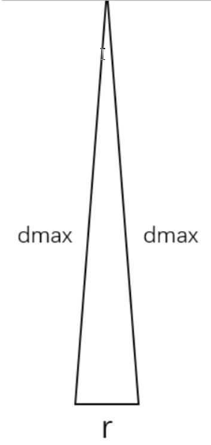

`search_parameters`中`angular_perturbation_step_size`的计算：

角分辨率公式推导：https://www.freesion.com/article/53801329845/

在很远的地方，一个网格分辨率r和激光雷达中心连线，如下图所示：

该三角形可以看做是等腰三角形。由余弦定理：  $\cos\theta=\frac{a^2+b^2-c^2}{2ab}$，对于本三角形有： $a = b = d_{max},c=r$，带入公式有： 
$$
\cos \theta = \frac{2d_{max}^2 - r^2}{2d_{max}^2} = 1 − \frac{r^2}{2d_{max}^2}
$$

