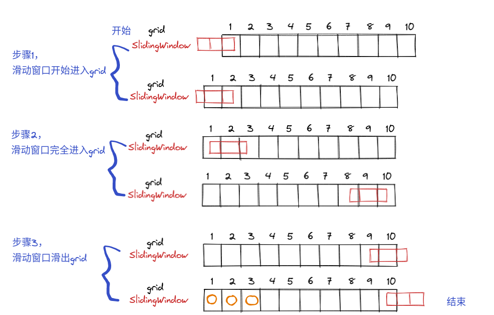
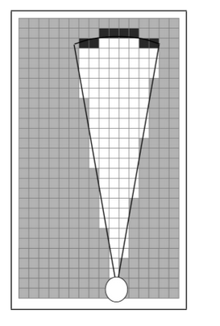

http://gaoyichao.com/Xiaotu/?book=Cartographer%E6%BA%90%E7%A0%81%E8%A7%A3%E8%AF%BB&title=%E5%88%86%E6%94%AF%E5%AE%9A%E7%95%8C%E9%97%AD%E7%8E%AF%E6%A3%80%E6%B5%8B%E7%9A%84%E5%8E%9F%E7%90%86%E5%92%8C%E5%AE%9E%E7%8E%B0

# 分支定界闭环检测的原理和实现

在一些SLAM系统中，通过闭环检测让机器人意识到它曾经到过某个场景，进而可以通过一些优化手段进一步的调整地图，提高定位和建图的精度。在Cartographer中，    我们可以把计算路径节点与子图之间的INTER_SUBMAP类型的约束看做是闭环检测。在[上一篇文章](http://gaoyichao.com/Xiaotu/?book=Cartographer源码解读&title=约束构建器_constraint_builder_)中，    我们分析了对象constraint_builder_是如何在后台组织这一计算过程的。而算法核心则是由类FastCorrelativeScanMatcher2D提供。

本文中，我们先研究一下[论文](http://gaoyichao.com/Xiaotu//papers/2016 - Real-time loop closure in 2D LIDAR SLAM - Hess et al.pdf)，了解分支定界的闭环检测算法原理，    再详细分析类[FastCorrelativeScanMatcher2D](https://github.com/googlecartographer/cartographer/blob/1.0.0/cartographer/mapping/internal/2d/scan_matching/fast_correlative_scan_matcher_2d.h#L112)了解其具体实现。

## 1. 算法原理

**主要区别**：
 3d: 暴力搜索
 2d: 预投影法：先通过角度切片，然后在在xy方向上暴力搜索，为了减少计算量。


主要工作逻辑

1. 以初始位置（角度）为基础，角度搜索范围内，按照搜索步长进行旋转当前scan。将这一系列的离散化的scan，按照旋转顺序存储起来。也就是切片
2. 在每个切片内，以初始位置（xy）为基础，xy搜索搜索范围内，按照搜索步长，进行离散，生成候选位置。
3. 求得每个候选位置的score，score最高的，就为最佳位置。


在[Local SLAM](http://gaoyichao.com/Xiaotu/?book=Cartographer源码解读&title=基于Ceres库的扫描匹配器)中，通过在子图中的Scan-to-map匹配过程可以得到了一个比较理想的机器人位姿估计。    但由于Local SLAM只使用了一段时间内的局部信息，所以定位误差还会随着时间累积。为了能够进一步的降低局部误差累积的影响，Cartographer还需要通过Pixel-accurate扫描匹配来进行闭环检测，    进一步的优化机器人的位姿估计。

记 $H={h_1,\cdots,h_k,\cdots,h_K}$为传感器扫描到的*K*个hit点集合，$h_k$是第*k*个hit点在机器人坐标系下的位置坐标。    那么 $h_k$在地图坐标系下的坐标可以表示为：


$$
\begin{equation}
T_{\varepsilon} h_k = 
	\begin{bmatrix} 
		\cos \varepsilon_{\theta} & - \sin \varepsilon_{\theta} \\ 
		\sin \varepsilon_{\theta} & \cos \varepsilon_{\theta} 
	\end{bmatrix}h_k
	+ 
	\begin{bmatrix} 
		\varepsilon_x \\ 
		\varepsilon_y 
	\end{bmatrix}
\end{equation}
$$


其中，$\varepsilon = [\varepsilon_x \enspace  \varepsilon_y \enspace \varepsilon_{\theta}]^T$分别是机器人在地图坐标系下的坐标, $\varepsilon_x, \enspace  \varepsilon_y$分别是机器人在地图坐标系下的坐标, $\varepsilon_{\theta}$是机器人的方向角。用 $T_\varepsilon$表示位姿估计描述的坐标变换。那么Pixel-accurate扫描匹配问题可以用下式来描述:

$$
\begin{equation}
	\begin{split}
		\varepsilon^* = \underset{\varepsilon \in \mathcal{W}}{\text{argmax}} \sum_{k = 1}^K M_{nearest}\left(T_{\varepsilon}h_k\right)
    \end{split} 
\end{equation}
$$


上式中，$\mathcal{W}$是一个搜索窗口， $M_{nearest}\left(T_{\varepsilon}h_k\right)$是离 $T_{\varepsilon}h_k$最近的栅格单元的占用概率。上式可以解释为, 在搜索窗口$\mathcal{W}$中找到一个最优的位姿，使得hit点集合出现的概率最大化。   [原文](http://gaoyichao.com/Xiaotu//papers/2016 - Real-time loop closure in 2D LIDAR SLAM - Hess et al.pdf)中给出了一个暴力的搜索方法，如上图所示，这是一种枚举的方法。    给定搜索步长 $\mathcal{r}$和 $\delta_{\theta}$，该搜索过程以 $\varepsilon_0$为中心，通过三层循环遍历所有的Pixel并选出得分最高的位姿作为输出 $\varepsilon^*$。

显然如果搜索窗口过大或者搜索步长太小，都将导致整个搜索过程耗时过长。为了提高算法的效率，Cartographer选择使用分支定界的方法来搜索位姿。该算法的基本思想就是，    把整个解空间用一棵树来表示，其根节点代表整个搜索窗口 $\mathcal{W}$。树中的每一个节点的孩子都是对该节点所代表的搜索空间的一个划分，每个叶子节点都对应着一个解。


整个搜索过程的基本思想，就是不断地分割搜索空间，这个过程称为**分支**。为每次分支之后的孩子节点确定一个上界，这个过程称为**定界**。    如果一个节点的定界超出了已知最优解的值，这意味着该节点下的所有解都不可能比已知解更优，将不再分支该节点。这样很多分支就不会继续搜索了，可以缩小搜索范围，提高算法效率。


Cartographer使用一种深度优先(Depth-First Search, DFS)的搜索方法，其算法的流程如上图所示。该算法设定了一个阈值`score_threshold`，约定了解的下界，如果一个节点的上界比它还小，    说明这个解空间实在太烂了，就不用考虑它了。

整个搜索过程借助了一个栈 $\{\mathcal{C}\}$来完成，首先将整个搜索空间 $\mathcal{W}$分割，得到初始的子空间节点集合 $\{\mathcal{C_0}\}$。    然后对集合 $\{\mathcal{C_0}\}$中的节点根据它们的上界进行排序，并依次入栈 $\{\mathcal{C_0}\}$保证得分最高的节点在栈顶的位置。这样可以优先搜索最有可能的解空间。

只要栈 $\{\mathcal{C}\}$不空，就需要进行深度优先搜索。首先从栈顶中出栈一个搜索节点 $\mathcal{c}$，如果 $\mathcal{c}$的上界比当前最优解的值高，则进一步的对该节点分割，否则认为该节点不具竞争力抛弃之。    如果该节点就是一个叶子节点，就更新最优解。否则进行分支得到新的搜索节点集合 $\{\mathcal{C_c}\}$，并为该集合中的节点定界。仍然根据节点的上界对集合 $\{\mathcal{C_c}\}$进行排序，    并将之压入栈中，保证 $\{\mathcal{C_c}\}$中最优的节点在栈顶的位置。

这种深度优先的搜索方法，能够尽可能的得到一个更优的解，使得`best_score`得到较快的增长。这样就可以达到压缩搜索空间的目的。显然该算法的实现关键在于分支和定界方法。

<font color=red> 笛卡尔乘积是指在数学中，两个集合X和Y的笛卡尔积（Cartesian product），又称直积，表示为*X*×*Y*，第一个对象是*X*的成员而第二个对象是*Y*的所有可能有序对 。</font>

<font color= red>假设集合A={a, b}，集合B={0, 1, 2}，则两个集合的笛卡尔积为{(a, 0), (a, 1), (a, 2), (b, 0), (b, 1), (b, 2)}。</font>


我们知道在二维空间中，机器人的位姿实际上是由 $x,\enspace y,\enspace \theta$三个量来表示的。    那么搜索窗口的栅格索引集合 $\overline{\mathcal{W}}$可以通过 <font color=red >笛卡尔积</font> $\{-w_x, \cdots, w_x\} \times \{-w_y, \cdots, w_y\} \times \{-w_{\theta}, \cdots, w_{\theta}\}$来枚举。    其中 $w_x, w_y$分别是 $x$和 $y$方向上最大的搜索索引，$w_{\theta}$则是搜索角度的最大索引。    那么搜索窗口 $\mathcal{W}$就可以用集合 $\left\{\varepsilon_0 + (r j_x, r j_y, \delta_{\theta} j_{\theta})\ \big|\ (j_x, j_y, j_{\theta}) \in \overline{\mathcal{W}} \right\}$来表示，    其中， $\varepsilon_0$是搜索中心，也是机器人位姿的初始估计。 $\mathcal{r}$和 $\delta_{\theta}$分别是位移和角度的搜索步长。

搜索树中的每个节点都可以用四个整数 $c = \left(c_x, c_y, c_{\theta}, c_h\right) \in \mathbb{Z}^4$来表示，其中 $c_x,c_y$分别是其搜索空间所对应的   $x,y$轴的起始索引，  $c_{\theta}$是搜索角度，$c_h$则说明了该搜索空间下一共有 $2^{c_h} \times 2^{c_h}$个可能的解，它们具有相同的搜索角度，但位置坐标不同。    这些解的组合方式可以用如下的笛卡尔积来表示:
$$
\begin{equation}
	\overline{\mathcal{U_c}} = 
		\left\{\left(j_x, j_y\right) \in \mathbb{Z^2}\ 
		\bigg| \ 
		\begin{array}{} 
			c_x ≤ j_x < c_x + 2^{c_h} \\
            c_y ≤ j_y < c_y + 2^{c_h} 
        \end{array} \right \} 
        \times \{c_{\theta}\}
                                                                                           
\end{equation}
$$


该节点所对应的搜索空间的栅格索引集合为 $\overline{W_c} = \overline{\mathcal{U_c}} \cap \overline{\mathcal{W}}$。对于叶子节点而言，$c_h = 0$，其搜索空间中只有一个索引对应着解 $\varepsilon_c = \varepsilon_0 + \left(rc_x, rc_y, \delta_{\theta}c_{\theta} \right)$。    每当对节点进行分支，就相当于在空间坐标上将搜索空间划分为四个区域，如下图所示。如果我们指定了搜索树的高度 $h_0$(`precomputation_grids_.size() - 1`)，那么初始的子空间节点集合中的节点 $c \in \{C_0\}$的四个整数可以表示为:

$$
\begin{equation}
c = \begin{cases}
         c_x & = & -w_x + 2^{h_0}j_x & : j_x \in \mathbb{Z}, 0 ≤ 2^{h_0} j_x ≤ 2w_x \\
         c_y & = & -w_y + 2^{h_0}j_y & : j_y \in \mathbb{Z}, 0 ≤ 2^{h_0} j_y ≤ 2w_y \\
         c_{\theta} & = & j_{\theta} & : j_{\theta} \in \mathbb{Z}, -w_{\theta} ≤ j_{\theta} ≤ w_{\theta}\\
         c_h & = & h_0 \\
        \end{cases}
\end{equation}
$$

一个高度为 $c_h(c_h > 1)$ 的节点，可以分成高度为$c_{h - 1}$的四个子节点:
$$
\begin{equation}
	\begin{array}
		\mathcal{C}_{c} = \{ c_{x}, c_{x}  +2^{c_{h}-1} \} \times \{ c_{y}, c_{y}+2^{c_{h}-1} \} \times c_{\theta} 
	\end{array}
\end{equation}
$$


搜索树上的每个节点的上界可以通过下式计算得到：
$$
\begin{equation}
	\begin{array}{rcl}
		\begin{split} score(c) 
			& = & \sum_{k = 1}^K \underset{j \in \overline{\mathcal{U_c}}}{\max} M_{nearest}\left(T_{\varepsilon_j}, h_k \right) \\
            & ≥ & \sum_{k = 1}^K \underset{j \in \overline{\mathcal{W_c}}}{\max} M_{nearest}\left(T_{\varepsilon_j}, h_k \right) \\
            & ≥ & \underset{j \in \overline{\mathcal{W_c}}}{\max} \sum_{k = 1}^K M_{nearest}\left(T_{\varepsilon_j}, h_k \right)
     	\end{split}
	\end{array}
\end{equation}
$$


如果我们对于每个节点都直接通过下式计算一遍上界的话，将是一个很大的计算量。所以Cartographer仍然采取了一种空间换时间的方法来进一步的提高搜索效率。它采用一种类似图像金字塔的方法，    预先计算出占用栅格地图在不同分枝尺寸下的上界，在实际计算上界时只需要根据 $c_h$查询对应尺度下的占用栅格即可获得节点的上界。    下图是从[原文](http://gaoyichao.com/Xiaotu//papers/2016 - Real-time loop closure in 2D LIDAR SLAM - Hess et al.pdf)中抠出来的分枝尺寸分别为1、4、16、64时的占用概率上界。

|                         |
| :----------------------------------------------: |
| 图 1: 分枝尺寸分别为1、4、16、64时的占用概率上界 |

我们就暂时称这个图为预算图吧，那么对于第 $h$层的节点，在预算图中 $x,y$的占用上界可以表示成下式，即以考察点 $x,y$为起点，    尺寸为的 $2^h \times 2^h$窗口内栅格的最高占用概率作为上界。

$$
\begin{equation}
	M_{precomp}^h (x, y) = \underset{
									\begin{array}{} 
										x' \in \left[x, x + r(2^h -1)\right] \\ 
										y' \in \left[y, y + r(2^h - 1) \right] 
									\end{array}
									}{max}
									M_{nearest}(x', y')
\end{equation}
$$


那么节点 $c$的上界就可以直接查表得到:
$$
\begin{equation}
	\begin{split}
        score(c) = \sum_{k = 1}^K M_{precomp}^{c_h} (T_{\varepsilon}h_k)
    \end{split}
\end{equation}
$$


所以，我们可以认为整个闭环检测的业务逻辑就是，根据当前的子图构建一个占用栅格地图，然后为该地图计算预算图，接着通过深度优先的分枝定界搜索算法估计机器人的位姿，    最后建立[机器人位姿与子图之间的约束关系](http://gaoyichao.com/Xiaotu/?book=Cartographer源码解读&title=约束构建器_constraint_builder_#ComputeConstraint)。    下面我们来详细了解一下这个分支定界搜索的实现细节。


## 2. [FastCorrelativeScanMatcher2D](https://github.com/googlecartographer/cartographer/blob/1.0.0/cartographer/mapping/internal/2d/scan_matching/fast_correlative_scan_matcher_2d.h#L112)

```c++
struct SubmapScanMatcher {
    const Grid2D* grid;
    std::unique_ptr<scan_matching::FastCorrelativeScanMatcher2D>    
        fast_correlative_scan_matcher;
    std::weak_ptr<common::Task> creation_task_handle;
};
```


在分析[约束构建器](http://gaoyichao.com/Xiaotu/?book=Cartographer源码解读&title=约束构建器_constraint_builder_#DispatchScanMatcherConstruction)的时候，    我们就已经看到对象`constraint_builder_`为每个子图都构建了一个`SubmapScanMatcher`类型的扫描匹配器。这个扫描匹配器是定义在类`ConstraintBuilder2D`内部的一个[结构体](https://github.com/googlecartographer/cartographer/blob/1.0.0/cartographer/mapping/internal/constraints/constraint_builder_2d.h#L109)。    如上侧的代码片段所示，它有三个字段，分别记录子图的占用栅格、扫描匹配器内核、线程池任务句柄。

实际上闭环检测是由类`FastCorrelativeScanMatcher2D`完成的。下表中列出了该类的成员变量。

| 对象名称                   | 对象类型                            | 说明                                                         |
| -------------------------- | ----------------------------------- | ------------------------------------------------------------ |
| options_                   | FastCorrelativeScanMatcherOptions2D | 关于闭环检测的扫描匹配器的各种配置                           |
| limits_                    | MapLimits                           | 子图的地图作用范围，我们已经在分析[占用栅格的数据结构](http://gaoyichao.com/Xiaotu/?book=Cartographer源码解读&title=占用栅格的数据结构#MapLimits)的时候，                简单了解了该数据结构的字段和作用。 |
| precomputation_grid_stack_ | PrecomputationGridStack2D           | 预算图的存储结构，用于查询不同分支尺寸下的搜索节点上界。     |

下面是类`FastCorrelativeScanMatcher2D`的构造函数，它有两个输入参数，其中`grid`是子图的占用栅格，`options`则记录了各种配置项。    在它的成员构造列表中，完成了三个成员的构造。

```cpp
FastCorrelativeScanMatcher2D::FastCorrelativeScanMatcher2D(const Grid2D& grid,
                                                           const proto::FastCorrelativeScanMatcherOptions2D& options)
            : options_(options),
              limits_(grid.limits()),
              precomputation_grid_stack_(common::make_unique<PrecomputationGridStack2D>(grid, options)) {}

```

我们已经看到该类使用了一个`PrecomputationGridStack2D`的数据类型来存储预算图。实际上它只是一个容器而已，只有一个成员变量`precomputation_grids_`。    实际的预算图是在`PrecomputationGrid2D`对象构建的时候计算的。

```cpp
std::vector<PrecomputationGrid2D> precomputation_grids_;
```

插入一下滑窗的工作方式 --- x 方向滑动。https://blog.csdn.net/tiancailx/article/details/108705852



假设原始栅格地图为14个格子，0-13，地图的分辨率width=4，滑窗之后的效果如下图所示：

**（图中滑窗之后的占用网格好像画错了。。。只理解概念吧**。我是按照将占用的网格的值是0.9存入intermediate的，其实是用1-0.9=0.1。。。）

intermediate前width - 1个值无意义, intermediate取的是栅格右侧(width-1)个栅格和此栅格的最大值, offset_(-width + 1, -width + 1)

```c++
int GetValue(const Eigen::Array2i& xy_index) const {
    // intermediate前width - 1个值无意义
    // intermediate取的是栅格右侧(width-1)个栅格和此栅格的最大值
    const Eigen::Array2i local_xy_index = xy_index - offset_;
    // The static_cast<unsigned> is for performance to check with 2 comparisons
    // xy_index.x() < offset_.x() || xy_index.y() < offset_.y() ||
    // local_xy_index.x() >= wide_limits_.num_x_cells ||
    // local_xy_index.y() >= wide_limits_.num_y_cells
    // instead of using 4 comparisons.
    if (static_cast<unsigned>(local_xy_index.x()) >=
            static_cast<unsigned>(wide_limits_.num_x_cells) ||
        static_cast<unsigned>(local_xy_index.y()) >=
            static_cast<unsigned>(wide_limits_.num_y_cells)) {
      return 0;
    }
    const int stride = wide_limits_.num_x_cells;
    return cells_[local_xy_index.x() + local_xy_index.y() * stride];
}
```


滑窗首先讲x=0处的栅格的值存入滑窗类，并赋值给 intermediate ，之后会分3个步骤，每个步骤对应一个for循环，合起来是遍历了一整行。

步骤一： 滑窗滑入网格，首先将滑窗中最大的值放入 intermediate的对应位置处，之后向滑窗的最右侧填入一个值，值的大小为  用1减去原网格的值 后放入滑窗，这部分只添加值。也就是网格中，空闲的值为0.1，存入intermediate的值为0.9？ carto的grid的占用值是多少？有待确认。

步骤二：滑窗已经完全滑入网格中，**滑窗的宽度即为width**。此时，首先将滑窗中最大的值放入 intermediate 的对应位置处，之后先删除滑窗的最左侧处的值，之后再向滑窗的最右侧填入一个值。

步骤三：滑窗滑出网格，此时，首先将滑窗中最大的值放入 intermediate的对应位置处，之后逐步删除滑窗的最左侧处的值。此时会导致 intermediate 的宽度比 grid 宽 width-1 个栅格。

之后再将y++，实现了整个原始网格的遍历。

经过这一系列操作，实现了滑窗从网格最左侧开始滑入，每次运动一个栅格，并最后从右侧滑出。实现了将width个栅格合一的操作。

```c++
  // First we compute the maximum probability for each (x0, y) achieved in the
  // span defined by x0 <= x < x0 + width.
  std::vector<float>& intermediate = *reusable_intermediate_grid;
  intermediate.resize(wide_limits_.num_x_cells * limits.num_y_cells);
 
   for (int y = 0; y != limits.num_y_cells; ++y) {
    SlidingWindowMaximum current_values;
 
    // 获取 grid 的x坐标的索引: 首先获取 (0, y)
    current_values.AddValue(
        1.f - std::abs(grid.GetCorrespondenceCost(Eigen::Array2i(0, y))));
 
    // 步骤一
    // x + width - 1 + y * stride 的范围 (从 0 到 width-2) 再加上 y * stride
    // 获取 grid 的x坐标的索引: (x + width, y) 的坐标从 (1 ,y) 到 (width-1, y)
 
    // 滑动窗口在x方向开始划入地图，所以只进行 填入值
    for (int x = -width + 1; x != 0; ++x) {
      intermediate[x + width - 1 + y * stride] = current_values.GetMaximum();
      if (x + width < limits.num_x_cells) {
        current_values.AddValue(1.f - std::abs(grid.GetCorrespondenceCost(
                                          Eigen::Array2i(x + width, y))));
      }
    }
 
    // 步骤二
    // x + width - 1 + y * stride 的范围 从 (width-1 到 limits.num_x_cells-2) 再加上 y * stride
    // 获取 grid 的x坐标的索引: (x + width, y) 的坐标从 (width, y) 到 (limits.num_x_cells-width-1, y)
    
    // 滑动窗口已经完全在地图里了，如果 地图中(x,y)处的值 是当前滑窗内的最大值，则删掉，
    // 之后再将(x+width,y)的值放入滑窗里
    for (int x = 0; x < limits.num_x_cells - width; ++x) {
      intermediate[x + width - 1 + y * stride] = current_values.GetMaximum();
      current_values.RemoveValue(
          1.f - std::abs(grid.GetCorrespondenceCost(Eigen::Array2i(x, y))));
      current_values.AddValue(1.f - std::abs(grid.GetCorrespondenceCost(
                                        Eigen::Array2i(x + width, y))));
    }
 
    // 步骤三
    // x + width - 1 + y * stride 的范围 从 (limits.num_x_cells-1  到 limits.num_x_cells+width-1) 再加上 y * stride
    // 获取 grid 的x坐标的索引: (x, y) 的坐标从 (limits.num_x_cells-width ,y) 到 (limits.num_x_cells-1, y)
    
    // 滑动窗口正在划出，一次减少一个值，所以intermediate的宽度比grid多 width-1
    for (int x = std::max(limits.num_x_cells - width, 0);
         x != limits.num_x_cells; ++x) {
      intermediate[x + width - 1 + y * stride] = current_values.GetMaximum();
      current_values.RemoveValue(
          1.f - std::abs(grid.GetCorrespondenceCost(Eigen::Array2i(x, y))));
    }
 
    // 理论上，滑窗走完地图的一行之后应该是空的，经过 只入，一出一入，只出，3个步骤
    current_values.CheckIsEmpty();
  }
```


在[上文](http://gaoyichao.com/Xiaotu/?book=Cartographer源码解读&title=约束构建器_constraint_builder_#match_full_submap)中，    我们了解到约束构建器通过变量`match_full_submap`来选择全地图匹配或者是定点的局部匹配。下面是定点局部匹配的接口函数，它有5个输入参数，    其中`initial_pose_estimate`描述了初始的位姿估计；`point_cloud`则是将要考察的路径节点下的激光点云数据；`min_score`是一个搜索节点的最小得分，    也就是前文中提到的`score_threshold`；指针`score`和`pose_estimate`是两个输出参数，用于成功匹配后返回匹配度和位姿估计。

```cpp
bool FastCorrelativeScanMatcher2D::Match(const transform::Rigid2d& initial_pose_estimate,
                                                 const sensor::PointCloud& point_cloud,
                                                 const float min_score, float* score,
                                                 transform::Rigid2d* pose_estimate) const {
            const SearchParameters search_parameters(options_.linear_search_window(),
                                                     options_.angular_search_window(),
                                                     point_cloud, limits_.resolution());
            return MatchWithSearchParameters(search_parameters, initial_pose_estimate, point_cloud, min_score, score, pose_estimate);
}
```

上面代码的第5到7行，构建了一个`SearchParameters`类型的对象，这是一个定义在[correlative_scan_matcher_2d.h](https://github.com/googlecartographer/cartographer/blob/1.0.0/cartographer/mapping/internal/2d/scan_matching/correlative_scan_matcher_2d.h)中的一个结构体，它描述了搜索窗口以及分辨率。然后在第8行中通过调用函数`MatchWithSearchParameters`来实际完成扫描匹配，进而实现闭环检测。

下面的代码是用于全地图匹配的接口函数，它的只是少了描述初始位姿的输入参数，其他参数的意义都与刚刚的定点局部匹配是一样的。殊途同归，    全地图匹配也是调用函数`MatchWithSearchParameters`来实际完成扫描匹配的。所不同的是，它需要提供一个以子图中心为搜索起点，覆盖整个子图的搜索窗口。    所以我们会看到第3到7行构建的对象`search_parameters`和`center`。

`search_parameters`中`angular_perturbation_step_size`的计算：

角分辨率公式推导： https://www.freesion.com/article/53801329845/

在很远的地方，一个网格分辨率r和激光雷达中心连线，如下图所示：

该三角形可以看做是等腰三角形。由余弦定理：  $\cos\theta=\frac{a^2+b^2-c^2}{2ab}$，对于本三角形有： $a = b = d_{max},c=r$，带入公式有： 
$$
\cos \theta = \frac{2d_{max}^2 - r^2}{2d_{max}^2} = 1 − \frac{r^2}{2d_{max}^2}
$$




```cpp
bool FastCorrelativeScanMatcher2D::MatchFullSubmap(const sensor::PointCloud& point_cloud, float min_score, float* score,
                                                           transform::Rigid2d* pose_estimate) const {
            const SearchParameters search_parameters(1e6 * limits_.resolution(),  
              // Linear search window, 1e6 cells/direction.
                M_PI,  // Angular search window, 180 degrees in both directions.
                                                     point_cloud, limits_.resolution());
            const transform::Rigid2d center = transform::Rigid2d::Translation(limits_.max() - 0.5 * limits_.resolution() * 
                                              Eigen::Vector2d(limits_.cell_limits().num_y_cells, limits_.cell_limits().num_x_cells));
            return MatchWithSearchParameters(search_parameters, center, point_cloud, min_score, score, pose_estimate);
        }

```

## 3. 分支定界搜索

接下来我们就从这个`MatchWithSearchParameters`函数出发研究这个深度优先的分支定界搜索算法，下面是这个函数的代码片段，它有6个输入参数，只是比定点局部匹配的接口函数多了一个`search_parameters`的参数，    其他参数的意义都一样。`search_parameters`描述了窗口大小、分辨率等搜索信息。在函数的一开始先检查一下指针`score`和`pose_estimate`非空，因为在后续的计算过程中将要修改这两个指针所指对象的数据内容。

```cpp
bool FastCorrelativeScanMatcher2D::MatchWithSearchParameters(SearchParameters search_parameters,
                                                                     const transform::Rigid2d& initial_pose_estimate,
                                                                     const sensor::PointCloud& point_cloud,
                                                                     float min_score, float* score,
                                                                     transform::Rigid2d* pose_estimate) const {
            CHECK_NOTNULL(score);
            CHECK_NOTNULL(pose_estimate);

```

然后，获取初始位姿估计的方向角，将激光点云中的点都绕Z轴转动相应的角度得到`rotated_point_cloud`。

```cpp
const Eigen::Rotation2Dd initial_rotation = initial_pose_estimate.rotation();
const sensor::PointCloud rotated_point_cloud = sensor::TransformPointCloud(point_cloud,
               transform::Rigid3f::Rotation(Eigen::AngleAxisf(initial_rotation.cast<float>().angle(), Eigen::Vector3f::UnitZ())));
```

调用定义在[correlative_scan_matcher_2d.cc](https://github.com/googlecartographer/cartographer/blob/1.0.0/cartographer/mapping/internal/2d/scan_matching/correlative_scan_matcher_2d.cc#L93)中的函数`GenerateRotatedScans`获得搜索窗口下机器人朝向各个方向角时的点云数据。    也就是说容器`rotated_scans`中保存了姿态为  $\varepsilon_0 + (0, 0, \delta_{\theta}j_{\theta}), j_{\theta} \in \mathbb{Z}, -w_{\theta} ≤ j_{\theta} ≤ w_{\theta}$时所有的点云数据，    其中就 $\varepsilon_0$是这里的初始位姿估计`initial_pose_estimate`，$\delta_{\theta}$则是角度搜索步长，它由对象`search_parameters`描述。

```cpp
const std::vector<sensor::PointCloud> rotated_scans = GenerateRotatedScans(rotated_point_cloud, search_parameters);
```

接着通过同样定义在[correlative_scan_matcher_2d.cc](https://github.com/googlecartographer/cartographer/blob/1.0.0/cartographer/mapping/internal/2d/scan_matching/correlative_scan_matcher_2d.cc#L111)中的函数`DiscretizeScans`，    完成对旋转后的点云数据离散化的操作，即将浮点类型的点云数据转换成整型的栅格单元索引。    类型`DiscreteScan2D`就是通过`typedef std::vector<Eigen::Array2i> DiscreteScan2D;`定义的整型容器。

在接下来的第14行中，我们通过对象`search_parameters`的接口`ShrinkToFit`尽可能的缩小搜索窗口的大小，以减小搜索空间，提高搜索效率。

```cpp
const std::vector<DiscreteScan2D> discrete_scans = DiscretizeScans(limits_, rotated_scans,
                            Eigen::Translation2f(initial_pose_estimate.translation().x(), 								initial_pose_estimate.translation().y()));
search_parameters.ShrinkToFit(discrete_scans, limits_.cell_limits());
```

准备工作做完之后，下面就要进入实际的搜索过程了。首先通过函数`ComputeLowestResolutionCandidates`完成对搜索空间的第一次分割，得到初始子空间节点集合 $\{C_0\}$。    该函数在最低分辨率的栅格地图上查表得到各个搜索节点 $c \in \{C_0\}$的上界，并降序排列。

```cpp
const std::vector<Candidate2D> lowest_resolution_candidates =
                ComputeLowestResolutionCandidates(discrete_scans, search_parameters);
```

最后调用函数`BranchAndBound`完成分支定界搜索，搜索的结果将被保存在`best_candidate`中。检查最优解的值，如果大于指定阈值`min_score`就认为匹配成功，    修改输入参数指针`score`和`pose_estimate`所指的对象。否则认为不匹配，不存在闭环，直接返回。

```cpp
	const Candidate2D best_candidate = BranchAndBound(discrete_scans, search_parameters, 										lowest_resolution_candidates, precomputation_grid_stack_->max_depth(), min_score);
	if (best_candidate.score > min_score) {
                *score = best_candidate.score;
                *pose_estimate = transform::Rigid2d({initial_pose_estimate.translation().x() + best_candidate.x, initial_pose_estimate.translation().y() + best_candidate.y}, initial_rotation * Eigen::Rotation2Dd(best_candidate.orientation));
                return true;
    }
	return false;
}
```

在研究`ComputeLowestResolutionCandidates`和`BranchAndBound`的实现之前，先来看一下数据类型`Candidate2D`，    它是定义在[correlative_scan_matcher_2d.h](https://github.com/googlecartographer/cartographer/blob/1.0.0/cartographer/mapping/internal/2d/scan_matching/correlative_scan_matcher_2d.h#L74)中的一个结构体。下表中列举了该结构体的成员变量。

| 对象名称       | 对象类型 | 说明                                                  |
| -------------- | -------- | ----------------------------------------------------- |
| scan_index     | int      | 角度的搜索索引$j_{\theta}$                            |
| x_index_offset | int      | x轴的搜索索引 $j_{x}$                                 |
| y_index_offset | int      | y轴的搜索索引 $j_{y}$                                 |
| x              | double   | 相对于初始位姿的x偏移量$rj_{x}$                       |
| y              | double   | 相对于初始位姿的y偏移量 $rj_{y}$                      |
| orientation    | double   | 相对于初始位姿的角度偏移量$\delta_{\theta}j_{\theta}$ |
| score          | float    | 候选点的评分，越高越好                                |

此外，它还定义了两个比较操作符的重载用于方便比较候选点的优劣。

```cpp
bool operator<(const Candidate2D& other) const { return score < other.score; }
bool operator>(const Candidate2D& other) const { return score > other.score; }
```

下面是函数`ComputeLowestResolutionCandidates`的实现，它以离散化之后的各搜索方向上的点云数据和搜索配置为输入，先调用函数`GenerateLowestResolutionCandidates`完成对搜索空间的初始分割，    再通过函数`ScoreCandidates`计算各个候选点的评分并排序。

```cpp
std::vector<Candidate2D> FastCorrelativeScanMatcher2D::ComputeLowestResolutionCandidates(
                                    const std::vector<DiscreteScan2D>& discrete_scans,
                                    const SearchParameters& search_parameters) const {
            std::vector<Candidate2D> lowest_resolution_candidates = GenerateLowestResolutionCandidates(search_parameters);
            ScoreCandidates(precomputation_grid_stack_->Get(precomputation_grid_stack_->max_depth()),
                            discrete_scans, search_parameters, &lowest_resolution_candidates);
            return lowest_resolution_candidates;
}
```

下面是函数`GenerateLowestResolutionCandidates`的代码片段，它根据搜索配置来完成初始分割。首先根据预算图的金字塔高度计算初始分割的粒度 $2^{h_0}$。

```cpp
std::vector<Candidate2D>
    FastCorrelativeScanMatcher2D::GenerateLowestResolutionCandidates(const SearchParameters& search_parameters) const {
            const int linear_step_size = 1 << precomputation_grid_stack_->max_depth();

```

然后遍历所有搜索方向，累计各个方向下空间的分割数量，得到num_candidates描述了搜索空间初始分割的子空间数量。

```cpp
int num_candidates = 0;
for (int scan_index = 0; scan_index != search_parameters.num_scans; ++scan_index) {
                const int num_lowest_resolution_linear_x_candidates = (search_parameters.linear_bounds[scan_index].max_x -
                                  search_parameters.linear_bounds[scan_index].min_x + linear_step_size) / linear_step_size;
                const int num_lowest_resolution_linear_y_candidates = (search_parameters.linear_bounds[scan_index].max_y -
                                  search_parameters.linear_bounds[scan_index].min_y + linear_step_size) / linear_step_size;
                num_candidates += num_lowest_resolution_linear_x_candidates * num_lowest_resolution_linear_y_candidates;
}
```

接下来在一个三层的嵌套for循环中，构建各个候选点。最后检查一下候选点数量，通过后返回。

```cpp
    std::vector<Candidate2D> candidates;
    candidates.reserve(num_candidates);
    for (int scan_index = 0; scan_index != search_parameters.num_scans; ++scan_index) {
        for (int x_index_offset = search_parameters.linear_bounds[scan_index].min_x;
             x_index_offset <= search_parameters.linear_bounds[scan_index].max_x;
             x_index_offset += linear_step_size) {
            for (int y_index_offset = search_parameters.linear_bounds[scan_index].min_y;
                 y_index_offset <= search_parameters.linear_bounds[scan_index].max_y;
                 y_index_offset += linear_step_size) {
                candidates.emplace_back(scan_index, x_index_offset, y_index_offset, search_parameters);
            } 
        } 
    }
    CHECK_EQ(candidates.size(), num_candidates);
    return candidates;
}
```

下面是函数`ScoreCandidates`的实现，该函数有四个参数，其中`precomputation_grid`是将要查询的预算图，而`discrete_scans`则是离散化的各搜索角度下的激光点云，而`search_parameters`则是搜索配置，    `candidates`则是候选点集合将在本函数中计算得分并排序。在函数中，我们在一个for循环中遍历所有的候选点，并为之计算所有点云的hit概率。最后通过std::sort完成排序。

```cpp
void FastCorrelativeScanMatcher2D::ScoreCandidates(
    								const PrecomputationGrid2D& precomputation_grid,
                                       const std::vector<DiscreteScan2D>& discrete_scans,
                                       const SearchParameters& search_parameters,
                                           std::vector<Candidate2D>* const candidates) const {
            for (Candidate2D& candidate : *candidates) {
                int sum = 0;
                for (const Eigen::Array2i& xy_index : discrete_scans[candidate.scan_index]) {
                    const Eigen::Array2i proposed_xy_index(xy_index.x() + candidate.x_index_offset, xy_index.y() + candidate.y_index_offset);
                    sum += precomputation_grid.GetValue(proposed_xy_index);
                }
                candidate.score = precomputation_grid.ToScore(sum / static_cast(discrete_scans[candidate.scan_index].size()));
            }
            std::sort(candidates->begin(), candidates->end(), std::greater());
}
```

下面是函数`BranchAndBound`，具体完成了分支定界搜索过程，输入参数就不一一介绍了，参考后面的注释。

```cpp
Candidate2D FastCorrelativeScanMatcher2D::BranchAndBound(
    const std::vector<DiscreteScan2D>& discrete_scans, // 离散化的各搜索角度下的激光点云
    const SearchParameters& search_parameters,        // 搜索配置参数
    const std::vector<Candidate2D>& candidates,       // 候选点集
    const int candidate_depth,                        // 搜索树高度，前文提到的c_h
    float min_score) const {                          // 候选点最小评分
```

这个函数是以递归调用的方式求解的。首先给出了递归终止的条件，就是如果搜索树高为0，意味着我们搜索到了一个叶子节点。同时由于每次迭代过程我们都是对新扩展的候选点进行降序排列，    所以可以认为队首的这个叶子节点就是我们想要的最优解，直接返回即可。

```cpp
if (candidate_depth == 0)
    return *candidates.begin();
```

然后创建一个临时的候选点对象`best_high_resolution_candidate`，为之赋予最小的评分。

```cpp
Candidate2D best_high_resolution_candidate(0, 0, 0, search_parameters);
best_high_resolution_candidate.score = min_score;
```

接着就会在一个for循环中遍历所有的候选点，如果遇到一个候选点的评分很低，意味着以后的候选点中也没有合适的解。可以直接跳出循环退出了，说明没有构成闭环。

```cpp
for (const Candidate2D& candidate : candidates) {
    if (candidate.score <= min_score)
        break;
```

如果for循环能够继续运行，说明当前候选点是一个更优的选择，需要对其进行分支。新生成的候选点将被保存在容器`higher_resolution_candidates`中。

```cpp
std::vector<Candidate2D> higher_resolution_candidates;
const int half_width = 1 << (candidate_depth - 1);
for (int x_offset : {0, half_width}) {
    if (candidate.x_index_offset + x_offset > search_parameters.linear_bounds[candidate.scan_index].max_x)
        break;
    for (int y_offset : {0, half_width}) {
        if (candidate.y_index_offset + y_offset > search_parameters.linear_bounds[candidate.scan_index].max_y) {
            break;
        }
        higher_resolution_candidates.emplace_back(candidate.scan_index, candidate.x_index_offset + x_offset, candidate.y_index_offset + y_offset, search_parameters);
    }
}
```

再然后就调用刚刚介绍过的函数`ScoreCandidates`对新扩展的候选点定界并排序。并递归调用`BranchAndBound`对新扩展的`higher_resolution_candidates`进行搜索。    这样就可以实现深度优先的搜索，先一直沿着最有可能的分支向下搜索，直到找到一个解。并将该解作为目前的最优解保存在`best_high_resolution_candidate`中。    以后通过递归调用发现了更优的解都将通过`std::max`函数来更新已知的最优解。

```cpp
ScoreCandidates(precomputation_grid_stack_->Get(candidate_depth - 1), discrete_scans, search_parameters, &higher_resolution_candidates);
best_high_resolution_candidate = std::max(best_high_resolution_candidate,
                                                      BranchAndBound(discrete_scans, search_parameters, higher_resolution_candidates, candidate_depth - 1,
                                                                     best_high_resolution_candidate.score));
```

当遍历完所有的候选点之后，对象`best_high_resolution_candidate`中就记录了最优的解，将之返回即可。

```cpp
	}
	return best_high_resolution_candidate;
}
```

至此，我们已经看到了完整的分支定界搜索过程。

## 4. 完

Cartographer使用类`FastCorrelativeScanMatcher2D`具体实现了，深度优先的分支定界搜索算法，该算法能够高效地确定激光点云与子图的匹配度，估计采集点云时机器人相对于子图的位姿。    为了能够高效的对搜索空间进行分割并计算上界，Cartographer还为每个子图预先计算了不同尺度下的占用概率，以后的搜索过程只需要简单的查表就可以完成了。


