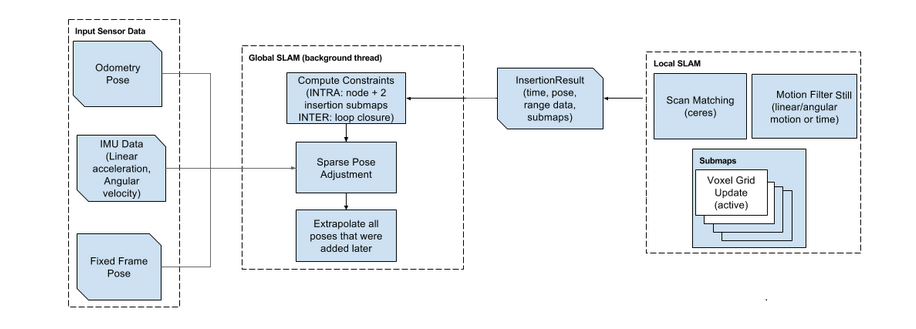

# Global SLAM的核心——PoseGraph2D

http://gaoyichao.com/Xiaotu/?book=Cartographer%E6%BA%90%E7%A0%81%E8%A7%A3%E8%AF%BB&title=Global_SLAM%E7%9A%84%E6%A0%B8%E5%BF%83_PoseGraph2D



上图中间的虚线框就是Global SLAM的主要工作内容，大体上可以分为三个部分。其一接收来自Local SLAM的子图更新结果，在位姿图中相应的增加节点和约束，    这点我们已经在[连接前端与后端的桥梁](http://gaoyichao.com/Xiaotu/?book=Cartographer源码解读&title=连接前端与后端的桥梁_GlobalTrajectoryBuilder)一文中有了初步的了解。    其二结合里程计、IMU、全局位姿测量数据(Fixed Frame Pose, 类似GPS这样具有全局测量能力的传感器)的测量信息，    使用[SPA(Sparse Pose Adjustment)](http://gaoyichao.com/Xiaotu//papers/2010 - Efficient Sparse Pose Adjustment for 2D Mapping - Konolige et al.pdf)技术求解后端的优化问题。    其三，在每次完成后端优化之后，都需要根据优化的结果对后来添加到位姿图中的节点和子图的位姿做修正。

本文中，我们先研究一下[论文](http://gaoyichao.com/Xiaotu//papers/2016 - Real-time loop closure in 2D LIDAR SLAM - Hess et al.pdf)，着重看一下后端所面临的优化问题是什么，    以及这个位姿图到底是个啥。再来看看PoseGraph2D的成员变量，大体了解一下它都要处理什么样的数据。

## 1. 后端优化问题

我们知道Cartographer中全局地图是由很多个子图拼接而成的，那么每一个子图在世界坐标系下都有一个位姿用  $\varepsilon^m$来表示，上角标 $m$表示 $map$。    假设我们一共有 $m$个子图，它们的位姿可以用集合$\Xi^m = \left\{\varepsilon_i^m\right\}_{i = 1, \cdots, m}$来记录，下角标 $i$表示第 $i$个子图。

前端每完成一次子图更新，一定会把一次激光扫描数据插入其维护的子图当中。这个插入结果将被Cartographer看做是构成一条轨迹的节点，并以此时的机器人位姿作为节点的位姿，    将其看做是一次激光扫描的参考位姿，在论文的上下文中称为扫描位姿(Scan Pose)，用符号 $\varepsilon^s$表示，上角标 $s$表示scan。假设我们一共有 $n$个节点，    它们的位姿可以用集合 $\Xi^s = \left\{\varepsilon_j^s\right\}_{j = 1, \cdots, n}$来记录，下角标 $j$表示第 $j$个节点。

后端的优化问题就可以描述成一个非线性的最小二乘问题，在后台线程中每隔几秒钟[使用Ceres库](http://gaoyichao.com/Xiaotu/?book=Cartographer源码解读&title=基于Ceres库的扫描匹配器)求解一次。    如果我们用 $\varepsilon_{ij}$表示第 $i$个子图与第 $j$个节点之间的相对位姿，并用协方差矩阵来 $\sum_{ij}$描述 $\varepsilon_{ij}$的可信度，那么后端优化问题可以形式化的用下式表述:
$$
\begin{equation}
	\begin{split}
        \underset{\Xi^m, \Xi^s}{\text{argmin}} &\quad 
        \cfrac{1}{2}\sum_{ij} \rho
        \left(E^2\left(\varepsilon_i^m, \varepsilon_j^s; 
        \Sigma_{ij}, \varepsilon_{ij} \right) \right)
    \end{split} 
\end{equation}
$$

$$
\begin{equation} 
	E^2\left(\varepsilon_i^m, \varepsilon_j^s; \Sigma_{ij}, \varepsilon_{ij} \right) = 
	e\left(\varepsilon_i^m, \varepsilon_j^s; \varepsilon_{ij}\right)^T 
	\Sigma_{ij}^{-1}
	e\left(\varepsilon_i^m, \varepsilon_j^s; \varepsilon_{ij}\right)
\end{equation}
$$

$$
\begin{equation}
	e\left(\varepsilon_i^m, \varepsilon_j^s; \varepsilon_{ij}\right) = 
	\varepsilon_{ij} - 
	\begin{bmatrix} 
		R_{\varepsilon_i^m}^{-1} (t_{\varepsilon_i^m} - t_{\varepsilon_j^s}) \\
		\varepsilon_{i;\theta}^m - \varepsilon_{j;\theta}^s 		\end{bmatrix}
\end{equation}
$$

上式([3](http://gaoyichao.com/Xiaotu/?book=Cartographer源码解读&title=Global_SLAM的核心_PoseGraph2D#mjx-eqn-f3))描述了全局位姿估计的偏差。其中 $t_{e_i^m}$和 $t_{e_j^s}$分别是子图位姿和节点位姿的位置矢量，两者求差得到世界坐标系下节点相对于子图的位置矢量。    矩阵 $R_{\varepsilon_i^m}$是由子图位姿写出的旋转矩阵，对其求逆即可得到世界坐标系下的矢量在子图的局部坐标系下的转换关系。    所以 $R_{\varepsilon_i^m}^{-1}\left(t_{\varepsilon_i^m} - t_{\varepsilon_j^s}\right)$实际就是将世界坐标下子图和节点位姿投影到子图的局部坐标系下，并计算两者的相对偏差量。    而 $ \varepsilon_{i;\theta}^m$和 $\varepsilon_{j;\theta}^s$分别是子图位姿和节点位姿中的方向角，两者求差即是子图局部坐标系下的相对方向角。    将根据世界坐标系下的位姿估计计算出的相对变换关系与前端输出的相对变换关系求差，就可以计算全局估计的偏差量。

从式([3](http://gaoyichao.com/Xiaotu/?book=Cartographer源码解读&title=Global_SLAM的核心_PoseGraph2D#mjx-eqn-f3))中偏差量的估算我们可以看到，Cartographer认为前端的定位结果在一段很短的时间内还是比较可信的，但是它的误差会随着时间累积以至于全局的估计不准确。    所以可以通过上面的方法计算全局估计的偏差量。    上式([2](http://gaoyichao.com/Xiaotu/?book=Cartographer源码解读&title=Global_SLAM的核心_PoseGraph2D#mjx-eqn-f2))中计算的 $E^2\left(\varepsilon_i^m, \varepsilon_j^s; \Sigma_{ij}, \varepsilon_{ij} \right)$实际上是一个关于全局位姿估计偏差的二次型。我们可以简单的理解为求平方，    但实际上它还考虑了前端定位结果的不确定性 $\sum_{ij}$。

式([2](http://gaoyichao.com/Xiaotu/?book=Cartographer源码解读&title=Global_SLAM的核心_PoseGraph2D#mjx-eqn-f2))中的二次型将被用作评价每个子图-节点对的位姿估计代价函数，将其代入式(1)中就得到了后端优化的目标函数。式中的核函数*ρ*(⋅)用于过滤因为错误的匹配而产生的一些异常约束，    降低它们对于最终优化结果的影响，原文中提到的一个*Huber loss*的核函数。

## 2. 位姿图与约束

通过对上述后端优化问题的定义，我们可以看到Cartographer中的位姿图实际上是一种二部图。如下图所示有两类顶点，三角表示子图，圆圈表示节点。    由于传感器的一次扫描数据可能插入多个不同的子图，所以同一个节点可能与多个子图之间存在一定的匹配关系，这个匹配关系就是所谓的约束，    可以理解为前文中的 $\sum_{ij}$和 $\varepsilon_{ij}$。


其实节点之间也不是孤立的，它们都是在上一个节点的基础上累加一些运动得到的。这些运动的测量就体现在了里程计以及IMU的积分定位、前端的扫描匹配等方面。    各个节点前后串连起来就得到了一条轨迹，我想这也是为什么Cartographer中定义了各类TrajectoryBuilder的一个出发点吧。

Cartographer在接口类[PoseGraphInterface](https://github.com/googlecartographer/cartographer/blob/1.0.0/cartographer/mapping/pose_graph_interface.h)内部定义了一个结构体Constraint来描述节点 $j$相对于子图 $i$的约束。    其定义如下面的代码片段所示，在该结构体的内部还定义了一个Pose的结构体，描述了节点 $j$相对于子图 $i$的相对位置关系。其中，字段zbar_ij描述的是在子图的 $\varepsilon_{ij}$，    而字段translation_weight和rotation_weight分别是平移和旋转的权重，应该对应着刚刚的 $\sum_{ij}$， 用于描述不确定度。

```c++
struct Constraint {
    struct Pose {
        transform::Rigid3d zbar_ij;    
        double translation_weight;
        double rotation_weight;
    };
    SubmapId submap_id;
    NodeId node_id;
    Pose pose;
    enum Tag { INTRA_SUBMAP, INTER_SUBMAP } tag;
}
```

结构体Constraint中用字段submap_id来记录约束对应的子图索引，node_id记录节点索引。它们的数据类型SubmapId和NodeId都是定义在文件[id.h](https://github.com/googlecartographer/cartographer/blob/1.0.0/cartographer/mapping/id.h)中的结构体。它们有一个相同的字段trajectory_id，用于标记当前跟踪的轨迹。各自有一个从0开始计数的submap_index和node_index，分别为每个子图和节点提供一个唯一的编号。

在Cartographer中有两类约束，被称为子图内约束(INTRA_SUBMAP)和子图间(INTER_SUBMAP)约束。INTRA_SUBMAP的约束是指在子图的更新过程中节点 $j$被直接插入到子图 $i$中。    而INTER_SUBMAP类型的约束中节点 $j$并不是直接插入到子图 $i$中，我猜应该是因为闭环检测而添加的约束。

## 3. 成员变量

类型[PoseGraph2D](https://github.com/googlecartographer/cartographer/blob/1.0.0/cartographer/mapping/internal/2d/pose_graph_2d.h)是从类[PoseGraph](https://github.com/googlecartographer/cartographer/blob/1.0.0/cartographer/mapping/pose_graph.h)派生而来的，而PoseGraph又继承了接口类[PoseGraphInterface](https://github.com/googlecartographer/cartographer/blob/1.0.0/cartographer/mapping/pose_graph_interface.h)。类PoseGraph和类PoseGraphInterface都是抽象类，定义了很多纯虚函数，并没有定义任何成员变量。而PoseGraph2D则是用于2D建图的实现。    我们所关心的位姿图应该是由三个容器构成的，submap_data_中记录了所有的子图对象，trajectory_nodes_中记录了所有的节点对象，它们通过容器constraints_中记录的约束建立起联系。

容器submap_data_中元素的数据类型是在类PoseGraph2D内部定义的一个结构体——InternalSubmapData，如下面的代码所示。它有三个字段，共享指针submap记录了具体的子图对象，    容器node_ids记录了所有直接插入submap的节点，枚举state记录了子图的状态。

```c++
enum class SubmapState { kActive, kFinished };    
struct InternalSubmapData {
    std::shared_ptr<const Submap2D> submap;
    std::set<NodeId> node_ids;
    SubmapState state = SubmapState::kActive;
};
```

子图的状态主要是给后台的线程提供的。一开始子图的状态都是kActive的，当它切换到kFinished的状态下后就会与所有的节点进行一次扫描匹配操作。此外新增的节点也会与所有kFinished状态的子图进行扫描匹配。    这一操作我们可以理解为是进行闭环检测，通过遍历与所有的kFinished状态的子图，或者节点，应当可以找到发生闭环的地点并建立一个约束来描述。

下面是容器trajectory_nodes_中元素的数据类型TrajectoryNode的代码。实际上它只有两个字段，其中constant_data的数据类型就是其内部定义的结构体Data，记录了点云、重力方向、局部位姿等数据，    我们已经在[Local SLAM的核心——LocalTrajectoryBuilder2D](http://gaoyichao.com/Xiaotu/?book=Cartographer源码解读&title=Local_SLAM的核心_LocalTrajectoryBuilder2D)一文中与之打过交道了。    而字段global_pose则记录了节点在世界坐标系下的位姿，即我们前面提到的 $\varepsilon_j^s$。

```c++
struct TrajectoryNode {
  struct Data {
    common::Time time;

    // Range data in 'pose' frame. Only used in the 2D case.
    sensor::RangeData range_data_2d;   //测量得到的2D range数据

    // Range data in 'pose' frame. Only used in the 3D case.
    sensor::CompressedRangeData range_data_3d;   //测量得到的3D range数据

    // Transform from the 3D 'tracking' frame to the 'pose' frame of the range
    // data, which contains roll, pitch and height for 2D. In 3D this is always
    // identity.
    transform::Rigid3d tracking_to_pose;    //涉及的3D变换
  };

  common::Time time() const { return constant_data->time; }
  //trimmed 修剪过的
  bool trimmed() const { return constant_data == nullptr; }

  // This must be a shared_ptr. If the data is used for visualization while the
  // node is being trimmed, it must survive until all use finishes.
  //常指针.指向某块内存,该内存块的数据不变，指针本身可以变。
  std::shared_ptr<const Data> constant_data;

  transform::Rigid3d pose;
};
```

结构体Data，使用字段time记录了扫描数据被插入子图的时刻，在TrajectoryNode中可以通过函数time获取。而tracking_to_pose则记录了节点在子图中的相对位姿。    这些数据在[Local SLAM的业务主线](http://gaoyichao.com/Xiaotu/?book=Cartographer源码解读&title=Loca_SLAM的业务主线_AddRangeData)中就已经填写了。

实际上结构体Data中还有三个用于3D建图时进行闭环检测的字段，由于2D建图应该用不到它，所以这里将之省略了。

