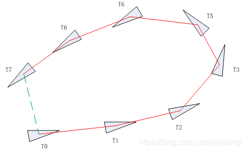
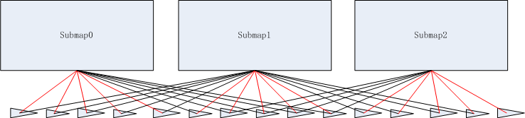
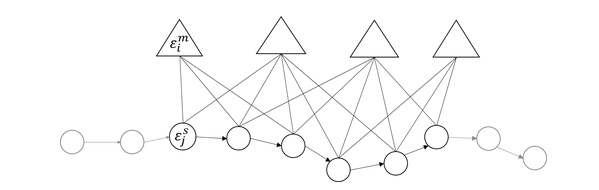

###  后端优化基本思想

https://blog.csdn.net/jiajiading/article/details/109856703?spm=1001.2014.3001.5502

ceres部分参考  mapping_2d --> scan_matching --> ceres.md

## 传统位姿图优化




其他常见的slam后端优化位姿图结构如上图所示，前端用于位姿的推移，即利用上刻位姿经过前端匹配获取到下一刻位姿，因此此刻相对于上刻位姿较为准确，但是由于累计误差导致如上图T7时刻的位姿与T0时刻的位姿误差较大，如果T7和T0时刻位姿相对较近，则可采用一定方法（即闭环检测），则可获取较为T7和T0两个时刻的相对位姿。由于初始时刻位姿固定，可得如下位姿公式。
$$
X_0^{map}    &= & \mathcal{Init} \\
X_{i+1}^{map} &= & T_{i+1}^i \times  X_{i}^{map} \\
X_0^{map}    &= & T_0^7 \times X_7^{map}
$$
从上公式可看出方程组为超定方程，而slam的位姿图优化，则是求解以上超定方程组，即可采用最熟悉的思路最小二程。

## cartographer 后端优化位姿图优化




已知节点、约束和闭环约束条件后，则可进行超定方程组求解，即求解所有节点的最佳位姿，使得超定方程组误差最小。optimization_problem_则是优化求解器，采用的是SPA(Sparse Pose Adjustment)方法进行优化，较早的开源SLAM算法kator slam后端优化采用相同的思想进行优化。由于目前许多优化库的出现，例如g2o、ceres、gtsam等，使得slam后端优化问题变得十分简单。而cartographer采用的ceres库进行实现的。


而cartographer的位姿图进行了一定的改变，cartographer的前端维护了submap，而非简单一系列位姿。因此采用的位姿约束为机器人时刻姿态与submap的相对位姿，同时也分为当前时刻位姿节点是否构建为对应的submap两种类型，非构建对应submap的相对位姿约束则为闭环约束，如上图所示，黑色位姿约束则可认为闭环约束。最后求解方法，仍然是采用优化求解超定方程组。


http://gaoyichao.com/Xiaotu/?book=Cartographer%E6%BA%90%E7%A0%81%E8%A7%A3%E8%AF%BB&title=Global_SLAM%E7%9A%84%E6%A0%B8%E5%BF%83_PoseGraph2D

我们知道Cartographer中全局地图是由很多个子图拼接而成的，那么每一个子图在世界坐标系下都有一个位姿用   $\varepsilon^m$来表示，上角标 $m$表示map。    假设我们一共有 $m$个子图，它们的位姿可以用集合 $\Xi^m = \left\{\varepsilon_i^m\right\}_{i = 1, \cdots, m}$来记录，下角标 $i$表示第 $i$个子图。

前端每完成一次子图更新，一定会把一次激光扫描数据插入其维护的子图当中。这个插入结果将被Cartographer看做是构成一条轨迹的节点，并以此时的机器人位姿作为节点的位姿，    将其看做是一次激光扫描的参考位姿，在论文的上下文中称为扫描位姿(Scan Pose)，用符号 $\varepsilon^s$表示，上角标 $s$表示scan。假设我们一共有 $n$个节点，    它们的位姿可以用集合 $\Xi^s = \left\{\varepsilon_j^s\right\}_{j = 1, \cdots, n}$来记录，下角标*j*表示第*j*个节点。

后端的优化问题就可以描述成一个非线性的最小二乘问题，在后台线程中每隔几秒钟[使用Ceres库](http://gaoyichao.com/Xiaotu/?book=Cartographer源码解读&title=基于Ceres库的扫描匹配器)求解一次。    如果我们用 $\varepsilon_{ij}$表示第 $i$个子图与第 $j$个节点之间的相对位姿，并用协方差矩阵 $\Sigma_{ij}$来描述*j*的可 $\varepsilon_{ij}$信度，那么后端优化问题可以形式化的用下式表述:
$$
\begin{equation}
	\begin{split}
        \underset{\Xi^m, \Xi^s}{\text{argmin}} &\quad 
        \cfrac{1}{2}\sum_{ij} \rho
        \Big(E^2\left(\varepsilon_i^m, \varepsilon_j^s; 
        \Sigma_{ij}, \varepsilon_{ij} \right) \Big)
    \end{split} 
\end{equation}
$$

$$
\begin{equation}
	E^2 (\varepsilon_i^m, \varepsilon_j^s; \Sigma_{ij}, \varepsilon_{ij}  ) = 
	e (\varepsilon_i^m, \varepsilon_j^s; \varepsilon_{ij} )^T \Sigma_{ij}^{-1}                 e\left(\varepsilon_i^m, \varepsilon_j^s; \varepsilon_{ij}\right)
\end{equation}
$$

$$
\begin{equation}
	e\left(\varepsilon_i^m, \varepsilon_j^s; \varepsilon_{ij}\right) = 
	\varepsilon_{ij} - 
	\begin{bmatrix} 
		R_{\varepsilon_i^m}^{-1}\left(t_{\varepsilon_i^m} - t_{\varepsilon_j^s}\right) \\
		\varepsilon_{i;\theta}^m - \varepsilon_{j;\theta}^s 
	\end{bmatrix}
\end{equation}
$$

上式(4)描述了全局位姿估计的偏差。其中 $t_{e_i^m}$和 $t_{e_j^s}$分别是子图位姿和节点位姿的位置矢量，两者求差得到世界坐标系下节点相对于子图的位置矢量。    矩阵 $R_{\varepsilon_i^m}$是由子图位姿写出的旋转矩阵，对其求逆即可得到世界坐标系下的矢量在子图的局部坐标系下的转换关系。    所以 $R_{\varepsilon_i^m}^{-1}\left(t_{\varepsilon_i^m} - t_{\varepsilon_j^s}\right)$实际就是将世界坐标下子图和节点位姿投影到子图的局部坐标系下，并计算两者的相对偏差量。    而 $e_{i;\theta}^m$和 $e_{j;\theta}^s$分别是子图位姿和节点位姿中的方向角，两者求差即是子图局部坐标系下的相对方向角。    将根据世界坐标系下的位姿估计计算出的相对变换关系与前端输出的相对变换关系求差，就可以计算全局估计的偏差量。

从式 (4)中偏差量的估算我们可以看到，Cartographer认为前端的定位结果在一段很短的时间内还是比较可信的，但是它的误差会随着时间累积以至于全局的估计不准确。    所以可以通过上面的方法计算全局估计的偏差量。    上式(3)中计算的 $E^2\left(\varepsilon_i^m, \varepsilon_j^s; \Sigma_{ij}, \varepsilon_{ij} \right)$实际上是一个关于全局位姿估计偏差的二次型。我们可以简单的理解为求平方，    但实际上它还考虑了前端定位结果的不确定性 $\Sigma_{ij}$。

式(3)中的二次型将被用作评价每个子图-节点对的位姿估计代价函数，将其代入式(1)中就得到了后端优化的目标函数。式中的核函数*ρ*(⋅)用于过滤因为错误的匹配而产生的一些异常约束，    降低它们对于最终优化结果的影响，原文中提到的一个*Huber loss*的核函数。

## 2. 位姿图与约束

通过对上述后端优化问题的定义，我们可以看到Cartographer中的位姿图实际上是一种二部图。如下图所示有两类顶点，三角表示子图，圆圈表示节点。    由于传感器的一次扫描数据可能插入多个不同的子图，所以同一个节点可能与多个子图之间存在一定的匹配关系，这个匹配关系就是所谓的约束，    可以理解为前文中的  $\Sigma_{ij}$和  $\varepsilon_{ij}$。



其实节点之间也不是孤立的，它们都是在上一个节点的基础上累加一些运动得到的。这些运动的测量就体现在了里程计以及IMU的积分定位、前端的扫描匹配等方面。    各个节点前后串连起来就得到了一条轨迹，我想这也是为什么Cartographer中定义了各类TrajectoryBuilder的一个出发点吧。


Cartographer在mapping接口类sparse_pose_graph内部定义了一个结构体Constraint来描述节点 $j$相对于子图 $i$ 的约束。    其定义如下面的代码片段所示，在该结构体的内部还定义了一个Pose的结构体，描述了节点 $j$相对于子图 $i$的相对位置关系。其中，字段 $zbar_{ij}$描述的是在子图的   $\varepsilon_{ij}$，    而字段translation_weight和rotation_weight分别是平移和旋转的权重，应该对应着刚刚的 $\Sigma_{ij}$，用于描述不确定度。

```c++
// A "constraint" as in the paper by Konolige, Kurt, et al. "Efficient sparse
// pose adjustment for 2d mapping." Intelligent Robots and Systems (IROS),
// 2010 IEEE/RSJ International Conference on (pp. 22--29). IEEE, 2010.
// 约束 
// cartographer paper-公式(SPA) (4) (5)
struct Constraint {
    struct Pose {
        transform::Rigid3d zbar_ij;  // 在子图的 ,对应εij
        // 两个权重对应Σij，用于描述不确定度
        double translation_weight;   // 平移的权重
        double rotation_weight;      // 旋转的权重
    };

    // 有一个相同的字段trajectory_id，用于标记当前跟踪的轨迹。
    // 各自有一个从0开始计数的submap_index和node_index，
    // 分别为每个子图和节点提供一个唯一的编号
    SubmapId submap_id;  // 'i' in the paper.记录约束对应的子图索引
    NodeId node_id;      // 'j' in the paper.  记录节点索引

    // Pose of the scan 'j' relative to submap 'i'.
    Pose pose;

    // Differentiates between intra-submap (where scan 'j' was inserted into
    // submap 'i') and inter-submap constraints (where scan 'j' was not inserted
    // into submap 'i').
    enum Tag { INTRA_SUBMAP, INTER_SUBMAP } tag;
};
```

结构体Constraint中用字段submap_id来记录约束对应的子图索引，node_id记录节点索引。它们的数据类型SubmapId和NodeId都是定义在文件[id.h](https://github.com/googlecartographer/cartographer/blob/1.0.0/cartographer/mapping/id.h)中的结构体。它们有一个相同的字段trajectory_id，用于标记当前跟踪的轨迹。各自有一个从0开始计数的submap_index和node_index，分别为每个子图和节点提供一个唯一的编号。

在Cartographer中有两类约束，被称为子图内约束(INTRA_SUBMAP)和子图间(INTER_SUBMAP)约束。INTRA_SUBMAP的约束是指在子图的更新过程中节点 $j$被直接插入到子图 $i$中。    而INTER_SUBMAP类型的约束中节点 $j$并不是直接插入到子图 $i$中，我猜应该是因为闭环检测而添加的约束。

