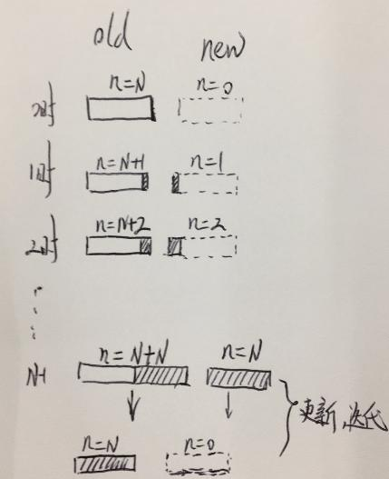

ActiveSubmaps2D类是cartographer中正在处理的submap地图顶层封装，可设置、获取、更新、插入、初始化当前submap，其主要封装了一个类似滑窗的方法，两个submap，一旧一新，其更新过程可如下图例，其实也可以看出每个相邻的两个submap实际上是有N个过渡的激光帧。

cartographer与其他slam最大的一个不同点就是采用了submap概念，即采用一定数量的laser  scan组成submap，然后再由n个submap组成整个地图空间。其中ActiveSubmaps2D类中旧的submap当采集完成时，即作为真正的存储的submap。
