# 姿态估计与李群和流形---收回(retraction)操作的选择

原文https://zhuanlan.zhihu.com/p/376342834

## 1 增量角度 $\theta = w\Delta t$ 和物体姿态的变化量  $\Delta q$ 之间的关系

在姿态估计的计算过程中，第一个要解决的问题就是，当我们在一段时间 $\Delta t$ 内测量得到角速度    $w$ ，得到物体变化的增量角度 $\theta = w\Delta t$ ，它和物体姿态的变化量  $\Delta q$ 之间的关系，也就是所谓的映射关系，是什么？看多了书，会发现这种映射关系居然不是唯一的，可以有好几种。

这种映射关系在流形中被称为收回(retraction)操作。在引入流形之后，就会发觉，存在有多种映射关系，其实是我们的选择。流形不只是完美的球面一种，我们相信底下的流形是什么样子，我们才选择了什么样的收回(retraction)操作。

## 2 形象理解映射关系

### 2.1 单位四元数的形象化

单位四元数 $q$ :
$$
q &= &r + x \pmb{\mathcal{i}} + y \pmb{\mathcal{j}} + z \pmb{\mathcal{k}} \\
  &= &r + \pmb{\mathcal{q}}
$$
可以表示三维空间的姿态。但是单位四元数 $q$ 要想用图形表示出来，也是一个困难的事情，因为单位四元数 $q$ 所在的球面是嵌入 $\mathbb{R}^4$ 空间中的 $\mathcal{S}^3$ 球面。所以有一种方法是用类似复平面的方式表示:

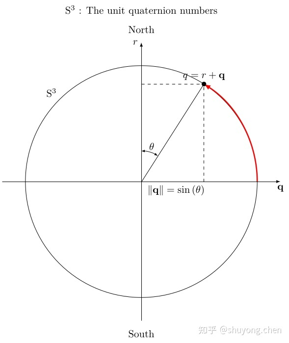

其中，实数轴做为南北轴。因为单位四元数 $q$ 表示旋转是两倍覆盖，所以一般选择 $r \ge 0$ 

的北半球表示一个三维旋转。另外，图中的角度 $\theta$ 代表的是:

$tan(\theta) = \frac{||q||}{r}$ 

### 2.2 映射关系的类型

在参考文献[1-3]这里，流形的收回(retraction)操作所选择指数映射函数 $exp()$ ，或大写指数映射函数 $\operatorname{Exp}()$ 的运算和常见的四元数形式关联为:
$$
\operatorname{Exp}(\theta a^{\wedge}) &= &exp([\theta \times])    \\
&= &cos(\frac{\theta}{2})+ sin(\frac{\theta}{2}) \pmb{\mathbb{u}}
$$
其实这个收回(retraction)操作，在不同的论文和项目里，有不同的版本。这个 $\frac{1}{2}$  系数，是因为四元数 $\mathcal{S}^3$   流形对 SO( 3 ) 是双倍覆盖。于是在旋转矩阵形式的版本中使用的是全角  $\theta$  ，而在四元数版本中使用的是半角 $\frac{\theta}{2}$ 。在参考文献[4]中，总结了常见的4种：

1. 正交投影 (Orthographic, O) 

   $ \left(\begin{array}{c}\sqrt{1-\|\boldsymbol{\theta}\|^{2} / 4} \\ \boldsymbol{\theta} / 2\end{array}\right) $

2. Rodrigues 参数 (Rodrigues Parameters, RP)

   $\frac{1}{\sqrt{4+\|\boldsymbol{\theta}\|^{2}}}\left(\begin{array}{l}2 \\ \boldsymbol{\theta}\end{array}\right) $

3. 改进型 Rodrigues 参数 (Modified Rodrigues Parameters, MRP)  

   $\frac{1}{16+\|\boldsymbol{\theta}\|^{2}}\left(\begin{array}{c}16-\|\boldsymbol{\theta}\|^{2} \\ 8 \boldsymbol{\theta}\end{array}\right) $

4. 旋转向量 (Rotation Vector, RV)

   $\left(\begin{array}{c}\cos (\boldsymbol{\theta} / 2) \\ (\boldsymbol{\theta} /\|\boldsymbol{\theta}\|) \sin (\boldsymbol{\theta} / 2)\end{array}\right) $

5. 参考文献[1-3]所选择的指数映射函数 

   $\exp ()\left(\begin{array}{c}\cos (\theta) \\ (\theta /\|\theta\|) \sin (\theta)\end{array}\right) $

前三种是我们所知道的球极平面投影 (stereographic projection){这三种投影分别具体称为正交投影  (Orthographic)、日晷投影 (Gnomonic) 和球极平面投影 (Stereographic)}。最后是所谓的等距投影  (Equidistant)。下面我们通过图形理解这些映射。

#### 2.2.1 正交投影(Orthographic)

其中 , $\mathbb{E}^3$ 空间在  $r \in [0, 1]$ 之间截取投影:

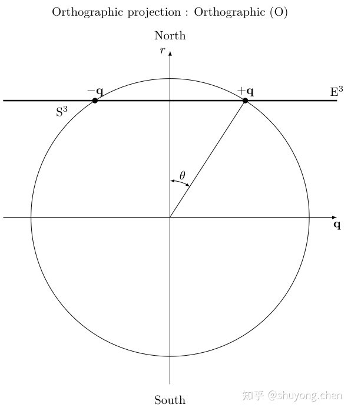

#### 2.2.2 Rodrigues 参数 (Rodrigues Parameters, RP)

又称Gibbs向量。这是[Dr. F. Landis Markley](https://link.zhihu.com/?target=http%3A//www.acsu.buffalo.edu/~johnc/markley/)的最爱，因为它是单映射， $+q$ 和  $-q$ 都映射到同一个Gibbs向量，对于同一个旋转来说，这是 $1:1$ 表示。并且因为 $tan()$  函数和高斯分布有一点点相像，就是两端有无限长尾。所以(NASA)大佬们的论文里更喜欢选择这个映射。在文献[4]里也偏向采用这种映射。这种映射属于日晷投影 (Gnomonic)， $\mathbb{E}^3$ 空间在  $r = 1$  ，通过圆心的两个单位四元数投影到同一个Gibbs向量

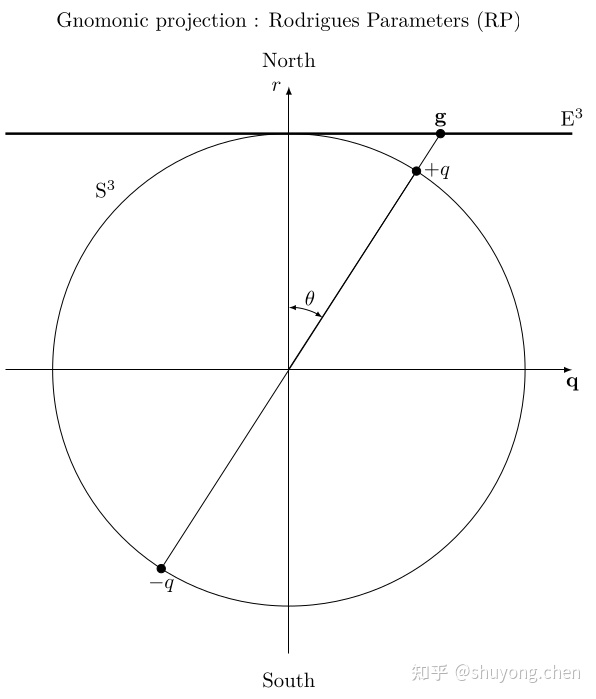

#### 2.2.3  改进型 Rodrigues 参数  (Modified Rodrigues Parameters, MRP)

这种映射与旋转向量映射有许多共同的特点，包括离散跳跃的需求，但又避免了超越函数。这种映射属于球极平面投影 (Stereographic)， $\mathbb{E}^3$ 空间在  $r = 0$  ， $\mathcal{S}^3$ 的一个半球在三维 $\pmb{\mathcal{p}}$  空间中投射到单位球体的内部，而 $\mathcal{S}^3$ 的另一个半球则投射到单位 $\pmb{\mathcal{p}} - sphere$  的外部。

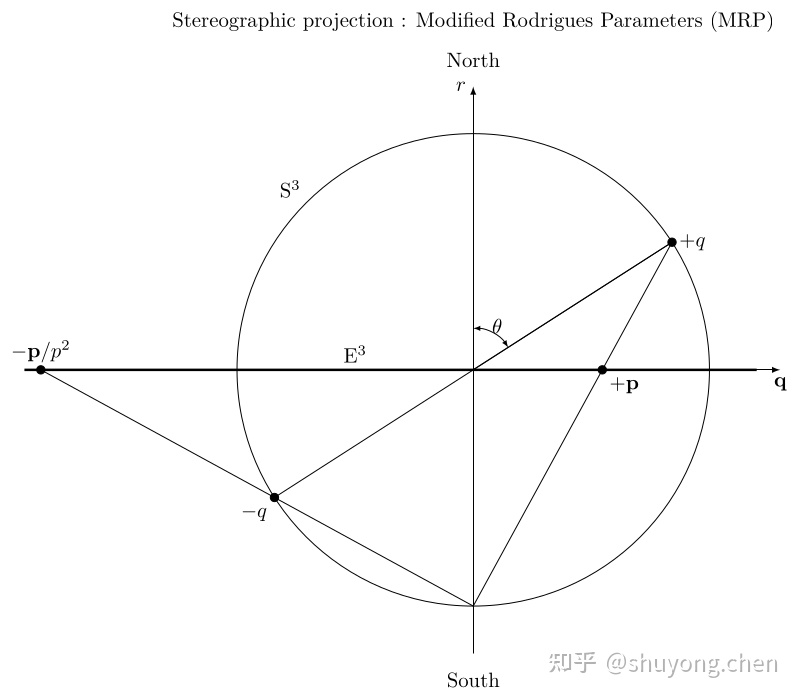

#### 2.2.4 旋转向量 (Rotation Vector, RV)

际上就是参考文献[1-3]所说的指数映射函数 $\operatorname{exp}()$ ，在旋转矩阵形式的版本中使用的是全角 $\theta$ ，而在四元数版本中使用的是半角  $\frac{\theta}{2}$  。这种映射属于等距投影 (Equidistant)， $\mathbb{E}^3$ 空间位于幺元处，并且向量的模长和测地线(geodesic)的弧长是  $1:1$ 关系.

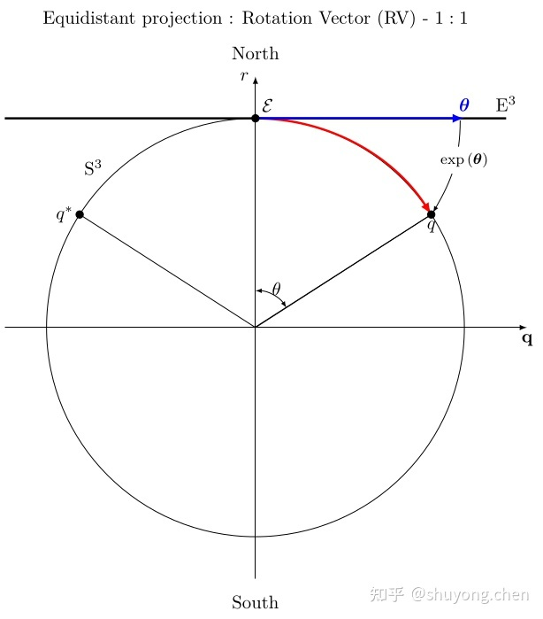

## 3 映射关系的选择

同时存在这么多种映射关系，这往往体现了不同理论之间，还有理论和工程之间的差异。

如果说前三种映射关系是第四种的某种近似，因为这四种映射关系在零点附近的小角度情况下数值很接近，但大角度之后就明显不再是球面，如果球面是完美模型，选择前三种映射关系可能是因为某种原因，例如选择正交投影  (Orthographic)是因为它可以简单地把单位四元数转换为轴-角向量，选择Rodrigues参数(RP)是因为它是单映射，选择改进型Rodrigues参数(MRP)是因为它避免了超越函数的运算。此外，因为在工程中IMU的取样间隔时间 $\Delta t$  很小，所以一般增量角度  $\pmb{\theta = w \Delta t}$ 都很小，所以都会应用三角函数小角度近似的方法。

难道就没有一个高下么？在一些论文里，例如在文献[4]中，做过模拟检验，前四种映射关系在数值精度上其实没有一个有特别优势。如果加入第五种映射关系经行对比，我估计结果也类似。因为都是在卡尔曼滤波器中采用这些映射关系，而卡尔曼是一个神奇的东西。虽然物理模型有差异，在测量更新阶段的残差增大，那首先影响的是协方差矩阵，接着是卡尔曼增益系数，但是最后的状态输出会趋向于类似的稳定数值上，因为测量校正发挥了影响力。最后可能只是内部的协方差矩阵的数量级从 $10^{-9}$ 变成了 $10^{-8}$ ，虽然差了一个数量级，但都是一个很小的数值，而且协方差矩阵和卡尔曼增益等比例稳定之后，输出结果也会稳定趋同。

## 4 总结

大佬选啥我跟啥。城门失火，殃及池鱼。神仙打架，小鬼遭殃。最后还得等大佬们吵架吵出一个结果之后我们好跟随。

## 5 参考文献

1. [A micro Lie theory for state estimation in robotics](https://link.zhihu.com/?target=https%3A//arxiv.org/abs/1812.01537)
2. [Lie theory for the roboticist](https://link.zhihu.com/?target=https%3A//www.youtube.com/watch%3Fv%3DnHOcoIyJj2o)
3. [Joan Solà - Lie theory for the Roboticist](https://link.zhihu.com/?target=https%3A//www.youtube.com/watch%3Fv%3DQR1p0Rabuww)
4. [Kalman Filtering for Attitude Estimation with Quaternions and Concepts from Manifold Theory](https://link.zhihu.com/?target=https%3A//www.mdpi.com/1424-8220/19/1/149)
5. [Full-Order Solution to the Attitude Reset Problem for Kalman Filtering of Attitudes](https://link.zhihu.com/?target=https%3A//arc.aiaa.org/doi/10.2514/1.G004134)

# 四元数的导数

参考：

[四元数速查手册](https://aipiano.github.io/2019/01/11/%E5%9B%9B%E5%85%83%E6%95%B0%E9%80%9F%E6%9F%A5%E6%89%8B%E5%86%8C/#:~:text=%E5%9B%9B%E5%85%83%E6%95%B0%E7%9A%84%E5%AF%BC%E6%95%B0%20%E5%AF%B9%E6%97%B6%E9%97%B4%E6%B1%82%E5%AF%BC,%E5%9C%A8%E5%8A%A8%E5%8A%9B%E5%AD%A6%E7%B3%BB%E7%BB%9F%E4%B8%AD%EF%BC%8C%E7%94%A8%E5%9B%9B%E5%85%83%E6%95%B0%E8%A1%A8%E7%A4%BA%E6%9F%90%E4%B8%AA%E7%89%A9%E4%BD%93%E7%9A%84%E5%A7%BF%E6%80%81%EF%BC%88%E6%97%8B%E8%BD%AC%E9%87%8F%EF%BC%89%E6%97%B6%EF%BC%8C%E5%9B%9B%E5%85%83%E6%95%B0%E6%98%AF%E6%97%B6%E9%97%B4%E7%9A%84%E5%87%BD%E6%95%B0%EF%BC%8C%E5%88%99%E5%85%B6%E5%85%B3%E4%BA%8E%E6%97%B6%E9%97%B4%E7%9A%84%E5%8F%98%E5%8C%96%E7%8E%87%EF%BC%88%E5%AF%BC%E6%95%B0%EF%BC%89%E4%B8%BA%20%E5%85%B6%E4%B8%AD%E6%98%AF%E5%B1%80%E9%83%A8%EF%BC%88Body%EF%BC%89%E5%9D%90%E6%A0%87%E7%B3%BB%E4%B8%8B%E7%89%A9%E4%BD%93%E7%9A%84%E8%A7%92%E9%80%9F%E5%BA%A6%EF%BC%8C%E6%98%AF%E4%B8%80%E4%B8%AA%E8%BD%B4%E8%A7%92%E8%A1%A8%E7%A4%BA%E7%9A%84%E4%B8%89%E7%BB%B4%E7%9F%A2%E9%87%8F%EF%BC%8C%E5%B8%A6%E5%85%A5%E4%B8%8A%E5%BC%8F%E8%AE%A1%E7%AE%97%E6%97%B6%E8%A6%81%E5%85%88%E5%8F%98%E4%B8%BA%E7%BA%AF%E5%9B%9B%E5%85%83%E6%95%B0%E3%80%82)

[三角函数公式（超全）](https://zhuanlan.zhihu.com/p/362443307)

[四元数的微分形式](https://blog.csdn.net/qq_39554681/article/details/88909564)

## 对时间求导

### 关于四元数表示旋转的一些知识

#### 1.四元数表示向量旋转
定义: $ p_v = [p_x \enspace p_y \enspace p_z]^T$为三维空间中的一点，将其转换成纯四元数形式即： $p=[0 \enspace p_v]^T$，令 
$$
q=
 \begin{bmatrix}
 cos(\frac{\theta}{2}) & vsin(\frac{\theta}{2})
 \end{bmatrix} ^T
$$

为单位四元数，则有
$$
p' = q \thinspace \cdot  p \thinspace \cdot  q^{-1}
   = 
   \begin{bmatrix}
   0 & p_v'
   \end{bmatrix}
   ^T
$$
其中 $p_v' = [p_x' \enspace p_y' \enspace p_z']^T$表示 $p_v$ 绕旋转轴 $v$ 旋转 $\theta$ 角度后得到的新向量在原三维空间中的坐标表示。

以1.为例，先做 $q_1$ 旋转，再做 $q_2$ 旋转之后向量  $x$ 在新坐标系中的表示为  $x'$ ，则有：
$$
x_{temp} &= &q_1 \thinspace \cdot x \thinspace \cdot q_1^{-1} \\
x' &= &q_2 \thinspace \cdot x_{temp} \thinspace \cdot q_2^{-1} \\
x' &= &q_2 q_1 \thinspace \cdot x \thinspace \cdot q_2^{-1} q_1^{-1}
$$
四元数 $q_2q_1$ 表示了连续两次的旋转。

#### 2.四元数表示坐标系旋转
定义向量 $v_0$在 $oxyz$坐标系中的表示为 $v_1=[v_x \enspace v_y \enspace v_z]^T$，令坐标系 $oxyz$ 绕单位旋转轴 $v$ 旋转 $\theta$ 角度，得到新坐标系  $o'x'y'z'$，此时 $v_0$ 在新坐标系中的坐标表示为 $v_1'=[v_x' \enspace v_y' \enspace v_z']^T$ 。那么，向量 $v_0$ 在两个坐标系之间的坐标转换关系为：
$$
\begin{bmatrix}
0 & v_1'
\end{bmatrix}
= q^{-1} \thinspace \cdot \thinspace
\begin{bmatrix}
0 & v_1
\end{bmatrix}

\thinspace \cdot \thinspace q
$$

其中
$$
q = 
\begin{bmatrix}
cos(\frac{\theta}{2}) & vsin(\frac{\theta}{2})
\end{bmatrix}
$$
其中 $v_1'=[v_x' \enspace v_y' \enspace v_z']^T$表示，原三维空间中的坐标系绕旋转轴 $v$ 旋转 $\theta$ 角度后得到了一个新的坐标系， 向量 $v_0$ 在新的坐标系中的坐标表示。

以2.为例，先做 $q_1$ 旋转，再做 $q_2$ 旋转之后向量 $x$ 在新坐标系中的表示为 $x'$ ，则有：
$$
x_{temp} &= &q_1^{-1} \thinspace \cdot x \thinspace \cdot q_1 \\
x' &= &q_2^{-1} \thinspace \cdot x_{temp} \thinspace \cdot q_2 \\
x' &= &q_2^{-1} q_1^{-1} \thinspace \cdot x \thinspace \cdot q_1 q_2  
$$
四元数 $q_1q_2$ 表示了连续两次的旋转。

**值得注意的是，上述两种四元数表示旋转的方式得到的四元数旋转关系是不同的，这是因为1.表示向量在同一个坐标系中的旋转，而2.中旋转的是坐标系**。

### 四元数微分形式推导

以无人机的姿态表示为例子，我们定义单位四元数  $q(t)$ 来表示从无人机的地理系E到机体系B的旋转关系。在 $t+\bigtriangleup t$ 时刻，旋转可表示为  $q(t + \bigtriangleup t)$；即在 $\bigtriangleup t$ 过程中，机体坐标系又经过了一个微小旋转，这个微小旋转的瞬时旋转角速度为 $w$；接着对瞬时旋转轴做单位化处理
$$
\hat{w} = w/||w||
$$
在 $\bigtriangleup t$ 转过的角度为：
$$
\bigtriangleup \theta = \bigtriangleup t ||w||
$$
则这次的微小旋转可由如下形式的单位四元数表示：
$$
\bigtriangleup q &= &cos(\frac{\bigtriangleup \theta}{2}) + \hat{w} sin(\frac{\bigtriangleup \theta}{2})  \\
&= &cos(\frac{||w||}{2} \bigtriangleup t) + \hat{w} sin(\frac{||w||}{2} \bigtriangleup t)
$$
假定地理系到机体系的旋转四元数为: $q_e^b = [q_0  \enspace q_1 \enspace q_2 \enspace q_3]^T$ 

则根据上述2.有
$$
\begin{bmatrix}
0 & ^{e}r
\end{bmatrix}
= (q_b^e)^{-1} 
\begin{bmatrix}
0 & ^br
\end{bmatrix}
q_b^e
$$
即(**注意**：此处转化为与1.相同的表示形式，但两者的物理意义不同)：
$$
\begin{bmatrix}
0 & ^{e}r
\end{bmatrix}
= (q_e^b)
\begin{bmatrix}
0 & ^br
\end{bmatrix}
(q_e^b)^{-1}
$$
那么根据上面的推导，连续两次的旋转可以表示为：

$q(t + \bigtriangleup t) = \bigtriangleup q \enspace \cdot \enspace q$

则有：
$$
q(t + \bigtriangleup t) - q(t) &= &\Big(cos(\frac{||w||}{2} \bigtriangleup t) + \hat{w} sin(\frac{||w||}{2} \bigtriangleup t) \Big) q(t) -q(t)
\\
&= &\Big(-2sin^2(\frac{||w||}{4} \bigtriangleup t)\Big)q(t) + \Big(\hat{w} sin(\frac{||w||}{2} \bigtriangleup t)\Big)q(t)
$$

略去高阶项可得：
$$
q(t + \bigtriangleup t) - q(t) = \Big(\hat{w} sin(\frac{||w||}{2} \bigtriangleup t)\Big)q(t)
$$
即:
$$
\dot{q(t)} &= &\lim_{\bigtriangleup t \to 0} \frac{q(t + \bigtriangleup t) - q(t)}{\bigtriangleup t}
\\
&= &\lim_{\bigtriangleup t \to 0} \frac{\Big(\hat{w} sin(\frac{||w||}{2} \bigtriangleup t)\Big)q(t)}{\bigtriangleup t}
\\
&= &\frac{1}{2} \thinspace \cdot \thinspace \hat{w} \thinspace \cdot \thinspace ||w|| \thinspace \cdot \thinspace q(t)
\\
&= &\frac{1}{2} \thinspace \cdot \thinspace w \thinspace \cdot \thinspace q(t)
$$
注意：此处的 $\cdot$ 表示四元数乘法； $w$ 为角速度的纯四元数表示，$w = [0 \enspace w_x \enspace w_y \enspace w_z]^T$

由于实际工程中我们都是通过固连在机体上的陀螺仪等传感器来获知机体角速度

$w^b$

它与地理坐标系下的角速度表示有如下关系

$w = q(t) w^b q(t)^{-1}$

带入上式即可得到姿态解算过程中常用的四元数的微分形式

$\dot{q(t)} = \frac{1}{2}q(t)w^b$

可以看出，通过一次四元数乘法运算便可得到四元数的微分。

上式可以写成如下的矩阵形式：
$$
\begin{bmatrix}
\dot{q_0} \\
\dot{q_1} \\
\dot{q_2} \\
\dot{q_3} 
\end{bmatrix}
= \frac{1}{2} 
\begin{bmatrix}
q_0 & -q_1 & -q_2 & -q_3 \\
q_1 &  q_0 & -q_3 &  q_2 \\
q_2 &  q_3 &  q_0 & -q_1 \\
q_3 & -q_2 &  q_1 &  q_0
\end{bmatrix}
\begin{bmatrix}
0 \\
w_x^b \\
w_y^b \\
w_z^b
\end{bmatrix}
$$
或者
$$
\begin{bmatrix}
\dot{q_0} \\
\dot{q_1} \\
\dot{q_2} \\
\dot{q_3} 
\end{bmatrix}
= \frac{1}{2} 
\begin{bmatrix}
    0 & -w_x^b & -w_y^b & -w_z^b \\
w_x^b &      0 &  w_z^b & -w_y^b \\
w_y^b & -w_z^b &      0 &  w_x^b \\
w_z^b &  w_y^b & -w_x^b &      0
\end{bmatrix}
\begin{bmatrix}
q_0 \\
q_1 \\
q_2 \\
q_3
\end{bmatrix}
$$

`QuaternionParameterization`四元数的流型:

$\textcolor{#00ff00}{\boxplus(x,\Delta) = \Big[cos(|\Delta|), \frac{sin(|\Delta|)}{|\Delta|}\Delta \Big] * x}$

# 三维旋转：欧拉角、四元数、旋转矩阵、轴角之间的转换

原文：

[三维旋转：欧拉角、四元数、旋转矩阵、轴角之间的转换](https://zhuanlan.zhihu.com/p/45404840)

参考文献：

[1]Henderson, D.M.. Euler angles, quaternions, and transformation matrices for space shuttle analysis[C]//NASA, Jun 09, 1977.

[2] [https://en.wikipedia.org/wiki/Conversion_between_quaternions_and_Euler_angles#Euler_Angles_to_Quaternion_Conversion](https://link.zhihu.com/?target=https%3A//en.wikipedia.org/wiki/Conversion_between_quaternions_and_Euler_angles%23Euler_Angles_to_Quaternion_Conversion)

[3] [https://en.wikipedia.org/wiki/Euler_angles](https://link.zhihu.com/?target=https%3A//en.wikipedia.org/wiki/Euler_angles)

[4] [https://en.wikipedia.org/wiki/Rotation_matrix](https://link.zhihu.com/?target=https%3A//en.wikipedia.org/wiki/Rotation_matrix)

[5] Slabaugh G G. Computing Euler angles from a rotation matrix[J]. 1999.

[6] Mike Day, Converting a Rotation Matrix to a Quaternion. [https://d3cw3dd2w32x2b.cloudfront.net](https://link.zhihu.com/?target=https%3A//d3cw3dd2w32x2b.cloudfront.net/wp-content/uploads/2015/01/matrix-to-quat.pdf)

[7] Tomas K.M. , Eric H., Naty H.. Real Time Rendering 3rd Edition , p68-p69,p76-p77， 2008.

[9] [https://en.wikipedia.org/wiki/Rodrigues%27_rotation_formula](https://link.zhihu.com/?target=https%3A//en.wikipedia.org/wiki/Rodrigues%27_rotation_formula)

[10] [https://en.wikipedia.org/wiki/Cross_product#Conversion_to_matrix_multiplication](https://link.zhihu.com/?target=https%3A//en.wikipedia.org/wiki/Cross_product%23Conversion_to_matrix_multiplication)

[11] [http://mathworld.wolfram.com/RodriguesRotationFormula.html](https://link.zhihu.com/?target=http%3A//mathworld.wolfram.com/RodriguesRotationFormula.html)

[12] [https://zh.wikipedia.org/wiki/%E5%9B%9B%E5%85%83%E6%95%B8](https://link.zhihu.com/?target=https%3A//zh.wikipedia.org/wiki/%E5%9B%9B%E5%85%83%E6%95%B8)

[13] [https://blog.csdn.net/silangquan/article/details/39008903](https://link.zhihu.com/?target=https%3A//blog.csdn.net/silangquan/article/details/39008903)

[14] Quaternion and Rotations, [http://run.usc.edu/cs520-s12/quaternions/quaternions-cs520.pdf](https://link.zhihu.com/?target=http%3A//run.usc.edu/cs520-s12/quaternions/quaternions-cs520.pdf)

[15] [https://en.wikipedia.org/wiki/Quaternions_and_spatial_rotation](https://link.zhihu.com/?target=https%3A//en.wikipedia.org/wiki/Quaternions_and_spatial_rotation) 

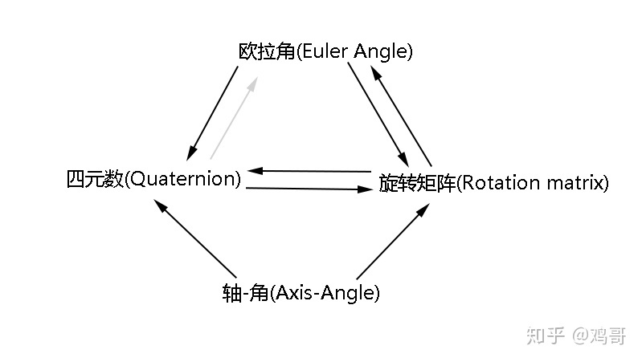

## **1 欧拉角(Euler Angle)与旋转矩阵(Rotation Matrix)**

### **1.1 欧拉角 ----> 旋转矩阵**

首先欧拉角旋转序列(Euler Angle Rotational Sequence)一共有12种顺规，6种绕三条轴的旋转(也叫**Tait-Bryan Angle**，XYZ,XZY,YXZ,YZX,ZXY,ZYX)，另外6种只绕两条轴的旋转(也叫**Proper Euler Angle**，XYX,YXY,XZX,ZXZ,YZY,ZYZ)。如果相邻两次旋转是绕同一条轴，例如XXY，那么其实可以坍缩成XY。那么只绕一条轴旋转就根本不够自由度就不需要说了。也就是说，一共有12种基础旋转的组合顺序，它们可以旋转出三维的所有旋转状态。所以一共是12种旋转顺规（可以表示所有旋转的集合），DirectXMath库采用的是**ZXY顺规**，分别对应着Z-Roll，X-Pitch，Y-Yaw。
$$
\begin{aligned}
R(\alpha, \beta, \gamma) = & R_{y}(\alpha) R_{x}(\beta) R_{z}(\gamma) \\
= &\left[\begin{array}{ccc}
\cos \alpha & 0 & \sin \alpha \\
0 & 1 & 0 \\
-\sin \alpha & 0 & \cos \alpha
\end{array}\right]\left[\begin{array}{ccc}
1 & 0 & 0 \\
0 & \cos \beta & -\sin \beta \\
0 & \sin \beta & \cos \beta
\end{array}\right]\left[\begin{array}{cc}
\cos \gamma & -\sin \gamma & 0 \\
\sin \gamma & \cos \gamma & 0 \\
0 & 0 & 1
\end{array}\right] \\
= &\left[\begin{array}{ccc}
c_{1} & 0 & s_{1} \\
0 & 1 & 0 \\
-s_{1} & 0 & c_{1}
\end{array}\right]\left[\begin{array}{cccc}
1 & 0 & 0 \\
0 & c_{2} & -s_{2} \\
0 & s_{2} & c_{2}
\end{array}\right]\left[\begin{array}{ccc}
c_{3} & -s_{3} & 0 \\
s_{3} & c_{3} & 0 \\
0 & 0 & 1
\end{array}\right] \\
= &\left[\begin{array}{ccc}
c_{1} & s_{1} s_{2} & s_{1} c_{2} \\
0 & c_{2} & -s_{2} \\
-s_{1} & c_{1} s_{2} & c_{1} c_{2}
\end{array}\right]\left[\begin{array}{ccc}
c_{3} & -s_{3} & 0 \\
s_{3} & c_{3} & 0 \\
0 & 0 & 1
\end{array}\right] \\
= &\left[\begin{array}{cccc}
c_{1} c_{3}+s_{1} s_{2} s_{3} & c_{3} s_{1} s_{2}-c_{1} s_{3} & c_{2} s_{1} \\
c_{2} s_{3} & c_{2} c_{3} & -s_{2} \\
c_{1} s_{2} s_{3}-s_{1} c_{3} & s_{1} s_{3}+c_{1} c_{3} s_{2} & c_{1} c_{2}
\end{array}\right]

\\
\\
其中:
\\
\\
c_{1} = &\cos (\alpha)=\cos \left(Y_{y a w}\right), s_{1}=\sin \alpha= \sin \left(Y_{y a w}\right) \\
c_{2} = &\cos (\beta)=\cos \left(X_{p i t c h}\right), s_{2}=\sin \beta=\sin \left(X_{p i t c h}\right) \\
c_{3} = &\cos (\gamma)=\cos \left(Z_{\text {roll }}\right), s_{3}=\sin \gamma=\sin \left(Z_{\text {roll }}\right)
\end{aligned}
$$
这里要提一嘴**内旋(intrinsic rotation)**和外旋**(extrinsic rotation)：内旋的每个elemental绕的是object space basis的轴，外旋的每个elemental rotation绕的是world space（惯性系）basis的轴**。上面的矩阵之所以是这么个顺序，是因为：

1. 采用了ZXY顺规
2. 采用列主向量
3. 采用外旋的约定（毕竟在图形学里常用euler angle去表示物体相对于惯性系的旋转姿态）

那么给定一个向量 $v$ ，上面的矩阵左乘以这个向量，就是对它做一次主动旋转，得到变换后的向量 $v^{'}$：

$v^{'} = Rv$ 

在这规定下，上面的矩阵就是先roll Z，再pitch X，再yaw Y。

上面的欧拉角--->矩阵的结果与维基百科Euler Angles[3] ![[公式]](https://www.zhihu.com/equation?tex=Y_1X_2Z_3) 给出的结果一致，那应该稳了：

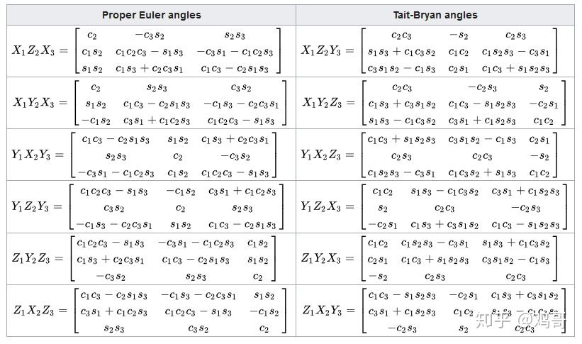

### **1.2 旋转矩阵----> 欧拉角**

参考一篇NASA的关于姿态描述的技术报告[1]的Appendix-A6和[5]，我们可以用**旋转矩阵元素的相乘、相除、反三角函数等操作去“凑”出欧拉角**。[5]给出了从XYZ顺规提取欧拉角的方法、步骤、思路，[1]则给出了全部12种顺规的欧拉角提取公式，但是没有给一些细节注意事项。所以总结一下，根据[1]、[5]、[7]《Real Time Rendering 3rd  Edition》4.2.2和自己的推导，从ZXY顺规旋转矩阵提取欧拉角的公式是（[1]原文下标似乎有点小问题）：

- Y axis yaw  angle:

  $\alpha=\operatorname{atan} 2(\sin \alpha \cos \beta, \cos \alpha \cos \beta)=\operatorname{atan} 2\left(m_{13}, m_{33}\right) $

- X axis pitch angle:

  $\beta=\arcsin (\sin \beta)=\arcsin \left(-m_{23}\right) $

- Z axis roll angle:

  $\gamma=\operatorname{atan} 2(\cos \beta \sin \gamma, \cos \beta \cos \gamma)=\operatorname{atan} 2\left(m_{21}, m_{22}\right)$

注意到一点，注意到矩阵的每一个元素都是pitch angle $\beta$  的函数…所以当 $m_{23} = -sin\beta = \pm 1$  即 $cos \beta = 0$  的时候，这时候其他的欧拉角提取表达式就凉凉了（分子分母都是0, arctan和atan2都没有意义了）….其实pitch angle $\beta = \pm \pi /2$ 恰好就是Gimbal Lock的位置。在Gimbal Lock的时候，旋转矩阵会退化为：
$$
\begin{aligned}
R(\alpha, \beta, \gamma) &=\left[\begin{array}{ccc}
c_{1} c_{3} \pm s_{1} s_{3} & \pm c_{3} s_{1}-c_{1} s_{3} & 0 \\
0 & 0 & \pm 1 \\
\pm c_{1} s_{3}-s_{1} c_{3} & s_{1} s_{3} \pm c_{1} c_{3} & 0
\end{array}\right] \\
&=\left[\begin{array}{ccc}
\cos (\alpha \pm \gamma) & \sin (\alpha \pm \gamma) & 0 \\
0 & 0 & \pm 1 \\
-\sin (\alpha \pm \gamma) & -\cos (\alpha \pm \gamma) & 0
\end{array}\right]
\end{aligned}
$$
那么要进一步处理万向节死锁的corner case就需要分两种情况：

- $\beta = - \pi /2$ ，此时 $sin\beta = - 1, cos \beta = 0$
  $$
  \begin{aligned}
  R(\alpha, \beta, \gamma) &=\left[\begin{array}{ccc}
  c_{1} c_{3}-s_{1} s_{3} & -c_{3} s_{1}-c_{1} s_{3} & 0 \\
  0 & 0 & \pm 1 \\
  -c_{1} s_{3}-s_{1} c_{3} & s_{1} s_{3}-c_{1} c_{3} & 0
  \end{array}\right] \\
  &=\left[\begin{array}{ccc}
  \cos (\alpha+\gamma) & -\sin (\alpha+\gamma) & 0 \\
  0 & 0 & 1 \\
  -\sin (\alpha+\gamma) & -\cos (\alpha+\gamma) & 0
  \end{array}\right] \\
  \Rightarrow \alpha+\gamma &=\operatorname{atan} 2\left(-m_{12}, m_{11}\right)
  \end{aligned}
  $$
  要给 $\alpha$ 或者 $\gamma$ 其中一个欧拉角赋值，另外一个就按等式计算出来。

- $\beta =  \pi /2$ ，此时 $sin\beta = 1, cos \beta = 0$
  $$
  \begin{aligned}
  R(\alpha, \beta, \gamma) &=\left[\begin{array}{ccc}
  c_{1} c_{3}+s_{1} s_{3} & c_{3} s_{1}-c_{1} s_{3} & 0 \\
  0 & 0 & -1 \\
  c_{1} s_{3}-s_{1} c_{3} & s_{1} s_{3}+c_{1} c_{3} & 0
  \end{array}\right] \\
  &=\left[\begin{array}{ccc}
  \cos (\alpha-\gamma) & \sin (\alpha-\gamma) & 0 \\
  0 & 0 & -1 \\
  -\sin (\alpha-\gamma) & \cos (\alpha-\gamma) & 0
  \end{array}\right] \\
  \Rightarrow \alpha-\gamma &=\operatorname{atan} 2\left(m_{12}, m_{11}\right)
  \end{aligned}
  $$
  

 同样的，要给 $\alpha$ 或者 $\gamma$ 其中一个欧拉角赋值，另外一个就按等式计算出来。

从旋转矩阵提取欧拉角的公式跟欧拉角顺规的选取有关，因为旋转矩阵的元素会略有不同，但是思路都是一样的，就是**根据旋转矩阵的解析表达式+反三角函数凑出来**23333。

## **2 四元数(Quaternion)与旋转矩阵**

### **2.1 四元数---->旋转矩阵**

众所周知的是，欧拉旋转是有万向节死锁(Gimbal Lock)的问题的。幸好我们有四元数(Quaternion)这种数学工具可以避免这个情况。一般来说，我们都会用单位四元数 $\mathbf{q} = w + x \pmb{\mathbf{i}} + y\pmb{\mathbf{j}} + z\pmb{\mathbf{k}}$ 来表示旋转，其中 $\|\mathbf{q}\| = x^2 + y^2 + z^2 + w^2$ 。那么给定一个单位四元数，可以构造旋转矩阵(column major)[1][4][8][14][15]：
$$
R(q)=\left[\begin{array}{ccc}
1-2 y^{2}-2 z^{2} & 2 x y-2 z w & 2 x z+2 y w \\
2 x y+2 z w & 1-2 x^{2}-2 z^{2} & 2 y z-2 x w \\
2 x z-2 y w & 2 y z+2 x w & 1-2 x^{2}-2 y^{2}
\end{array}\right]
$$
这个四元数构造的大概思路就是把**四元数的旋转操作写成矩阵形式**（注：给定一个用于旋转的单位四元数  $\mathbf{q} = w + x \pmb{\mathbf{i}} + y\pmb{\mathbf{j}} + z\pmb{\mathbf{k}}$ 和被旋转的三维向量 $\mathbf{v}$ ，那么要直接用四元数旋转这个向量，则我们首先要构造一个纯四元数 $\mathbf{p} = (\mathbf{v},0)$ ，设旋转后的向量为 $\mathbf{v}^{'}$  ，旋转后的向量构造的纯四元数为 $\mathbf{p}^{'} = (\mathbf{v}^{'},0)$ ，那么 $\mathcal{p}^{'} = \mathbf{q} \mathbf{p} \mathbf{q}^{-1}$ ）。因为是用四元数来构造矩阵的，所以这个矩阵构造公式就没有欧拉角顺规的说法了。

### **2.2 旋转矩阵---->四元数**

那第一步肯定是判断3x3矩阵是一个正交矩阵啦（满足 $\mathbf{R} \mathbf{R}^T = \mathbf{R}^T \mathbf{R} = I$ ）。那么如果这个矩阵已经是一个合法的旋转矩阵了，要从旋转矩阵里提取四元数，也是可以像提取欧拉角那样，**用参数化过的矩阵的表达式凑出来**。参考[8]《Real Time Rendering 3rd edition》Chapter4的思路，我们观察一下用四元数分量进行参数化的矩阵 $\mathbf{R}(q)$ ，然后经过一顿操作，我们发现：
$$
\begin{array}{l}
m_{32}-m_{23}=(2 y z+2 x w)-(2 y z-2 x w)=4 x w \\
m_{13}-m_{31}=(2 x z+2 y w)-(2 x z-2 y w)=4 y w \\
m_{21}-m_{12}=(2 x y+2 z w)-(2 x y-2 z w)=4 z w
\end{array}
$$
于是我们再凑出个实分量 $w$ ，就可以把四元数四个分量都用矩阵元素表示出来了。于是我们又机智地发现了一个等式：
$$
\begin{aligned}
\operatorname{tr}(R(q)) &=m_{11}+m_{22}+m_{33} \\
&=3-4\left(x^{2}+y^{2}+z^{2}\right) \\
&=4\left(1-\left(x^{2}+y^{2}+z^{2}\right)\right)-1 \\
&=4 w^{2}-1
\end{aligned}
$$

其中 $\operatorname{tr}(M)$ 是矩阵 $M$ 的迹(trace)，也就是矩阵对角元素的和。因为这里用的是3x3矩阵，跟其他资料里面的表示有一点不同。所以我们可以把四元数的四个分量都用矩阵元素凑出来了：
$$
\begin{aligned}
w &=\frac{\sqrt{(\operatorname{tr}(R)+1}}{2} \\
x &=\frac{m_{32}-m_{23}}{4 w} \\
y &=\frac{m_{13}-m_{31}}{4 w} \\
z &=\frac{m_{21}-m_{12}}{4 w}
\end{aligned}
$$
有一点《Real Time Rendering》提到的， ![[公式]](https://www.zhihu.com/equation?tex=w) 绝对值比较小的时候，可能会出现数值不稳定的情况，那么想要数值稳定的话就得用一种不用除法的方式来凑，在这不展开了，可以看一下RTR 2333。

## **3 欧拉角与四元数**

### **3.1 欧拉角---->四元数**

首先提一下四元数的乘积：
$$
\begin{aligned}
\mathbf{p} &=w_{1}+\mathbf{v}_{1}=w_{1}+x_{1} \mathbf{i}+y_{1} \mathbf{j}+z_{1} \mathbf{k} \\
\mathbf{q} &=w_{2}+\mathbf{v}_{2}=w_{2}+x_{2} \mathbf{i}+y_{2} \mathbf{j}+z_{2} \mathbf{k} \\
\Rightarrow \mathbf{p q} &=w_{1} w_{2}-\mathbf{v}_{1} \cdot \mathbf{v}_{2}+w_{2} \mathbf{v}_{1}+w_{1} \mathbf{v}_{2}+\mathbf{v}_{1} \times \mathbf{v}_{2} \\
&=\left[\begin{array}{l}
x_{1} w_{2}+w_{1} x_{2}+y_{1} z_{2}-z_{1} y_{2} \\
y_{1} w_{2}+w_{1} y_{2}+z_{1} x_{2}-x_{1} z_{2} \\
z_{1} w_{2}+w_{1} z_{2}+x_{1} y_{2}-y_{1} x_{2} \\
w_{1} w_{2}-x_{1} x_{2}-y_{1} y_{2}-z_{1} z_{2}
\end{array}\right]
\end{aligned}
$$
参考维基百科[2]的思路，欧拉角构造四元数，跟欧拉角构造旋转矩阵一样，就是**把三个基础旋转Elemental Rotation组合在一起。**

那么用于旋转的四元数 $q(x,y,z,w)$ 的表达式是：
$$
\begin{aligned}
\mathbf{q}_{\mathrm{IB}} &=\left[\begin{array}{c}
\cos (\psi / 2) \\
0 \\
0 \\
\sin (\psi / 2)
\end{array}\right]\left[\begin{array}{c}
\cos (\theta / 2) \\
0 \\
\sin (\theta / 2) \\
0
\end{array}\right]\left[\begin{array}{c}
\cos (\phi / 2) \\
\sin (\phi / 2) \\
0 \\
0
\end{array}\right] \\
&=\left[\begin{array}{l}
\cos (\phi / 2) \cos (\theta / 2) \cos (\psi / 2)+\sin (\phi / 2) \sin (\theta / 2) \sin (\psi / 2) \\
\sin (\phi / 2) \cos (\theta / 2) \cos (\psi / 2)-\cos (\phi / 2) \sin (\theta / 2) \sin (\psi / 2) \\
\cos (\phi / 2) \sin (\theta / 2) \cos (\psi / 2)+\sin (\phi / 2) \cos (\theta / 2) \sin (\psi / 2) \\
\cos (\phi / 2) \cos (\theta / 2) \sin (\psi / 2)-\sin (\phi / 2) \sin (\theta / 2) \cos (\psi / 2)
\end{array}\right]
\end{aligned}
$$

### **3.2 四元数---->欧拉角**

本来我以为，从四元数提取欧拉角的思路可以跟旋转矩阵提取欧拉角类似，也是用四元数的元素运算和反三角函数凑出公式来。后来我发现这简直就是一个极其硬核的任务，展开之后每一项都是六次多项式，画面有一丢暴力且少儿不宜，直接强行凑的话画风大概是这样：
$$
\begin{array}{c}
x w &= &\left(c_{1} s_{2} c_{3}+s_{1} c_{2} s_{3}\right)\left(c_{1} c_{2} c_{3}+s_{1} s_{2} s_{3}\right) \\
&= &c_{1}^{2} c_{2} s_{2} c_{3}^{2}+c_{1} s_{2} s_{2}^{2} c_{3} s_{3}+c_{1} s_{1} c_{2}^{2} c_{3} s_{3}+s_{1}^{2} c_{2} s_{2} s_{3}^{2} \\
y z &= &\left(s_{1} c_{2} c_{3}-c_{1} s_{2} s_{3}\right)\left(-s_{1} s_{2} c_{3}+c_{1} c_{2} s_{3}\right) \\
&= &-s_{1}^{2} c_{2} s_{2} c_{3}^{2}+c_{1} s_{1} c_{2}^{2} c_{3} s_{3}+c_{1} s_{1} s_{2}^{2} c_{3} s_{3}-c_{1}^{2} c_{2} s_{2} s_{3}^{2} \\
\Rightarrow 2(x w-y z) &= &2\left(c_{1}^{2} c_{2} s_{2}+s_{1}^{2} c_{2} s_{2}\right)=2 c_{2} s_{2}=\sin \beta \\
\Rightarrow \beta &= &\arcsin (2(x w-y z))=\arcsin \left(-m_{23}\right)
\end{array}
$$
这个结果跟欧拉角参数化的旋转矩阵的  $m_{23} = -sin\beta = 2yz - 2xw$  的表达式是吻合的。但这还只是最好凑的那一个，惹不起惹不起。所以舒服的思路还是**四元数-->旋转矩阵-->欧拉角**，想一步到位的话，把四元数分量参数化的旋转矩阵、欧拉角参数化的旋转矩阵结合在一起，参考下旋转矩阵转欧拉角的方法，替换下元素就完事了。这里就不把公式展开了，因为四元数直接转欧拉角 跟 旋转矩阵转欧拉角一样，依旧是要处理gimbal lock的corner case，还是那么麻烦，所以这里先鸽了23333

## **4 轴-角(Axis-Angle)**

### **4.1 轴角---->四元数**

轴-角(Axis-Angle)顾名思义就是绕某条单位轴旋转一定角度，从这个意义上看，它构造四元数是非常舒服的，毕竟直观的几何意义有一点点类似，绕单位轴 $u$ 旋转 $\theta$ 的四元数是：
$$
\pmb{\mathbf{q}}(w,\pmb{\mathbf{v}}) = (cos \frac{\theta}{2}, \pmb{\mathbf{u}} sin \frac{\theta}{2} )
$$

### **4.2 轴角---->旋转矩阵**

Axis Angle转Rotation Matrix可以从[9]罗德里格斯旋转公式Rodrigues Rotation Formula开始推导。

[Rodrigues' rotation formula](https://link.zhihu.com/?target=https%3A//en.wikipedia.org/wiki/Rodrigues%27_rotation_formula)

设 $\mathbf{v}$ 是我们要旋转的单位向量，旋转轴为 $\mathbf{k}$ ，  $\mathbf{v}$  绕 $\mathbf{k}$  旋转角度 $\theta$ ，那么旋转后的向量为：
$$
\mathbf{v}_{r o t}=\mathbf{v} \cos \theta+(\mathbf{k} \times \mathbf{v}) \sin \theta+\mathbf{k}(\mathbf{k} \cdot \mathbf{v})(1-\cos \theta)
$$
这个公式的推导思路是这样子的，我们先对向量 $\mathbf{v}$ 进行正交分解，分解成投影到旋转轴    $\mathbf{k}$  的分量和垂直于   $\mathbf{k}$  的分量：
$$
\mathbf{v} = \mathbf{v}_{\bot} + \mathbf{v}_{\parallel}
$$
其中：
$$
\mathbf{v}_{\parallel} &=  &(\mathbf{v} \cdot \mathbf{k})\mathbf{k}
\\
\mathbf{v}_{\bot} &=  &-\mathbf{k} \times (\mathbf{k} \times \mathbf{v})
$$
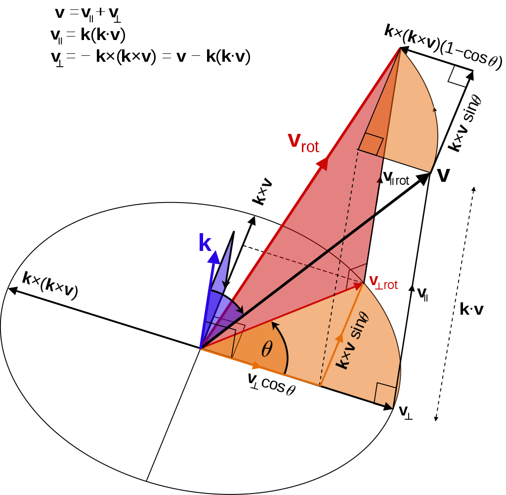

于是绕 $\mathbf{k}$ 旋转向量 $\mathbf{v}$  其实就是把上面**正交投影后的向量分别旋转之后再加起来**。那么很明显的，投影到旋转轴上的部分 $\mathbf{v}_{\parallel}$ 都跟旋转轴共享了，那么自然旋转之后的结果就没有变化了，于是我们只需要旋转和旋转轴垂直的部分  $\mathbf{v}_{\bot}$  。那么这个 $\mathbf{v}_{\bot}$  旋转后的表达式就是：
$$
\mathbf{v}_{\perp-\text { rotated }}=\cos \theta \mathbf{v}_{\perp}+\sin \theta \mathbf{k} \times \mathbf{v}
$$
然后我们不按wikipedia里面坑爹的、不考虑下文的变形，自己推一波：
$$
\begin{aligned}
\mathbf{v}_{\text {rotated }} &=\mathbf{v}_{\perp-\text { rotated }}+\mathbf{v}_{\|-\text {rotated }} \\
&=\cos \theta \mathbf{v}_{\perp}+\sin \theta \mathbf{k} \times \mathbf{v}+\mathbf{v}_{\|} \\
&=-\cos \theta \mathbf{k} \times(\mathbf{k} \times \mathbf{v})+\sin \theta \mathbf{k} \times \mathbf{v}+\left(\mathbf{v}-\mathbf{v}_{\perp}\right) \\
&=-\cos \theta \mathbf{k} \times(\mathbf{k} \times \mathbf{v})+\sin \theta \mathbf{k} \times \mathbf{v}+(\mathbf{v}-(-\mathbf{k} \times(\mathbf{k} \times \mathbf{v}))) \\
&=\mathbf{v}+(1-\cos \theta) \mathbf{k} \times(\mathbf{k} \times \mathbf{v})+\sin \theta \mathbf{k} \times \mathbf{v}
\end{aligned}
$$
这里我们把旋转后向量的表达式**变形得只剩下叉积(cross product)，去掉点积(dot product)了**，这样子我们才可以把这个绕轴旋转的表达式写成矩阵形式。怎么写呢？首先叉积可以写成矩阵形式：
$$
\begin{array}{c}
\mathbf{M}=\left[\begin{array}{ccc}
0 & -k_{z} & k_{y} \\
k_{z} & 0 & -k_{x} \\
-k_{y} & k_{x} & 0
\end{array}\right] \\
\mathbf{M v}=\mathbf{k} \times \mathbf{v}
\end{array}
$$
于是罗德里格斯旋转公式的变换就可以写成矩阵形式：
$$
R(\mathbf{k}, \theta)=\mathbf{I}+\sin \theta \mathbf{M}+(1-\cos \theta) \mathbf{M}^{2}
$$
展开之后就是：
$$
R(\mathbf{k}, \theta) = 
	\begin{bmatrix}
   		\cos \theta+k_{x}^{2}(1-\cos \theta) & -\sin \theta k_{z}+(1-\cos \theta) k_{x} k_{y} & \sin \theta k_{y}+(1-\cos \theta) k_{x} k_{z} \\
		\sin \theta k_{z}+(1-\cos \theta) k_{x} k_{y} & \cos \theta+k_{y}^{2}(1-\cos \theta) & -\sin \theta k_{x}+(1-\cos \theta) k_{y} k_{z} \\
		-\sin \theta k_{y}+(1-\cos \theta) k_{x} k_{z} & \sin \theta k_{x}+(1-\cos \theta) k_{y} k_{z} & \cos \theta+k_{z}^{2}(1-\cos \theta)
	\end{bmatrix}
$$

# IMU预积分原理

以VINS-Mono为例

原文：

[如何将大象放进去：SLAM技术之IMU预积分原理[1]](https://zhuanlan.zhihu.com/p/385180002)

## **1 前言**

预积分是一种巧妙利用“诀窍”——相对位姿差异在积分运算中保持固定——将位姿类传感器（原始的）高频观测等效为（经过积分的）低频观测的处理技术。

将预积分应用于经典的增量/渐进（incremental）状态滤波算法[8]时，事实上根本不存在什么惊喜（惊不惊喜）。但在批量（batch）状态滤波算法中，预积分值的计算代价是近似“锁定”的（即使后续因为IMU偏置状态发生变化需要调整，调整代价也很微小），在滤波算法中优化过程中面对一波接一波的重复性迭代计算，这种“折扣”就显得尤为“诱惑”——预积分值一旦取得，每次都可以直接拿来作为等效过程内的位姿测量，迭代过程中即使作为传感器测量基准的状态位姿发生改变了，也不需要重新对整个过程的观测进行积分计算，所谓“磨刀不误砍柴工”就是“惊喜”。

换一个角度理解，预积分技术以积分的初始状态作为基准，在进行积分操作后就将等效时间段内的系列过程状态进行了舍弃，随之同时被忽略的是时间段内过程状态间的链式依赖关系。最后的效果是时间段内的位姿变化以一个等效的可变基准的单个（相对）状态呈现。简单来讲，预积分对高频传感器进行了“降维打击”，在“打击”下观测信息损失了大量过程状态及其细节，仅留下一个具有相对意义的状态量来模拟传感器观测（以下称为等效观测）。

彼之砒霜，吾之蜜糖，世界就是这么奇妙，在非线性优化算法的眼中，损失细节的预积分可是香饽饽。这类采用批量状态滤波的算法因计算资源的限制，为了算法的实时性，会尽可能减少滤波状态的数量。以VINS_Mono为例，该算法采用了滑动窗口方法仅选择少量状态进行实时（相对全局优化的频率、而言）滤波，并在滤波过程中丢弃大量的临时状态。在全局优化是更是仅留下经过严格筛选的关键帧状态作为优化状态。因此在如何充分利用已有信息，避免额外增加不必要的过程状态计算的考量下，预积分技术逐渐成为应用于优化迭代计算场合一个必然选择，尤其适用于低频输出的优化算法利用IMU、里程计等高频位姿传感信息的场景。

值得注意的是，由于优化过程使用了预积分作为观测值，并将该观测提供的约束信息进行了等效，该等效观测与真实环境的近似程度也是优化是否能获得理想结果的一个重要前提。一般认为，IMU状态变化均匀，器件较为稳定的情况预积分时间和处理帧数可以适当变长或增加，反之，如果IMU器件精度较差，加速度和角速度测量容易受到偏置的影响或者运动比较剧烈的场合，预积分处理时间段和处理帧数应该变短或降低。例如VIO方案中通常选择以两帧图像的时间间隔（10～20Hz）对MEMS类型的IMU进行预积分，用在实时状态优化计算模块，能够同时达到降低计算量并保持计算精度的要求。

| 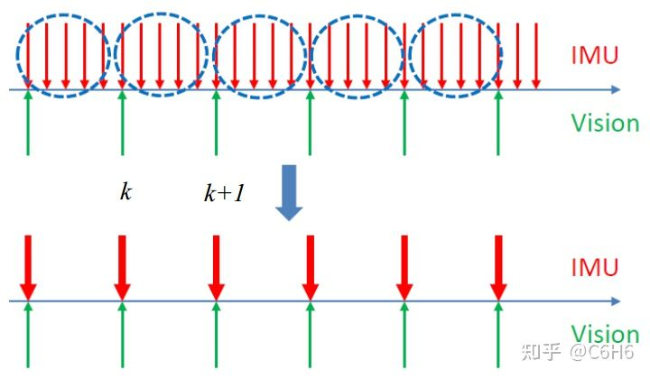VINS_Mono将高频IMU信息处理为与视觉同频的预积分信息 |
| :----------------------------------------------------------: |

## 2 预积分的数学模型

VINS-Mono采用了因子图的方式表示状态估计问题。在因子图模型中，系统状态以节点的形式进行表示，观测量以因子形式表示，而观测量与因子之间存在的关系则通过彼此连接的约束边表示。

| 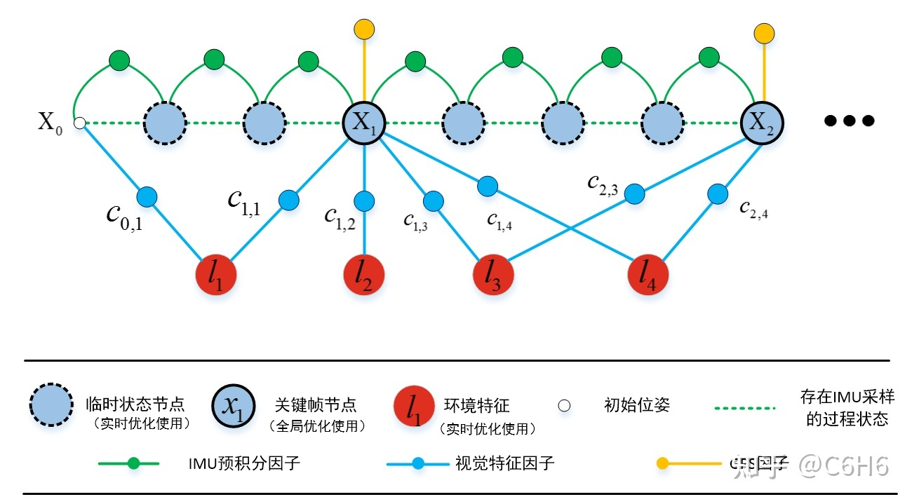VINS_Mono状态优化算法因子图模型 |
| :-------------------------------------------------: |

本文将因子图建模的三要素——节点、因子、约束边作为内容要点，按照先后顺序对IMU预积分相关的系统状态（节点）、观测（因子）、预积分与系统状态的约束关系（约束边）进行介绍，并针对每部分难点展开说明。

| 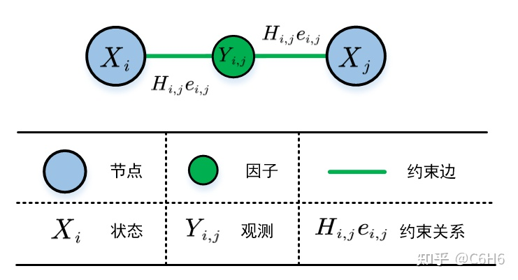预积分因子模型涉及的要素 |
| :------------------------------------------: |

内容组织如下所示：

| 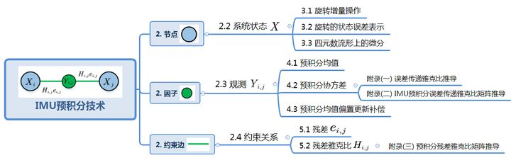内容组织思维导图 |
| :----------------------------------: |

### 2.1 符号与名称定义

为了易于理解及避免混淆，本文对预积分数学模型中出现的一些符号标识和名称进行了重新定义，具体说明如下：

沿用VINS_Mono论文的表示方式, 将初始状态时间序号记为 $\mathrm{i}$, 将末状态时间记为  $\mathrm{j}$, 在时间 $\mathrm{i \thicksim j}$ 之间可获得一系列IMU测量数据, 并设定IMU采样时间间隔保持一致, 间隔为 $\Delta t$, 即相邻时间下标标号差异造成的时间差存在关系 $t_{i+1}-t_{i}=\Delta t$ 。

与论文不一致的地方是, 规定字母右下区域为时间标记区域, 例如 $X_{i}$ 表示时间标记为 $i$ 的系 统状态, $t_{i, j}$ 表示由 时刻到时刻的时间差 $(j>i)$ ; 字母右上区域表示参考坐标系、变换关系或性质, 例如 $P_{j}^{w}$ 表示 $j$ 时刻以全局坐标系 $w$ (world系) 为参考系的系统位置; $q_{j}^{w, b j}$ 表示j时刻局部坐标系 $b_{j}$ (body系) 相对于 $w$ 系的姿态四元数表示, 或是能将局部坐标系 $b_{j}$ 的坐标（向 量）转到 $w$ 系的旋转四元数。使用 $R\left\{q_{j}^{w, b j}\right\}$ 表示与该四元数等价的旋转矩阵。在一些不需要 坐标系转化的场合, 右上标则表示主符号的性质, 例如 $\eta^{a}$ 表示加速度的噪声, $J^{\alpha, B a}$ 表示预积分位置分量 $\alpha$ 对加速度偏置 $B_{a}$ 的偏导; 此外, 为了防止次数序号与时间序号表示产生混淆, 迭代算法迭代次数使用了括号标识, 例如 $X_{i}(m)$ 表示处于第 $m$ 次迭代计算过程中的 $X_{i}$ 的计算结 果。

以上表示方法仍存在局限性, 出于某些条件限制或遵从习惯, 文中有些变量的定义并不能严格 符合以上规则, 例如 $q_{t+1}^{w, b(t+1)}$ 中括号的使用, 主要考虑作为上标的 $b$ 使用 $b_{t+1}$ 表达时, 由于尺 寸过小不容易被识别, 但这种例外所占比例很小。

对容易混淆的概念进行重命名, 以便突出区别并进行明显区分:

观测获取模型, 一般场合下, 传感器原始测量值就是观测值, 滤波过程中直接使用观测值参与 滤波运算。但预积分观测是一种等效观测, 需要对原始测量值进行 “深加工”。本文将这种使用原始测量信息 “深加工” 获取等效观测的数学表示方法称为等效观测获取模型。下文中等效观测获取方程使用 $f(\cdot)$ 表示。推导观测获取模型主要是为了得到等效观测均值与观测方差。在等效观测状态扩展的情况下, 还参与残差雅克比的计算。

观测反推模型, 该名称与一般滤波方法中的观测模型概念较为接近, 不同点在于传统方法将状 态代入观测模型后可反推得到处于该状态时应获得的原始测量值, 这里则是使用系统状态和等效观测反推模型来求解在此状态下应获得的等效观测。下文中等效观测状态方程使用 $h(\cdot)$ 表示。观测反推模型是为了得到观测与系统状态之间的关系, 这个关系包括残差、残差雅克比。

### 2.2 系统状态

一条IMU预积分信息会涉及两个相关的系统状态：积分起始状态 $X_{i}$ 和结束状态 $X_{j}$。

根据原文定义 $X_{i}=\left[\begin{array}{lllll}P_{i}^{w} & V_{i}^{w} & q_{i}^{w, b i} & B_{i}^{a} & B_{i}^{g}\end{array}\right]^{T}$ ， 前三项表示IMU位姿相关的状态：位 置、速度、姿态; 后两项代表IMU传感器的工作状态：加速度偏置和角速度偏置。一般认为这两项 偏置与IMU的姿态无关，因此两项偏置 $B_{i}^{a} 、 B_{i}^{g}$ 右上标不使用坐标系标记，而换作数据类型标 记，右下标则继续沿用时间表示标记。

在优化问题中系统状态通常称为节点, 并建模为高斯分布, $X \sim N\left(\hat{X}, \Sigma_{X}\right)$, 其中 $\hat{X}$ 是均值, $\Sigma_{X}$ 是方差, 表示状态的不确定程度。除此以外, 还可以从噪声的角度对状 态进行建模, 称为状态误差 (Error State)。即将系统状态理解为状态均值 $\hat{X}$ 和一个误差的结 合： $X \stackrel{\Delta}{=} \hat{X}+\delta X ， \delta X$ 也可以作为系统状态, 是一个小量, 并且符合高斯分布, 即 $\delta X \sim N\left(\delta \hat{X}, \Sigma_{\delta X}\right)$ 。状态误差与传统的状态表示法虽然表示方式有所不同, 但实际具有相同 的不确定性属性, 因此 $\Sigma_{\delta X}=\Sigma_{X}$ 。这两种表示方法在表示线性空间状态时完全等价, 也同样 遵循传统状态滤波的方法和步骤一一均值计算、方差计算、均值补偿, 但在分析旋转等非线性空间 状态时, 传统方法就遇到了挑战。而状态误差由于关注重点为状态误差, 误差通常满足小量的特 点, 在经过空间变换后能在局部范围内保持线性空间特性（相关概念后续介绍）, 为适配经典的状态滤波数学模型提供便利手段。

### 2.3 观测

将始末状态 (两个节点) 间的IMU预积分观测记为 $Y_{i, j}$ (使用 $Y$ 表示是方便与系统状态 $X$ 进行区分)。 $Y_{i, j}$ 所表示的观测并不是IMU原始测量值, 而是对原始测量值进行积分操作的数据。该操作过程涉及到对观测的多次变换, 为了避免混淆, 对不同阶段的观测进行定义和说明:

#### 2.3.1 IMU原始观测

IMU获得的原始测量类型主要是加速度和角速度。考虑到噪声的因素, 我们将IMU理想测量值 记为加速度 $a_{t}^{b t}$ 和角速度 $\omega_{t}^{b t}$, 对应的实际测量值记为 $\hat{a}_{t}^{b t}, \hat{\omega}_{t}^{b t}$ 。它们存在如下关系：
$$
\begin{array}{r}
a_{t}^{b t}=\hat{a}_{t}^{b t}-\eta_{t}^{a}-B_{t}^{a} \\
\omega_{t}^{b t}=\hat{\omega}_{t}^{b t}-\eta_{t}^{g}-B_{t}^{g}
\end{array}
$$
其中 $\eta_{t}^{a} 、 \eta_{t}^{g}$ 分别为迭加于实际测量值的加速度和角速度随机噪声。可简单认为该噪声为高 斯白噪声, 与时间无关可省去时间下标, 记为: $\eta^{a} 、 \eta^{g}$,
$$
\eta^{a} \sim N\left(0, \Sigma^{a}\right), \quad \eta^{g} \sim N\left(0, \Sigma^{g}\right)
$$
$B_{t}^{a} 、 B_{t}^{g}$ 分别是加速度和角速度测量信息中存在的偏置（也称为零偏或零漂）, 建模为:
$$
\left\{\begin{array}{l}
B_{t}^{a}=\hat{B}_{t}^{a}-n_{t}^{B a} \\
B_{t}^{g}=\hat{B}_{t}^{g}-n_{t}^{B g}
\end{array}\right.
$$
其中 $\hat{B}_{t}^{a} 、 \hat{B}_{t}^{g}$ 是名义 (Nominal) 偏置, $n_{t}^{B a} 、 n_{t}^{B g}$ 是噪声, 该噪声是一种随机游走噪 声, 一般认为偏置变化速度符合高斯分布：
$$
\left\{\begin{array}{l}
\dot{n}_{t}^{B a}=\eta^{B a} \\
\dot{n}_{t}^{B g}=\eta^{B g}
\end{array}\right.
$$
其中 $\eta^{B a} 、 \eta^{B g}$ 是高斯白噪声, 可表示为 $\eta^{B a} \sim N\left(0, \Sigma^{B a}\right), \eta^{B g} \sim N\left(0, \Sigma^{B g}\right)$。 IMU 偏 置也可建模为离散模型:
$$
\left\{\begin{array}{l}
B_{t+\Delta t}^{a}=B_{t}^{a}-\eta^{B a} \cdot \Delta t \\
B_{t+\Delta t}^{g}=B_{t}^{g}-\eta^{B g} \cdot \Delta t
\end{array}\right.
$$
值得注意的是, 由于加速度和角速度噪声 $\eta^{a} 、 \eta^{g}$ 是随机噪声, 迭加于实际测量值时本身没有绝对正负符号之分, 因此很多场合 [9]使用如下表达形式也是合理的:
$$
\begin{array}{l}
a_{t}^{b t}=\hat{a}_{t}^{b t}+\eta^{a}-B_{t}^{a} \\
\omega_{t}^{b t}=\hat{\omega}_{t}^{b t}+\eta^{g}-B_{t}^{g}
\end{array}
$$
按照习惯, 可使用一个符号表示 IMU 的原始测量, 记为 $U_{t}$,    $U_{t}=\left[\begin{array}{ll}a_{t}^{b t} & \omega_{t}^{b t}\end{array}\right]^{T}$ , 满足分布 $U_{t} \sim N\left(u_{t}, \Sigma_{U t}\right)$, 其中 $u_{t}=\left[\begin{array}{c}\hat{a}_{t}^{b t} \\ \hat{\omega}_{t}^{b t}\end{array}\right], \quad \Sigma_{U t}=\left[\begin{array}{cc}\Sigma_{t}^{a} & 0 \\ 0 & \Sigma_{t}^{g}\end{array}\right]$ 。

#### 2.3.2 IMU中值观测

需要强调的是，IMU原始观测是离散信号，只反应了某一时间点的运动特性。为了能使观测数据能够尽可能反应真实世界的连续运动过程，VINS-Mono使用了中值积分法，即通过对两个相邻时间点的IMU测量值求平均来等效这一时间段的运动特性。这里将该值称为中值观测。

IMU加速度中值观测记为 $\bar{a}_{t}^{b t}$, 角速度中值观测记为 $\bar{\omega}_{t}^{b t}$, 分别表示IMU在 $\mathrm{t} \sim \mathrm{t}+1$ 时段内的加速度和角速度近似值。其中
$$
\begin{array}{c}
\bar{a}_{t}^{b t} &= &\frac{1}{2}\left[\left(a_{t}^{b t}-B_{t}^{a}\right)+R\left\{q_{t+1}^{b t, b(t+1)}\right\} \cdot\left(a_{t+1}^{b(t+1)}-B_{t+1}^{a}\right)\right] \\
\bar{\omega}_{t}^{b t} &= &\frac{1}{2}\left[\left(\omega_{t}^{b t}-B_{t}^{g}\right)+\left(\omega_{t+1}^{b(t+1)}-B_{t+1}^{g}\right)\right]
\end{array}
$$
代入实际观测和观测误差, 可得:
$$
\begin{array}{c}
\bar{a}_{t}^{b t} &= &\frac{1}{2}\left[\left(\hat{a}_{t}^{b t}-\eta^{a}-\hat{B}_{t}^{a}+n_{t}^{B a}\right)+R\left\{q_{t+1}^{b t, b(t+1)}\right\} \cdot\left(a_{t+1}^{b(t+1)}-\eta^{a}-\hat{B}_{t+1}^{a}+n_{t+1}^{B a}\right)\right] \\
\bar{\omega}_{t}^{b t} &= &\frac{1}{2}\left[\left(\hat{\omega}_{t}^{b t}-\eta^{g}-\hat{B}_{t}^{g}+n_{t}^{B g}\right)+\left(\hat{\omega}_{t+1}^{b(t+1)}-\eta^{g}-\hat{B}_{t+1}^{g}+n_{t+1}^{B g}\right)\right]
\end{array}
$$
当参考系为全局坐标时, 加速度中值观测可表示为:
$$
\bar{a}_{t}^{w}=\frac{1}{2}\left[R\left\{q_{t+1}^{w, b t}\right\} \cdot\left(a_{t}^{b t}-B_{t}^{a}\right)+R\left\{q_{t+1}^{w, b(t+1)}\right\} \cdot\left(a_{t+1}^{b(t+1)}-B_{t+1}^{a}\right)\right]
$$
从YINS-Mono代码推测, 可能因为IMU的采样频率较高, 相邻时间点的偏置差异很小, 可认为 近似相等, 即 $\hat{B}_{t}^{g}=\hat{B}_{t+1}^{g}, n_{t}^{B g}=n_{t+1}^{B g}$, 所以中值观测可简化为:
$$
\begin{array}{c}
\bar{a}_{t}^{b t} &= &\frac{1}{2}\left[\left(\hat{a}_{t}^{b t}-\eta^{a}-\hat{B}_{t}^{a}+n_{t}^{B a}\right)+R\left\{q_{t+1}^{b t, b(t+1)}\right\} \cdot\left(a_{t+1}^{b(t+1)}-\eta^{a}-\hat{B}_{t}^{a}+n_{t}^{B a}\right)\right] \\
\bar{\omega}_{t}^{b t} &= &\frac{1}{2}\left(\hat{\omega}_{t}^{b t}+\hat{\omega}_{t+1}^{b(t+1)}\right)-\eta^{g}-\hat{B}_{t}^{g}+n_{t}^{B g}=\frac{1}{2} \hat{\bar{\omega}}_{t}^{b t}-\eta^{g}+n_{t}^{B g}
\end{array}
$$
其中 $\hat{\bar{\omega}}_{t}^{b t}$ 是去掉偏置后的角速度实际测量中值:
$$
\hat{\bar{\omega}}_{t}^{b t}=\frac{1}{2}\left(\hat{\omega}_{t}^{b t}+\hat{\omega}_{t+1}^{b(t+1)}\right)-\hat{B}_{t}^{g}
$$

#### 2.3.3预积分等效观测

从某种意义上来说, 可以将IMU数据预积分模块认为是一种新的传感器, 而数据 $Y_{i, j}$ 就是这 个新传感器提供的观测（称为等效的观测）。 $Y_{i, j}=\left[\begin{array}{lll}\alpha_{i, j} & \beta_{i, j} & \gamma_{i, j}\end{array}\right]^{T}$, 一般建模为高斯模型, 使用 $\hat{\alpha}_{i, j} \quad \hat{\beta}_{i, j} \quad \hat{\gamma}_{i, j}$ 分别表示位置、速度和角度相关预积分的均值, 噪声的协方差是 $\Sigma_{\alpha \beta \gamma}$, 可记为:
$$
Y_{i, j} \sim N\left(\left[\begin{array}{lll}
\hat{\alpha}_{i, j} & \hat{\beta}_{i, j} & \hat{\gamma}_{i, j}
\end{array}\right]^{T}, \Sigma_{\alpha \beta \gamma}\right)
$$
IMU预积分观测值的获取也就是对以上高斯模型参数的求取。为了与一般的观测模型有所区分, 这里将使用IMU原始测量的观测模型称为原始观测模型, 将IMU原始测量值进行预积分作为等效观测的数学模型称为等效观测获取模型, 获得的等效观测可表示如下:
$$
Y_{i, j}=f_{i, j}\left(\left.a_{t}^{b t}\right|_{t=i: j},\left.\omega_{t}^{b t}\right|_{t=i: j},\left.B_{t}^{a}\right|_{t=i: j},\left.B_{t}^{g}\right|_{t=i: j}\right)
$$
式中 $\left.a_{t}^{b t}\right|_{t=i: j},\left.\omega_{t}^{b t}\right|_{t=i: j}$ 表示在 $i j$ 时段由IMU得到的系列原始观测。 $\left.B_{t}^{a}\right|_{t=i: j}$ 、 $\left.B_{t}^{g}\right|_{t=i: j}$ 是对应IMU原始测量值的偏置。偏置通常不能由IMU自身获得, 是由外部环境提供的校准量。

需要说明的是, 在求解优化问题过程中, 考虑到偏置作为系统状态分量能够在每次迭代计算中被修正, 预积分值也需要随之进行更新, VINS-Mono对预积分的等效观测概念进行了扩展, 将偏置也作为原始观测量的一部分, 即:
$$
\begin{array}{c}
U_{t}=\left[\begin{array}{llll}
a_{t}^{b t} & \omega_{t}^{b t} & B_{t}^{a} & B_{t}^{g}
\end{array}\right]^{T} \\
Y_{i, j} \sim N\left(\left[\begin{array}{lllll}
 \hat{\alpha}_{i, j} & \hat{\beta}_{i, j} & \hat{\gamma}_{i, j} & \hat{B}_{j}^{a} & \hat{B}_{j}^{g}
\end{array}\right]^{T}, \Sigma_{\alpha \beta \gamma B}\right)
\end{array}
$$
下文中将等效观测简记为 $f_{i, j}$
$$
f_{i, j} \triangleq Y_{i, j}
$$
等效观测获取模型推导需要借助 IMU 的运动学方程, 参考原文 IMU 运动学模型如下所示:

q(t)求导参考上面四元数的导数
$$
X_{j} &= &\left[\begin{array}{c}
P_{j}^{w} \\
V_{j}^{w} \\
q_{j}^{w, b j} \\
B_{j}^{a} \\
B_{j}^{g}
\end{array}\right] \\
&\Longrightarrow  &\left\{\begin{array}{l}
P_{j}^{w}=P_{i}^{w}+V_{i}^{w} \cdot t_{i, j}-1 / 2 \cdot g^{w} \cdot t_{i, j}^{2}+R\left\{q_{i}^{w, b i}\right\} \cdot \iint_{t \epsilon[i, j]} R\left\{q_{t}^{b i, b t}\right\} \cdot a_{t}^{b t} \cdot d t^{2} \\
V_{j}^{w}=V_{w, i}-g^{w} \cdot t_{i, j}+R\left\{q_{i}^{w, b i}\right\} \cdot \int_{t \epsilon[i, j]} R\left\{q_{t}^{b i, b t}\right\} \cdot a_{t}^{b t} \cdot d t \\
q_{j}^{w, b j}=q_{i}^{w, b i} \otimes \int_{t \epsilon[i, j]} \dot{q}_{t}^{b i, b t} \cdot d t=q_{i}^{w, b i} \otimes \int_{t \in[i, j]} q_{t}^{b i, b t} \otimes\left[\begin{array}{c}
0 \\
1 / 2 \cdot \omega_{t}^{b b}
\end{array}\right] \cdot d t \\
B_{j}^{a}=B_{i}^{a}+\eta^{B a} \cdot t_{i, j} \\
B_{j}^{g}=B_{i}^{g}+\eta^{B g} \cdot t_{i, j}
\end{array}\right.
$$
在运动学模型上提取与预积分相关的项目可取得等效观测获取模型。具体方法将在后文介绍。

### 2.4 预积分约束关系建立和处理

度量传感器信息的不确定性对系统状态的影响是状态估计优化算法的基础，而分析系统状态与传感器观测模型，获取两者之间的关系是取得度量方法的重要途径。由模型推导出来的关系通常包含以下两个部分内容：观测值与观测估计值的残差、残差与系统状态的雅克比。

基于状态优化的SLAM利用观测残差、雅克比矩阵和观测协方差等元素将SLAM问题表达为因子图模型，并使用非线性优化方法进行求解。以因子图的一元约束（Unary Edge约束只与一个状态节点有关，如GPS观测约束或先验约束）为例，其关系建立和处理过程如下：

假设系统状态表示为 $X_{i}$, 观测获取 $f_{i}$ 符合高斯分布 $f_{i} N\left(\hat{f}_{i}, \Sigma_{f i}\right)$, 观测反推为 $h_{i}\left(X_{i}\right)$, 则残差可以表示为:
$$
e_{i} \stackrel{\Delta}{=} h_{i}\left(X_{i}\right)-f_{i}
$$
状态估计问题就可以转化为非线性最小二乘模型：
$$
X_{i}^{*}=\underset{X i}{\arg \min } \sum_{i}\left\|e_{i}\right\|_{\Sigma f i}^{2}=\underset{X i}{\arg \min } \sum_{i}\left\|h_{i}\left(X_{i}\right)-f_{i}\right\|_{\Sigma_{f i}}^{2}
$$
式中 $\Sigma_{f i}$ 为观测 $f_{i}$ 的协方差, $\sum_{i}(\cdot)$ 表示对与状态 $X_{i}$ 有关的残差项进行求和运算, $\|\cdot\|_{\Sigma}^{2}$ 为马氏范数, $\|e\|_{\Sigma}^{2} \stackrel{\Delta}{=} e^{T} \Sigma^{-1} e 。$

如果采用迭代优化方法, 将第 $\mathrm{m}+1$ 次的状态更新表示为 $\Delta X_{i}^{*}(m+1)$, 简记为 $\Delta_{i}^{*}(m+1)$, 并在 $X_{i}(m)$ 处对观测反推值进行一阶泰勒展开, 设雅克比矩阵为 $H_{i} \triangleq \frac{\Delta e_{i}}{\partial X_{i}}$, 第m次迭代雅克比矩阵记为 $\left.H_{i}(m) \triangleq \frac{\Delta e_{i}}{\partial X_{i}}\right|_{X i=\hat{X} i(m)}$ 。则给定状态初值情况 下状态局部更新值的求解, 可表示为:
$$
\left\{\begin{array}{l}
\Delta_{i}^{*}(m+1)=\underset{\Delta i}{\arg \min } \sum_{i}\left\|h_{i}\left(\hat{X}_{i}(m)\right)+H_{i}(m) \Delta_{i}-\hat{f}_{i}\right\|_{\Sigma_{f i}}^{2} \\
X_{i}(m+1)=X_{i}(m)+\Delta_{i}^{*}(m+1)
\end{array}\right.
$$
在算法后续操作中, 会对马氏范数重写为 2 范数, 以便消除雅克比和残差的量纲, 即:
$$
\|e\|_{\Sigma}^{2}=\left(\Sigma^{-\frac{1}{2}} e\right)^{T} \cdot\left(\Sigma^{-\frac{1}{2}} e\right)=\left\|\Sigma^{-\frac{1}{2}} e\right\|_{2}^{2}
$$
省略迭代次数表示, 迭代优化可以得到标准最小二乘建模形式:
$$
\Delta^{*}=\underset{\Delta i}{\arg \min } \sum_{i}\left\|A_{i} \Delta_{i}-b_{i}\right\|_{2}^{2}
$$
其中 $A_{i}=\Sigma_{f i}^{-1 / 2} \cdot H_{i}, \quad b_{i}=\Sigma_{f i}^{-1 / 2} \cdot\left(\hat{f}_{i}-h_{i}\left(\hat{X}_{i}\right)\right)$ ，以上过程称为白化[4] (whitening) 。

至此优化求解状态问题中需要关注的内容就集中到两个部分, 残差 $b_{i}$和雅克比 $A_{i}$ 。这两个部分包含着观测与系统状态的不确定性关系, 是优化算法构建的重要部分。

## 3 系统状态

VINS-Mono数学建模复杂，很大程度上是因为系统状态包含旋转分量，而且使用四个参数的四元数表示旋转。从构成形式来看，四元数存在4个自由度，但实际上旋转只具有3个自由度，即四元数参数并不相互独立，参数之间还存在着相互约束，这类表示方法称为过参数化表示（over-parameterized）。过参数化表示所在的空间是一种非线性流形（manifold），由于空间内存在额外的约束，一般线性空间中向量相加的性质在流形中并不适用，也无法进行传统意义上的微分、积分操作。这种情况下，如果优化算法仍按照非线性优化算法规则对参数直接进行线性操作，新参数可能会移动到流形之外，不再符合流形的定义。

　　鉴于旋转的特殊性，与其他系统分量相比，系统的旋转分类使用四元数表示后需要更加复杂的机制来应对非线性流形的特殊性质，以使其与优化算法适配。

### 3.1 旋转的增量操作

为了能够保证获得的最终姿态结果仍然在四元数流形内，对四元数表示的姿态进行增量等线性操作时需要首先获得该四元数表示姿态的切空间（3维），该切空间与李代数相关，在局部范围（小量）内满足线性空间的性质，并且表示具有唯一性，增量操作（增加  $\theta$ ）先在该切空间内完成，然后再将结果映射回原来的流形。以上操作的过程如下图所示。

| 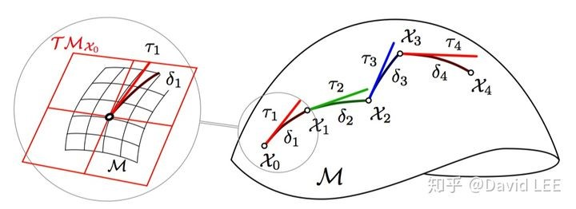优化过程中姿态变量的增量操作。上图表示了4次增量操作，将姿态由X0转换到X4（图示仅供参考，符号意义与本文并不统一，考虑其出色的说明能力，直接引用原图） |
| :----------------------------------------------------------: |

VINS-Mono采用上述方式来处理迭代更新系统状态，规则为： 
$$
X_{i_{-} n e w} \stackrel{\Delta}{=} X_{i_{-} o l d} \oplus \Delta X_{i}
$$
其中 “ $\oplus$ ” 是状态 $X_{i}$ 的广义加 `[2][10]`操作。操作符号两边的左右元素属于不同的空间, 进 行操作后得到的结果与左元素类型相同。

例如式中状态 $X_{i_{-} o l d}$ 中表示姿态的分量 $q_{i}^{w, b i}$ 属于4维空间, 而状态增量 $\Delta X_{i}$ 是一个李代数, $\Delta X_{i}$ 对应的旋转矢量为 $\theta$ (3维)。如果 $\theta$ 是一个小量, 则在局部范围内具备 3 维线性空间性质, 经过操作后的 $X_{i_{n} n e w}$ 则与 $X_{i_{-} o l d}$ 属性相同。右元素 $\theta$ 也称为局部参数 (local parameter) , 具体形式为: $\theta=\left[\begin{array}{lll}\theta_{x} & \theta_{y} & \theta_{z}\end{array}\right]^{T}$
使用广义加处理姿态增量最终表现在四元数形式上满足如下关系:
$$
q_{i_{-} \text {new }}^{w, b i}=q_{i_{-} o l d}^{w, b i} \oplus \theta \approx q_{i_{-} o l d}^{w, b i} \otimes\left[\begin{array}{c}
1 \\
\theta / 2
\end{array}\right]
$$
综上所述, 状态更新可表示为:
$$
X_{i\_ n e w} = \begin{bmatrix}
P_{i\_ n e w}^{w} \\
V_{i\_ n e w}^{w} \\
q_{i\_ n e w}^{w, b i} \\
B_{i\_ n e w}^{a} \\
B_{i\_ n e w}^{g}
\end{bmatrix} = X_{i_{-} o l d} \oplus \Delta X_{i}  
= \begin{bmatrix}
P_{i\_ o l d}^{w} \\
V_{i\_ o l d}^{w} \\
q_{i\_ o l d} \\
B_{i\_ o l d}^{a} \\
B_{i\_ o l d}^{g}
\end{bmatrix} \oplus \begin{bmatrix}
\Delta P_{i}^{w} \\
\Delta V_{i}^{w} \\
\theta \\
\Delta B_{i}^{a} \\
\Delta B_{i}^{g}
\end{bmatrix} 
\approx \begin{bmatrix}
P_{i\_ o l d}^{w} + \Delta P_{i}^{w}  \\
V_{i\_ o l d}^{w} + \Delta V_{i}^{w} \\
q_{i\_ o l d}^{w, b i} \otimes  
	\begin{bmatrix}
		1 \\
		\theta / 2
	\end{bmatrix}  \\
B_{i\_ o l d}^{a}+\Delta B_{i}^{a} \\
B_{i\_ o l d}^{g}+\Delta B_{i}^{g}
\end{bmatrix}
$$

### 3.2 旋转的误差表示

状态误差建模为状态中旋转分量的表示提供了一种有效方法。

按照四元数的定义，任意旋转可表示为四元数：
$$
q \stackrel{\Delta}{=}\left[\begin{array}{c}
\cos \frac{\phi}{2} \\
\boldsymbol{n} \sin \frac{\phi}{2}
\end{array}\right]=\left[\begin{array}{c}
\cos \phi / 2 \\
n_{x} \sin \phi / 2 \\
n_{y} \sin \phi / 2 \\
n_{z} \sin \phi / 2
\end{array}\right]
$$
其中 $\boldsymbol{n}$ 为单位旋转轴, $\phi$ 为绕轴旋转角度大小。
将旋转使用等价的李代数表示, 可记为:
$$
\Phi \stackrel{\Delta}{=} \log q=[\boldsymbol{n} \phi]=\left[\begin{array}{c}
n_{x} \phi \\
n_{x} \phi \\
n_{x} \phi
\end{array}\right]=\left[\begin{array}{c}
\Phi_{x} \\
\Phi_{y} \\
\Phi_{z}
\end{array}\right]
$$
在旋转角度 $\phi$ 为小量时,
$$
q \approx\left[\begin{array}{c}
1 \\
\boldsymbol{n} \phi / 2
\end{array}\right]=\left[\begin{array}{c}
1 \\
\Phi_{x} / 2 \\
\Phi_{y} / 2 \\
\Phi_{z} / 2
\end{array}\right]
$$
可以看到四元数的虚部分量与李代数近似相等。即
$$
2\lfloor q\rfloor_{x y z} \approx \Phi
$$
其中 $2\lfloor\cdot\rfloor_{x y z}$ 是提取四元数虚部分量, 将其转化为等价李代数（旋转向量）的数学操作。
VINS_Mono使用局部小量参数 $\delta \theta$ 作为系统旋转分量的状态误差, $\delta \theta \in \mathbb{R}^{3}$, $\delta \theta \sim N\left(\delta \hat{\theta}, \Sigma_{\delta \theta}\right)$ 。相应得, 系统状态的状态误差建模表示为:
$$
\delta X=\left[\begin{array}{lllll}
l \delta P & \delta V & \delta \theta & \delta B^{a} & \delta B^{g}
\end{array}\right]^{T}
$$
系统更新使用广义加概念表示可将旋转分量建模为:
$$
q \stackrel{\Delta}{=} \hat{q} \oplus \delta \theta
$$
为了避免歧义及与后续内容统一, 后文将使用 $\delta \theta$ 表示旋转状态的局部参数, 不再使用 $\theta$, 防止不经意间出现的混淆—误认为 $\theta$ 为 $q$ 的等价李代数形式, 而其实 $\theta$ 是 $q$ 切空间上的小量 这一事实。

### 3.3 四元数流形上的微分

状态中有四元数流形分量存在时, 状态有关微分的定义也要使用局部参数 $\delta \theta$ 的表示形式。例 如在VINS-Mono中以四元数 $X$ 为变量的函数 $f(X)$ 的微分可作如下定义:
(1) 当 $f(X)$ 不属于流形时
$$
\frac{\partial f(X)}{\partial \delta \theta} \stackrel{\Delta}{=} \lim _{\delta \theta \rightarrow 0} \frac{f(X \oplus \delta \theta)-f(X)}{\delta \theta}=\lim _{\delta \theta \rightarrow 0} \frac{f\left(X \otimes\left[\begin{array}{c}
1 \\
\delta \theta
\end{array}\right]\right)-f(X)}{\delta \theta}
$$
(2) 当 $f(X)$ 也为四元数时
$$
\frac{\partial f(X)}{\partial \delta \theta} \triangleq \lim _{\delta \theta \rightarrow 0} \frac{2\left\lfloor f(X \oplus \delta \theta) \otimes f^{-1}(X)\right\rfloor_{x y z}}{\delta \theta}
$$
上述微分定义方法也称为 “扰动” 求导法, 是求旋转相关导数的一种常用技巧。扰动求导法还 有其他一些形式, 将在附录（三）中进行介绍。

## 4 预积分观测

在优化问题中, 观测值一般直接由传感器的原始观测取得, 与系统状态无关。但 IMU 预积分的数值不能直接获得, 需要对原始观测值进行积分, 虽然等效观测是相对位姿, 但因为积分过程涉及到中间状态, 等效观测值需要利用 IMU 运动学模型推导得出。
根据 IMU 运动学模型的定义, 可以获得始末状态与 IMU 测量所构成的表示形式如式(2.21) 所示。为了便于说明, 先省去偏置部分, 并给公式相关部分加上色彩一  $\textcolor{blue}{\mathrm{i}}$ 时刻状态使用蓝色表示, $\textcolor{green}{\mathrm{j}}$ 时刻状态使用绿色表示, 系统参数使用黑色表示, 预积分使用红色表示, 整理公式如 下所示:
$$
\begin{cases}
\textcolor{green}{P_{j}^{w}} &= &\textcolor{blue}{P_{i}^{w}+V_{i}^{w}} \cdot t_{i, j}-1 / 2 \cdot g^{w} \cdot t_{i, j}^{2}+ \textcolor{blue}{R \{q_{i}^{w, b i} \}} \cdot \textcolor{red}{\underbrace{\iint_{t \in [i, j]} R \{q_{t}^{b i, b t} \} \cdot a_{t}^{b t} \cdot d t^{2}}_{\alpha_{i, j}}} 
\\
\textcolor{green}{V_{j}^{w}} &= &\textcolor{blue}{V_{w, i}}-g^{w} \cdot t_{i, j}+\textcolor{blue}{R \{q_{i}^{w, b i} \}} \cdot \textcolor{red}{\underbrace{\int_{t \in [i, j]} R \{q_{t}^{b i, b t} \} \cdot a_{t}^{b t} \cdot d t}_{\beta_{i, j}}} 
\\
\textcolor{green}{q_{j}^{w, b j}} &= &\textcolor{blue}{q_{i}^{w, b i}} \otimes \textcolor{red}{\underbrace{q_{i, j}^{b i, b j}}_{\gamma_{i j}}} 
= \textcolor{blue}{q_{i}^{w, b i}} \otimes \textcolor{red}{\underbrace{\int_{t \in [i, j]} q_{t}^{b i, b t} \otimes 
	\begin{bmatrix}
		0 \\
		1 / 2 \cdot \omega_{t}^{b t}
	\end{bmatrix}
\cdot d t}_{\gamma_{i j}}} 
\end{cases}
$$
我们感兴趣的预积分观测的表达式如红色部分所示, 红色部分的组成元系只与 $\mathrm{i} \sim \mathrm{j}$ 时段的 IMU 测量值有关, 与初始时刻状态 $X_{i}$ (蓝色) 及历史状态都没有关系, 体现出该量的观测属性, 以及最重要的 “相对性”。末状态 $X_{j}$ 是在初始状态 $X_{i}$ 的基础上 “迭加” 预积分获得。

值得注意的是, 除姿态状态分量外, 其他类型状态分量与初始状态的 “迭加” 还需要与本分量类型不同分量的参与。例如不能理解为初状态位置分量加预积分位置分量可得到末状态位置分量, 而应看到末状态位置分量是由初状态的位置、速度、姿态分量, 以及固定参数（重力、时间）加上预积分位置分量共同作用计算形成的。例如简单认为 $X_{j}^{\alpha}=X_{i}^{\alpha}+Y_{i, j}^{\alpha}$ 是错误的。

等效观测模型为:
$$
Y_{i, j}=\textcolor{red}{f_{i, j}}=\left[\begin{array}{c}
\textcolor{red}{\alpha_{i, j}} \\
\textcolor{red}{\beta_{i, j}} \\
\textcolor{red}{\gamma_{i, j}}
\end{array}\right]=\left[\begin{array}{c}
\textcolor{red}{\iint_{t \in[i, j]} R\left\{q_{t}^{b i, b t}\right\} \cdot a_{t}^{b t} \cdot d t^{2}} \\
\textcolor{red}{\int_{t \in[i, j]} R\left\{q_{t}^{b i, b t}\right\} \cdot a_{t}^{b t} \cdot d t} \\
\textcolor{red}{\int_{t \in[i, j]} q_{t}^{b i, b t} \otimes\left[\begin{array}{c}
0 \\
1 / 2 \cdot \omega_{t}^{b t}
\end{array}\right] \cdot d t}
\end{array}\right]
$$
将 IMU 偏置增加到预积分的等效观测中, 预积分的等效观测模型增广为:
$$
Y_{i, j}=\textcolor{red}{f_{i, j}}=\left[\begin{array}{l}
\textcolor{red}{\alpha_{i, j}} \\
\textcolor{red}{\beta_{i, j}} \\
\textcolor{red}{\gamma_{i, j}} \\
B_{j}^{a} \\
B_{j}^{g}
\end{array}\right]=\left[\begin{array}{c}
\textcolor{red}{\iint_{t \in[i, j]} R\left\{q_{t}^{b i, b t}\right\} \cdot a_{t}^{b t} \cdot d t^{2}} \\
\textcolor{red}{\int_{t[[i, j]} R\left\{q_{t}^{b i, b t}\right\} \cdot a_{t}^{b t} \cdot d t} \\
\textcolor{red}{\int_{t \in[i, j]} q_{t}^{b i, b t} \otimes\left[\begin{array}{c}
0 \\
1 / 2 \cdot \omega_{t}^{b t}
\end{array}\right] \cdot d t} \\
B_{i}^{a}+\eta^{B a} \cdot t_{i, j} \\
B_{i}^{g}+\eta^{B g} \cdot t_{i, j}
\end{array}\right]
$$
需要注意的是, 在扩展模型中预积分偏置部分不再具有 “相对” 性, 而是表示偏置本身, 因此使用末时间下标表示。
预积分观测推导工作包含三方面的内容: 预积分均值 $\left[\begin{array}{lllll}\hat{\alpha}_{i, j} & \hat{\beta}_{i, j} & \hat{\gamma}_{i, j} & \hat{B}_{j}^{a} & \hat{B}_{j}^{a}\end{array}\right]^{T}$, 预积分协方差 $\Sigma_{\alpha \beta \gamma B}$, 以及由偏置更新所需要进行的预积分均值偏置更新补偿。

其中预积分均值部分包含两项内容: 获取手段一一等效观测递推模型, 以及获取结果均值表达式; 预积分协方差部分包含两项内容: 获取手段一一观测误差传递雅克比矩阵, 以及结果一一协方差表达式; 偏置更新部分则包含获取手段一一均值/偏置雅克比矩阵, 以及结果 一均值迭代更新表达式两项内容。

### 4.1 预积分均值

等效观测模型中时间以连续形式表示, 但工程实践中获得的 IMU 观测是离散的, 因此需要对等效观测模型进行离散化, 并推导出递推表达式或离散展开表达式, 才能以累积形式进行离散积分, 进而取得预积分。以下将按照难易程度, 对各部分进行推导。

#### 4.1.1 偏置部分 $\widehat{B}_{j}^{a} 、 \widehat{B}_{j}^{g}$

对于存在于时间段 $\mathrm{i} \sim \mathrm{j}$ 内的时间 $\mathrm{k}$, 其对应的偏置记为 $B_{k}^{a} 、 B_{k}^{q}$, 有以下递推关系:
$$
\left\{\begin{array}{l}
B_{k+1}^{a}=B_{k}^{a}+\eta^{B a} \cdot \Delta t \\
B_{k+1}^{g}=B_{k}^{g}+\eta^{B g} \cdot \Delta t
\end{array}\right.
$$
由于 $\eta^{B a} 、 \eta^{B g}$ 为高斯白噪声, 偏置在预积分的均值保持不变
$$
\left\{\begin{array}{l}
\hat{B}_{j}^{a}=\hat{B}_{i}^{a} \\
\widehat{B}_{j}^{g}=\hat{B}_{i}^{g}
\end{array}\right.
$$
偏置与偏置均值的关系为:
$$
\left\{\begin{array}{l}
B_{k}^{a}=\hat{B}_{i}^{a}-\eta^{B a} \cdot t_{i, k} \\
B_{k}^{g}=\hat{B}_{i}^{g}-\eta^{B g} \cdot t_{i, k}
\end{array}\right.
$$
在 VINS-Mono 中, $\hat{B}_{i}^{a} 、 \hat{B}_{i}^{g}$ 从优化算法迭代过程计算得到的偏置状态估计获得。

#### 4.1.2 角度部分 $\hat{\gamma}_{i, j}$

根据角度分量的定义及四元数的性质, 对于存在于时间 $\mathrm{i} \sim \mathrm{j}$ 的时间点 $\mathrm{k}$, 与预计分旋转部分的值 $\gamma_{i, j}$ 存在如下关系:
$$
\begin{aligned}
\gamma_{i, j} &=q_{i, j}^{b i, b j}=q_{i, k}^{b i, b k} \otimes q_{k, k+1}^{b k, b(k+1)} \otimes q_{k+1, j}^{b(k+1), b j} \\
&=q_{i, k}^{b i, b k} \otimes\left(\int_{t[k, k+1]} q_{k}^{b k, b t} \otimes\left[\begin{array}{c}
0 \\
1 / 2 \cdot \omega_{t}^{b t}
\end{array}\right] \cdot d t\right) \otimes q_{k+1, j}^{b(k+1), b j}
\end{aligned}
$$
定义 $\gamma_{i, k} \triangleq q_{i, k}^{b i, b k}$, 则存在:
$$
\gamma_{i, k+1}=q_{i, k+1}^{b i, b(k+1)}=q_{i, k}^{b i, b k} \otimes q_{k, k+1}^{b k, b(k+1)}=\gamma_{i, k} \otimes \int_{t e[k, k+1]} q_{k}^{b k, b t} \otimes\left[\begin{array}{c}
0 \\
1 / 2 \cdot \omega_{t}^{b t}
\end{array}\right] \cdot d t
$$
对上式后半部分进行分析可得:
$$
\begin{aligned}
\int_{t \in[k, k+1]} q_{t}^{b k, b t} \otimes\left[\begin{array}{c}
0 \\
1 / 2 \cdot \omega_{t}^{b t}
\end{array}\right] \cdot d t & \approx\left[\begin{array}{c}
\cos \left(\bar{\omega}_{k}^{b k} \cdot \Delta t / 2\right) \\
1 / 2 \cdot \sin \left(\bar{\omega}_{k}^{b k} \cdot \Delta t / 2\right)
\end{array}\right] \\
& \approx\left[\begin{array}{c}
1 \\
1 / 2 \cdot \bar{\omega}_{k}^{b k} \cdot \Delta t
\end{array}\right]
\end{aligned}
$$
即可得到递推公式:
$$
\underbrace{\gamma_{i, k+1}}_{\textcolor{red}{i \sim k+1 \text{时刻}}} \approx \underbrace{\gamma_{i, k}}_{\textcolor{red}{i \sim k \text{时刻}}} 
\otimes \underbrace{\begin{bmatrix}
1 \\
1 / 2 \cdot \bar{w}_K^{bk} \cdot \Delta t
\end{bmatrix}}_{\textcolor{red}{k \sim k+1 \text{时刻增量}}}
$$

式中 $\bar{\omega}_{k}^{b k}$ 是 $\mathrm{IMU}$ 在 $\mathrm{k} \sim \mathrm{k}+1$ 时段内的角速度中值观测。中值观测与 IMU 实际测量真实值之 间存在如下关系:
$$
\bar{\omega}_{k}^{b k}=\frac{1}{2}\left(\hat{\omega}_{k}^{b k}+\hat{\omega}_{k+1}^{b(k+1)}\right)-\eta^{g}-\hat{B}_{k}^{g}+\eta^{B g}
$$
因为测量值的高斯白噪声均值为 0 , 所以等效测量值的均值 $\hat{\bar{\omega}}_{k+1}^{b k}$ :
$$
\hat{\bar{\omega}}_{k}^{b k}=\frac{1}{2}\left(\hat{\omega}_{k}^{b k}+\hat{\omega}_{k+1}^{b(k+1)}\right)-\hat{B}_{k}^{q}
$$
其中 $\hat{\omega}_{k}^{b k}, \hat{\omega}_{k+1}^{b(k+1)}$ 分别是 IMU 在 $\mathrm{k}$ 时刻和 $\mathrm{k}+1$ 时刻的角速度原始测量值, $\hat{B}_{k}^{g}$ 是对应时刻角速度测量值偏置。当然, 如果采用了简化积分模型, 也可以认为 $\hat{\bar{\omega}}_{k}^{b k}=\hat{\omega}_{k}^{b k}-\hat{B}_{k}^{g}$, 或者 $\hat{\bar{\omega}}_{k}^{b k}=\hat{\omega}_{k+1}^{b(k+1)}-\hat{B}_{k+1}^{q}$

综上所述, 可得有关均值的递推公式:
$$
\underbrace{\gamma_{i, k+1}}_{\textcolor{red}{i \sim k+1 \text{时刻}}} \approx \underbrace{\gamma_{i, k}}_{\textcolor{red}{i \sim k \text{时刻}}} 
\otimes \underbrace{\begin{bmatrix}
1 \\
1 / 2 \cdot \bar{w}_K^{bk} \cdot \Delta t
\end{bmatrix}}_{\textcolor{red}{k \sim k+1 \text{时刻增量}}}
$$
或者离散展开表达式
$$
\hat{\gamma}_{i, j} &\approx &\underbrace{\hat{\gamma}_{i, i}}_{\left[1 \space 0^{3}\right]^{T}} \otimes\left[\begin{array}{c}1 \\ 1 / 2 \cdot \hat{\bar{\omega}}_{i}^{b i} \cdot \Delta t\end{array}\right] \otimes \cdots \otimes\left[\begin{array}{c}1 \\ 1 / 2 \cdot \hat{\bar{\omega}}_{k}^{b k} \cdot \Delta t\end{array}\right] \otimes \cdots \otimes\left[\begin{array}{c}1 \\ 1 / 2 \cdot \hat{\bar{\omega}}_{j-1}^{b(j-1)} \cdot \Delta t\end{array}\right]
\\
&= & \underbrace{\begin{bmatrix}
1 \\
1 / 2 \cdot \bar{w}_K^{bk} \cdot \Delta t
\end{bmatrix}}_{\textcolor{red}{i \sim i+1 \text{时刻增量}}}
\otimes \cdots \otimes
\underbrace{\begin{bmatrix}
1 \\
1 / 2 \cdot \bar{w}_K^{bk} \cdot \Delta t
\end{bmatrix}}_{\textcolor{red}{k \sim k+1 \text{时刻增量}}} 
\otimes \cdots \otimes
\underbrace{\begin{bmatrix}
1 \\
1 / 2 \cdot \bar{w}_K^{bk} \cdot \Delta t
\end{bmatrix}}_{\textcolor{red}{j-1 \sim j \text{时刻增量}}} 
$$

#### 4.1.3 速度部分 $\hat{\beta}_{i, j}$
根据公式定义对于任意存在于时间 $\mathrm{i} \sim \mathrm{j}$ 的时间点 $\mathrm{k}$, 存在如下关系:
$$
\begin{aligned}
\beta_{i, j} &=\int_{t \in[i, j]} R\left\{q_{t}^{b i, b t}\right\} \cdot a_{t}^{b t} \cdot d t \\
&=\int_{t \in[i, k]} R\left\{q_{t}^{b i, b t}\right\} \cdot a_{t}^{b t} \cdot d t+\int_{t \in[k, j]} R\left\{q_{t}^{b i, b t}\right\} \cdot a_{t}^{b t} \cdot d t \\
&=\beta_{i, k}+\int_{t \in[k, j]} R\left\{q_{t}^{b i, b t}\right\} \cdot a_{t}^{b t} \cdot d t
\end{aligned}
$$
对上式后半部分进行分析可得:
$$
\begin{aligned}
\int_{t[k, j]} R\left\{q_{t}^{b i, b t}\right\} \cdot a_{t}^{b t} \cdot d t &=\int_{t \in[k, k+1]} R\left\{q_{t}^{b i, b t}\right\} \cdot a_{t}^{b t} \cdot d t+\int_{t \in[k+1, j]} R\left\{q_{t}^{b i, b t}\right\} \cdot a_{t}^{b t} \cdot d t \\
& \approx \bar{a}_{k}^{b i} \cdot \Delta t+\int_{t \in[k+1, j]} R\left\{q_{t}^{b i, b t}\right\} \cdot a_{t}^{b t} \cdot d t
\end{aligned}
$$
与 $\bar{\omega}_{k}^{b k}$ 类似, 式中 $\bar{a}_{k}^{b i}$ 是 IMU 在 $\mathrm{k} \sim \mathrm{k}+1$ 时段内的加速度中值观测, 但稍有不同的是 $\bar{a}_{k}^{b i}$ 以 $b_{i}$ 为参考系。加速度中值观测与 IMU 实际测量值之间存在如下关系:
$$
\bar{a}_{k}^{b i}=\frac{1}{2}\left[R\left\{q_{k}^{b i, b k}\right\} \cdot\left(a_{k}^{b k}-B_{k}^{a}\right)+R\left\{q_{k}^{b, b(k+1)}\right\} \cdot\left(a_{k+1}^{b(k+1)}-B_{k}^{a}\right)\right]
$$
其中 $a_{k}^{b k}, a_{k+1}^{b(k+1)}$ 分别是 IMU 在 $\mathrm{k}$ 时刻和 $\mathrm{k}+1$ 时刻的加速度测量值, $B_{k}^{a}$ 是对应时刻的加速度测量值偏置。同样在简化积分模型中, 也可以认为 $\bar{a}_{k}^{b i}=R\left\{q_{t}^{b i, b k}\right\} \cdot\left(a_{k}^{b k}-B_{k}^{a}\right)$, 或者 $\bar{a}_{k}^{b i}=R\left\{q_{t}^{b i, b(k+1)}\right\} \cdot\left(a_{k+1}^{b(k+1)}-B_{k+1}^{a}\right) 。$

综上所述, 可得递推公式:
$$
\underbrace{\beta_{i, k+1}}_{\textcolor{red}{i \sim k+1 \text {时刻}}} &= &\beta_{i, k} + \int_{t \in [k, k+1]} R\left\{q_{t}^{b i, b t}\right\} \cdot a_{t}^{b t} \cdot d t
\\
&\approx &\underbrace{\beta_{i, k}}_{\textcolor{red}{i \sim k \text {时刻}}} + \underbrace{\bar{a}_{k}^{b i} \cdot \Delta t}_{\textcolor{red}{k \sim k+1 \text {时刻}}}
$$

递推均值公式为:
$$
\underbrace{\hat{\beta}_{i, k+1}}_{\textcolor{red}{i \sim k+1 \text {时刻}}} &= &\hat{\beta}_{i, k} + \int_{t \in [k, k+1]} R\left\{q_{t}^{b i, b t}\right\} \cdot \hat{a}_{t}^{b t} \cdot d t
\\
&\approx &\underbrace{\hat{\beta}_{i, k}}_{\textcolor{red}{i \sim k \text {时刻}}} + \underbrace{\hat{\bar{a}}_{k}^{b i} \cdot \Delta t}_{\textcolor{red}{k \sim k+1 \text {时刻}}}
$$

式中：
$$
\hat{\bar{a}}_{k}^{b i}=\frac{1}{2}\left[R\left\{\hat{\gamma}_{b i, b k}\right\} \cdot\left(\hat{a}_{k}^{b k}-\hat{B}_{k}^{a}\right)+R\left\{\hat{\gamma}_{b i, b(k+1)}\right\} \cdot\left(\hat{a}_{k+1}^{b(k+1)}-\hat{B}_{k}^{a}\right)\right]
$$
或者离散展开表达式:
$$
\underbrace{\hat{\beta}_{i, j}}_{\textcolor{red}{i \sim j \text { 时刻 }}} &\approx &\underbrace{\hat{\beta}_{i, i}}_{\text {数值为0}}+\hat{\bar{a}}_{i}^{b i} \cdot \Delta t+\cdots+\hat{\bar{a}}_{k}^{b i} \cdot \Delta t+\cdots+\hat{\bar{a}}_{j-1}^{b i} \cdot \Delta t
\\
&= &\underbrace{\hat{\bar{a}}_{i}^{b i} \cdot \Delta t}_{\textcolor{red}{i \sim i+1 \text {时刻增量}}}
+\cdots+
\underbrace{\hat{\bar{a}}_{k}^{b i} \cdot \Delta t}_{\textcolor{red}{k \sim k+1 \text {时刻增量}}}
+\cdots+
\underbrace{\hat{\bar{a}}_{j-1}^{b i} \cdot \Delta t}_{\textcolor{red}{j-1 \sim j \text {时刻增量}}}
$$

#### 4.1.4 位置部分 $\hat{\alpha}_{i, j}$

根据公式定义对于任意存在于时间 $\mathrm{i} \sim \mathrm{j}$ 的时间点 $\mathrm{k}$, 存在如下关系:
$$
\begin{aligned}
\alpha_{i, j} &=\iint_{t \in[i, j]} R\left\{q_{t}^{b i, b t}\right\} \cdot a_{t}^{b t} \cdot d t^{2} \\
&=\int_{t \in[i, j]}\left(\int_{t \in[i, j]} R\left\{q_{t}^{b i, b t}\right\} \cdot a_{t}^{b t} \cdot d t\right) d t \\
&=\int_{t \in[i, j]}\left(\int_{t \in[i, k]} R\left\{q_{t}^{b i, b t}\right\} \cdot a_{t}^{b t} \cdot d t+\int_{t \in[k, j]} R\left\{q_{t}^{b i, b t}\right\} \cdot a_{t}^{b t} \cdot d t\right) d t \\
&=\int_{t \in[i, j]}\left(\beta_{i, k}+\int_{t \in[k, j]} R\left\{q_{t}^{b i, b t}\right\} \cdot a_{t}^{b t} \cdot d t\right) d t
\end{aligned}
$$
因此可得递推公式
$$
\underbrace{\alpha_{i, k+1}}_{\textcolor{red}{i \sim k+1 \text{时刻}}} 
 &= &\iint_{t \in[i, k+1]} R\left\{q_{t}^{b i, b t}\right\} \cdot a_{t}^{b t} \cdot d t^{2} 
 \\
 &= &\int_{t \in[i, k+1]}\left(\beta_{i, k}+\int_{t \in[k, k+1]} R\left\{q_{t}^{b i, b t}\right\} \cdot a_{t}^{b t} \cdot d t\right) d t 
 \\
 &= &\underbrace{\int_{t \in [i, k]} \beta_{i, k} d t}_{\alpha_{i,k}}+\int_{t \in [k, k+1]} \beta_{i, k} d t+\iint_{t \in [k, k+1]} R\left\{q_{t}^{b i, b t}\right\} \cdot a_{t}^{b t} \cdot d t
 \\
 &= &\underbrace{\alpha _{i,k}}_{\textcolor{red}{i \sim k 时刻}} + \underbrace{\beta_{i,k} \cdot \Delta t + \frac{1}{2}\bar{a}_k^{bi}\Delta t^2}_{\textcolor{red}{k \sim k+1 \text{时刻增量}}}
$$

可得均值递推公式
$$
\underbrace{\widehat{\alpha}_{i, k+1}}_{\textcolor{red}{i \sim k+1 \text { 时刻 }}}=\underbrace{\hat{\alpha}_{i, k}}_{\textcolor{red}{i \sim k \text { 时刻 }}}+\underbrace{\hat{\beta}_{i, k} \cdot \Delta t+\frac{1}{2} \widehat{\bar{a}}_{k}^{b i} \Delta t^{2}}_{\textcolor{red}{k \sim k+1 \text { 时刻增量 }}}
$$
或者离散展开表达式:
$$
\begin{aligned}
\underbrace{\hat{\alpha}_{i, j}}_{\textcolor{red}{i \sim j \text { 时刻 }}} \approx & \underbrace{\hat{\alpha}_{i, i}}_{\text {数值为 } 0}+\underbrace{\hat{\beta}_{i, i+1} \cdot \Delta t+\frac{1}{2} \hat{\bar{a}}_{i}^{b i} \Delta t^{2}}_{\textcolor{red}{i \sim i+1 \text { 时刻增量 }}}+\cdots+\\
& \underbrace{\hat{\beta}_{k, k+1} \cdot \Delta t+\frac{1}{2} \hat{\bar{a}}_{k}^{b i} \Delta t^{2}}_{\textcolor{red}{k \sim k+1 \text { 时刻增量 }}}+\cdots+\underbrace{\hat{\beta}_{j-1, j} \cdot \Delta t+\frac{1}{2} \hat{\bar{a}}_{j-1}^{b i} \Delta t^{2}}_{\textcolor{red}{j-1 \sim j \text { 时刻增量 }}}
\end{aligned}
$$

### 4.2 预积分协方差

预积分协方差反映了等效观测的不确定程度。由于预积分协方差计算模型存在积分运算, 协方差计算不仅需要考虑原始测量噪声, 还将涉及到积分过程一系列中间状态存在的噪声传递 情况。

#### 4.2.1 经典形式的协方差递推

按照经典扩展卡尔曼滤波 (EKF) 误差传递分析方法, 可通过建立状态递推模型取得协方差的传递规则。预积分可建模状态为 $Y_{k}, Y_{k} \triangleq Y_{i, k}$, 系统测量 (输入) 为 $U_{k} \triangleq\left[\bar{a}_{k}^{b k}  \enspace \bar{\omega}_{k}^{b k}\right]^{T}$ 的 预测更新步骤。状态递推模型可以表示为:
$$
Y_{k+1}=F_{k} Y_{k}+G_{k} U_{k}
$$

在获取 $Y_{k} \sim N\left(y_{k}, \Sigma_{k}\right), U_{k} \sim N\left(u_{k}, \Sigma_{U k}\right)=N\left(\left[\left[\begin{array}{c}\hat{a}_{k}^{b k} \\ \hat{\bar{\omega}}_{k}^{b k}\end{array}\right], \Sigma_{U k}\right)\right.$, 并且取得状态相对前一时刻状态和输入的雅克比 $F_{k}=\frac{\partial f_{i, k}}{\partial Y_{k}}, G_{k}=\frac{\partial f_{i, k}}{\partial U_{k}}$ 的基础上, 可取得状态协方差的递推表示形式:
$$
\Sigma_{k+1}=F_{k} \Sigma_{k} F_{k}^{T}+G_{k} \Sigma_{U k} G_{k}^{T}
$$
#### 4.2.2 基于状态误差的协方差递推

预积分 $Y_{i, k}$ 中的角度相关分量 $\gamma_{i, k}$ 为四元数, 并不适配传统算法中的微分运算, 因此分析时需要转化为局部参数形式表示状态, 并使用状态误差形式分析分析角度分量协方差的传递。

因此状态误差卡尔曼滤波 (ESKF) 算法成为适合的工具。
$\mathrm{ESKF}$ 将系统状态建模为 $Y_{k} \stackrel{\Delta}{=} y_{k} \oplus \delta Y_{k}$, 其中 $y_{k}$ 是均值, $\delta Y_{k}$ 是状态的误差, 是一个局部参数变量, 符合零均值的高斯分布, 即 $\delta Y_{k} \sim N\left(0, \Sigma_{k}\right), \delta Y_{k}$ 的方差与 $Y_{k}$ 的方差完全相等。系统输入建模为 $U_{k} \stackrel{\Delta}{=} u_{k}+\eta_{k}$, 其中 $\eta_{k}$ 是输入白噪声, $\eta_{k} \sim N\left(0, \Sigma_{U k}\right)$ 。此时, $Y_{k}$ 均值借助 $y_{k}$ 和 $u_{k}$ 取得, $Y_{k}$ 协方差的度量则由 $\delta Y_{k}$ 和 $\eta_{k}$ 承担, 基于状态误差的递推模型（误差传递雅克比推导见 附录 $(一)$ ）表示为:
$$
\delta Y_{k+1}=F_{k} \delta Y_{k}+G_{k} \eta_{k}
$$
$\mathrm{ESKF}$ 的雅克比 $F_{k}$ 与经典形式的雅克相比, 在滤波状态与滤波状态局部参数同维的情况下两者等价; 在局部参数与原状态不同维的对应部分存在不同。ESKF 表示 IMU 预积分使用状态误差 $\delta \theta_{i, k}$ 作为局部参数, 原 $\gamma_{i, k}$ 对应的雅克比将被 $\delta \theta_{i, k}$ 表示的局部参数相关雅克比进行替换。 在这种情况下, 此时状态递推模型展开后形式可以表示为:
$$
\left[\begin{array}{l}\delta \alpha_{i, k+1} \\ \delta \beta_{i, k+1} \\ \delta \theta_{i, k+1} \\ \delta B_{k+1}^{a} \\ \delta B_{k+1}^{g}\end{array}\right]=F_{k}\left[\begin{array}{l}\delta \alpha_{i, k} \\ \delta \beta_{i, k} \\ \delta \theta_{i, k} \\ \delta B_{k}^{a} \\ \delta B_{k}^{g}\end{array}\right]+G_{k}\left[\begin{array}{c}\bar{\eta}_{k}^{a} \\ \bar{\eta}_{k}^{g} \\ \eta_{k}^{B a} \\ \eta_{k}^{B g}\end{array}\right]
$$
式中 $\bar{\eta}_{k}^{a}, \bar{\eta}_{k}^{g}$ 是 IMU 加速度和角速度等效测量值的随机噪声。其中雅克比
$$
F_{k}=\left[\begin{array}{llll}
\frac{\textcolor{Red}{\partial \alpha_{i, k+1}}}{\partial \delta Y_{k}} & \frac{\textcolor{BurntOrange}{\partial \beta_{i, k+1}}}{\partial \delta Y_{k}} & \frac{\textcolor{PineGreen}{\partial \delta \theta_{i, k+1}}}{\partial \delta Y_{k}} & \frac{\textcolor{Blue}{\partial B_{k+1}^{a}}}{\partial \delta Y_{k}} & \frac{\textcolor{Fuchsia}{\partial B_{k+1}^{g}}}{\partial \delta Y_{k}}
\end{array}\right]^{T}
$$
展开可得:

附录(一)
$$
F_{k}=\left[\begin{array}{ccccc}
  \frac{\textcolor{Red}{\partial \alpha_{i, k+1}}}{\textcolor{Red}{\partial \delta \alpha_{i, k}}} 
& \frac{\textcolor{Red}{\partial \alpha_{i, k+1}}}{\textcolor{BurntOrange}{\partial \delta \beta_{i, k}}} 
& \frac{\textcolor{Red}{\partial \alpha_{i, k+1}}}{\textcolor{PineGreen}{\partial \delta \theta_{i, k}}} 
& \frac{\textcolor{Red}{\partial \alpha_{i, k+1}}}{\textcolor{Blue}{\partial \delta B_{k}^{a}}} 
& \frac{\textcolor{Red}{\partial \alpha_{i, k+1}}}{\textcolor{Fuchsia}{\partial \delta B_{k}^{g}}} 
\\
  \frac{\textcolor{BurntOrange}{\partial \beta_{i, k+1}}}{\textcolor{Red}{\partial \delta \alpha_{i, k}}} 
& \frac{\textcolor{BurntOrange}{\partial \beta_{i, k+1}}}{\textcolor{BurntOrange}{\partial \delta \beta_{i, k}}} 
& \frac{\textcolor{BurntOrange}{\partial \beta_{i, k+1}}}{\textcolor{PineGreen}{\partial \delta \theta_{i, k}}} 
& \frac{\textcolor{BurntOrange}{\partial \beta_{i, k+1}}}{\textcolor{Blue}{\partial \delta B_{k}^{a}}} 
& \frac{\textcolor{BurntOrange}{\partial \beta_{i, k+1}}}{\textcolor{Fuchsia}{\partial \delta B_{k}^{g}}} 
\\
  \frac{\textcolor{PineGreen}{\partial \delta \theta_{i, k+1}}}{\textcolor{Red}{\partial \delta \alpha_{i, k}}} 
& \frac{\textcolor{PineGreen}{\partial \delta \theta_{i, k+1}}}{\textcolor{BurntOrange}{\partial \delta \beta_{i, k}}} 
& \frac{\textcolor{PineGreen}{\partial \delta \theta_{i, k+1}}}{\textcolor{PineGreen}{\partial \delta \theta_{i, k}}} 
& \frac{\textcolor{PineGreen}{\partial \delta \theta_{i, k+1}}}{\textcolor{Blue}{\partial \delta B_{k}^{a}}} 
& \frac{\textcolor{PineGreen}{\partial \delta \theta_{i, k+1}}}{\textcolor{Fuchsia}{\partial \delta B_{k}^{g}}} 
\\
  \frac{\textcolor{Blue}{\partial B_{k+1}^{Ba}}}{\textcolor{Red}{\partial \delta \alpha_{i, k}}} 
& \frac{\textcolor{Blue}{\partial B_{k+1}^{Ba}}}{\textcolor{BurntOrange}{\partial \delta \beta_{i, k}}} 
& \frac{\textcolor{Blue}{\partial B_{k+1}^{Ba}}}{\textcolor{PineGreen}{\partial \delta \theta_{i, k}}} 
& \frac{\textcolor{Blue}{\partial B_{k+1}^{Ba}}}{\textcolor{Blue}{\partial \delta B_{k}^{a}}} 
& \frac{\textcolor{Blue}{\partial B_{k+1}^{Ba}}}{\textcolor{Fuchsia}{\partial \delta B_{k}^{g}}} 
\\
  \frac{\textcolor{Fuchsia}{\partial B_{k+1}^{Bg}}}{\textcolor{Red}{\partial \delta \alpha_{i, k}}} 
& \frac{\textcolor{Fuchsia}{\partial B_{k+1}^{Bg}}}{\textcolor{BurntOrange}{\partial \delta \beta_{i, k}}} 
& \frac{\textcolor{Fuchsia}{\partial B_{k+1}^{Bg}}}{\textcolor{PineGreen}{\partial \delta \theta_{i, k}}} 
& \frac{\textcolor{Fuchsia}{\partial B_{k+1}^{Bg}}}{\textcolor{Blue}{\partial \delta B_{k}^{a}}} 
& \frac{\textcolor{Fuchsia}{\partial B_{k+1}^{Bg}}}{\textcolor{Fuchsia}{\partial \delta B_{k}^{g}}}
\end{array}\right]
$$

需要注意的是, 使用旋转状态对应的雅克比使用状态误差雅克比表示形式, 例如雅克比项 $\frac{\textcolor{PineGreen}{\partial \delta \theta_{i, k+1}}}{\textcolor{Red}{\partial \delta \alpha_{i, k}}}$, 而不是 $\frac{\textcolor{PineGreen}{\partial  \theta_{i, k+1}}}{\textcolor{Red}{\partial \delta \alpha_{i, k}}} $ 。此外, VINS-Mono 的观测采用中值测量 $U_{k}=\left[\begin{array}{lll}\bar{a}_{k}^{b i} & \bar{\omega}_{k}^{b k}\end{array}\right]^{T}$, 即输入项同时涉及两个时间点的测量, 根据中值测量的表达式可知, 输入部分 $\eta_{k}$ 以及输入雅克比 $G_{k}$ 的表达上均需作出相应改变, 根据开源程序还原得到的模型 [6] 如下:
$$
\left[\begin{array}{l}\delta \alpha_{i, k+1} \\ \delta \beta_{i, k+1} \\ \delta \theta_{i, k+1} \\ \delta B_{k+1}^{a} \\ \delta B_{k+1}^{g}\end{array}\right]=F_{k}\left[\begin{array}{l}\delta \alpha_{i, k} \\ \delta \beta_{i, k} \\ \delta \theta_{i, k} \\ \delta B_{k}^{a} \\ \delta B_{k}^{g}\end{array}\right]+G_{k}\left[\begin{array}{c}\eta_{k}^{a} \\ \eta_{k}^{g} \\ \eta_{k+1}^{a} \\ \eta_{k+1}^{g} \\ \eta_{k}^{B a} \\ \eta_{k}^{B g}\end{array}\right]
$$
但考虑到加速度、角速度以及偏置速度白噪声与时间无关, 即 $\eta_{k}^{a}=\eta_{k+1}^{a}=\eta^{a} , \enspace \eta_{k}^{g}=\eta_{k+1}^{g}=\eta^{g}, \enspace  \eta_{k+1}^{B a}=\eta_{k}^{B a}=\eta^{B a}, \enspace  \eta_{k+1}^{B g}=\eta_{k}^{B g}=\eta^{B g}$, 因此本文认为在弄清噪声所作用的时间域的前提下, 模型中使用不带时标的噪声参数更为简洁:
$$
\left[\begin{array}{c}
\delta \alpha_{i, k+1} \\
\delta \beta_{i, k+1} \\
\delta \theta_{i, k+1} \\
\delta B_{k+1}^{a} \\
\delta B_{k+1}^{g}
\end{array}\right]=F_{k}\left[\begin{array}{c}
\delta \alpha_{i, k} \\
\delta \beta_{i, k} \\
\delta \theta_{i, k} \\
\delta B_{k}^{a} \\
\delta B_{k}^{g}
\end{array}\right]+G_{k}\left[\begin{array}{c}
\eta^{a} \\
\eta^{g} \\
\eta^{B a} \\
\eta^{B g}
\end{array}\right]
$$
其中  $\eta_{k} \sim N\left(0, \Sigma_{U_{k}}\right), \quad \Sigma_{U k}=\left[\begin{array}{cccc}
\Sigma^{a} & 0 & 0 & 0 \\
0 & \Sigma^{g} & 0 & 0 \\
0 & 0 & \Sigma^{B a} & 0 \\
0 & 0 & 0 & \Sigma^{B g}
\end{array}\right] $
$$
G_{k}=\left[\begin{array}{cccc}
  \frac{\textcolor{Red}{\partial \alpha_{i, k+1}}}{\partial \eta^{a}} 
& \frac{\textcolor{Red}{\partial \alpha_{i, k+1}}}{\partial \eta^{g}} 
& \frac{\textcolor{Red}{\partial \alpha_{i, k+1}}}{\partial \eta^{B a}} 
& \frac{\textcolor{Red}{\partial \alpha_{i, k+1}}}{\partial \eta^{B g}} 
\\
  \frac{\textcolor{BurntOrange}{\partial \beta_{i, k+1}}}{\partial \eta^{a}} 
& \frac{\textcolor{BurntOrange}{\partial \beta_{i, k+1}}}{\partial \eta^{g}} 
& \frac{\textcolor{BurntOrange}{\partial \beta_{i, k+1}}}{\partial \eta^{B a}} 
& \frac{\textcolor{BurntOrange}{\partial \beta_{i, k+1}}}{\partial \eta^{B g}} 
\\
  \frac{\textcolor{PineGreen}{\partial \delta \theta_{i, k+1}}}{\partial \eta^{a}} 
& \frac{\textcolor{PineGreen}{\partial \delta \theta_{i, k+1}}}{\partial \eta^{g}} 
& \frac{\textcolor{PineGreen}{\partial \delta \theta_{i, k+1}}}{\partial \eta^{B a}} 
& \frac{\textcolor{PineGreen}{\partial \delta \theta_{i, k+1}}}{\partial \eta^{B g}} 
\\
  \frac{\textcolor{Blue}{\partial B_{k+1}^{a}}}{\partial \eta^{a}} 
& \frac{\textcolor{Blue}{\partial B_{k+1}^{a}}}{\partial \eta^{g}} 
& \frac{\textcolor{Blue}{\partial B_{k+1}^{a}}}{\partial \eta^{B a}} 
& \frac{\textcolor{Blue}{\partial B_{k+1}^{a}}}{\partial \eta^{B g}} 
\\
  \frac{\textcolor{Fuchsia}{\partial B_{k+1}^{g}}}{\partial \eta^{a}} 
& \frac{\textcolor{Fuchsia}{\partial B_{k+1}^{g}}}{\partial \eta^{g}} 
& \frac{\textcolor{Fuchsia}{\partial B_{k+1}^{g}}}{\partial \eta^{B a}} 
& \frac{\textcolor{Fuchsia}{\partial B_{k+1}^{g}}}{\partial \eta^{B g}}
\end{array}\right]
$$

雅克比的具体推导见附录 (二)
最后得到系统的雅克比矩阵协方差矩阵的递推公式为:
$$
\Sigma_{k+1}=F_{k} \Sigma_{k} F_{k}^{T}+G_{k} \Sigma_{U k} G_{k}^{T}
$$
当 $\mathrm{k}=\mathrm{i}$ 时 $\Sigma_{i}=0$ 。
最终预积分的协方差可得:
$$
\Sigma_{\alpha \beta \gamma B}=F_{j-1} \Sigma_{j-1} F_{j-1}^{T}+G_{j-1} \Sigma_{U_{j-1}} G_{j-1}^{T}
$$

### 4.3 预积分均值偏置更新补偿

IMU 预积分计算结果有偏置 $B_{t}^{a}, B_{t}^{g}$ 参与, 因此当偏置改变后 (有外部提供) 预积分均值 积分结果也应该随之改变。状态优化算法求解过程中, 作为系统状态的偏置会在迭代优化过程 中不断更新, 按照上述原则, 一旦偏置发生改变, 就需要更新模型按照递推公式重新进行预积分计算, 而如此操作需要消耗较多的计算资源, 一种更为“经济”的做法是对预积分计算结果进行近似计算, 即将预积分的表达式在原偏置处进行一阶泰勒展开, 借助泰勒展开得到的雅克比矩阵和偏置更新获得的相对偏差计算预积分的近似值。近似计算在每次迭代发生时仅需计算一 次, 从而避免更新模型进行完全重新计算所涉及的递推运算。在偏置更新偏差较小的情况下, 上述近似计算方法能得到较高的近似精度。
具体操作可以表示为:
$$
\left\{\begin{array}{l}
\widehat{\alpha}_{i, j}(m+1) \approx \widehat{\alpha}_{i, j}(m)+J^{\alpha, B a}(m) \Delta \widehat{B}_{i}^{a}(m+1)+J^{\alpha, B g}(m) \Delta \widehat{B}_{i}^{g}(m+1) \\
\hat{\beta}_{i, j}(m+1) \approx \widehat{\beta}_{i, j}(m)+J^{\beta, B a}(m) \Delta \widehat{B}_{i}^{a}(m+1)+J^{\beta, B g}(m) \Delta \widehat{B}_{i}^{g}(m+1) \\
\hat{\gamma}_{i, j}(m+1) \approx \hat{\gamma}_{i, j}(m) \otimes\left[\begin{array}{c}
1 \\
1 / 2^{\gamma, B g}(m) \Delta \widehat{B}_{i}^{g}(m+1)
\end{array}\right] \\
\widehat{B}_{j}^{a}(m+1)=\widehat{B}_{i}^{a}(m+1) \approx \widehat{B}_{i}^{a}(m)+\Delta \widehat{B}_{i}^{a}(m+1) \\
\widehat{B}_{j}^{g}(m+1)=\widehat{B}_{i}^{g}(m+1) \approx \widehat{B}_{i}^{g}(m)+\Delta \widehat{B}_{i}^{g}(m+1)
\end{array}\right.
$$
表达式括号内的 $\mathrm{m}$ 表示优化迭代次数, $\Delta \widehat{B}_{i}^{a}(m+1) \stackrel{\Delta}{=} \widehat{B}_{i}^{a}(m+1)-\widehat{B}_{i}^{a}(m)$ 表示相近的 两次迭代所使用的加速度偏置差异, 其中 $\widehat{B}_{i}^{a}(m)$ 表示预积分在第 $m$ 次迭代前使用的加速度偏 置初始值, $\widehat{B}_{i}^{a}(m+1)$ 表示在第 $\mathrm{m}$ 次优化迭代后得到的加速度偏置计算值。类似的有角速度 偏置差异 $\Delta \widehat{B}_{i}^{g}(m+1) \stackrel{\Delta}{=} \widehat{B}_{i}^{g}(m+1)-\widehat{B}_{i}^{g}(m)$ 。

$\left.J^{\alpha, B a}(m) \stackrel{\Delta}{=} \frac{\partial \alpha_{i, j}}{\partial B_{i}^{a}}\right|_{B_{i}^{a}=\hat{B}_{i}^{a}(m)}$,  $\left.J^{\alpha, B g}(m) \stackrel{\Delta}{=} \frac{\partial \alpha_{i, j}}{\partial B_{i}^{g}}\right|_{B_{i}^{g}=\hat{B}_{i}^{g}(m)}$,  $\left.J^{\beta, B a}(m) \stackrel{\Delta}{=} \frac{\partial \beta_{i, j}}{\partial B_{i}^{a}}\right|_{B_{i}^{a}=\hat{B}_{i}^{a}(m)}$,   $ 
\left.J^{\alpha, B g}(m) \stackrel{\Delta}{=} \frac{\partial \beta_{i, j}}{\partial B_{i}^{g}}\right|_{B_{i}^{g}=\hat{B}_{i}^{g}(m)}$,   $\left.J^{\gamma, B g}(m) \stackrel{\Delta}{=} \frac{\partial\left\lfloor\gamma_{i, j}\right\rfloor_{x y z}}{\partial B_{i}^{g}}\right|_{B_{i}^{g}=\hat{B}_{i}^{g}(m)}$。

$ J^{\alpha, B a} 、 J^{\alpha, B g} 、 J^{\beta, B a} 、 J^{\beta, B g} 、 J^{\gamma, B g} $ 是预积分对偏置的偏导。 

定义预积分对偏置 $B_{i} \stackrel{\Delta}{=}\left[\begin{array}{ll}B_{i}^{a} & B_{i}^{g}\end{array}\right]^{T}$ 的导数为 $J$
$$
J  \stackrel{\Delta}{=} 
\frac{\partial Y_{i, j}}{\partial B_{i}}
= \left[\begin{array}{cc}
  \frac{\textcolor{Red}{\partial \alpha_{i, j}}}{\textcolor{Blue}{\partial B_{i}^{a}}} 
& \frac{\textcolor{Red}{\partial \alpha_{i, j}}}{\textcolor{Fuchsia}{\partial B_{i}^{g}}} 
\\
  \frac{\textcolor{BurntOrange}{\partial \beta_{i, j}}}{\textcolor{Blue}{\partial B_{i}^{a}}} 
& \frac{\textcolor{BurntOrange}{\partial \beta_{i, j}}}{\textcolor{Fuchsia}{\partial B_{i}^{g}}} 
\\
\frac{\textcolor{PineGreen}{\partial\left\lfloor\gamma_{i, j}\right\rfloor_{x y z}}}{\textcolor{Blue}{\partial B_{i}^{a}}} 
& \frac{\textcolor{PineGreen}{\partial\left\lfloor\gamma_{i, j}\right\rfloor_{x y z}}}{\textcolor{Fuchsia}{\partial B_{i}^{g}}} 
\\
\frac{\textcolor{Blue}{\partial B_{j}^{a}}}{\textcolor{Blue}{\partial B_{i}^{a}}} 
& \frac{\textcolor{Blue}{\partial B_{j}^{a}}}{\textcolor{Fuchsia}{\partial B_{i}^{g}}} 
\\
\frac{\textcolor{Fuchsia}{\partial B_{j}^{g}}}{\textcolor{Blue}{\partial B_{i}^{a}}} 
& \frac{\textcolor{Fuchsia}{\partial B_{j}^{g}}}{\textcolor{Fuchsia}{\partial B_{i}^{g}}}
\end{array}\right]
=\left[\begin{array}{cc}
J^{\alpha, B a} 
& J^{\alpha, B g} 
\\
J^{\beta, B a} 
& J^{\beta, B g} 
\\
\frac{\textcolor{PineGreen}{\partial\left\lfloor\gamma_{i, j}\right\rfloor_{x y z}}}{\textcolor{Blue}{\partial B_{i}^{a}}} 
& J^{\gamma, B g} 
\\
\frac{\textcolor{Blue}{\partial B_{j}^{a}}}{\textcolor{Blue}{\partial B_{i}^{a}}} 
& \frac{\textcolor{Blue}{\partial B_{j}^{a}}}{\textcolor{Fuchsia}{\partial B_{i}^{g}}} 
\\
\frac{\textcolor{Fuchsia}{\partial B_{j}^{g}}}{\textcolor{Blue}{\partial B_{i}^{a}}} 
& \frac{\textcolor{Fuchsia}{\partial B_{j}^{g}}}{\textcolor{Fuchsia}{\partial B_{i}^{g}}}
\end{array}\right]
$$
根据导数的链式法则可得:
$$
\begin{aligned}
\frac{\partial Y_{i, j}}{\partial B_{i}} &=\frac{\partial Y_{i, j}}{\partial Y_{i, j-1}} \cdot \frac{\partial Y_{i, j-1}}{\partial Y_{i, j-2}} \cdots \frac{\partial Y_{i, k+1}}{\partial Y_{i, k}} \cdots \frac{\partial Y_{i, i+1}}{\partial Y_{i, i}} \cdot \frac{\partial Y_{i, i}}{\partial B_{i}} \\
&=F_{j-1} \cdot F_{j-2} \cdots F_{k} \cdots F_{i} \cdot \frac{\partial Y_{i, i}}{\partial B_{i}}
\end{aligned}
$$
定义初始雅克比:
$$
J_{i} \stackrel{\Delta}{=} 
\frac{\partial Y_{i, i}}{\partial B_{i}}
=\begin{bmatrix}
  \frac{\textcolor{Red}{\partial \alpha_{i, i}}}{\textcolor{Blue}{\partial B_{i}^{a}}} 
& \frac{\textcolor{Red}{\partial \alpha_{i, i}}}{\textcolor{Fuchsia}{\partial B_{i}^{g}}} 
\\
  \frac{\textcolor{BurntOrange}{\partial \beta_{i, i}}}{\textcolor{Blue}{\partial B_{i}^{a}}} 
& \frac{\textcolor{BurntOrange}{\partial \beta_{i, i}}}{\textcolor{Fuchsia}{\partial B_{i}^{g}}} 
\\
\frac{\textcolor{PineGreen}{\partial\left\lfloor\gamma_{i, i}\right\rfloor_{x y z}}}{\textcolor{Blue}{\partial B_{i}^{a}}} 
& \frac{\textcolor{PineGreen}{\partial\left\lfloor\gamma_{i, i}\right\rfloor_{x y z}}}{\textcolor{Fuchsia}{\partial B_{i}^{g}}} 
\\
\frac{\textcolor{Blue}{\partial B_{i}^{a}}}{\textcolor{Blue}{\partial B_{i}^{a}}} 
& \frac{\textcolor{Blue}{\partial B_{i}^{a}}}{\textcolor{Fuchsia}{\partial B_{i}^{g}}} 
\\
\frac{\textcolor{Fuchsia}{\partial B_{i}^{g}}}{\textcolor{Blue}{\partial B_{i}^{a}}} 
& \frac{\textcolor{Fuchsia}{\partial B_{i}^{g}}}{\textcolor{Fuchsia}{\partial B_{i}^{g}}}
\end{bmatrix}
=\left[\begin{array}{ll}
0 & 0 \\
0 & 0 \\
0 & 0 \\
I & 0 \\
0 & I
\end{array}\right]
$$
则能够得到链式公式:
$$
J=F_{j-1} \cdot F_{j-2} \cdots F_{k} \cdots F_{i} \cdot J_{i}
$$
相应取得计算雅克比的递推方法:
$$
J_{k+1} \stackrel{\Delta}{=} F_{k} \cdot J_{k}=F_{k} \cdot
\begin{bmatrix}
  \frac{\textcolor{Red}{\partial \alpha_{i}}_{, k}}{\textcolor{Blue}{\partial B_{i}^{a}}} 
& \frac{\textcolor{Red}{\partial \alpha_{i}}_{, k}}{\textcolor{Fuchsia}{\partial B_{i}^{g}}} 
\\
  \frac{\textcolor{BurntOrange}{\partial \beta_{i}}_{, k}}{\textcolor{Blue}{\partial B_{i}^{a}}} 
& \frac{\textcolor{BurntOrange}{\partial \beta_{i}}_{, k}}{\textcolor{Fuchsia}{\partial B_{i}^{g}}} 
\\
\frac{\textcolor{PineGreen}{\partial \lfloor\gamma_{i}}_{, k}\textcolor{PineGreen}{ \rfloor_{x y z}}}{\textcolor{Blue}{\partial B_{i}^{a}}} 
& \frac{\textcolor{PineGreen}{\partial \lfloor\gamma_{i}}_{, k}\textcolor{PineGreen}{ \rfloor_{x y z}}}{\textcolor{Fuchsia}{\partial B_{i}^{g}}} 
\\
\frac{\textcolor{Blue}{\partial B_{k}^{a}}}{\textcolor{Blue}{\partial B_{i}^{a}}} 
& \frac{\textcolor{Blue}{\partial B_{k}^{a}}}{\textcolor{Fuchsia}{\partial B_{i}^{g}}} 
\\
\frac{\textcolor{Fuchsia}{\partial B_{k}^{g}}}{\textcolor{Blue}{\partial B_{i}^{a}}} 
& \frac{\textcolor{Fuchsia}{\partial B_{k}^{g}}}{\textcolor{Fuchsia}{\partial B_{i}^{g}}}
\end{bmatrix}
$$
最终取得 $J=F_{j-1} \cdot J_{j-1}$
提取相应的部分, 就可取得 $J^{\alpha, B a} 、 J^{\alpha, B g} 、 J^{\beta, B a} 、 J^{\beta, B g} 、 J^{\gamma, B g}$ 对应的值。
VINS-Mono 采用了稍微复杂一些的处理, 其定义了所有预积分项的导数为 $J$
$$
J \stackrel{\Delta}{=} \frac{\partial Y_{i, j}}{\partial Y_{i, i}}
&=&\left[\begin{array}{ccccc}
  \frac{\textcolor{Red}{\partial \alpha_{i, j}}}{\textcolor{Red}{\partial \alpha_{i}}_{, i}}
& \frac{\textcolor{Red}{\partial \alpha_{i, j}}}{\textcolor{BurntOrange}{\partial \beta_{i}}_{, i}} 
& \frac{\textcolor{Red}{\partial \alpha_{i, j}}}{\textcolor{PineGreen}{\partial \delta \theta_{i}}_{, i}} 
& \frac{\textcolor{Red}{\partial \alpha_{i, j}}}{\textcolor{Blue}{\partial B_{i}^{a}}} 
& \frac{\textcolor{Red}{\partial \alpha_{i, j}}}{\textcolor{Fuchsia}{\partial B_{i}^{g}}} 
\\
  \frac{\textcolor{BurntOrange}{\partial \beta_{i, j}}}{\textcolor{Red}{\partial \alpha_{i}}_{, i}} 
& \frac{\textcolor{BurntOrange}{\partial \beta_{i, j}}}{\textcolor{BurntOrange}{\partial \beta_{i}}_{, i}} 
& \frac{\textcolor{BurntOrange}{\partial \beta_{i, j}}}{\textcolor{PineGreen}{\partial \delta \theta_{i}}_{, i}} 
& \frac{\textcolor{BurntOrange}{\partial \beta_{i, j}}}{\textcolor{Blue}{\partial B_{i}^{a}}} 
& \frac{\textcolor{BurntOrange}{\partial \beta_{i, j}}}{\textcolor{Fuchsia}{\partial B_{i}^{g}}} 
\\
  \frac{\textcolor{PineGreen}{\partial\left\lfloor\gamma_{i, j}\right\rfloor_{x y z}}}{\textcolor{Red}{\partial \alpha_{i}}_{, i}} 
& \frac{\textcolor{PineGreen}{\partial\left\lfloor\gamma_{i, j}\right\rfloor_{x y z}}}{\textcolor{BurntOrange}{\partial \beta_{i}}_{, i}} 
& \frac{\textcolor{PineGreen}{\partial\left\lfloor\gamma_{i, j}\right\rfloor_{x y z}}}{\textcolor{PineGreen}{\partial \delta \theta_{i}}_{, i}} 
& \frac{\textcolor{PineGreen}{\partial\left\lfloor\gamma_{i, j}\right\rfloor_{x y z}}}{\textcolor{Blue}{\partial B_{i}^{a}}} 
& \frac{\textcolor{PineGreen}{\partial\left\lfloor\gamma_{i, j}\right\rfloor_{x y z}}}{\textcolor{Fuchsia}{\partial B_{i}^{g}}} 
\\
  \frac{\textcolor{Blue}{\partial B_{j}^{Ba}}}{\textcolor{Red}{\partial \alpha_{i}}_{, i}} 
& \frac{\textcolor{Blue}{\partial B_{j}^{Ba}}}{\textcolor{BurntOrange}{\partial \beta_{i}}_{, i}} 
& \frac{\textcolor{Blue}{\partial B_{j}^{Ba}}}{\textcolor{PineGreen}{\partial \delta \theta_{i}}_{, i}} 
& \frac{\textcolor{Blue}{\partial B_{j}^{Ba}}}{\textcolor{Blue}{\partial B_{i}^{a}}} 
& \frac{\textcolor{Blue}{\partial B_{j}^{Ba}}}{\textcolor{Fuchsia}{\partial B_{i}^{g}}} 
\\
  \frac{\textcolor{Fuchsia}{\partial B_{j}^{Bg}}}{\textcolor{Red}{\partial \alpha_{i}}_{, i}} 
& \frac{\textcolor{Fuchsia}{\partial B_{j}^{Bg}}}{\textcolor{BurntOrange}{\partial \beta_{i}}_{, i}} 
& \frac{\textcolor{Fuchsia}{\partial B_{j}^{Bg}}}{\textcolor{PineGreen}{\partial \delta \theta_{i}}_{, i}} 
& \frac{\textcolor{Fuchsia}{\partial B_{j}^{Bg}}}{\textcolor{Blue}{\partial B_{i}^{a}}} 
& \frac{\textcolor{Fuchsia}{\partial B_{j}^{Bg}}}{\textcolor{Fuchsia}{\partial B_{i}^{g}}}
\end{array}\right]
\\
\\
&=&\left[\begin{array}{c}
  \frac{\textcolor{Red}{\partial \alpha_{i, j}}}{\textcolor{Red}{\partial \alpha_{i}}_{, i}}
& \frac{\textcolor{Red}{\partial \alpha_{i, j}}}{\textcolor{BurntOrange}{\partial \beta_{i}}_{, i}} 
& \frac{\textcolor{Red}{\partial \alpha_{i, j}}}{\textcolor{PineGreen}{\partial \delta \theta_{i}}_{, i}} 
& J^{\alpha, B a}
& J^{\alpha, B g}
\\
  \frac{\textcolor{BurntOrange}{\partial \beta_{i, j}}}{\textcolor{Red}{\partial \alpha_{i}}_{, i}} 
& \frac{\textcolor{BurntOrange}{\partial \beta_{i, j}}}{\textcolor{BurntOrange}{\partial \beta_{i}}_{, i}} 
& \frac{\textcolor{BurntOrange}{\partial \beta_{i, j}}}{\textcolor{PineGreen}{\partial \delta \theta_{i}}_{, i}} 
& J^{\beta, B a}
& J^{\beta, B g}
\\
  \frac{\textcolor{PineGreen}{\partial\left\lfloor\gamma_{i, j}\right\rfloor_{x y z}}}{\textcolor{Red}{\partial \alpha_{i}}_{, i}} 
& \frac{\textcolor{PineGreen}{\partial\left\lfloor\gamma_{i, j}\right\rfloor_{x y z}}}{\textcolor{BurntOrange}{\partial \beta_{i}}_{, i}} 
& \frac{\textcolor{PineGreen}{\partial\left\lfloor\gamma_{i, j}\right\rfloor_{x y z}}}{\textcolor{PineGreen}{\partial \delta \theta_{i}}_{, i}} 
& \frac{\textcolor{PineGreen}{\partial\left\lfloor\gamma_{i, j}\right\rfloor_{x y z}}}{\textcolor{Blue}{\partial B_{i}^{a}}} 
& J^{\gamma, B g} 
\\
  \frac{\textcolor{Blue}{\partial B_{j}^{Ba}}}{\textcolor{Red}{\partial \alpha_{i}}_{, i}} 
& \frac{\textcolor{Blue}{\partial B_{j}^{Ba}}}{\textcolor{BurntOrange}{\partial \beta_{i}}_{, i}} 
& \frac{\textcolor{Blue}{\partial B_{j}^{Ba}}}{\textcolor{PineGreen}{\partial \delta \theta_{i}}_{, i}} 
& \frac{\textcolor{Blue}{\partial B_{j}^{Ba}}}{\textcolor{Blue}{\partial B_{i}^{a}}} 
& \frac{\textcolor{Blue}{\partial B_{j}^{Ba}}}{\textcolor{Fuchsia}{\partial B_{i}^{g}}} 
\\
  \frac{\textcolor{Fuchsia}{\partial B_{j}^{Bg}}}{\textcolor{Red}{\partial \alpha_{i}}_{, i}} 
& \frac{\textcolor{Fuchsia}{\partial B_{j}^{Bg}}}{\textcolor{BurntOrange}{\partial \beta_{i}}_{, i}} 
& \frac{\textcolor{Fuchsia}{\partial B_{j}^{Bg}}}{\textcolor{PineGreen}{\partial \delta \theta_{i}}_{, i}} 
& \frac{\textcolor{Fuchsia}{\partial B_{j}^{Bg}}}{\textcolor{Blue}{\partial B_{i}^{a}}} 
& \frac{\textcolor{Fuchsia}{\partial B_{j}^{Bg}}}{\textcolor{Fuchsia}{\partial B_{i}^{g}}}
\end{array}\right]
$$
仍然满足: $J_{k+1}=F_{k} \cdot J_{k}$, 其中初始值 $J_{i} \stackrel{\Delta}{=} \frac{\partial Y_{i, i}}{\partial Y_{i, i}}=I$ 。 该表示形式与仅保留偏置偏导形式的区别是需要增加额外的计算量。
值得注意的是, 预积分偏置雅克比表达式与后续残差雅克比相关模块完全相同, 因此在算 法编制过程中, 可以直接调用此处的偏置雅克比计算结果, 进一步节省计算资源。 另外需要明确, 偏置更新补偿只改变均值, 不会对等效观测的协方差产生影响。

## 5 预积分约束关系

IMU 预积分的等效观测反推模型可由 IMU 运动模型推导得出, 该模型涉及到起始和终止两个状态  $X_{i} 、 X_{j}$ , 表示为:
$$
Y_{i, j}=h\left(X_{i}, X_{j}\right)
$$
简记为  $h_{i, j}$  。 为了将其表达式与预积分模型进行区分, 使用右上标带有 $ \mathrm{h}$  的符号进行标注。 以避免理解后续内容时产生 “为什么又一次对预积分求导” 等混淆。值得注意的是, 反推模型的偏置 VINS-Mono 使用末状态  $\mathrm{j}$  的偏置  $B_{j}^{a} 、 B_{j}^{g}$  。根据式(4.1)提供的形式, 可得:
$$
h\left(X_{i}, X_{j}\right) \stackrel{\Delta}{=} h_{i,j}
=\left[\begin{array}{c}
\alpha_{i, j}^{h} \\
\beta_{i, j}^{h} \\
\gamma_{i, j}^{h} \\
B_{j}^{h, a} \\
B_{j}^{h, g}
\end{array}\right]=\left[\begin{array}{c}
R^{-1}\left\{q_{i}^{w, b i}\right\} \cdot\left(P_{j}^{w}-P_{i}^{w}-V_{i}^{w} \cdot t_{i, j}+1 / 2 \cdot g^{w} \cdot t_{i, j}^{2}\right) \\
R^{-1}\left\{q_{i}^{w, b i}\right\} \cdot\left(V_{j}^{w}-V_{w, i}+g^{w} \cdot t_{i, j}\right) \\
q_{i}^{b i, w} \otimes q_{j}^{w, b j} \\
B_{j}^{a} \\
B_{j}^{g}
\end{array}\right]
$$

### 5.1 残差

使用 $e_{i, j}$ 表示 IMU 预积分残差, 残差由等效观测反推模型与等效观测获取模型取得, 其展 开形式为:
$$
e_{i, j}=h_{i, j}-f_{i, j}
=\left[\begin{array}{c}
\textcolor{Red}{e_{i, j}^{\alpha}} \\
\textcolor{BurntOrange}{e_{i, j}^{\beta}} \\
\textcolor{PineGreen}{e_{i, j}^{\gamma}} \\
\textcolor{Blue}{e_{i, j}^{B a}} \\
\textcolor{Fuchsia}{e_{i, j}^{B g}}
\end{array}\right]
=\left[\begin{array}{c}
R^{-1}\left\{q_{i}^{w, b i}\right\} \cdot\left(P_{j}^{w}-P_{i}^{w}-V_{i}^{w} \cdot t_{i, j}+1 / 2 \cdot g^{w} \cdot t_{i, j}^{2}\right)-\alpha_{i, j} \\
R^{-1}\left\{q_{i}^{w, b i}\right\} \cdot\left(V_{j}^{w}-V_{w, i}+g^{w} \cdot t_{i, j}\right)-\beta_{i, j} \\
\gamma_{i, j}^{*} \otimes q_{i}^{b i, w} \otimes q_{j}^{w, b j} \\
B_{j}^{a}-B_{i}^{a} \\
B_{j}^{g}-B_{i}^{g}
\end{array}\right]
$$
残差 $e_{i, j}$ 中的角度相关分量使用四元数表示, 出于适配优化算法的考虑, 需使用分量为李 代数的局部参数量表示。即残差分量 $e_{i, j}^{\gamma}$ 中的四元数表示需替换为与李代数 $\theta$ 相关形式 $e_{i, j}^{\theta}$ :
$$
\textcolor{PineGreen}{e_{i, j}^{\theta}} \stackrel{\Delta}{=} 2\left\lfloor\gamma_{i, j}^{*} \otimes q_{i}^{b i, w} \otimes q_{j}^{w, b j}\right\rfloor_{x y z}
$$
其中 $2\lfloor\cdot\rfloor_{x y z}$ 是提取四元数虚部分量, 将其转化为等价李代数（旋转向量）的数学操作。

### 5.2 残差雅克比

等效观测反推模型涉及到起始和终止两个状态 $X_{i} 、 X_{j}$ ，残差雅克比也相应包含两个状态 的相关内容, 因为姿态分量的原因, 使用误差局部参数形式表示残差雅克比。设残差雅克比为 $H_{i, j}$, 可作如下定义:
$$
H_{i, j} \stackrel{\Delta}{=}\left[\begin{array}{l}
\frac{\partial e_{i, j}}{\partial \delta X_{i}} \\
\frac{\partial e_{i, j}}{\partial \delta X_{j}}
\end{array}\right]
$$
其中
$$
\delta X_{i}=\left[\begin{array}{l}
\delta P_{i}^{w} \\
\delta V_{i}^{w} \\
\delta \theta_{i, i^{\prime}} \\
\delta B_{i}^{a} \\
\delta B_{i}^{g}
\end{array}\right]
$$
$\delta \theta_{i, i^{\prime}}$ 表示 $\mathrm{i}$ 时刻姿态 $q_{i}^{w, b i}$ 上存在姿态的扰动
对其展开, 有如下表示:
$$
H_{i, j}=\left[\begin{array}{c}
\frac{\partial e_{i, j}}{\partial \delta X_{i}} \\
\frac{\partial e_{i, j}}{\partial \delta X_{j}}
\end{array}\right]=\left[\begin{array}{c}
\frac{\partial\left(h_{i, j}-f_{i, j}\right)}{\partial \delta X_{i}} \\
\frac{\partial\left(h_{i, j}-f_{i, j}\right)}{\partial \delta X_{j}}
\end{array}\right] \stackrel{\Delta}{=}\left[\begin{array}{c}
H_{i} \\
H_{j}
\end{array}\right]
$$
以第 $H_{i}$ 为例, 展开后可得:
$$
\begin{aligned}
H_{i} &=\frac{\partial\left(h_{i, j}-f_{i, j}\right)}{\partial \delta X_{i}} \\
&=\left[\begin{array}{ccccc}
\frac{\textcolor{Red}{\partial e_{i, j}^{\alpha}}}{\partial \delta P_{i}^{w}} 
& \frac{\textcolor{Red}{\partial e_{i, j}^{\alpha}}}{\partial \delta V_{i}^{w}} 
& \frac{\textcolor{Red}{\partial e_{i, j}^{\alpha}}}{\partial \delta \theta_{i, i^{\prime}}} 
& \frac{\textcolor{Red}{\partial e_{i, j}^{\alpha}}}{\partial \delta B_{i}^{a}} 
& \frac{\textcolor{Red}{\partial e_{i, j}^{\alpha}}}{\partial \delta B_{i}^{g}} 
\\
\frac{\textcolor{BurntOrange}{\partial e_{i, j}^{\beta}}}{\partial \delta P_{i}^{w}} 
& \frac{\textcolor{BurntOrange}{\partial e_{i, j}^{\beta}}}{\partial \delta V_{i}^{w}} 
& \frac{\textcolor{BurntOrange}{\partial e_{i, j}^{\beta}}}{\partial \delta \theta_{i, i^{\prime}}} 
& \frac{\textcolor{BurntOrange}{\partial e_{i, j}^{\beta}}}{\partial \delta B_{i}^{a}} 
& \frac{\textcolor{BurntOrange}{\partial e_{i, j}^{\beta}}}{\partial \delta B_{i}^{g}} 
\\
\frac{\textcolor{PineGreen}{\partial 2\left\lfloor e_{i, j}^{\gamma}\right\rfloor_{x y z}}}{\partial \delta P_{i}^{w}} 
& \frac{\textcolor{PineGreen}{\partial 2\left\lfloor e_{i, j}^{\gamma}\right\rfloor_{x y z}}}{\partial \delta V_{i}^{w}} 
& \frac{\textcolor{PineGreen}{\partial 2\left\lfloor e_{i, j}^{\gamma}\right\rfloor_{x y z}}}{\partial \delta \theta_{i, i^{\prime}}} 
& \frac{\textcolor{PineGreen}{\partial 2\left\lfloor e_{i, j}^{\gamma}\right\rfloor_{x y z}}}{\partial \delta B_{i}^{a}} 
& \frac{\textcolor{PineGreen}{\partial 2\left\lfloor e_{i, j}^{\gamma}\right\rfloor_{x y z}}}{\partial \delta B_{i}^{g}} 
\\
\frac{\textcolor{Blue}{\partial e_{i, j}^{B a}}}{\partial \delta P_{i}^{w}} 
& \frac{\textcolor{Blue}{\partial e_{i, j}^{B a}}}{\partial \delta V_{i}^{w}} 
& \frac{\textcolor{Blue}{\partial e_{i, j}^{B a}}}{\partial \delta \theta_{i, i^{\prime}}} 
& \frac{\textcolor{Blue}{\partial e_{i, j}^{B a}}}{\partial \delta B_{i}^{a}} 
& \frac{\textcolor{Blue}{\partial e_{i, j}^{B a}}}{\partial \delta B_{i}^{g}} 
\\
\frac{\textcolor{Fuchsia}{\partial e_{i, j}^{B g}}}{\partial \delta P_{i}^{w}}
& \frac{\textcolor{Fuchsia}{\partial e_{i, j}^{B g}}}{\partial \delta V_{i}^{w}} 
& \frac{\textcolor{Fuchsia}{\partial e_{i, j}^{B g}}}{\partial \delta \theta_{i, i^{\prime}}} 
& \frac{\textcolor{Fuchsia}{\partial e_{i, j}^{B g}}}{\partial \delta B_{i}^{a}} 
& \frac{\textcolor{Fuchsia}{\partial e_{i, j}^{B g}}}{\partial \delta B_{i}^{g}}
\end{array}\right]
\end{aligned}
$$

相关具体推导，见附录（三）。
获得残差雅克比矩阵的表达式之后, 代入第 $m$ 次迭代优化获得的状态值, 就可以获得第 $\mathrm{m}+1$ 次迭代使用的残差雅克比:
$$
H_{i, j}(m) \triangleq\left[\begin{array}{l}
\left.H_{i}\right|_{X i(m), X j(m)} \\
\left.H_{j}\right|_{X i(m), X j(m)}
\end{array}\right]
$$
使用预积分得到的协方差对残差和雅克比进行白化后, 建模为标准的最小二乘形式, 将其以因子的形式加入优化算法。优化算法计算得出状态增量 $\Delta X_{i}^{*} 、 \Delta X_{j}^{*}$, 取得更新的状态解:
$$
\left\{\begin{array}{l}
X_{i}^{*}=X_{i} \oplus \Delta X_{i}^{*} \\
X_{j}^{*}=X_{j} \oplus \Delta X_{j}^{*}
\end{array}\right.
$$
引入优化算法迭代次数 $m$ 后, 得到的状态解为:
$$
\begin{cases}
X_{i}(m+1)=X_{i}(m) \oplus \Delta X_{i}^{*}(m+1) \\
X_{j}(m+1)=X_{j}(m) \oplus \Delta X_{j}^{*}(m+1)
\end{cases}
$$

## 6 总结与展望

IMU预积分技术是一项融合了多项复杂内容的综合性技术，熟练运行该项技术不仅需要综合的理论水平，还需较强合的实践能力。其复杂性体现在：

　　（1） IMU是一种较为复杂的传感器，测量值是姿态的导数和位置的二阶导数，且存在偏置，数学模型比一般传感器复杂。

　　（2） 滤波使用的IMU预积分观测是IMU观测的等效值，需要对IMU原始测量进行预积分操作，并且还需关注IMU测量噪声在积分过程中的传递特性。

　　（3） 离散积分使用了中值等效的做法，使模型表示更为复杂。

　　（4） 等效观测和滤波状态均涉及旋转分量，需要使用局部参数和状态误差的表示形式来应对旋转的流形特性。

　　（5） 程序实现涉及到多种状态变量和参数设置，各功能实现模块间也存在复杂的数据交互和相互调用。

　　从开始动笔总结到初稿完成，耗时近一个月有余。虽然总结用时大超预期，但收获也大超预期。发生了很多次一开始以为已经掌握，在推导过程中却发现存在疑问，最后经过查阅资料和思考，认识到原来之前理解一直是错的情况。现在回头再看IMU预积分，已经不是初期识得那般模样，熟悉了许多，却也敬畏了许多。相信还有许多理解不到位，甚至错误的地方，希望通过此文能引来大家对相关问题更多深入的讨论。

　　理解IMU预计分技术对使用其他位姿类传感器具有相通性，该原理可以进行拓展应用于如里程计、轮速计等传感器信息的融合定位。用于状态误差的表示方法，求取雅克比矩阵的扰动法，以及雅克比矩阵的众多形式的等价性等知识点值得你拥有！

## 附录一 误差传递雅克比推导

针对传统的线性空间状态量, 存在两种方法 [6]来推导误差传递雅克比, 这里分别称为基于系统状态递推方程的推导方法和基于误差微分方程的推导方法。状态递推方程的推导方法较为直观, 易于理解。微分方程是惯导解算中常用的一种建模方式, 基于误差微分方程的推导方法已经在文献 $[11]$ 中得到较为详细介绍。
因旋转状态表示的特殊性, 旋转状态相关的误差传递雅克比表达式与其他雅克比相比也具有明显的特殊性, 需要单独进行分析和推导。

### 1. 基于系统状态递推方程推导

#### 1.1 常规形式推导

非线性系统的状态递推表达式如下:
$$
X_{t+1}=f\left(X_{t}, U_{t}\right)
$$
假设系统状态由均值和误差组成, 即
$$
\left\{\begin{array}{l}
X_{t+1}=\hat{X}_{t+1}+\delta X_{t+1} \\
X_{t}=\hat{X}_{t}+\delta X_{t} \\
U_{t}=\hat{U}_{t}+\delta U_{t}
\end{array}\right.
$$
其中 $\delta X_{t+1} 、 \delta X_{t} 、 \delta U_{t}$ 建模为零均值高斯白噪声。 代入表达式可得:
$$
\hat{X}_{t+1}+\delta X_{t+1}=f\left(\hat{X}_{t}+\delta X_{t}, \hat{U}_{t}+\delta U_{t}\right)
$$
对上式在 $X_{t}=\hat{X}_{t}$ 和 $U_{t}=\hat{U}_{t}$ 处进行一阶泰勒展开, 可得:
$$
X_{t+1}=\hat{X}_{t+1}+\delta X_{t+1}=f\left(\hat{X}_{t}, \hat{U}_{t}\right)+F_{t} \cdot\left(X_{t}-\hat{X}_{t}\right)+G_{t} \cdot\left(U_{t}-\hat{U}_{t}\right)
$$
其中$\left.F_{t} \triangleq \frac{\partial f\left(X_{t}, U_{t}\right)}{\partial X_{t}}\right|_{X_{t}=\hat{X}_{t}},\left.G_{t} \stackrel{\Delta}{=} \frac{\partial f\left(X_{t}, U_{t}\right)}{\partial U_{t+1}}\right|_{U t=\hat{U}_{t}}$

整理方程, 并由 $\hat{X}_{t+1}=f\left(\hat{X}_{t}, \hat{U}_{t}\right)$, 从上式消去相关部分可得状态误差递推模型:
$$
\delta X_{t+1}=F_{t} \cdot \delta X_{t}+G_{t} \cdot \delta U_{t}
$$
可见状态误差模型中的雅克比 $F_{t} 、 G_{t}$ 与经典的状态递推模型中对应雅克比形式完全相同。

#### 1.2 等价形式

除此之外雅克比 $F_{t-1} 、 G_{t}$ 有多种表达形式, 以 $F_{t}$ 为例, 以下证明
$$
F_{t}=\left.\frac{\partial f\left(X_{t}, U_{t}\right)}{\partial X_{t}}\right|_{X_{t}=\hat{X}_{t}}=\left.\frac{\partial f\left(X_{t}, U_{t}\right)}{\partial \delta X_{t}}\right|_{X_{t}=\hat{X}_{t}}=\left.\frac{\partial \delta f\left(X_{t}, U_{t}\right)}{\partial \delta X_{t}}\right|_{X_{t-1}=\hat{X}_{t}}
$$
首先证明前半部分:
$$
\begin{aligned}
\frac{\partial f\left(X_{t}, U_{t}\right)}{\partial \delta X_{t}} &=\frac{\partial f\left(X_{t}, U_{t}\right)}{\partial X_{t}} \frac{\partial X_{t}}{\partial \delta X_{t}} \\
&=\frac{\partial f\left(X_{t}, U_{t}\right)}{\partial X_{t}} \frac{\partial\left(\widehat{X}_{t}+\delta X_{t}\right)}{\partial \delta X_{t}} \\
&=\frac{\partial f\left(X_{t}, U_{t}\right)}{\partial X_{t}}
\end{aligned}
$$
证明后半部分, 由
$$
\delta f\left(X_{t}, U_{t}\right)=f\left(X_{t}, U_{t}\right)-f\left(\hat{X}_{t}, \widehat{U}_{t}\right)=f\left(X_{t}, U_{t}\right)-\widehat{X}_{t+1}
$$
可得:
$$
\begin{aligned}
\frac{\partial \delta f\left(X_{t}, U_{t}\right)}{\partial \delta X_{t}} &=\frac{\partial\left(f\left(X_{t}, U_{t}\right)-\widehat{X}_{t+1}\right)}{\partial \delta X_{t}} \\
&=\frac{\partial\left(f\left(X_{t}, U_{t}\right)-\widehat{X}_{t+1}\right)}{\partial X_{t}} \frac{\partial X_{t}}{\partial \delta X_{t}} \\
&=\frac{\partial f\left(X_{t}, U_{t}\right)}{\partial X_{t}} \frac{\partial X_{t}}{\partial \delta X_{t}} \\
&=\frac{\partial f\left(X_{t}, U_{t}\right)}{\partial X_{t}}
\end{aligned}
$$
同理可获得
$$
G_{t}=\left.\frac{\partial f\left(X_{t}, U_{t}\right)}{\partial U_{t}}\right|_{U t=\hat{U} t}=\left.\frac{\partial f\left(X_{t}, U_{t}\right)}{\partial \delta U_{t}}\right|_{U t=\hat{U} t}=\left.\frac{\partial \delta f\left(X_{t}, U_{t}\right)}{\partial \delta U_{t}}\right|_{U t=\hat{U} t}
$$
因此误差传递雅克比 $F_{t-1} 、 G_{t}$ 的导数具有多种状态表达形式, 而且结果完全等价。 从以上这一结论可以得出: 在优化算法中对状态求导与对误差状态求导等价, 因此雅克比的推导不必太在意形式, 可以根据需要选择任何易于得出结果的形式, 状态或误差状态都可。

### 2. 基于误差微分方程推导

#### 2.1 常规形式推导

误差微分方程一般由状态微分方程得到, 设状态微分方程模型为:
$$
\dot{X}_{t}=g\left(X_{t}, U_{t}\right)
$$
代入误差表达式可得
$$
\dot{\left(\hat{X}_{t} + \delta X_{t}\right)}=g\left(\hat{X}_{t}+\delta X_{t}, \hat{U}_{t}+\delta U_{t}\right)
$$
将上式在 $X_{t}=\hat{X}_{t}$ 和 $U_{t+1}=\hat{U}_{t+1}$ 处进行一阶泰勒展开, 可得:
$$
\dot{\left(\hat{X}_{t}+\delta X_{t}\right)}=g\left(\hat{X}_{t}, \hat{U}_{t}\right)+A_{t} \delta X_{t}+B_{t} \delta U_{t}
\\
\left.\dot{X}_{t}\right|_{X_{t}=\dot{X}_{t}}+\delta \dot{X}_{t}=g\left(\hat{X}_{t}, \hat{U}_{t}\right)+A_{t} \delta X_{t}+B_{t} \delta U_{t} 
$$

$$
\delta \dot{X}_{t}=A_{t} \delta X_{t}+B_{t} \delta U_{t}
$$
其中 ,  $\left.A_{t} \triangleq \frac{\partial g\left(X_{t}, U_{t}\right)}{\partial X_{t}}\right|_{X_{t}=\dot{X}_{t}},\left.B_{t} \triangleq \frac{\partial g\left(X_{t}, U_{t}\right)}{\partial U_{t}}\right|_{U t=\dot{U} t}$

接下来对上式进行离散化:
$$
\begin{aligned}
\delta X_{t+1} &=\int_{0}^{t+1} \delta \dot{X}_{\tau} \cdot d \tau=\int_{0}^{t} \delta \dot{X}_{\tau} \cdot d \tau+\int_{t}^{t+1} \delta \dot{X}_{\tau} \cdot d \tau \\
&=\delta X_{t}+\int_{t}^{t+1} \delta \dot{X}_{\tau} \cdot d \tau \\
&=\delta X_{t}+\int_{t}^{t+1}\left(A_{\tau} \cdot \delta X_{\tau}+B_{\tau} \cdot \delta U_{\tau}\right) \cdot d \tau \\
& \approx \delta X_{t}+A_{t} \cdot \delta X_{t} \cdot \Delta t+B_{t} \cdot \delta U_{t} \cdot \Delta t
\end{aligned}
$$
整理可得状态误差递推模型:
$$
\delta X_{t+1}=\left(I+A_{t} \cdot \Delta t\right) \cdot \delta X_{t}+B_{t} \cdot \delta U_{t} \cdot \Delta t
$$
结合上节内容, 可得两种表达方式得到的误差传递雅克比存在下列对应关系:
$$
\begin{array}{c}
F_{t}=I+A_{t} \cdot \Delta t \\
G_{t}=B_{t} \cdot \Delta t
\end{array}
$$

#### 2.2 等价形式

基于与1.2同样的原理, 可得
$$
A_{t}=\frac{\partial g\left(X_{t}, U_{t}\right)}{\partial X_{t}}=\frac{\partial g\left(X_{t}, U_{t}\right)}{\partial \delta X_{t}}=\frac{\partial \delta g\left(X_{t}, U_{t}\right)}{\partial \delta X_{t}}
$$

$$
B_{t}=\frac{\partial g\left(X_{t}, U_{t}\right)}{\partial U_{t}}=\frac{\partial g\left(X_{t}, U_{t}\right)}{\partial \delta U_{t}}=\frac{\partial \delta g\left(X_{t}, U_{t}\right)}{\partial \delta U_{t}}
$$

### 3. 旋转四元数状态误差传递雅克比推导

以旋转四元数表示系统状态时, 误差传递雅克比不符合常规的形式, 需要根据四元数流形上的微分定义单独进行推导。
设 $\mathrm{t}$ 和 $\mathrm{t}+1$ 时刻对应的系统姿态状态分别记为 $q_{t+1}^{w, b(t+1)}$ 和 $q_{t}^{w, b t}$, 将姿态均值记为 $\hat{q}_{t+1}^{w, b(t+1)}$ 和 $\hat{q}_{t}^{u, b t}$, 姿态存在的误差分别记为 $\delta \theta_{w, b(t+1)}$ 和 $\delta \theta_{w, b t}$, 并定义为右扰动, 则满足:
$$
\begin{cases}
{ q _ { t + 1 } ^ { w, b ( t + 1 ) } = \hat { q } _ { t + 1 } ^ { w , b ( t + 1 ) } \oplus \delta \theta _ { w , b ( t + 1 ) } } \\
{ q _ { t } ^ { w , b t } = \hat { q } _ { t } ^ { w , b t } \oplus \delta \theta _ { w , b t } }
\end{cases} 
\\
\\
 \Longrightarrow
\begin{cases}
q_{t+1}^{w, b(t+1)}=\hat{q}_{t+1}^{w, b(t+1)} \otimes\left[\begin{array}{c}
1 \\
\delta \theta_{w, b(t+1)} / 2
\end{array}\right] \\
q_{t}^{w, b t}=\hat{q}_{t}^{w, b t} \otimes\left[\begin{array}{c}
1 \\
\delta \theta_{w, b t} / 2
\end{array}\right]
\end{cases}
$$

旋转状态具有与独立性, 即旋转状态与位置、速度等系统状态分量无关, 只与旋转相关的状态和输入有关。在 ESKF 的表示的系统状态中, 与旋转无关量对应的雅克比为零, 需要推导的雅克比仅涉及与旋转有关联的状态量和输入, 具体为旋转状态误差 $\delta \theta_{w, b(t+1)}$, 角速度偏置误差 $\delta B_{i}^{g}$, 与旋转关联的输入噪声有角速度噪声 $\eta^{g}$, 角速度偏置速度噪声 $\eta^{B g}$ 。
因此, 推导 ESKF 中状态误差递推模型, 实际是求表达式:
$$
\delta \theta_{w, b(t+1)}=F_{t}^{\theta} \cdot \delta \theta_{w, b t}+F_{t}^{B g}+G_{t}^{g} \cdot \eta^{g}+G_{t}^{B g} \cdot \eta^{B g}
$$
中的 $F_{t}^{\theta} \triangleq \frac{\partial \delta \theta_{w, b(t+1)}}{\partial \delta \theta_{w, b t}} 、 F_{t}^{B g} \triangleq \frac{\partial \delta \theta_{w, b(t+1)}}{\partial \delta B_{t}^{g}} 、 G_{t}^{g} \triangleq \frac{\partial \delta \theta_{w, b(t+1)}}{\partial \eta^{g}} 、 G_{t}^{B g} \triangleq \frac{\partial \delta \theta_{w, b(t+1)}}{\partial \delta \eta^{B g}} $

#### 3.1 $F_t^{\theta}$ 推导

当状态有了 $\gamma_{t, t+1}$ 的更新时, 由姿态状态更新关系, 可知以四元数表示的系统姿态状态更新表达式满足以下形式:
$$
q_{t+1}^{w, b(t+1)}=q_{t}^{w, b t} \otimes \gamma_{t, t+1}
$$
将含有姿态误差的表达式代入上式, 可得:
$$
\widehat{q}_{t+1}^{w, b(t+1)} \otimes\left[\begin{array}{c}
1 \\
\delta \theta_{w, b(t+1)} / 2
\end{array}\right]=\widehat{q}_{t}^{w, b t} \otimes\left[\begin{array}{c}
1 \\
\delta \theta_{w, b t} / 2
\end{array}\right] \otimes \gamma_{t, t+1}
$$
对上式进行变换, 左乘 $\hat{q}_{t+1}^{b(t+1), w}$, 可得
$$
\begin{array}{l}
{\left[\begin{array}{c}
1 \\
\delta \theta_{w, b(t+1)} / 2
\end{array}\right]=\widehat{q}_{t+1}^{b(t+1), w} \otimes \widehat{q}_{t}^{w, b t} \otimes\left[\begin{array}{c}
1 \\
\delta \theta_{w, b t} / 2
\end{array}\right] \otimes \gamma_{t, t+1}} \\
{\left[\begin{array}{c}
1 \\
\delta \theta_{w, b(t+1)} / 2
\end{array}\right]=\left(\gamma_{t, t+1}\right)^{*} \otimes\left[\begin{array}{c}
1 \\
\delta \theta_{w, b t} / 2
\end{array}\right] \otimes \gamma_{t, t+1}}
\end{array}
$$
参考附录 2 中三元组四元数乘积性质, 上式右半部分可化简为:
$$
\left[\begin{array}{c}
1 \\
\delta \theta_{w, b(t+1)} / 2
\end{array}\right]=\left[\begin{array}{c}
1 \\
R^{-1}\left\{\gamma_{t, t+1}\right\} \cdot \delta \theta_{w, b t} / 2
\end{array}\right]
$$
可得到旋转状态误差的递推表达式:
$$
\delta \theta_{w, b(t+1)}=R^{-1}\left\{\gamma_{t, t+1}\right\} \cdot \delta \theta_{w, b t}
$$
对上式求导, 可得
$$
\frac{\partial \delta \theta_{w, b(t+1)}}{\partial \delta \theta_{w, b t}}=R^{-1}\left\{\gamma_{t, t+1}\right\}=F_{t}^{\theta}
$$

#### 3.2 $F_t^{Bg}$ 推导

使用扰动求导的技巧获取 $\delta \theta_{w, b(t+1)}$ 与 $\delta B_{t}^{g}$ 的关系。对系统姿态状态更新表达式添加扰动 $\delta \theta_{w, b(t+1)}$ 和 $\delta B_{t}^{g}$, 可得:
$$
\gamma_{t, t+1}=\left[\begin{array}{c}
1 \\
\hat{\bar{\omega}}_{t}^{b t} \cdot \Delta t / 2
\end{array}\right] \otimes\left[\begin{array}{c}
1 \\
-\delta B_{t}^{g} \cdot \Delta t / 2
\end{array}\right]=\widehat{\gamma}_{t, t+1} \otimes\left[\begin{array}{c}
1 \\
-\delta B_{t}^{g} \cdot \Delta t / 2
\end{array}\right]
$$
$$
\begin{aligned}
\widehat{q}_{t+1}^{w, b(t+1)} \otimes &\left[\begin{array}{c}
1 \\
\delta \theta_{w, b(t+1)} / 2
\end{array}\right]=q_{t}^{w, b t} \otimes \gamma_{t, t+1} \\
\widehat{q}_{t+1}^{w, b(t+1)} \otimes &\left[\begin{array}{c}
1 \\
\delta \theta_{w, b(t+1)} / 2
\end{array}\right]=q_{t}^{w, b t} \otimes \hat{\gamma}_{t, t+1} \otimes\left[\begin{array}{c}
1 \\
-\delta B_{t}^{g} \cdot \Delta t / 2
\end{array}\right] \\
&\left[\begin{array}{c}
1 \\
\delta \theta_{w, b(t+1)} / 2
\end{array}\right]=\hat{\gamma}_{t, t+1}^{*} \otimes \hat{\gamma}_{t, t+1} \otimes\left[\begin{array}{c}
1 \\
-\delta B_{t}^{g} \cdot \Delta t / 2
\end{array}\right]
\end{aligned}
$$
可得误差表达式:
$$
\delta \theta_{w, b(t+1)}=-\delta B_{t}^{g} \cdot \Delta t
$$
因此
$$
\frac{\partial \delta \theta_{w, b(t+1)}}{\partial \delta B_{t}^{g}}=-\Delta t \cdot \mathrm{I}=F_{t}^{B g}
$$

#### 3.3 $G_t^{g}$ 推导

同理, 使用扰动求导技巧获取 $\delta \theta_{w, b(t+1)}$ 与 $\eta^{g}$ 的关系。
$$
\gamma_{t, t+1}=\left[\begin{array}{c}
1 \\
\hat{\bar{\omega}}_{t}^{b t} \cdot \Delta t / 2
\end{array}\right] \otimes\left[\begin{array}{c}
1 \\
\eta^{g} \cdot \Delta t / 2
\end{array}\right]=\hat{\gamma}_{t, t+1} \otimes\left[\begin{array}{c}
1 \\
\eta^{g} \cdot \Delta t / 2
\end{array}\right]
$$

$$
\begin{array}{c}
\hat{q}_{t+1}^{w, b(t+1)} \otimes\left[\begin{array}{c}
1 \\
\delta \theta_{w, b(t+1)} / 2
\end{array}\right]=q_{t}^{w, b t} \otimes \hat{\gamma}_{t, t+1} \otimes\left[\begin{array}{c}
1 \\
\eta^{g} \cdot \Delta t / 2
\end{array}\right] \\
{\left[\begin{array}{c}
1 \\
\delta \theta_{w, b(t+1)} / 2
\end{array}\right]=\hat{\gamma}_{t, t+1}^{*} \otimes \hat{\gamma}_{t, t+1} \otimes\left[\begin{array}{c}
1 \\
\eta^{g} \cdot \Delta t / 2
\end{array}\right]}
\end{array}
$$
可得误差表达式:
$$
\delta \theta_{w, b(t+1)}=\eta^{g} \cdot \Delta t
$$
因此
$$
\frac{\partial \delta \theta_{w, b(t+1)}}{\partial \eta^{g}}=\Delta t \cdot \mathrm{I}=G_{t}^{g}
$$

#### 3.4 $G_t^{Bg}$ 推导

使用扰动求导技巧获取 $\delta \theta_{w, b(t+1)}$ 与 $\eta^{B g}$ 的关系, 如果认为 $\hat{\gamma}_{t, t+1}$ 使用 $\hat{B}_{t}^{g}$, 则
$$
\gamma_{t, t+1}=\left[\begin{array}{c}
1 \\
\hat{\bar{\omega}}_{t}^{b t} \cdot \Delta t / 2
\end{array}\right] \otimes\left[\begin{array}{c}
1 \\
\eta^{B g} \cdot \Delta t \cdot \Delta t / 2
\end{array}\right]=\hat{\gamma}_{t, t+1} \otimes\left[\begin{array}{c}
1 \\
\eta^{B g} \cdot \Delta t^{2} / 2
\end{array}\right]
$$

$$
\hat{q}_{t+1}^{w, b(t+1)} \otimes \begin{bmatrix}
1 \\
\delta \theta_{w, b(t+1)} / 2
\end{bmatrix}
&= & q_{t}^{w, b t} \otimes \hat{\gamma}_{t, t+1} \otimes \begin{bmatrix}
1 \\
\eta^{B g} \cdot \Delta t^{2} / 2
\end{bmatrix}
\\
\begin{bmatrix}
1 \\
\delta \theta_{w, b(t+1)} / 2
\end{bmatrix}
&= & \hat{\gamma}_{t, t+1}^{*} \otimes \hat{\gamma}_{t, t+1} \otimes \begin{bmatrix}
1 \\
\eta^{B g} \cdot \Delta t^{2} / 2
\end{bmatrix}
$$
可得误差表达式:
$$
\delta \theta_{w, b(t+1)}=\eta^{B g} \cdot \Delta t^{2}
$$
因此
$$
\frac{\partial \delta \theta_{w, b(t+1)}}{\partial \eta^{B g}}=\Delta t^{2} \cdot \mathrm{I}=G_{t}^{B g}
$$

#### 3.5 等价形式

旋转误差表达式也有多种形式。为了避免混淆, 这里不使用 $\theta_{w, b(t+1)}$, 因此不存在例如 $\frac{\partial \theta_{w, b(t+1)}}{\partial \eta^{B g}}=\frac{\partial \delta \theta_{w, b(t+1)}}{\partial \eta^{B g}}$ 的表达。
表达式 $\frac{\partial \delta \theta_{w, b(t+1)}}{\partial \eta^{B g}}=\frac{\partial \delta \theta_{w, b(t+1)}}{\partial \delta \eta^{B g}}$ 是合理的，证明略。
除此之外, 关于预积分中的旋转分量 $\gamma_{i, k+1}$ 有如下等价表达:
$$
\frac{\partial \delta \theta_{i, k+1}}{\partial \delta \theta_{i, k}}=\frac{\partial\left\lfloor\gamma_{i, k+1}\right\rfloor_{x y z}}{\partial \delta \theta_{i, k}}=\frac{\partial \delta\left\lfloor\gamma_{i, k+1}\right\rfloor_{x y z}}{\partial \delta \theta_{i, k}}
$$
由式 $q_{k+1}^{b i, b(k+1)}=\gamma_{i, k+1}$ 添加扰动可得:
$$
\begin{aligned}
\hat{q}_{k+1}^{b i, b(k+1)} \otimes &\left[\begin{array}{c}
1 \\
\delta \theta_{i, k+1} / 2
\end{array}\right]=\hat{\gamma}_{i, k+1} \otimes\left[\begin{array}{c}
1 \\
\delta\left\lfloor\gamma_{i, k+1}\right\rfloor_{x y z} / 2
\end{array}\right] \\
&\left[\begin{array}{c}
1 \\
\delta \theta_{i, k+1} / 2
\end{array}\right]=\left[\begin{array}{c}
1 \\
\delta\left\lfloor\gamma_{i, k+1}\right\rfloor_{x y z} / 2
\end{array}\right]
\end{aligned}
$$
这表明 $\delta \theta_{i, k+1} 、 \delta\left\lfloor\gamma_{i, k+1}\right\rfloor_{x y z}$ 等价。
以下将证明: $\frac{\partial \delta \theta_{i, k+1}}{\partial \delta \theta_{i, k}}=\frac{\partial\left\lfloor\gamma_{i, k+1}\right\rfloor_{x y z}}{\partial \delta \theta_{i, k}}$
由 $\delta \theta_{i, k+1} 、 \delta\left\lfloor\gamma_{i, k+1}\right\rfloor_{x y z}$ 等价可得
$$
\frac{\partial \delta \theta_{i, k+1}}{\partial \delta \theta_{i, k}}=\frac{\partial \delta\left\lfloor\gamma_{i, k+1}\right\rfloor_{x y z}}{\partial \delta \theta_{i, k}}
$$
再对后半部分进行分解, 可得:
$$
\frac{\partial \delta\left\lfloor\gamma_{i, k+1}\right\rfloor_{x y z}}{\partial \delta \theta_{i, k}}=\frac{\partial\left(\left\lfloor\gamma_{i, k+1}\right\rfloor_{x y z}-\left\lfloor\hat{\gamma}_{i, k+1}\right\rfloor_{x y z}\right)}{\partial \delta \theta_{i, k}}=\frac{\partial\left\lfloor\gamma_{i, k+1}\right\rfloor_{x y z}}{\partial \delta \theta_{i, k}}
$$
旋转状态误差传递也可以由微分方程推导得出, 文献 $[11]$ 已经做了很详细的说明, 这里就不再赘述。

## 附录二 IMU预积分误差传递雅克比矩阵推导

### 1. 关于李群流形的一些基本概念和性质
由于预积分雅克比是在李群流形 $S O(3)$ 上推导的, 有必要对相关知识进行介绍。

#### 1.1 hat 运算符“^”

将 3 维向量 $\boldsymbol{a} \in \mathbb{R}^{3}$ 映射为 $3 \times 3$ 反对称矩阵, 如下:
$$
\boldsymbol{a}^{\wedge}=\left[\begin{array}{l}
a_{1} \\
a_{2} \\
a_{3}
\end{array}\right]^{\wedge}=\left[\begin{array}{ccc}
0 & -a_{3} & a_{2} \\
a_{3} & 0 & -a_{1} \\
-a_{2} & a_{1} & 0
\end{array}\right]
$$

#### 1.2 hat 运算符性质
性质 1 : 设 $\boldsymbol{b} \in \mathbb{R}^{3}$, 则
$$
\boldsymbol{a}^{\wedge} \cdot \boldsymbol{b}=-\boldsymbol{b}^{\wedge} \cdot \boldsymbol{a}
$$
性质 2 ：设 $R \in S O(3)$, 则
$$
(R \cdot \boldsymbol{a})^{\wedge}=R \cdot \boldsymbol{a}^{\wedge} \cdot R^{T}
$$
#### 1.3 指数映射
指数映射 $\exp (\cdot)$ 将李代数 $s o(3)$ 中的元素映射到 $S O(3)$ 中, 当元素为小量时, 有一阶近似, 设 $\theta \in s o(3), \theta$ 为一个小量, 则:
$$
\exp \left(\theta^{\wedge}\right) \approx \mathrm{I}+\theta^{\wedge}
$$
#### 1.4 旋转矩阵相关导数的定义
推导使用到了上面的扰动求导模型。例如旋转矩阵 $R \in S O(3)$, 向量 $p \in \mathbb{R}^{3}$, 以李代数表示的扰动记为 $\varphi, \varphi$ 是一个小量, $\varphi \in s o(3)$ 。根据扰动参考坐标系的不同, 可分为左乘扰动（乘在   $R$ 左边）和右乘扰动（乘在 $R$ 右边）两种。
向量 $R \cdot p$ 相对 $\varphi$ 的右扰动导数定义为:
$$
\begin{aligned}
\frac{\partial R \cdot p}{\partial \varphi} & \stackrel{\Delta}{=} \lim _{\varphi \rightarrow 0} \frac{R \cdot \exp \left(\varphi^{\wedge}\right) \cdot p-R \cdot p}{\varphi} \\
& \approx \lim _{\varphi \rightarrow 0} \frac{R \cdot\left(\mathrm{I}+\varphi^{\wedge}\right) \cdot p-R \cdot p}{\varphi} \\
&=\lim _{\varphi \rightarrow 0} \frac{R \cdot \varphi^{\wedge} \cdot p}{\varphi} \\
 &\overset{\text { 叉积性质 }}{=}\lim _{\varphi \rightarrow 0} \frac{R \cdot\left(-p^{\wedge} \cdot \varphi\right)}{\varphi} \\
&=-R \cdot p^{\wedge}
\end{aligned}
$$
向量 $R \cdot p$ 相对 $\varphi$ 的左扰动导数定义为:
$$
\begin{aligned}
\frac{\partial R \cdot p}{\partial \varphi} & \stackrel{\Delta}{=} \lim _{\varphi \rightarrow 0} \frac{\exp \left(\varphi^{\wedge}\right) \cdot R \cdot  p-R \cdot p}{\varphi} \\
& \approx \lim _{\varphi \rightarrow 0} \frac{\left(\mathrm{I}+\varphi^{\wedge}\right) \cdot R \cdot p-R \cdot p}{\varphi} \\
&=\lim _{\varphi \rightarrow 0} \frac{\varphi^{\wedge} \cdot R \cdot p}{\varphi} =\lim _{\varphi \rightarrow 0} \frac{\varphi^{\wedge} \cdot (R \cdot p)}{\varphi} \\
 &\overset{\text { 叉积性质 }}{=}\lim _{\varphi \rightarrow 0} \frac{-(R \cdot p)^{\wedge} \cdot \varphi}{\varphi} \\
&=-(R \cdot p)^{\wedge}
\end{aligned}
$$

#### 1.5 局部扰动和全局扰动

需要特别注意的是, 由于扰动参与的表达非常简洁, 扰动方向和旋转关系极易被忽略。

 以全局坐标系 $(\mathrm{w})$ 相对于局部坐标系 $(\mathrm{b})$ 为例, 假设扰动 $\varphi$ 表示的旋转角度绝对值为 为 $\phi$, 则右扰动的完整形式为:
$$
\frac{\partial R^{w,b} \cdot p^b}{\partial \varphi^{b,b'}} = -R^{w,b} \cdot (p^b)^{\wedge}
$$

右扰动 $\varphi^{b, b^{\prime}}$ 以 $\mathrm{b}$ 系为参考系, 相对旋转 $\phi$ 。右扰动是局部扰动。 

左扰动的完整形式为:
$$
\frac{\partial R^{w,b} \cdot p^b}{\partial \varphi^{w',w}} = -(R^{w,b} \cdot p^b)^{\wedge}
$$

左扰动是 $\varphi^{w^{\prime}, w}$ 以 $w$ 系为参考系, 相对旋转 $-\phi$ 。左扰动是全局扰动。 

不同扰动的定义决定着后续优化算法迭代时旋转增量的形式和方向。

#### 1.6 三元组四元数乘积性质

对于四元数 $q$ 及其共轭 $q^{*}$, 以及四元数 $\boldsymbol{p}$, 其中 $\boldsymbol{p}=\left[\begin{array}{c}p_{w} \\ p_{x} \\ p_{y} \\ p_{z}\end{array}\right]=\left[\begin{array}{c}p_{w} \\ \boldsymbol{p}_{v}\end{array}\right], p_{w}$ 和 $\boldsymbol{p}_{v}$ 分别为 $\boldsymbol{p}$ 的实 部和虚部, 存在如下关系:
$$
q \otimes \boldsymbol{p} \otimes q^{*}=\left[\begin{array}{c}
p_{w} \\
R\{q\} \cdot \boldsymbol{p}_{v}
\end{array}\right]
$$
更详细的背景知识介绍请参考文献 $[7]$ 。

### 2. 雅克比推导

由状态误差模型可知:
$$
F_{k}=\left[\begin{array}{llll}
\underbrace{\frac{\textcolor{Red}{\partial \alpha_{i, k+1}}}{\partial \delta Y_{k}}}_{\mathrm{I}} 
& \underbrace{\frac{\textcolor{BurntOrange}{\partial \beta_{i, k+1}}}{\partial \delta Y_{k}}}_{\mathrm{II}} 
& \underbrace{\frac{
\textcolor{PineGreen}{\partial \delta \theta_{i, k+1}}}{\partial \delta Y_{k}}}_{\mathrm{III}} 
& \underbrace{\frac{\textcolor{Blue}{\partial B_{k+1}^{a}}}{\partial \delta Y_{k}}}_{\mathrm{IV}} 
& \underbrace{\frac{\textcolor{Fuchsia}{\partial B_{k+1}^{g}}}{\partial \delta Y_{k}}}_{\mathrm{V}}
\end{array}\right]^{T}
$$

$$
G_{k}=\left[\begin{array}{cccc}
\underbrace{\frac{\textcolor{Red}{\partial \alpha_{i, k+1}}}{\partial \eta^{a}} 
\quad \frac{\textcolor{Red}{\partial \alpha_{i, k+1}}}{\partial \eta^{g}} 
\quad \frac{\textcolor{Red}{\partial \alpha_{i, k+1}}}{\partial \eta^{B a}} 
\quad \frac{\textcolor{Red}{\partial \alpha_{i, k+1}}}{\partial \eta^{B g}}}_{\mathrm{I}} 
\\
  \underbrace{\frac{\textcolor{BurntOrange}{\partial \beta_{i, k+1}}}{\partial \eta^{a}} 
\quad \frac{\textcolor{BurntOrange}{\partial \beta_{i, k+1}}}{\partial \eta^{g}} 
\quad \frac{\textcolor{BurntOrange}{\partial \beta_{i, k+1}}}{\partial \eta^{B a}} 
\quad \frac{\textcolor{BurntOrange}{\partial \beta_{i, k+1}}}{\partial \eta^{B g}} }_{\mathrm{II}} 
\\
  \underbrace{\frac{\textcolor{PineGreen}{\partial \delta \theta_{i, k+1}}}{\partial \eta^{a}} 
\quad \frac{\textcolor{PineGreen}{\partial \delta \theta_{i, k+1}}}{\partial \eta^{g}} 
\quad \frac{\textcolor{PineGreen}{\partial \delta \theta_{i, k+1}}}{\partial \eta^{B a}} 
\quad \frac{\textcolor{PineGreen}{\partial \delta \theta_{i, k+1}}}{\partial \eta^{B g}} }_{\mathrm{III}} 
\\
  \underbrace{\frac{\textcolor{Blue}{\partial B_{k+1}^{a}}}{\partial \eta^{a}} 
\quad \frac{\textcolor{Blue}{\partial B_{k+1}^{a}}}{\partial \eta^{g}} 
\quad \frac{\textcolor{Blue}{\partial B_{k+1}^{a}}}{\partial \eta^{B a}} 
\quad \frac{\textcolor{Blue}{\partial B_{k+1}^{a}}}{\partial \eta^{B g}} }_{\mathrm{IV}} 
\\
  \underbrace{\frac{\textcolor{Fuchsia}{\partial B_{k+1}^{g}}}{\partial \eta^{a}} 
\quad \frac{\textcolor{Fuchsia}{\partial B_{k+1}^{g}}}{\partial \eta^{g}} 
\quad \frac{\textcolor{Fuchsia}{\partial B_{k+1}^{g}}}{\partial \eta^{B a}} 
\quad \frac{\textcolor{Fuchsia}{\partial B_{k+1}^{g}}}{\partial \eta^{B g}}
}_{\mathrm{V}} 
\end{array}\right]
$$

由雅克比矩阵的表示形式, 可知 ESKF 雅克比矩阵包含着一系列偏导单元, 即 $\textcolor{Red}{\alpha_{i, k+1}}、\textcolor{BurntOrange}{\beta_{i, k+1}} 、 \textcolor{PineGreen}{\delta \theta_{i, k+1}} 、 \textcolor{Blue}{B_{k+1}^{a}} 、 \textcolor{Fuchsia}{B_{k+1}^{g}}$ 元素对 $\textcolor{Red}{\alpha_{i, k}} 、 \textcolor{BurntOrange}{\beta_{i, k}} 、 \textcolor{PineGreen}{\delta \theta_{i, k} }、 \textcolor{Blue}{B_{k}^{a} }、 \textcolor{Fuchsia}{B_{k}^{g}} 、 \eta^{a} 、 \eta^{g} 、 \eta^{B a} 、 \eta^{B g}$ 元素的 偏导。其中涉及到姿态的变为 $\textcolor{PineGreen}{\delta \theta_{i, k+1}} 、 \textcolor{Fuchsia}{B_{k+1}^{g} }、 \textcolor{PineGreen}{\delta \theta_{i, k} }、 \textcolor{Fuchsia}{B_{k}^{g}} 、 \eta^{g} 、 \eta^{B g}$ 。在推导过程中, 不涉及 姿态的变量偏导单元容易观察得出变量之间的关系并取得导数; 由于旋转表示方式的特殊性, 不容易直观找到涉及到姿态的变量偏导单元中相关变量的关联关系, 需要借助扰动求导方法将 关注信息从相关项目中的 “暴露”出来。
为了便于表示, 以下将按照行号进行推导。
$$
F_{k} \stackrel{\Delta}{=}\left[\begin{array}{lllll}
F_{\mathrm{I}} & F_{\mathrm{II}} & F_{\mathrm{III}} & F_{\mathrm{IV}} & F_{\mathrm{V}}
\end{array}\right]^{T} 
$$

$$
G_{k} \stackrel{\Delta}{=}\left[\begin{array}{lllll}
G_{\mathrm{I}} & G_{\mathrm{II}} & G_{\mathrm{III}} & G_{\mathrm{IV}} & G_{\mathrm{V}}
\end{array}\right]^{T}
$$

#### 2.1 第 $I$ 行 $F_{\mathrm{I}} 、 G_{\mathrm{I}}$ 推导:

由式(4.23)可知:
$$
\textcolor{Red}{\alpha_{i, k+1}}=\textcolor{Red}{\underbrace{\alpha_{i, k}}_{\textcolor{black}{\langle\mathrm{i}\rangle}}} + \textcolor{BurntOrange}{\underbrace{\beta_{i, k}}_{\textcolor{black}{\langle 2\rangle}}} \cdot \Delta t + \frac{1}{2}\underbrace{\bar{a}_{k}^{b i}}_{\langle 3\rangle} \Delta t^{2}
$$
其中 $\bar{a}_{k}^{b i}$ 和 $\bar{\omega}_{k}^{b k}$ 根据变换关系有以下等价的表达方式, 后续会根据需要选择合适的形式:
$$
\bar{a}_{k}^{b i}
&=&\frac{1}{2}\left[\textcolor{Fuchsia}{R\left\{q_{\textcolor{Black}{k}}^{b i, b k}\right\}} \cdot\left(a_{k}^{b k}-\textcolor{Blue}{B_{k}^{a}}\right)+\textcolor{Fuchsia}{R\left\{q_{\textcolor{Black}{k+1}}^{b i, b(k+1)}\right\}} \cdot\left(a_{k+1}^{b(k+1)}-\textcolor{Blue}{B_{k+1}^{a}}\right)\right] \\
&=&\frac{1}{2}\left[\textcolor{Fuchsia}{R\left\{q_{\textcolor{Black}{k}}^{b i, b k}\right\}} \cdot\left(\hat{a}_{k}^{b k}+\eta^{a}-\textcolor{Blue}{B_{k}^{a}}\right)+\textcolor{Fuchsia}{R\left\{q_{\textcolor{Black}{k+1}}^{b i, b(k+1)}\right\}} \cdot\left(\hat{a}_{k+1}^{b(k+1)}+\eta^{a}-\textcolor{Blue}{B_{k}^{a}}-\eta^{B a} \cdot \Delta t\right)\right] \\
&=&\frac{1}{2}\left[\textcolor{Fuchsia}{R\left\{q_{\textcolor{Black}{k}}^{b i, b k}\right\}} \cdot\left(\hat{a}_{k}^{b k}+\eta^{a}-\textcolor{Blue}{\hat{B}_{i}^{a}}-\eta^{B a} \cdot t_{i, k}\right)+\textcolor{Fuchsia}{R\left\{q_{\textcolor{Black}{k+1}}^{b i, b(k+1)}\right\}} \cdot\left(\hat{a}_{k+1}^{b(k+1)}+\eta^{a}-\textcolor{Blue}{\widehat{B}_{i}^{a}}-\eta^{B a} \cdot t_{i, k+1}\right)\right] \\
&=&\frac{1}{2}\left[\underbrace{\textcolor{Fuchsia}{R\left\{q_{\textcolor{Black}{k}}^{b i, b k}\right\}}}_{\langle 4\rangle} \cdot(\hat{a}_{k}^{b k}+\underbrace{\eta^{a}}_{\langle 5\rangle}-\underbrace{\textcolor{Blue}{B_{k}^{a}}}_{\langle 6\rangle})+\underbrace{\textcolor{Fuchsia}{R\left\{q_{\textcolor{Black}{k+1}}^{b i, b(k+1)}\right\}}}_{\langle 7\rangle} \cdot(\hat{a}_{k+1}^{b(k+1)}+\underbrace{\eta^{a}}_{\langle 8\rangle}-\underbrace{\textcolor{Blue}{B_{k}^{a}}}_{\langle 9\rangle}-\underbrace{\eta^{B a}}_{\langle 10\rangle} \cdot \Delta t)\right]
$$

$$
\begin{aligned}
\bar{\omega}_{k}^{b k} &=\frac{1}{2}\left(\omega_{k}^{b k}+\omega_{k+1}^{b(k+1)}\right)-B_{k}^{g} \\
&=\frac{1}{2}\left(\omega_{k}^{b k}+\omega_{k+1}^{b(k+1)}\right)-\widehat{B}_{i}^{g}-\eta^{B g} \cdot t_{i, k} \\
&=\frac{1}{2}\left(\hat{\omega}_{k}^{b k}+\hat{\omega}_{k+1}^{b(k+1)}\right)+\eta^{g}-\widehat{B}_{k}^{g}-\eta^{B g} \\
&=\frac{1}{2}\left(\hat{\omega}_{k}^{b k}+\hat{\omega}_{k+1}^{b(k+1)}\right)+\eta^{g}-\widehat{B}_{i}^{g}-\eta^{B g} \cdot t_{i, k}
\end{aligned}
$$

可以看到与元素 $\textcolor{Red}{\alpha_{i, k}}$ 有关的是第 $<1>$ 项; 与 $\textcolor{BurntOrange}{\beta_{i, k}}$ 相关的是第 $<2>$ 项; 与 $\textcolor{Blue}{B_{k}^{a}}$ 有关是第 $<6>、<9> ;$ 与 $\eta^{a}$ 相关的是第 $<5>、 <8>$ 项; 与 $\eta^{B a}$ 相关的是第 $<6>、<9>、<10>$ 项。（这一点是本文推导过程中的新发现, VINS-Mono 认为偏置噪声与 $\alpha_{i, k+1}$ 无关。)
与姿态相关的量隐藏在与旋转相关的项目中, 例如与 $\textcolor{PineGreen}{\theta_{i, k}}$ 隐藏在公式中的第 $<3>$ 项中; 与 $\textcolor{Fuchsia}{B_{i, k}^{g}}$ 有关项隐藏在第 $<4>$ 项有关 $\textcolor{Fuchsia}{q_{t}^{b i, b k}}$ 的表达中。相关细节将在后续推导过程详细介绍。

##### 2.1.1 $F_{\mathrm{I}}$ 的推导

$$
F_{\mathrm{I}}=\frac{\textcolor{Red}{\partial \alpha_{i, k+1}}}{\partial \delta Y_{k}}=[
\underbrace{\frac{\textcolor{Red}{\partial \alpha_{i, k+1}}}{\textcolor{Red}{\partial \delta \alpha_{i, k}}}}_{F 11} 
\underbrace{\frac{\textcolor{Red}{\partial \alpha_{i, k+1}}}{\textcolor{BurntOrange}{\partial \delta \beta_{i, k}}}}_{F 12} 
\underbrace{\frac{\textcolor{Red}{\partial \alpha_{i, k+1}}}{\textcolor{PineGreen}{\partial \delta \theta_{i, k}}}}_{F 13} 
\underbrace{\frac{\textcolor{Red}{\partial \alpha_{i, k+1}}}{\textcolor{Blue}{\partial \delta B_{k}^{a}}}}_{F 14} 
\underbrace{\frac{\textcolor{Red}{\partial \alpha_{i, k+1}}}{\textcolor{Fuchsia}{\partial \delta B_{k}^{g}}}}_{F 15}]
$$
易知:
$$
\begin{array}{c}
F_{11}=\frac{\textcolor{Red}{\partial \alpha_{i, k+1}}}{\textcolor{Red}{\partial \delta \alpha_{i, k}}}=\mathrm{I} \\
F_{12}=\frac{\textcolor{Red}{\partial \alpha_{i, k+1}}}{\textcolor{BurntOrange}{\partial \delta \beta_{i, k}}}=\mathrm{I} \cdot \Delta t
\end{array}
$$

$$
F_{13}
&= &\frac{\textcolor{Red}{\partial \alpha_{i, k+1}}}{\textcolor{PineGreen}{\partial \delta \theta_{i, k}}}
\\
&= &\frac{\Delta t^{2}}{2} \cdot \frac{\partial \bar{a}_{k}^{b i}}{\textcolor{PineGreen}{\partial \delta \theta_{i, k}}}
\\
&= &\frac{\Delta t^{2}}{2} \cdot \frac{\partial\left[\textcolor{Fuchsia}{R\left\{q_{\textcolor{Black}{k}}^{b i, b k}\right\}} \cdot\left(a_{k}^{b k}-\textcolor{Blue}{B_{k}^{a}}\right)+\textcolor{Fuchsia}{R\left\{q_{\textcolor{Black}{k+1}}^{b i, b(k+1)}\right\}} \cdot\left(a_{k+1}^{b(k+1)}-\textcolor{Blue}{B_{k+1}^{a}}\right)\right]}{\textcolor{PineGreen}{\partial \delta \theta_{i, k}}} 
\\
&= &\frac{\Delta t^{2}}{2} \cdot \underbrace{\frac{\partial \textcolor{Fuchsia}{R\left\{q_{\textcolor{Black}{k}}^{b i, b k}\right\}} \cdot\left(a_{k}^{b k}-\textcolor{Blue}{B_{k}^{a}}\right)}{\partial \delta \theta_{i, k}}}_{(1)} + \frac{\Delta t^{2}}{2} \cdot \underbrace{\frac{\partial \textcolor{Fuchsia}{R\left\{q_{\textcolor{Black}{k+1}}^{b i, b(k+1)}\right\}} \cdot\left(a_{k+1}^{b(k+1)}-\textcolor{Blue}{B_{k+1}^{a}}\right)}{\textcolor{PineGreen}{\partial \delta \theta_{i, k}}}}_{(2)}
$$

下面分(1)、(2)两项来讨论, 根据导数的定义, 在(1)项中添加右扰动
$$
(1) &= &\lim _{\textcolor{PineGreen}{\delta \theta_{i, k}} \rightarrow 0} \frac{\textcolor{Fuchsia}{R\left\{q_{\textcolor{Black}{k}}^{b i, b k}\right\}} \cdot \exp \left(\textcolor{PineGreen}{\delta \theta_{i, k}}\right) \cdot\left(a_{k}^{b k}-\textcolor{Blue}{B_{k}^{a}}\right)-\textcolor{Fuchsia}{R\left\{q_{\textcolor{Black}{k}}^{b i, b k}\right\}} \cdot\left(a_{k}^{b k}-\textcolor{Blue}{B_{k}^{a}}\right)}{\textcolor{PineGreen}{\delta \theta_{i, k}}}
\\
&\approx &\lim _{\textcolor{PineGreen}{\delta \theta_{i, k}} \rightarrow 0} \frac{\textcolor{Fuchsia}{R\left\{q_{\textcolor{Black}{k}}^{b i, b k}\right\}} \cdot\left(I+\textcolor{PineGreen}{\delta \theta_{i, k}^{\textcolor{Black}{\wedge}}}\right) \cdot\left(a_{k}^{b k}-\textcolor{Blue}{B_{k}^{a}}\right)-\textcolor{Fuchsia}{R\left\{q_{\textcolor{Black}{k}}^{b i, b k}\right\}} \cdot\left(a_{k}^{b k}-\textcolor{Blue}{B_{k}^{a}}\right)}{\textcolor{PineGreen}{\delta \theta_{i, k}}}
\\
&= &\lim _{\textcolor{PineGreen}{\delta \theta_{i, k}} \rightarrow 0} \frac{\textcolor{Fuchsia}{R\left\{q_{\textcolor{Black}{k}}^{b i, b k}\right\}} \cdot \textcolor{PineGreen}{\delta \theta_{i, k}^{\textcolor{Black}{\wedge}}} \cdot\left(a_{k}^{b k}-\textcolor{Blue}{B_{k}^{a}}\right)}{\textcolor{PineGreen}{\delta \theta_{i, k}}}
\\
&= &-\textcolor{Fuchsia}{R\left\{q_{\textcolor{Black}{k}}^{b i, b k}\right\}} \cdot\left(a_{k}^{b k}-\textcolor{Blue}{B_{k}^{a}}\right)^{\wedge}
$$

同理可在(2)项中添加右扰动, 但由于扰动 $\textcolor{PineGreen}{\delta \theta_{i, k}}$ 发生在 $\mathrm{k}$ 时刻, 并且参考坐标系是 $b_{k}$, 因此 需要对 $\textcolor{Fuchsia}{R\left\{q_{\textcolor{Black}{k+1}}^{b i, b(k+1)}\right\}}$ 作如下转换:
$$
\textcolor{Fuchsia}{R\left\{q_{\textcolor{Black}{k+1}}^{b i, b(k+1)}\right\}}
=
\textcolor{Fuchsia}{R\left\{q_{\textcolor{Black}{k}}^{b i, b \textcolor{Black}{k}}\right\}}
\textcolor{Fuchsia}{R\left\{q_{\textcolor{Black}{k+1}}^{b \textcolor{Black}{k}, b(k+1)}\right\}}
$$
这样就 “暴露” 出来参考基准 $b_{k}$, 其中 $\textcolor{Fuchsia}{R\left\{q_{\textcolor{Black}{k+1}}^{b \textcolor{Black}{k}, b(k+1)}\right\}}$ 是在参考系 $b_{k+1}$ 相对 $b_{k}$ 的姿态, 数值可由 IMU 观测 $\hat{\bar{\omega}}_{k}^{b k}$ 取得, $\bar{\omega}_{k}^{b k}$ 是平均角速度, $\hat{\bar{\omega}}_{k}^{b k}=\frac{1}{2}\left(\hat{\omega}_{k}^{b k}+\hat{\omega}_{k+1}^{b(k+1)}\right)-B_{k}^{g}$, 即:
$$
\textcolor{Fuchsia}{R\left\{q_{\textcolor{Black}{k+1}}^{b \textcolor{Black}{k}, b(k+1)}\right\}}=\exp \left[\left(\hat{\bar{\omega}}_{k}^{b k} \cdot \Delta t\right)^{\wedge}\right] \approx \mathrm{I}+\left[\hat{\bar{\omega}}_{k}^{b k} \cdot \Delta t\right]^{\wedge}
$$
得到导数表达式:
$$
(2)
&= & \lim _{\textcolor{PineGreen}{\delta \theta_{i, k}} \rightarrow 0} \frac{\textcolor{Fuchsia}{R\left\{q_{\textcolor{Black}{k}}^{b i,  \textcolor{Black}{bk}}\right\}} \cdot \exp \left(\textcolor{PineGreen}{\delta \theta_{i, k}}\right) \cdot \textcolor{Fuchsia}{R\left\{q_{\textcolor{Black}{k+1}}^{b \textcolor{Black}{k}, b(k+1)}\right\}} \cdot\left(a_{k+1}^{b(k+1)}-\textcolor{Blue}{B_{k+1}^{a}}\right)}{\textcolor{PineGreen}{\delta \theta_{i, k}}} \\
& &-\lim _{\textcolor{PineGreen}{\delta \theta_{i, k}} \rightarrow 0} \frac{\textcolor{Fuchsia}{R\left\{q_{\textcolor{Black}{k}}^{b i,  \textcolor{Black}{bk}}\right\}} \cdot \textcolor{Fuchsia}{R\left\{q_{\textcolor{Black}{k+1}}^{b \textcolor{Black}{k}, b(k+1)}\right\}} \cdot\left(a_{k+1}^{b(k+1)}-\textcolor{Blue}{B_{k+1}^{a}}\right)}{\textcolor{PineGreen}{\delta \theta_{i, k}}} \\
&\approx & \lim _{\textcolor{PineGreen}{\delta \theta_{i, k}} \rightarrow 0} \frac{\textcolor{Fuchsia}{R\left\{q_{\textcolor{Black}{k}}^{b i,  \textcolor{Black}{bk}}\right\}} \cdot \textcolor{PineGreen}{\delta \theta_{i, k}^{\textcolor{Black}{\wedge}}} \cdot \textcolor{Fuchsia}{R\left\{q_{\textcolor{Black}{k+1}}^{b \textcolor{Black}{k}, b(k+1)}\right\}} \cdot\left(a_{k+1}^{b(k+1)}-\textcolor{Blue}{B_{k+1}^{a}}\right)}{\textcolor{PineGreen}{\delta \theta_{i, k}}} \\
&= &-\textcolor{Fuchsia}{R\left\{q_{\textcolor{Black}{k}}^{b i,  \textcolor{Black}{bk}}\right\}} \cdot\left[\textcolor{Fuchsia}{R\left\{q_{\textcolor{Black}{k+1}}^{b \textcolor{Black}{k}, b(k+1)}\right\}}\left(a_{k+1}^{b(k+1)}-\textcolor{Blue}{B_{k+1}^{a}}\right)\right]^{\wedge}
$$
根据 hat 运算符性质 2 进一步化简
$$
(2) 
&= &-\textcolor{Fuchsia}{R\left\{q_{\textcolor{Black}{k+1}}^{b i,  \textcolor{Black}{bk}}\right\}} \cdot \textcolor{Fuchsia}{R\left\{q_{\textcolor{Black}{k+1}}^{b \textcolor{Black}{k}, b(k+1)}\right\}} \cdot\left(a_{k+1}^{b(k+1)}-\textcolor{Blue}{B_{k+1}^{a}}\right)^{\wedge} \cdot \textcolor{Fuchsia}{R^{\textcolor{Black}{T}}\left\{q_{\textcolor{Black}{k+1}}^{b \textcolor{Black}{k}, b(k+1)}\right\}} \\
&= &-\textcolor{Fuchsia}{R\left\{q_{\textcolor{Black}{k+1}}^{b \textcolor{Black}{k}, b(k+1)}\right\}} \cdot\left(a_{k+1}^{b(k+1)}-\textcolor{Blue}{B_{k+1}^{a}}\right)^{\wedge} \cdot\left\{\mathrm{I}-\left[\left(\bar{\omega}_{k}^{b k}-B_{k}^{g}\right) \cdot \Delta t\right]^{\wedge}\right\}
$$
综上所述
$$
\begin{aligned}
F_{13}=& \frac{\textcolor{Red}{\partial \alpha_{i, k+1}}}{\textcolor{PineGreen}{\partial \delta \theta_{i, k}}}=\frac{\Delta t^{2}}{2} \cdot \frac{\partial \bar{a}_{i}^{b k}}{\textcolor{PineGreen}{\partial \delta \theta_{i, k}}} \\
=&-\frac{\Delta t^{2}}{4} \cdot\textcolor{Fuchsia}{R\left\{q_{\textcolor{Black}{k}}^{b i,  \textcolor{Black}{bk}}\right\}}  \cdot\left(\hat{a}_{k}^{b k}-\textcolor{Blue}{\widehat{B}_{i}^{a}}\right)^{\wedge} \\
&-\frac{\Delta t^{2}}{4} \cdot \textcolor{Fuchsia}{R\left\{q_{\textcolor{Black}{k+1}}^{b i,  bk+1}\right\}}  \cdot\left(\hat{a}_{k+1}^{b(k+1)}-\textcolor{Blue}{\widehat{B}_{i}^{a}}\right)^{\wedge} \cdot\left\{\mathrm{I}-\left[\left(\hat{\bar{\omega}}_{k}^{b k}-\widehat{B}_{i}^{g}\right) \cdot \Delta t\right]^{\wedge}\right\}
\end{aligned}
$$

$$
\begin{aligned}
F_{14} &=\frac{\textcolor{Red}{\partial \alpha_{i, k+1}}}{\textcolor{Blue}{\partial \delta B_{k}^{a}}}
=\frac{\Delta t^{2}}{2} \cdot \frac{\partial \bar{a}_{i}^{b k}}{\textcolor{Blue}{\partial \delta B_{k}^{a}}} \\
&=\frac{\Delta t^{2}}{4} \cdot \frac{\partial\left[\textcolor{Fuchsia}{R\left\{q_{\textcolor{Black}{k}}^{b i, b k}\right\}} \cdot\left(a_{k}^{b k}-\textcolor{Blue}{B_{k}^{a}}\right)+\textcolor{Fuchsia}{R\left\{q_{\textcolor{Black}{k+1}}^{b i, b(k+1)}\right\}} \cdot\left(a_{k+1}^{b(k+1)}-\textcolor{Blue}{B_{k}^{a}}-\eta^{B a} \cdot \Delta t\right)\right]}{\textcolor{Blue}{\partial \delta B_{k}^{a}}} \\
&=-\frac{\Delta t^{2}}{4} \cdot\left(\textcolor{Fuchsia}{R\left\{q_{\textcolor{Black}{k}}^{b i, b k}\right\}}+\textcolor{Fuchsia}{R\left\{q_{\textcolor{Black}{k+1}}^{b i, b(k+1)}\right\}}\right)
\end{aligned}
$$
$F_{15}$ 的计算涉及到 $\textcolor{Fuchsia}{B_{k}^{g}, B_{k}^{g}}$ 是与角速度 $\omega_{k}^{b k}$ 相关的变量, 因此需要从姿态中释放出有关角速 度的信息, 然后利用扰动求导和链式法则求取相关项。
$$
\begin{aligned}
F_{15} &=\frac{\textcolor{Red}{\partial \alpha_{i, k+1}}}{\textcolor{Fuchsia}{\partial \delta B_{k}^{g}}}
=\frac{\Delta t^{2}}{2} \cdot \frac{\partial \bar{a}_{i}^{b k}}{\textcolor{Fuchsia}{\partial \delta B_{k}^{g}}} \\
&=\frac{\Delta t^{2}}{4} \cdot \frac{\partial\left[\textcolor{Fuchsia}{R\left\{q_{\textcolor{Black}{k}}^{b i, b k}\right\}} \cdot\left(a_{k}^{b k}-\textcolor{Blue}{B_{k}^{a}}\right)+\textcolor{Fuchsia}{R\left\{q_{\textcolor{Black}{k+1}}^{b i, b(k+1)}\right\}} \cdot\left(a_{k+1}^{b(k+1)}-\textcolor{Blue}{B_{k+1}^{a}}\right)\right]}{\textcolor{Fuchsia}{\partial \delta B_{k}^{g}}}
\end{aligned}
$$
$\textcolor{Fuchsia}{R\left\{q_{\textcolor{Black}{k}}^{b i, b k}\right\}}$ 的取得只与 $\mathrm{k}$ 时刻之前的旋转有关, 因此与 $\omega_{k}^{b k}$ 无关。与 $\omega_{k}^{b k}$ 有关的项为 $\textcolor{Fuchsia}{R\left\{q_{\textcolor{Black}{k+1}}^{b i, b(k+1)}\right\}}$, 类似于 $F_{13}$ 的计算, 对 $\textcolor{Fuchsia}{R\left\{q_{\textcolor{Black}{k+1}}^{b i, b(k+1)}\right\}}$ 进行展开:
$$
\begin{aligned}
& \frac{\partial \textcolor{Fuchsia}{R\left\{q_{\textcolor{Black}{k+1}}^{b i, b(k+1)}\right\}} \cdot\left(a_{k+1}^{b(k+1)}-\textcolor{Blue}{B_{k+1}^{a}}\right)}{\textcolor{Fuchsia}{\partial \delta B_{k}^{g}}} \\
=& \frac{\partial \textcolor{Fuchsia}{R\left\{q_{\textcolor{Black}{k}}^{b i, \textcolor{Black}{b k}}\right\}} \cdot \textcolor{Fuchsia}{R\left\{q_{\textcolor{Black}{k+1}}^{\textcolor{Black}{b k}, b(k+1)}\right\}} \cdot\left(a_{k+1}^{b(k+1)}-\textcolor{Blue}{B_{k+1}^{a}}\right)}{\textcolor{Fuchsia}{\partial \delta B_{k}^{g}}} \\
=& \frac{\partial \textcolor{Fuchsia}{R\left\{q_{\textcolor{Black}{k}}^{b i, \textcolor{Black}{b k}}\right\}} \cdot\left\{\mathrm{I}+\left[\left(\bar{\omega}_{k}^{b k}-\textcolor{Fuchsia}{B_{k}^{g}}\right) \cdot \Delta t\right]^{\wedge}\right\} \cdot\left(a_{k+1}^{b(k+1)}-\textcolor{Blue}{B_{k+1}^{a}}\right)}{\textcolor{Fuchsia}{\partial \delta B_{k}^{g}}} \\
=& \frac{\partial \textcolor{Fuchsia}{R\left\{q_{\textcolor{Black}{k}}^{b i, \textcolor{Black}{b k}}\right\}} \cdot\left[\left(\bar{\omega}_{k}^{b k}-\textcolor{Fuchsia}{B_{k}^{g}}\right) \cdot \Delta t\right]^{\wedge} \cdot\left(a_{k+1}^{b(k+1)}-\textcolor{Blue}{B_{k+1}^{a}}\right)}{\textcolor{Fuchsia}{\partial \delta B_{k}^{g}}} \\
=&-\frac{\partial \textcolor{Fuchsia}{R\left\{q_{\textcolor{Black}{k}}^{b i, \textcolor{Black}{b k}}\right\}} \cdot\left(a_{k+1}^{b(k+1)}-\textcolor{Blue}{B_{k+1}^{a}}\right)^{\wedge} \cdot\left[\left(\bar{\omega}_{k}^{b k}-\textcolor{Fuchsia}{B_{k}^{g}}\right) \cdot \Delta t\right]}{\textcolor{Fuchsia}{\partial \delta B_{k}^{g}}} \\
=& \textcolor{Fuchsia}{R\left\{q_{\textcolor{Black}{k}}^{b i, \textcolor{Black}{b k}}\right\}} \cdot\left(a_{k+1}^{b(k+1)}-\textcolor{Blue}{B_{k+1}^{a}}\right)^{\wedge} \cdot \Delta t
\end{aligned}
$$
综上所述:
$$
F_{15}=\frac{1}{4} \textcolor{Fuchsia}{R\left\{q_{\textcolor{Black}{k}}^{b i, \textcolor{Black}{b k}}\right\}} \cdot \Delta t^{3} \cdot\left(\hat{a}_{k+1}^{b(k+1)}-\textcolor{Blue}{\widehat{B}_{i}^{a}}\right)^{\wedge}
$$
##### 2.1.2  $G_{\mathrm{I}}$ 的推导

$$
G_{\mathrm{I}} =[\underbrace{\frac{\textcolor{Red}{\partial \alpha_{i, k+1}}}{\partial \eta^{a}}}_{G 11} \underbrace{\frac{\textcolor{Red}{\partial \alpha_{i, k+1}}}{\partial \eta^{g}}}_{G 12} \underbrace{\frac{\textcolor{Red}{\partial \alpha_{i, k+1}}}{\partial \eta^{B a}}}_{G 13} \underbrace{\frac{\textcolor{Red}{\partial \alpha_{i, k+1}}}{\partial \eta^{B g}}}_{G 14}]
$$

$$
\begin{aligned}
G_{11} &= \frac{\textcolor{Red}{\partial \alpha_{i, k+1}}}{\partial \eta^{a}}
\\
&= \frac{\Delta t^{2}}{2} \cdot \frac{\partial \bar{a}_{i}^{b k}}{\partial \eta^{a}} 
\\
&= \frac{\Delta t^{2}}{2} \cdot \frac{\partial \frac{1}{2}\left[\textcolor{Fuchsia}{R\left\{q_{\textcolor{Black}{k}}^{b i, b k}\right\}} \cdot\left(\hat{a}_{k}^{b k}+\eta^{a}-\textcolor{Blue}{B_{k}^{a}}\right)+\textcolor{Fuchsia}{R\left\{q_{\textcolor{Black}{k+1}}^{b i, b(k+1)}\right\}} \cdot\left(\hat{a}_{k+1}^{b(k+1)}+\eta^{a}-\textcolor{Blue}{B_{\textcolor{Black}{k+1}}^{a}}\right)\right]}{\partial \eta^{a}} 
\\
&= \frac{\Delta t^{2}}{4} \cdot\left[\textcolor{Fuchsia}{R\left\{q_{\textcolor{Black}{k}}^{b i, b k}\right\}}+\textcolor{Fuchsia}{R\left\{q_{\textcolor{Black}{k+1}}^{b i, b(k+1)}\right\}}\right]
\end{aligned}
$$

$$
\begin{aligned}
G_{12} &=\frac{\textcolor{Red}{\partial \alpha_{i, k+1}}}{\partial \eta^{g}}=\frac{\Delta t^{2}}{2} \cdot \frac{\partial \bar{a}_{i}^{b k}}{\partial \eta^{g}} \\
&=\frac{\Delta t^{2}}{2} \cdot \frac{\partial \frac{1}{2}\left[\textcolor{Fuchsia}{R\left\{q_{\textcolor{Black}{k}}^{b i, b k}\right\}} \cdot\left(a_{k}^{b k}-\textcolor{Blue}{B_{k}^{a}}\right)+\textcolor{Fuchsia}{R\left\{q_{\textcolor{Black}{k+1}}^{b i, b(k+1)}\right\}} \cdot\left(a_{k+1}^{b(k+1)}-\textcolor{Blue}{B_{k+1}^{a}}\right)\right]}{\partial \eta^{g}} \\
&=\frac{\Delta t^{2}}{4} \cdot \frac{\partial \textcolor{Fuchsia}{R\left\{q_{\textcolor{Black}{k}}^{b i, b k}\right\}} \cdot\left(a_{k}^{b k}-\textcolor{Blue}{B_{k}^{a}}\right)}{\partial \eta^{g}}+\frac{\Delta t^{2}}{4} \cdot \frac{\partial \textcolor{Fuchsia}{R\left\{q_{\textcolor{Black}{k+1}}^{b i, b(k+1)}\right\}} \cdot\left(a_{k+1}^{b(k+1)}-\textcolor{Blue}{B_{k+1}^{a}}\right)}{\partial \eta^{g}} \\
&=\frac{\Delta t^{2}}{4} \cdot \frac{\partial \textcolor{Fuchsia}{R\left\{q_{\textcolor{Black}{k+1}}^{b i, b(k+1)}\right\}} \cdot\left(a_{k+1}^{b(k+1)}-\textcolor{Blue}{B_{k+1}^{a}}\right)}{\partial \eta^{g}} \\
&=\frac{\Delta t^{2}}{4} \cdot \frac{\partial \textcolor{Fuchsia}{R\left\{q_{\textcolor{Black}{k}}^{b i, b k}\right\}} \cdot\left\{\mathrm{I}+\left[\left(\bar{\omega}_{k}^{b k}-\textcolor{Fuchsia}{B_{k}^{g}}\right) \cdot \Delta t\right]^{\wedge}\right\} \cdot\left(a_{k+1}^{b(k+1)}-\textcolor{Blue}{B_{k+1}^{a}}\right)}{\partial \eta^{g}} \\
&=\frac{\Delta t^{2}}{4} \cdot \frac{\partial \textcolor{Fuchsia}{R\left\{q_{\textcolor{Black}{k}}^{b i, b k}\right\}} \cdot\left[\left(\bar{\omega}_{k}^{b k}-\textcolor{Fuchsia}{B_{k}^{g}}\right) \cdot \Delta t\right]^{\wedge} \cdot\left(a_{k+1}^{b(k+1)}-\textcolor{Blue}{B_{k+1}^{a}}\right)}{\partial \eta^{g}} \\
&=-\frac{\Delta t^{2}}{4} \cdot \frac{\partial \textcolor{Fuchsia}{R\left\{q_{\textcolor{Black}{k}}^{b i, b k}\right\}} \cdot\left(a_{k+1}^{b(k+1)}-\textcolor{Blue}{B_{k+1}^{a}}\right)^{\wedge} \cdot\left[\left(\hat{\bar{\omega}}_{k}^{b k}+\eta^{g}-\textcolor{Fuchsia}{B_{k}^{g}}\right) \cdot \Delta t\right]}{\partial \eta^{g}} \\
&=-\frac{\Delta t^{3}}{4} \cdot \textcolor{Fuchsia}{R\left\{q_{\textcolor{Black}{k}}^{b i, b k}\right\}} \cdot\left(\hat{a}_{k+1}^{b(k+1)}-\textcolor{Blue}{\hat{B}_{i}^{a}}\right)^{\wedge} 
\end{aligned}
$$
$$
G_{13}=\frac{\textcolor{Red}{\partial \alpha_{i, k+1}}}{\partial \eta^{B a}}=\frac{\Delta t^{2}}{2} \cdot \frac{\partial \bar{a}_{i}^{b k}}{\partial \eta^{B a}}
$$

$G_{13}$ 表达上有一些疑问, 如果认为此时使用的偏置均值是 $\textcolor{Blue}{\widehat{B}_{i}^{a}}$, 那么表达式为
$$
\begin{aligned}
G_{13} &=\frac{\Delta t^{2}}{4} \cdot \frac{\partial\left[\textcolor{Fuchsia}{R\left\{q_{\textcolor{Black}{k}}^{b i, b k}\right\}} \cdot\left(a_{k}^{b k}-\textcolor{Blue}{\widehat{B}_{i}^{a}}-\eta^{B a} \cdot t_{i, k}\right)+\textcolor{Fuchsia}{R\left\{q_{\textcolor{Black}{k+1}}^{b i, b(k+1)}\right\}} \cdot\left(a_{k+1}^{b(k+1)}-\textcolor{Blue}{\widehat{B}_{i}^{a}}-\eta^{B a} \cdot t_{i, k+1}\right)\right]}{\partial \eta^{B a}} \\
&=-\frac{\Delta t^{2}}{4} \cdot\left(\textcolor{Fuchsia}{R\left\{q_{\textcolor{Black}{k}}^{b i, b k}\right\}} \cdot t_{i, k}+\textcolor{Fuchsia}{R\left\{q_{\textcolor{Black}{k+1}}^{b i, b(k+1)}\right\}} \cdot t_{i, k+1}\right)
\end{aligned}
$$
如果认为此时使用的偏置均值是 $\textcolor{Blue}{\widehat{B}_{k}^{a}}$, 那么表达式为:
$$
\begin{aligned}
G_{13} &=\frac{\Delta t^{2}}{4} \cdot \frac{\partial\left[\textcolor{Fuchsia}{R\left\{q_{\textcolor{Black}{k}}^{b i, b k}\right\}} \cdot\left(a_{k}^{b k}-\textcolor{Blue}{\widehat{B}_{k}^{a}}\right)+\textcolor{Fuchsia}{R\left\{q_{\textcolor{Black}{k+1}}^{b i, b(k+1)}\right\}} \cdot\left(a_{k+1}^{b(k+1)}-\textcolor{Blue}{\widehat{B}_{k}^{a}}-\eta^{B a} \cdot \Delta t\right)\right]}{\partial \eta^{B a}} \\
&=-\frac{\Delta t^{2}}{4} \cdot \textcolor{Fuchsia}{R\left\{q_{\textcolor{Black}{k+1}}^{b i, b(k+1)}\right\}} \cdot \Delta t
\end{aligned}
$$
如果认为此时使用的偏置均值是 $\textcolor{Blue}{\widehat{B}_{k-1}^{a}}$, 那么表达式为:
$$
\begin{aligned}
G_{13} &=\frac{\textcolor{Red}{\partial \alpha_{i, k+1}}}{\partial \eta^{B a}}=\frac{\Delta t^{2}}{2} \cdot \frac{\partial \bar{a}_{i}^{b k}}{\partial \eta^{B a}} \\
&=\frac{\Delta t^{2}}{4} \cdot \frac{\partial\left[\textcolor{Fuchsia}{R\left\{q_{\textcolor{Black}{k}}^{b i, b k}\right\}} \cdot\left(a_{k}^{b k}-\textcolor{Blue}{\widehat{B}_{k-1}^{a}}-\eta^{B a} \cdot \Delta t\right)+\textcolor{Fuchsia}{R\left\{q_{\textcolor{Black}{k+1}}^{b i, b(k+1)}\right\}} \cdot\left(a_{k+1}^{b(k+1)}-\textcolor{Blue}{\widehat{B}_{k-1}^{a}}-2 \cdot \eta^{B a} \cdot \Delta t\right)\right]}{\partial \eta^{B a}} \\
&=-\frac{\Delta t^{2}}{4} \cdot\left(\textcolor{Fuchsia}{R\left\{q_{\textcolor{Black}{k}}^{b i, b k}\right\}} \cdot \Delta t+2 \textcolor{Fuchsia}{R\left\{q_{\textcolor{Black}{k+1}}^{b i, b(k+1)}\right\}} \cdot \Delta t\right)
\end{aligned}
$$
按照 VINS-Mono 代码进行公式反推, 使用的是表达式(8.36), 但本文认为表达式(8.35)更 为合理。
$$
\begin{aligned}
G_{14} &=\frac{\textcolor{Red}{\partial \alpha_{i, k+1}}}{\partial \eta^{B g}}=\frac{\Delta t^{2}}{2} \cdot \frac{\partial \bar{a}_{i}^{b k}}{\partial \eta^{B g}} \\
&=\frac{\Delta t^{2}}{4} \cdot \frac{\partial\left[\textcolor{Fuchsia}{R\left\{q_{\textcolor{Black}{k}}^{b i, b k}\right\}} \cdot\left(a_{k}^{b k}-\textcolor{Blue}{B_{k}^{a}}\right)+\textcolor{Fuchsia}{R\left\{q_{\textcolor{Black}{k+1}}^{b i, b(k+1)}\right\}} \cdot\left(a_{k+1}^{b(k+1)}-\textcolor{Blue}{B_{k+1}^{a}}\right)\right]}{\partial \eta^{B g}} \\
&=\frac{\Delta t^{2}}{4} \cdot \frac{\partial\left[\textcolor{Fuchsia}{R\left\{q_{\textcolor{Black}{k+1}}^{b i, b(k+1)}\right\}} \cdot\left(a_{k+1}^{b(k+1)}-\textcolor{Blue}{B_{k+1}^{a}}\right)\right]}{\partial \eta^{B g}} \\
&=-\frac{\Delta t^{2}}{4} \cdot \frac{\partial \textcolor{Fuchsia}{R\left\{q_{\textcolor{Black}{k}}^{b i, b k}\right\}} \cdot\left(a_{k+1}^{b(k+1)}-\textcolor{Blue}{B_{k+1}^{a}}\right)^{\wedge} \cdot\left[\left(\hat{\bar{\omega}}_{k}^{b k}+\eta^{g}-\textcolor{Fuchsia}{B_{k}^{g}}\right) \cdot \Delta t\right]}{\partial \eta^{B g}} \\
&=\frac{\Delta t^{2}}{4} \cdot \frac{\partial \textcolor{Fuchsia}{R\left\{q_{\textcolor{Black}{k}}^{b i, b k}\right\}} \cdot\left(a_{k+1}^{b(k+1)}-\textcolor{Blue}{B_{k+1}^{a}}\right)^{\wedge} \cdot\left[\left(\textcolor{Fuchsia}{\widehat{B}_{i}^{g}}+\eta^{B g} \cdot t_{i, k+1}\right) \cdot \Delta t\right]}{\partial \eta^{B g}} \\
&=\frac{\Delta t^{3}}{4} \cdot \textcolor{Fuchsia}{R\left\{q_{\textcolor{Black}{k}}^{b i, b k}\right\}} \cdot\left(\widehat{a}_{k+1}^{b b(k+1)}-\textcolor{Blue}{\widehat{B}_{i}^{a}}\right)^{\wedge} \cdot t_{i, k+1}
\end{aligned}
$$

#### 2.2 第 $II$ 行 $F_{\mathrm{II}} 、 G_{\mathrm{II}}$ 推导:

由式(4.18)可知:
$$
\textcolor{BurntOrange}{\beta_{i, k+1}}=\textcolor{BurntOrange}{\beta_{i, k}}+\bar{a}_{k}^{b i} \cdot \Delta t
$$

##### 2.2.1 $F_{\text {II }}$ 的推导

$$
F_{\mathrm{II}}
=\frac{\textcolor{BurntOrange}{\partial \beta_{i, k+1}}}{\partial \delta Y_{k}}
=\left[
\underbrace{\frac{\textcolor{BurntOrange}{\partial \beta_{i, k+1}}}{\textcolor{Red}{\partial \delta \alpha_{i, k}}}}_{F 21} 
\quad
\underbrace{\frac{\textcolor{BurntOrange}{\partial \beta_{i, k+1}}}{\textcolor{BurntOrange}{\partial \delta \beta_{i, k}}}}_{F 22} 
\quad
\underbrace{\frac{\textcolor{BurntOrange}{\partial \beta_{i, k+1}}}{\textcolor{PineGreen}{\partial \delta \theta_{i, k}}}}_{F 23} 
\quad
\underbrace{\frac{\textcolor{BurntOrange}{\partial \beta_{i, k+1}}}{\textcolor{Blue}{\partial \delta B_{k}^{a}}}}_{F 24} 
\quad
\underbrace{\frac{\textcolor{BurntOrange}{\partial \beta_{i, k+1}}}{\textcolor{Fuchsia}{\partial \delta B_{k}^{g}}}}_{F 25}\right]
$$
参考第 $I$ 行的原理并使用其已取得的形式, 可知:
$$
F_{21}=\frac{\textcolor{BurntOrange}{\partial \beta_{i, k+1}}}{\textcolor{Red}{\partial \delta \alpha_{i, k}}}=0
$$

$$
F_{22}=\frac{\textcolor{BurntOrange}{\partial \beta_{i, k+1}}}{\textcolor{BurntOrange}{\partial \delta \beta_{i, k}}}=\mathrm{I}
$$

$$
\begin{aligned}
F_{23}
&=\frac{\textcolor{BurntOrange}{\partial \beta_{i, k+1}}}{\textcolor{PineGreen}{\partial \delta \theta_{i, k}}}=\frac{\partial \bar{a}_{k}^{b i} \cdot \Delta t}{\textcolor{PineGreen}{\partial \delta \theta_{i, k}}} \\
&=-\frac{\Delta t}{2} \cdot \textcolor{Fuchsia}{R\left\{q_{\textcolor{Black}{k}}^{b i, b k}\right\}} \cdot\left(\hat{a}_{k}^{b k}-\textcolor{Blue}{\widehat{B}_{i}^{a}}\right)^{\wedge} \\
& \qquad -\frac{\Delta t}{2} \cdot \textcolor{Fuchsia}{R\left\{q_{\textcolor{Black}{k+1}}^{b i, b k+1}\right\}} \cdot\left(\hat{a}_{k+1}^{b(k+1)}-\textcolor{Blue}{\widehat{B}_{i}^{a}}\right)^{\wedge} \cdot\left\{\mathrm{I}-\left[\left(\hat{\bar{\omega}}_{k}^{b k}-\widehat{B}_{i}^{g}\right) \cdot \Delta t\right]^{\wedge}\right\}
\end{aligned}
$$

$$
\begin{aligned}
F_{24}
&=\frac{\textcolor{BurntOrange}{\partial \beta_{i, k+1}}}{\textcolor{Blue}{\partial \delta B_{k}^{a}}}=\frac{\partial \bar{a}_{k}^{b i} \cdot \Delta t}{\textcolor{Blue}{\partial \delta B_{k}^{a}}} \\
&=-\frac{\Delta t}{2} \cdot\left(\textcolor{Fuchsia}{R\left\{q_{\textcolor{Black}{k}}^{b i, b k}\right\}}+\textcolor{Fuchsia}{R\left\{q_{\textcolor{Black}{k+1}}^{b i, b(k+1)}\right\}}\right)
\end{aligned}
$$

$$
F_{25}=\frac{\textcolor{BurntOrange}{\partial \beta_{i, k+1}}}{\textcolor{Fuchsia}{\partial \delta B_{k}^{g}}}=\frac{\partial \bar{a}_{k}^{b i} \cdot \Delta t}{\textcolor{Fuchsia}{\partial \delta B_{k}^{g}}}=0
$$
##### 2.2.2  $G_{\mathrm{II}}$ 的推导

$$
G_{I I}=[
\underbrace{\frac{\textcolor{BurntOrange}{\partial \beta_{i, k+1}}}{\partial \eta^{a}}}_{G 21} 
\quad
\underbrace{\frac{\textcolor{BurntOrange}{\partial \beta_{i, k+1}}}{\partial \eta^{g}}}_{G 22} 
\quad
\underbrace{\frac{\textcolor{BurntOrange}{\partial \beta_{i, k+1}}}{\partial \eta^{B a}}}_{a 23}
\quad
\underbrace{\frac{\textcolor{BurntOrange}{\partial \beta_{i, k+1}}}{\partial \eta^{B g}}}_{G 24}]
$$

$$
\begin{aligned}
G_{21}
&=\frac{\textcolor{BurntOrange}{\partial \beta_{i, k+1}}}{\partial \eta^{a}}=\Delta t \cdot \frac{\partial \bar{a}_{i}^{b k}}{\partial \eta^{a}} \\
&=\frac{\Delta t}{2} \cdot\left[\textcolor{Fuchsia}{R\left\{q_{\textcolor{Black}{k}}^{b i, b k}\right\}}+\textcolor{Fuchsia}{R\left\{q_{\textcolor{Black}{k+1}}^{b i, b(k+1)}\right\}}\right]
\end{aligned}
$$

$$
\begin{aligned}
G_{22}
&=\frac{\textcolor{BurntOrange}{\partial \beta_{i, k+1}}}{\partial \eta^{g}}=\Delta t \cdot \frac{\partial \bar{a}_{i}^{b k}}{\partial \eta^{g}} \\
&=-\frac{\Delta t^{2}}{2} \cdot \textcolor{Fuchsia}{R\left\{q_{\textcolor{Black}{k}}^{b i, b k}\right\}} \cdot\left(\hat{a}_{k+1}^{b(k+1)}-\textcolor{Blue}{\widehat{B}_{i}^{a}}\right)^{\wedge}
\end{aligned}
$$

$$
\begin{aligned}
G_{23}
&=\frac{\textcolor{BurntOrange}{\partial \beta_{i, k+1}}}{\partial \eta^{B a}}=\Delta t \cdot \frac{\partial \bar{a}_{i}^{b k}}{\partial \eta^{B a}} \\
&=-\frac{\Delta t}{2} \cdot\left(\textcolor{Fuchsia}{R\left\{q_{\textcolor{Black}{k}}^{b i, b k}\right\}} \cdot t_{i, k}+\textcolor{Fuchsia}{R\left\{q_{\textcolor{Blue}{k+1}}^{b i, b(k+1)}\right\}} \cdot t_{i, k+1}\right)
\end{aligned}
$$

$$
\begin{aligned}
G_{24}
&=\frac{\textcolor{BurntOrange}{\partial \beta_{i, k+1}}}{\partial \eta^{B g}}=\Delta t \cdot \frac{\partial \bar{a}_{i}^{b k}}{\partial \eta^{B g}} \\
&=\frac{\Delta t^{2}}{2} \cdot \textcolor{Fuchsia}{R\left\{q_{\textcolor{Black}{k}}^{b i, b k}\right\}} \cdot\left(\hat{a}_{k+1}^{b(k+1)}-\textcolor{Blue}{\widehat{B}_{i}^{a}}\right)^{\wedge} \cdot t_{i, k+1}
\end{aligned}
$$

#### 2.3 第 $III$ 行 $F_{\mathrm{III}} 、 G_{\mathrm{III}}$ 推导:

$$
F_{\mathrm{III}}=\frac{\textcolor{PineGreen}{\partial \delta \theta_{i, k+1}}}{\partial \delta Y_{k}}=\left[
\underbrace{\frac{\textcolor{PineGreen}{\partial \delta \theta_{i, k+1}}}{\textcolor{Red}{\partial \delta \alpha_{i, k}}}}_{F 31} 
\quad
\underbrace{\frac{\textcolor{PineGreen}{\partial \delta \theta_{i, k+1}}}{\textcolor{BurntOrange}{\partial \delta \beta_{i, k}}}}_{F 32} 
\quad
\underbrace{\frac{\textcolor{PineGreen}{\partial \delta \theta_{i, k+1}}}{\textcolor{PineGreen}{\partial \delta \theta_{i, k}}}}_{F 33} 
\quad
\underbrace{\frac{\textcolor{PineGreen}{\partial \delta \theta_{i, k+1}}}{\textcolor{Blue}{\partial \delta B_{k}^{a}}}}_{F 34} 
\quad
\underbrace{\frac{\textcolor{PineGreen}{\partial \delta \theta_{i, k+1}}}{\textcolor{Fuchsia}{\partial \delta B_{k}^{g}}}}_{F 35}
\right]
$$
$$
G_{\mathrm{III}}=\left[
\underbrace{\frac{\textcolor{PineGreen}{\partial \delta \theta_{i, k+1}}}{\partial \eta^{a}}}_{G 31} 
\quad
\underbrace{\frac{\textcolor{PineGreen}{\partial \delta \theta_{i, k+1}}}{\partial \eta^{g}}}_{G 32} 
\quad
\underbrace{\frac{\textcolor{PineGreen}{\partial \delta \theta_{i, k+1}}}{\partial \eta^{B a}}}_{G 33} 
\quad
\underbrace{\frac{\textcolor{PineGreen}{\partial \delta \theta_{i, k+1}}}{\partial \eta^{B g}}}_{G 34}
\right]
$$

推导过程与参考附录 1 中有关旋转状态误差传递推导类似, 这里直接给出结论:
$$
F_{31}=\frac{\textcolor{PineGreen}{\partial \delta \theta_{i, k+1}}}{\textcolor{Red}{\partial \delta \alpha_{i, k}}}=0
$$

$$
F_{32}=\frac{\textcolor{PineGreen}{\partial \delta \theta_{i, k+1}}}{\textcolor{BurntOrange}{\partial \delta \beta_{i, k}}}=0
$$

$$
F_{33}=\frac{\textcolor{PineGreen}{\partial \delta \theta_{i, k+1}}}{\textcolor{PineGreen}{\partial \delta \theta_{i, k}}}=R^{-1}\left\{\widehat{\gamma}_{k, k+1}\right\} \approx I-\left[\hat{\bar{\omega}}_{k}^{b k} \cdot \Delta t\right]^{\wedge}
$$

$$
F_{34}=\frac{\textcolor{PineGreen}{\partial \delta \theta_{i, k+1}}}{\textcolor{Blue}{\partial \delta B_{k}^{a}}}=0
$$

$$
F_{35}=\frac{\textcolor{PineGreen}{\partial \delta \theta_{i, k+1}}}{\textcolor{Fuchsia}{\partial \delta B_{k}^{g}}}=-\Delta t \cdot I
$$

$$
G_{31}=\frac{\textcolor{PineGreen}{\partial \delta \theta_{i, k+1}}}{\partial \eta^{a}}=0
$$

$$
G_{32}=\frac{\textcolor{PineGreen}{\partial \delta \theta_{i, k+1}}}{\partial \eta^{g}}=\Delta t \cdot I
$$

$$
G_{33}=\frac{\textcolor{PineGreen}{\partial \delta \theta_{i, k+1}}}{\partial \eta^{B a}}=0
$$

$$
G_{34}=\frac{\textcolor{PineGreen}{\partial \delta \theta_{i, k+1}}}{\partial \eta^{B g}}=\Delta t^{2} \cdot I
$$

#### 2.4 第 $IV$ 行 $F_{\mathrm{IV}} 、 G_{\mathrm{IV}}$ 推导:

$$
F_{\mathrm{IV}}=\frac{\textcolor{Blue}{\partial B_{k+1}^{a}}}{\partial \delta Y_{k}} =\left[
\underbrace{\frac{\textcolor{Blue}{\partial B_{k+1}^{B a}}}{\textcolor{Red}{\partial \delta \alpha_{i, k}}}}_{F 41} 
\quad
\underbrace{\frac{\textcolor{Blue}{\partial B_{k+1}^{B a}}}{\textcolor{BurntOrange}{\partial \delta \beta_{i, k}}}}_{F 42} 
\quad
\underbrace{\frac{\textcolor{Blue}{\partial B_{k+1}^{B a}}}{\textcolor{PineGreen}{\partial \delta \theta_{i, k}}}}_{F 43} 
\quad
\underbrace{\frac{\textcolor{Blue}{\partial B_{k+1}^{B a}}}{\textcolor{Blue}{\partial \delta B_{k}^{a}}}}_{F 44} 
\quad
\underbrace{\frac{\textcolor{Blue}{\partial B_{k+1}^{B a}}}{\textcolor{Fuchsia}{\partial \delta B_{k}^{g}}}}_{F 45}
\right]
$$
$$
G_{\mathrm{IV}} =\left[
\underbrace{\frac{\textcolor{Blue}{\partial B_{k+1}^{a}}}{\partial \eta^{a}}}_{G 41} 
\quad
\underbrace{\frac{\textcolor{Blue}{\partial B_{k+1}^{a}}}{\partial \eta^{g}}}_{G 42} 
\quad
\underbrace{\frac{\textcolor{Blue}{\partial B_{k+1}^{a}}}{\partial \eta^{B a}}}_{G 43} 
\quad
\underbrace{\frac{\textcolor{Blue}{\partial B_{k+1}^{a}}}{\partial \eta^{B g}}}_{G 44}
\right]
$$

$B_{k+1}^{B a}$ 的表达式只与 $\delta B_{k}^{a} 、 \eta^{B a}$ 有关, 因此除了 $F_{44} 、 G_{43}$, 其他表达式都为零。
$$
F_{44}=\frac{\textcolor{Blue}{\partial B_{k+1}^{B a}}}{\textcolor{Blue}{\partial \delta B_{k}^{a}}}=\frac{\partial\left(\textcolor{Blue}{B_{k}^{a}}+\eta^{B a} \cdot \Delta t\right)}{\textcolor{Blue}{\partial \delta B_{k}^{a}}}=I
$$

$$
G_{43}=\frac{\textcolor{Blue}{\partial B_{k+1}^{a}}}{\partial \eta^{B a}}=\frac{\partial\left(\textcolor{Blue}{\hat{B}_{i}^{a}}+\eta^{B a} \cdot t_{i, k}\right)}{\partial \eta^{B a}}=I \cdot t_{i, k}
$$

#### 2.5 第 $V$ 行 $F_{\mathrm{V}} 、 G_{\mathrm{V}}$ 推导:

$$
F_{\mathrm{V}}=\frac{\textcolor{Fuchsia}{\partial B_{k+1}^{g}}}{\partial \delta Y_{k}} =\left[ 
\underbrace{\frac{\textcolor{Fuchsia}{\partial B_{k+1}^{B g}}}{\textcolor{Red}{\partial \delta \alpha_{i, k}}}}_{F 51} 
\quad
\underbrace{\frac{\textcolor{Fuchsia}{\partial B_{k+1}^{B g}}}{\textcolor{BurntOrange}{\partial \delta \beta_{i, k}}}}_{F 52} 
\quad
\underbrace{\frac{\textcolor{Fuchsia}{\partial B_{k+1}^{B g}}}{\textcolor{PineGreen}{\partial \delta \theta_{i, k}}}}_{F 53} 
\quad
\underbrace{\frac{\textcolor{Fuchsia}{\partial B_{k+1}^{B g}}}{\textcolor{Blue}{\partial \delta B_{k}^{a}}}}_{F 54} 
\quad
\underbrace{\frac{\textcolor{Fuchsia}{\partial B_{i, k+1}^{B g}}}{\textcolor{Fuchsia}{\partial \delta B_{k}^{g}}}}_{F 55}
\right]
$$
$$
G_{\mathrm{V}} =\left[
\underbrace{\frac{\textcolor{Fuchsia}{\partial B_{k+1}^{g}}}{\partial \eta^{a}}}_{G 51} 
\quad
\underbrace{\frac{\textcolor{Fuchsia}{\partial B_{k+1}^{g}}}{\partial \eta^{g}}}_{G 52}
\quad
\underbrace{\frac{\textcolor{Fuchsia}{\partial B_{k+1}^{g}}}{\partial \eta^{B a}}}_{G 53} 
\quad
\underbrace{\frac{\textcolor{Fuchsia}{\partial B_{k+1}^{g}}}{\partial \eta^{B g}}}_{G 54}
\right]
$$

$\textcolor{Fuchsia}{B_{i, k+1}^{B g}}$ 的表达式只与 $\textcolor{Fuchsia}{\delta B_{k}^{g}} 、 \eta^{B g}$ 有关, 因此除了 $F_{55} 、 G_{54}$, 其他表达式都为零。
$$
F_{44}=\frac{\textcolor{Fuchsia}{\partial B_{i, k+1}^{B g}}}{\textcolor{Fuchsia}{\partial \delta B_{k}^{g}}}=\frac{\partial\left(\textcolor{Fuchsia}{B_{k}^{g}}+\eta^{B g} \cdot \Delta t\right)}{\textcolor{Fuchsia}{\partial \delta B_{k}^{g}}}=I
$$
$$
G_{43}
=\frac{\textcolor{Fuchsia}{\partial B_{i, k+1}^{B g}}}{\partial \eta^{B g}}
=\frac{\partial\left(\textcolor{Fuchsia}{\widehat{B}_{i}^{g}}+\eta^{B g} \cdot t_{i,k}\right)}{\partial \eta^{B g}}
= I \cdot t_{i,k}
$$

## 附录三预积分残差雅克比矩阵推导

由残差雅克比的定义, 首先对 $H_{i}$ 进行推导

### 1. $H_{i}$ 推导

$$
H_{i} =\left[\begin{array}{ccccc}
\frac{\textcolor{Red}{\partial e_{i, j}^{\alpha}}}{\partial \delta P_{i}^{w}} 
& \frac{\textcolor{Red}{\partial e_{i, j}^{\alpha}}}{\partial \delta V_{i}^{w}} 
& \frac{\textcolor{Red}{\partial e_{i, j}^{\alpha}}}{\partial \delta \theta_{i, i^{\prime}}} 
& \frac{\textcolor{Red}{\partial e_{i, j}^{\alpha}}}{\partial \delta B_{i}^{a}} 
& \left.\frac{\textcolor{Red}{\partial e_{i, j}^{\alpha}}}{\partial \delta B_{i}^{g}} \right\}I
\\
\frac{\textcolor{BurntOrange}{\partial e_{i, j}^{\beta}}}{\partial \delta P_{i}^{w}} 
& \frac{\textcolor{BurntOrange}{\partial e_{i, j}^{\beta}}}{\partial \delta V_{i}^{w}} 
& \frac{\textcolor{BurntOrange}{\partial e_{i, j}^{\beta}}}{\partial \delta \theta_{i, i^{\prime}}} 
& \frac{\textcolor{BurntOrange}{\partial e_{i, j}^{\beta}}}{\partial \delta B_{i}^{a}} 
& \left.\frac{\textcolor{BurntOrange}{\partial e_{i, j}^{\beta}}}{\partial \delta B_{i}^{g}} \right\}II
\\
\frac{\textcolor{PineGreen}{\partial 2\left\lfloor e_{i, j}^{\gamma}\right\rfloor_{x y z}}}{\partial \delta P_{i}^{w}} 
& \frac{\textcolor{PineGreen}{\partial 2\left\lfloor e_{i, j}^{\gamma}\right\rfloor_{x y z}}}{\partial \delta V_{i}^{w}} 
& \frac{\textcolor{PineGreen}{\partial 2\left\lfloor e_{i, j}^{\gamma}\right\rfloor_{x y z}}}{\partial \delta \theta_{i, i^{\prime}}} 
& \frac{\textcolor{PineGreen}{\partial 2\left\lfloor e_{i, j}^{\gamma}\right\rfloor_{x y z}}}{\partial \delta B_{i}^{a}} 
& \left.\frac{\textcolor{PineGreen}{\partial 2\left\lfloor e_{i, j}^{\gamma}\right\rfloor_{x y z}}}{\partial \delta B_{i}^{g}} \right\}III
\\
\frac{\textcolor{Blue}{\partial e_{i, j}^{B a}}}{\partial \delta P_{i}^{w}} 
& \frac{\textcolor{Blue}{\partial e_{i, j}^{B a}}}{\partial \delta V_{i}^{w}} 
& \frac{\textcolor{Blue}{\partial e_{i, j}^{B a}}}{\partial \delta \theta_{i, i^{\prime}}} 
& \frac{\textcolor{Blue}{\partial e_{i, j}^{B a}}}{\partial \delta B_{i}^{a}} 
& \left.\frac{\textcolor{Blue}{\partial e_{i, j}^{B a}}}{\partial \delta B_{i}^{g}} \right\}IV
\\
\frac{\textcolor{Fuchsia}{\partial e_{i, j}^{B g}}}{\partial \delta P_{i}^{w}}
& \frac{\textcolor{Fuchsia}{\partial e_{i, j}^{B g}}}{\partial \delta V_{i}^{w}} 
& \frac{\textcolor{Fuchsia}{\partial e_{i, j}^{B g}}}{\partial \delta \theta_{i, i^{\prime}}} 
& \frac{\textcolor{Fuchsia}{\partial e_{i, j}^{B g}}}{\partial \delta B_{i}^{a}} 
& \left.\frac{\textcolor{Fuchsia}{\partial e_{i, j}^{B g}}}{\partial \delta B_{i}^{g}} \right\}V
\end{array}\right]
$$

#### 1.1 第 $I$ 行推导

对第一行进行标记:
$$
H_{i \mathrm{I}}=\left[
\underbrace{\frac{\textcolor{Red}{\partial e_{i, j}^{\alpha}}}{\partial \delta P_{i}^{w}}}_{H i 11} 
\quad
\underbrace{\frac{\textcolor{Red}{\partial e_{i, j}^{\alpha}}}{\partial \delta V_{i}^{w}}}_{H i 12} 
\quad
\underbrace{\frac{\textcolor{Red}{\partial e_{i, j}^{\alpha}}}{\partial \delta \theta_{i, i^{\prime}}}}_{H i 13} 
\quad
\underbrace{\frac{\textcolor{Red}{\partial e_{i, j}^{\alpha}}}{\partial \delta B_{i}^{a}}}_{H i 14} 
\quad
\underbrace{\frac{\textcolor{Red}{\partial e_{i, j}^{\alpha}}}{\partial \delta B_{i}^{g}}}_{H i 15}
\right]
$$

$$
\begin{aligned}
H_{i 11}
&=\frac{\textcolor{Red}{\partial e_{i, j}^{\alpha}}}{\partial \delta P_{i}^{w}}=\frac{\textcolor{Red}{\partial \alpha_{i, j}^{h}}}{\partial \delta P_{i}^{w}} \\
&=\frac{\partial \textcolor{Fuchsia}{R^{-1}\left\{q_{i}^{w, b i}\right\}} \cdot\left(\textcolor{PineGreen}{P_{j}^{w}}-\textcolor{Blue}{P_{i}^{w}}-\textcolor{Blue}{V_{i}^{w}} \cdot t_{i, j}+1 / 2 \cdot g^{w} \cdot t_{i, j}^{2}\right)}{\partial \delta P_{i}^{w}} \\
&=-\textcolor{Fuchsia}{R^{-1}\left\{q_{i}^{w, b i}\right\}}
\end{aligned}
$$

$$
\begin{aligned}
H_{i 12}
&=\frac{\textcolor{Red}{\partial e_{i, j}^{\alpha}}}{\partial \delta V_{i}^{w}}
=\frac{\textcolor{Red}{\partial \alpha_{i, j}^{h}}}{\partial \delta V_{i}^{w}} \\
&=\frac{\partial \textcolor{Fuchsia}{R^{-1}\left\{q_{i}^{w, b i}\right\}} \cdot\left(\textcolor{PineGreen}{P_{j}^{w}}-\textcolor{Blue}{P_{i}^{w}}-\textcolor{Blue}{V_{i}^{w}} \cdot t_{i, j}+1 / 2 \cdot g^{w} \cdot t_{i, j}^{2}\right)}{\partial \delta V_{i}^{w}} \\
&=-\textcolor{Fuchsia}{R^{-1}\left\{q_{i}^{w, b i}\right\}} \cdot t_{i, j}
\end{aligned}
$$

$$
\begin{aligned}
H_{i 13}
&=\frac{\textcolor{Red}{\partial e_{i, j}^{\alpha}}}{\partial \delta \theta_{i, i^{\prime}}}
=\frac{\textcolor{Red}{\partial \alpha_{i, j}^{h}}}{\partial \delta \theta_{i, i^{\prime}}} \\
&=\frac{\partial \textcolor{Fuchsia}{R^{-1}\left\{q_{i}^{w, b i}\right\}} \cdot\left(\textcolor{PineGreen}{P_{j}^{w}}-\textcolor{Blue}{P_{i}^{w}}-\textcolor{Blue}{V_{i}^{w}} \cdot t_{i, j}+1 / 2 \cdot g^{w} \cdot t_{i, j}^{2}\right)}{\partial \delta \theta_{i, i^{\prime}}}
\end{aligned}
$$
对公式中的部分符号进行简记:
$$
\Delta P \triangleq \textcolor{PineGreen}{P_{j}^{w}}-\textcolor{Blue}{P_{i}^{w}}-\textcolor{Blue}{V_{i}^{w}} \cdot t_{i, j}+1 / 2 \cdot g^{w} \cdot t_{i, j}^{2}
$$

$$
\begin{aligned}
H_{i 13} 
&=\frac{\partial \textcolor{Fuchsia}{ R^{-1}\left\{q_{i}^{w, b i}\right\}} \cdot \Delta P}{\partial \delta \theta_{i, i^{\prime}}} \\
&=\lim _{\delta \theta_{i} \rightarrow 0} \frac{\left[\textcolor{Fuchsia}{R^{-1}\left\{q_{i}^{w, b i}\right\}} \cdot \exp \left(\delta \theta_{i}\right)\right]^{-1} \cdot \Delta P-\textcolor{Fuchsia}{R^{-1}\left\{q_{i}^{w, b i}\right\}} \cdot \Delta P}{\delta \theta_{i, i^{\prime}}} \\
&=\lim _{\delta \theta_{i} \rightarrow 0} \frac{\left[\exp \left(\delta \theta_{i}\right)\right]^{-1} \cdot \textcolor{Fuchsia}{R^{-1}\left\{q_{i}^{w, b i}\right\}} \cdot \Delta P-\textcolor{Fuchsia}{R^{-1}\left\{q_{i}^{w, b i}\right\}} \cdot \Delta P}{\delta \theta_{i, i^{\prime}}} \\
& \approx \lim _{\delta \theta_{i} \rightarrow 0} \frac{\left(I-\delta \theta_{i}^{\wedge}\right) \cdot \textcolor{Fuchsia}{R^{-1}\left\{q_{i}^{w, b i}\right\}} \cdot \Delta P-\textcolor{Fuchsia}{R^{-1}\left\{q_{i}^{w, b i}\right\}} \cdot \Delta P}{\delta \theta_{i, i^{\prime}}} \\
    &=\lim _{\delta \theta_{i} \rightarrow 0} \frac{-\delta \theta_{i}^{\wedge} \cdot \textcolor{Fuchsia}{R^{-1}\left\{q_{i}^{w, b i}\right\}} \cdot \Delta P}{\delta \theta_{i, i^{\prime}}} \\
&=\left[\textcolor{Fuchsia}{R^{-1}\left\{q_{i}^{w, b i}\right\}} \cdot \Delta P\right]^{\wedge} \\
&=\left[\textcolor{Fuchsia}{R^{-1}\left\{q_{i}^{w, b i}\right\}} \cdot\left(\textcolor{PineGreen}{P_{j}^{w}}-\textcolor{Blue}{P_{i}^{w}}-\textcolor{Blue}{V_{i}^{w}} \cdot t_{i, j}+1 / 2 \cdot g^{w} \cdot t_{i, j}^{2}\right)\right]^{\wedge} 
\end{aligned}
$$

$$
H_{i 14} =\frac{\textcolor{Red}{\partial e_{i, j}^{\alpha}}}{\partial \delta B_{i}^{a}}=\frac{\textcolor{Red}{\partial\left(-\alpha_{i, j}\right)}}{\partial \delta B_{i}^{a}}=-J^{\alpha, B a}
$$

$$
H_{i 15}=\frac{\textcolor{Red}{\partial e_{i, j}^{\alpha}}}{\partial \delta B_{i}^{q}}=\frac{\textcolor{Red}{\partial\left(-\alpha_{i, j}\right)}}{\partial \delta B_{i}^{g}}=-J^{\alpha, B g}
$$

#### 1.2 第 $II$ 行推导

对第二行进行推导, 记:
$$
H_{i I I} =\left[
\underbrace{\frac{\textcolor{BurntOrange}{\partial e_{i, j}^{\beta}}}{\partial \delta P_{i}^{w}}}_{H i 21}
\quad
\underbrace{\frac{\textcolor{BurntOrange}{\partial e_{i, j}^{\beta}}}{\partial \delta V_{i}^{w}}}_{H i 22} 
\quad
\underbrace{\frac{\textcolor{BurntOrange}{\partial e_{i, j}^{\beta}}}{\partial \delta \theta_{i, i^{\prime}}}}_{H i 23} 
\quad
\underbrace{\frac{\textcolor{BurntOrange}{\partial e_{i, j}^{\beta}}}{\partial \delta B_{i}^{a}}}_{H i 24} 
\quad
\underbrace{\frac{\textcolor{BurntOrange}{\partial e_{i, j}^{\beta}}}{\partial \delta B_{i}^{g}}}_{H i 25}
\right]
$$

$$
H_{i 21} =\frac{\textcolor{BurntOrange}{\partial e_{i, j}^{\beta}}}{\partial \delta P_{i}^{w}}=0
$$

$$
\begin{aligned}
H_{i 22} &=\frac{\textcolor{BurntOrange}{\partial e_{i, j}^{\beta}}}{\partial \delta V_{i}^{w}}=\frac{\textcolor{BurntOrange}{\partial \beta_{i, j}^{h}}}{\partial \delta V_{i}^{w}} \\
&=\frac{\partial \textcolor{Fuchsia}{R^{-1}\left\{q_{i}^{w, b i}\right\}} \cdot\left(\textcolor{PineGreen}{V_{j}^{w}}-\textcolor{Blue}{V_{w, i}}+g^{w} \cdot t_{i, j}\right)}{\partial \delta V_{i}^{w}} \\
&=-\textcolor{Fuchsia}{R^{-1}\left\{q_{i}^{w, b i}\right\}}
\end{aligned}
$$

$$
\begin{aligned}
H_{i 23} &=\frac{\textcolor{BurntOrange}{\partial e_{i, j}^{\beta}}}{\partial \delta \theta_{i, i^{\prime}}}=\frac{\textcolor{BurntOrange}{\partial \beta_{i, j}^{h}}}{\partial \delta \theta_{i, i^{\prime}}} \\
&=\frac{\partial \textcolor{Fuchsia}{R^{-1}\left\{q_{i}^{w, b i}\right\}} \cdot\left(\textcolor{PineGreen}{V_{j}^{w}}-\textcolor{Blue}{V_{w, i}}+g^{w} \cdot t_{i, j}\right)}{\partial \delta \theta_{i, i^{\prime}}}
\end{aligned}
$$
对公式中的部分符号进行简记:
$$
\Delta V \stackrel{\Delta}{=} \textcolor{PineGreen}{V_{j}^{w}}-\textcolor{Blue}{V_{w, i}}+g^{w} \cdot t_{i, j}
$$

$$
\begin{aligned}
H_{i 23} &=\frac{\partial \textcolor{Fuchsia}{R^{-1}\left\{q_{i}^{w, b i}\right\}} \cdot \Delta V}{\partial \delta \theta_{i, i^{\prime}}} \\
&=\left[\textcolor{Fuchsia}{R^{-1}\left\{q_{i}^{w, b i}\right\}} \cdot \Delta V\right]^{\wedge} \\
&=\left[\textcolor{Fuchsia}{R^{-1}\left\{q_{i}^{w, b i}\right\}} \cdot\left(\textcolor{PineGreen}{V_{j}^{w}}-\textcolor{Blue}{V_{w, i}}+g^{w} \cdot t_{i, j}\right)\right]^{\wedge} 
\end{aligned}
$$

$$
H_{i 24}=\frac{\textcolor{BurntOrange}{\partial e_{i, j}^{\beta}}}{\partial \delta B_{i}^{a}}=\frac{\textcolor{BurntOrange}{\partial\left(-\beta_{i, j}\right)}}{\partial \delta B_{i}^{a}}=-J^{\beta, B a}
$$

$$
H_{i 25}=\frac{\textcolor{BurntOrange}{\partial e_{i, j}^{\beta}}}{\partial \delta B_{i}^{g}}=\frac{\textcolor{BurntOrange}{\partial\left(-\beta_{i, j}\right)}}{\partial \delta B_{i}^{g}}=-J^{\beta, B g}
$$
#### 1.3 第 $III$ 行推导

对第三行进行推导, 记:
$$
H_{i I I I} = \left[
\underbrace{\frac{\textcolor{PineGreen}{\partial 2\left\lfloor e_{i, j}^{\gamma}\right\rfloor_{x y z}}}{\partial \delta P_{i}^{w}}}_{H i 31} 
\quad
\underbrace{\frac{\textcolor{PineGreen}{\partial 2\left\lfloor e_{i, j}^{\gamma}\right\rfloor_{x y z}}}{\partial \delta V_{i}^{w}}}_{H i 32} 
\quad
\underbrace{\frac{\textcolor{PineGreen}{\partial 2\left\lfloor e_{i, j}^{\gamma}\right\rfloor_{x y z}}}{\partial \delta \theta_{i, i^{\prime}}}}_{H i 33} 
\quad
\underbrace{\frac{\textcolor{PineGreen}{\partial 2\left\lfloor e_{i, j}^{\gamma}\right\rfloor_{x y z}}}{\partial \delta B_{i}^{a}}}_{H i 34} 
\quad
\underbrace{\frac{\textcolor{PineGreen}{\partial 2\left\lfloor e_{i, j}^{\gamma}\right\rfloor_{x y z}}}{\partial \delta B_{i}^{q}}}_{H i 35}
\right]
$$

$$
H_{i 31}=\frac{\textcolor{PineGreen}{\partial 2\left\lfloor e_{i, j}^{\gamma}\right\rfloor_{x y z}}}{\partial \delta P_{i}^{w}}=0
$$

$$
H_{i 32}=\frac{\textcolor{PineGreen}{\partial 2\left\lfloor e_{i, j}^{\gamma}\right\rfloor_{x y z}}}{\partial \delta V_{i}^{w}}=0
$$

$$
H_{i 33}
=\frac{\textcolor{PineGreen}{\partial 2\left\lfloor e_{i, j}^{\gamma}\right\rfloor_{x y z}}}{\partial \delta \theta_{i, i^{\prime}}}
=\frac{\partial 2\left\lfloor\gamma_{i, j}^{*} \otimes \textcolor{Fuchsia}{q_{i}^{b i, \textcolor{Black}{w}}} \otimes \textcolor{Fuchsia}{q_{j}^{\textcolor{Black}{w}, b j}}\right\rfloor_{x y z}}{\partial \delta \theta_{i, i^{\prime}}}
$$
转化 $\textcolor{Fuchsia}{q_{i}^{b i, \textcolor{Black}{w}}}$ 为 $\left(\textcolor{Fuchsia}{q_{i}^{\textcolor{Black}{w}, b i}}\right)^{*}$, 使其更容易在 $b i$ 坐标系上添加右扰动 $\delta \theta_{i, i^{\prime}}$, 可得
$$
\begin{aligned}
H_{i 33} 
&=\frac{\partial 2\left\lfloor\gamma_{i, j}^{*} \otimes \textcolor{Fuchsia}{q_{i}^{b i, \textcolor{Black}{w}}} \otimes \textcolor{Fuchsia}{q_{j}^{\textcolor{Black}{w}, b j}}\right\rfloor_{x y z}}{\partial \delta \theta_{i, i^{\prime}}}
=\frac{\partial 2\left\lfloor\gamma_{i, j}^{*} \otimes\left(\textcolor{Fuchsia}{q_{i}^{\textcolor{Black}{w}, b i}}\right)^{*} \otimes\left(\textcolor{Fuchsia}{q_{j}^{b j, \textcolor{Black}{w}}}\right)^{*}\right\rfloor_{x y z}}{\partial \delta \theta_{i, i^{\prime}}} \\
&=\frac{\partial 2\left\lfloor\left(\textcolor{Fuchsia}{q_{j}^{b j, \textcolor{Black}{w}}} \otimes \textcolor{Fuchsia}{q_{i}^{\textcolor{Black}{w}, b i}} \otimes \gamma_{i, j}\right)^{*}\right\rfloor_{x y z}}{\partial \delta \theta_{i, i^{\prime}}} \\
&=-\lim _{\delta \theta_{i, i^{\prime}} \rightarrow 0} \frac{2\left\lfloor \textcolor{Fuchsia}{q_{j}^{b j, \textcolor{Black}{w}}} \otimes \textcolor{Fuchsia}{q_{i}^{\textcolor{Black}{w}, b i}} \otimes\left[\begin{array}{c}
1 \\
\frac{1}{2} \delta \theta_{i, i^{\prime}}
\end{array}\right] \otimes \gamma_{i, j}\right\rfloor_{x y z}-2\left\lfloor \textcolor{Fuchsia}{q_{j}^{b j, \textcolor{Black}{w}}} \otimes \textcolor{Fuchsia}{q_{i}^{\textcolor{Black}{w}, b i}} \otimes \gamma_{i, j}\right\rfloor_{x y z}}{\delta \theta_{i, i^{\prime}}} \\
&=-\lim _{\delta \theta_{i, i^{\prime}} \rightarrow 0} \frac{2\left\lfloor\textcolor{Fuchsia}{q_{j}^{b j, \textcolor{Black}{w}}} \otimes \textcolor{Fuchsia}{q_{i}^{\textcolor{Black}{w}, b i}} \otimes\left[\begin{array}{c}
0 \\
\frac{1}{2} \delta \theta_{i, i^{\prime}}
\end{array}\right] \otimes \gamma_{i, j}\right\rfloor_{x y z}}{\delta \theta_{i, i^{\prime}}}
\end{aligned}
$$
对四元数部分进行整理:
$$
\textcolor{Fuchsia}{q_{j}^{b j, \textcolor{Black}{w}}} \otimes \textcolor{Fuchsia}{q_{i}^{\textcolor{Black}{w}, b i}} \otimes\left[\begin{array}{c}
0 \\
\frac{1}{2} \delta \theta_{i, i^{\prime}}
\end{array}\right] \otimes \gamma_{i, j}=\left[\textcolor{Fuchsia}{q_{j}^{b j, \textcolor{Black}{w}}} \otimes \textcolor{Fuchsia}{q_{i}^{\textcolor{Black}{w}, b i}}\right]_{L} \cdot\left[\gamma_{i, j}\right]_{R} \cdot\left[\begin{array}{c}
0 \\
\frac{1}{2} \delta \theta_{i, i^{\prime}}
\end{array}\right]
$$
其中 $\left[\cdot \right]_{L} 、\left[\cdot \right]_{R}$ 为四元数转左/右乘矩阵算子。最终得:
$$
H_{i 33}=-\left\lfloor\left[\textcolor{Fuchsia}{q_{j}^{b j, \textcolor{Black}{w}}} \otimes \textcolor{Fuchsia}{q_{i}^{\textcolor{Black}{w}, b i}}\right]_{L} \cdot\left[\gamma_{i, j}\right]_{R}\right\rfloor_{x y z}
$$
#### 1.4 第 $IV$ 行推导

对第四行进行推导, 记:
$$
H_{i I V}=
\left[
\underbrace{\frac{\textcolor{Blue}{\partial e_{i, j}^{B a}}}{\partial \delta P_{i}^{w}}}_{H i 41} 
\quad
\underbrace{\frac{\textcolor{Blue}{\partial e_{i, j}^{B a}}}{\partial \delta V_{i}^{w}}}_{H i 42} 
\quad
\underbrace{\frac{\textcolor{Blue}{\partial e_{i, j}^{B a}}}{\delta \theta_{i, i^{\prime}}}}_{H i 43} 
\quad
\underbrace{\frac{\textcolor{Blue}{\partial e_{i, j}^{B a}}}{\partial \delta B_{i}^{a}}}_{H i 44} 
\quad
\underbrace{\frac{\textcolor{Blue}{\partial e_{i, j}^{B a}}}{\partial \delta B_{i}^{g}}}_{H i 45} 
\right]
$$

$$
H_{i 41}=\frac{\textcolor{Blue}{\partial e_{i, j}^{B a}}}{\partial \delta P_{i}^{w}}=0
$$
$$
H_{i 42} =\frac{\textcolor{Blue}{\partial e_{i, j}^{B a}}}{\partial \delta V_{i}^{w}}=0
$$

$$
H_{i 43} =\frac{\textcolor{Blue}{\partial e_{i, j}^{B a}}}{\partial \delta \theta_{i, i^{\prime}}}=0
$$

$$
H_{i 44}=\frac{\textcolor{Blue}{\partial e_{i, j}^{B a}}}{\partial \delta B_{i}^{a}} =\frac{\textcolor{Blue}{\partial}\left(B_{j}^{a}-B_{i}^{a}\right)}{\partial \delta B_{i}^{a}}=-I
$$

$$
H_{i 45} =\frac{\textcolor{Blue}{\partial e_{i, j}^{B a}}}{\partial \delta B_{i}^{g}}=0
$$

#### 1.5 第 $V$ 行推导

对第五行进行推导, 记:
$$
H_{i V}=
\left[
\underbrace{\frac{\textcolor{Fuchsia}{\partial e_{i, j}^{B g}}}{\partial \delta P_{i}^{w}}}_{H i 51} 
\quad
\underbrace{\frac{\textcolor{Fuchsia}{\partial e_{i, j}^{B g}}}{\partial \delta V_{i}^{w}}}_{H i 52} 
\quad
\underbrace{\frac{\textcolor{Fuchsia}{\partial e_{i, j}^{B g}}}{\partial \delta \theta_{i, i^{\prime}}}}_{H i 53} 
\quad
\underbrace{\frac{\textcolor{Fuchsia}{\partial e_{i, j}^{B g}}}{\partial \delta B_{i}^{a}}}_{H i 54} 
\quad
\underbrace{\frac{\textcolor{Fuchsia}{\partial e_{i, j}^{B g}}}{\partial \delta B_{i}^{g}}}_{H i 55}
\right]
$$

$$
H_{i 51}=\frac{\textcolor{Fuchsia}{\partial e_{i, j}^{B g}}}{\partial \delta P_{i}^{w}}=0
$$

$$
H_{i 52}=\frac{\textcolor{Fuchsia}{\partial e_{i, j}^{B g}}}{\partial \delta V_{i}^{w}}=0
$$

$$
H_{i 53}=\frac{\textcolor{Fuchsia}{\partial e_{i, j}^{B g}}}{\partial \delta \theta_{i, i^{\prime}}}=0
$$

$$
H_{i 54}=\frac{\textcolor{Fuchsia}{\partial e_{i, j}^{B g}}}{\partial \delta B_{i}^{a}}=0
$$

$$
H_{i 55}=\frac{\textcolor{Fuchsia}{\partial e_{i, j}^{B g}}}{\partial \delta B_{i}^{g}}=\frac{\textcolor{Fuchsia}{\partial}\left(B_{j}^{g}-B_{i}^{g}\right)}{\partial \delta B_{i}^{g}}=-I
$$

### 2. $H_{j}$ 推导

$$
H_{j}=\left[\begin{array}{ccccc}
\frac{\textcolor{Red}{\partial e_{i, j}^{\alpha}}}{\partial \delta P_{j}^{w}} 
& \frac{\textcolor{Red}{\partial e_{i, j}^{\alpha}}}{\partial \delta V_{j}^{w}} 
& \frac{\textcolor{Red}{\partial e_{i, j}^{\alpha}}}{\partial \delta \theta_{j, j^{\prime}}} 
& \frac{\textcolor{Red}{\partial e_{i, j}^{\alpha}}}{\partial \delta B_{j}^{a}} 
& \left.\frac{\textcolor{Red}{\partial e_{i, j}^{\alpha}}}{\partial \delta B_{j}^{g}}\right\} \mathrm{I} 
\\
\frac{\textcolor{BurntOrange}{\partial e_{i, j}^{\beta}}}{\partial \delta P_{j}^{w}} 
& \frac{\textcolor{BurntOrange}{\partial e_{i, j}^{\beta}}}{\partial \delta V_{j}^{w}} 
& \frac{\textcolor{BurntOrange}{\partial e_{i, j}^{\beta}}}{\partial \delta \theta_{j, j^{\prime}}} 
& \frac{\textcolor{BurntOrange}{\partial e_{i, j}^{\beta}}}{\partial \delta B_{j}^{a}} 
& \left.\frac{\textcolor{BurntOrange}{\partial e_{i, j}^{\beta}}}{\partial \delta B_{j}^{g}}\right\} I I 
\\
\frac{\textcolor{PineGreen}{\partial 2\left\lfloor e_{i, j}^{\gamma}\right\rfloor_{x y z}}}{\partial \delta P_{j}^{w}} 
& \frac{\textcolor{PineGreen}{\partial 2\left\lfloor e_{i, j}^{\gamma}\right\rfloor_{x y z}}}{\partial \delta V_{j}^{w}} 
& \frac{\textcolor{PineGreen}{\partial 2\left\lfloor e_{i, j}^{\gamma}\right\rfloor_{x y z}}}{\partial \delta \theta_{j, j^{\prime}}} 
& \frac{\textcolor{PineGreen}{\partial 2\left\lfloor e_{i, j}^{\gamma}\right\rfloor_{x y z}}}{\partial \delta B_{j}^{a}} 
& \left.\frac{\textcolor{PineGreen}{\partial 2\left\lfloor e_{i, j}^{\gamma}\right\rfloor_{x y z}}}{\partial \delta B_{j}^{g}}\right\} I I I 
\\
\frac{\textcolor{Blue}{\partial e_{i, j}^{B a}}}{\partial \delta P_{j}^{w}} 
& \frac{\textcolor{Blue}{\partial e_{i, j}^{B a}}}{\partial \delta V_{j}^{w}} 
& \frac{\textcolor{Blue}{\partial e_{i, j}^{B a}}}{\partial \delta \theta_{j, j^{\prime}}} 
& \frac{\textcolor{Blue}{\partial e_{i, j}^{B a}}}{\partial \delta B_{j}^{a}} 
& \left.\frac{\textcolor{Blue}{\partial e_{i, j}^{B a}}}{\partial \delta B_{j}^{g}}\right\} I V 
\\
\frac{\textcolor{Fuchsia}{\partial e_{i, j}^{B g}}}{\partial \delta P_{j}^{w}} 
& \frac{\textcolor{Fuchsia}{\partial e_{i, j}^{B g}}}{\partial \delta V_{j}^{w}} 
& \frac{\textcolor{Fuchsia}{\partial e_{i, j}^{B g}}}{\delta \delta \theta_{j, j^{\prime}}} 
& \frac{\textcolor{Fuchsia}{\partial e_{i, j}^{B g}}}{\partial \delta B_{j}^{a}} 
& \left.\frac{\textcolor{Fuchsia}{\partial e_{i, j}^{B g}}}{\partial \delta B_{j}^{g}}\right\} V
\end{array}\right]
$$
#### 2.1 第 $I$ 行推导

$$
H_{j \mathrm{I}}=
\left[
\underbrace{\frac{\textcolor{Red}{\partial e_{i, j}^{\alpha}}}{\partial \delta P_{j}^{w}}}_{H j 11} 
\quad
\underbrace{\frac{\textcolor{Red}{\partial e_{i, j}^{\alpha}}}{\partial \delta V_{j}^{w}}}_{H j 12}
\quad
\underbrace{\frac{\textcolor{Red}{\partial e_{i, j}^{\alpha}}}{\partial \delta \theta_{j, j^{\prime}}}}_{H j 13} 
\quad
\underbrace{\frac{\textcolor{Red}{\partial e_{i, j}^{\alpha}}}{\partial \delta B_{j}^{a}}}_{H j 14} 
\quad
\underbrace{\frac{\textcolor{Red}{\partial e_{i, j}^{\alpha}}}{\partial \delta B_{j}^{g}}}_{H j 15}
\right]
$$

$$
H_{j 11}=\frac{\textcolor{Red}{\partial e_{i, j}^{\alpha}}}{\partial \delta P_{j}^{w}}=\textcolor{Fuchsia}{R^{-1}\left\{q_{i}^{w, b i}\right\}}
$$
$$
H_{j 12}=\frac{\textcolor{Red}{\partial e_{i, j}^{\alpha}}}{\partial \delta V_{j}^{w}}=0
$$

$$
H_{j 13}=\frac{\textcolor{Red}{\partial e_{i, j}^{\alpha}}}{\partial \delta \theta_{j, j^{\prime}}}=0
$$

由于预积分与末状态的 $B_{j}^{a} 、 B_{j}^{g}$ 无关, 所以
$$
H_{j 14}=\frac{\textcolor{Red}{\partial e_{i, j}^{\alpha}}}{\partial \delta B_{j}^{a}}=\frac{\textcolor{Red}{\partial\left(-\alpha_{i, j}\right)}}{\partial \delta B_{j}^{a}}=0
$$

$$
H_{i 15}=\frac{\textcolor{Red}{\partial e_{i, j}^{\alpha}}}{\partial \delta B_{j}^{g}}=\frac{\textcolor{Red}{\partial\left(-\alpha_{i, j}\right)}}{\partial \delta B_{j}^{g}}=0
$$
#### 2.2 第 $II$ 行推导

对第二行进行推导, 记:
$$
H_{j I I}=
\left[
\underbrace{\frac{\textcolor{BurntOrange}{\partial e_{i, j}^{\beta}}}{\partial \delta P_{j}^{w}}}_{H j 21} 
\quad
\underbrace{\frac{\textcolor{BurntOrange}{\partial e_{i, j}^{\beta}}}{\partial \delta V_{j}^{w}}}_{H j 22} 
\quad
\underbrace{\frac{\textcolor{BurntOrange}{\partial e_{i, j}^{\beta}}}{\partial \delta \theta_{j, j^{\prime}}}}_{H j 23} 
\quad
\underbrace{\frac{\textcolor{BurntOrange}{\partial e_{i, j}^{\beta}}}{\partial \delta B_{j}^{a}}}_{H j 24} 
\quad
\underbrace{\frac{\textcolor{BurntOrange}{\partial e_{i, j}^{\beta}}}{\partial \delta B_{j}^{g}}}_{H j 25}
\right]
$$

$$
H_{j 21}=\frac{\textcolor{BurntOrange}{\partial e_{i, j}^{\beta}}}{\partial \delta P_{j}^{w}}=0
$$

$$
\begin{aligned}
H_{j 22}
&=\frac{\textcolor{BurntOrange}{\partial e_{i, j}^{\beta}}}{\partial \delta V_{j}^{w}}=\frac{\textcolor{BurntOrange}{\partial \beta_{i, j}^{h}}}{\partial \delta V_{i}^{w}} \\
&=\frac{\partial \textcolor{Fuchsia}{R^{-1}\left\{q_{i}^{w, b i}\right\}} \cdot\left(\textcolor{PineGreen}{V_{j}^{w}}-\textcolor{Blue}{V_{w, i}}+g^{w} \cdot t_{i, j}\right)}{\partial \delta V_{i}^{w}} \\
&=\textcolor{Fuchsia}{R^{-1}\left\{q_{i}^{w, b i}\right\}}
\end{aligned}
$$

$$
H_{j 23}=\frac{\textcolor{BurntOrange}{\partial e_{i, j}^{\beta}}}{\partial \delta \theta_{j, j^{\prime}}}=0
$$

$$
H_{j 24}=\frac{\textcolor{BurntOrange}{\partial e_{i, j}^{\beta}}}{\partial \delta B_{j}^{a}}=0
$$

$$
H_{j 25}=\frac{\textcolor{BurntOrange}{\partial e_{i, j}^{\beta}}}{\partial \delta B_{j}^{g}}=0
$$

#### 2.3 第 $III$ 行推导

对第三行进行推导, 记:
$$
H_{j I I I}=
\left[
\underbrace{\frac{\textcolor{PineGreen}{\partial 2\left\lfloor e_{i, j}^{\gamma}\right\rfloor_{x y z}}}{\partial \delta P_{j}^{w}}}_{H j 31} 
\quad
\underbrace{\frac{\textcolor{PineGreen}{\partial 2\left\lfloor e_{i, j}^{\gamma}\right\rfloor_{x y z}}}{\partial \delta V_{j}^{w}}}_{H j 32} 
\quad
\underbrace{\frac{\textcolor{PineGreen}{\partial 2\left\lfloor e_{i, j}^{\gamma}\right\rfloor_{x y z}}}{\partial \delta \theta_{j, j^{\prime}}}}_{H j 33} 
\quad
\underbrace{\frac{\textcolor{PineGreen}{\partial 2\left\lfloor e_{i, j}^{\gamma}\right\rfloor_{x y z}}}{\partial \delta B_{j}^{a}}}_{H j 34} 
\quad
\underbrace{\frac{\textcolor{PineGreen}{\partial 2\left\lfloor e_{i, j}^{\gamma}\right\rfloor_{x y z}}}{\partial \delta B_{j}^{g}}}_{H j 35}
\right]
$$

$$
H_{j 31}=\frac{\textcolor{PineGreen}{\partial 2\left\lfloor e_{i, j}^{\gamma}\right\rfloor_{x y z}}}{\partial \delta P_{j}^{w}}=0
$$

$$
H_{j 32}=\frac{\textcolor{PineGreen}{\partial 2\left\lfloor e_{i, j}^{\gamma}\right\rfloor_{x y z}}}{\partial \delta V_{j}^{w}}=0
$$

$$
H_{j 33}=\frac{\textcolor{PineGreen}{\partial 2\left\lfloor e_{i, j}^{\gamma}\right\rfloor_{x y z}}}{\partial \delta \theta_{j, j^{\prime}}}=\frac{\partial 2\left\lfloor\gamma_{i, j}^{*} \otimes \textcolor{Fuchsia}{q_{i}^{b i, \textcolor{Black}{w}}} \otimes \textcolor{Fuchsia}{q_{j}^{\textcolor{Black}{w}, b j}}\right\rfloor_{x y z}}{\partial \delta \theta_{j, j^{\prime}}}
$$

在 $b j$ 坐标系上添加右扰动 $\delta \theta_{j, j^{\prime}}$, 可得
$$
\begin{aligned}
H_{j 33} 
&= \frac{\partial 2 \left \lfloor \gamma_{i, j}^{*} \otimes \textcolor{Fuchsia}{q_{i}^{b i, \textcolor{Black}{w}}} \otimes \textcolor{Fuchsia}{q_{j}^{\textcolor{Black}{w}, b j}} \right \rfloor_{x y z}}{\partial \delta \theta_{j, j^{\prime}}}
\\
&= \lim_{\delta \theta_{j, j^{\prime}} \rightarrow 0}
\frac {2 \left \lfloor \gamma_{i ,j}^{*} \otimes \textcolor{Fuchsia}{q_{i}^{bi , \textcolor{Black}{w}}} \otimes \textcolor{Fuchsia}{q_{j}^{\textcolor{Black}{w} , bj}} \otimes
\begin{bmatrix}
1 \\
\frac{1}{2} \delta \theta_{j, j^{\prime}}
\end{bmatrix}
\right\rfloor_{x y z} - 2\left\lfloor\gamma_{i, j}^{*} \otimes \textcolor{Fuchsia}{q_{i}^{b i, \textcolor{Black}{w}}} \otimes \textcolor{Fuchsia}{q_{j}^{\textcolor{Black}{w}, b j}}\right\rfloor_{x y z} }
{ \partial \delta \theta_{j, j^{\prime}}} \\
&= -\lim_{\delta \theta_{j, j^{\prime}} \rightarrow 0} 
\frac{2 \left \lfloor \gamma_{i ,j}^{*} \otimes \textcolor{Fuchsia}{q_{i}^{bi , \textcolor{Black}{w}}} \otimes \textcolor{Fuchsia}{q_{j}^{\textcolor{Black}{w} , bj}} \otimes
\begin{bmatrix}
1 \\
\frac{1}{2} \delta \theta_{j, j^{\prime}}
\end{bmatrix}
\right\rfloor_{x y z}}
{\partial \delta \theta_{j, j^{\prime}}}
\end{aligned}
$$
对四元数部分进行整理:
$$
\gamma_{i, j}^{*} \otimes \textcolor{Fuchsia}{q_{i}^{b i, \textcolor{Black}{w}}} \otimes \textcolor{Fuchsia}{q_{j}^{\textcolor{Black}{w}, b j}} \otimes\left[\begin{array}{c}
0 \\
\frac{1}{2} \delta \theta_{j, j^{\prime}}
\end{array}\right]
=\left[\gamma_{i, j}^{*} \otimes \textcolor{Fuchsia}{q_{i}^{b i, \textcolor{Black}{w}}} \otimes \textcolor{Fuchsia}{q_{j}^{\textcolor{Black}{w}, b j}}\right]_{L} \cdot\left[\begin{array}{c}
0 \\
\frac{1}{2} \delta \theta_{j, j^{\prime}}
\end{array}\right]
$$
最终得:
$$
H_{j 33}=\left\lfloor\left[\gamma_{i, j}^{*} \otimes \textcolor{Fuchsia}{q_{i}^{b i, \textcolor{Black}{w}}} \otimes \textcolor{Fuchsia}{q_{j}^{\textcolor{Black}{w}, b j}}\right]_{L}\right\rfloor_{x y z}
$$

#### 2.4 第 $IV$ 行推导

对第四行进行推导, 记:
$$
H_{j I V}=
\left[
\underbrace{\frac{\textcolor{Fuchsia}{\partial e_{i, j}^{B a}}}{\partial \delta P_{j}^{w}}}_{H j 41} 
\quad
\underbrace{\frac{\textcolor{Fuchsia}{\partial e_{i, j}^{B a}}}{\partial \delta V_{j}^{w}}}_{H j 42} 
\quad
\underbrace{\frac{\textcolor{Fuchsia}{\partial e_{i, j}^{B a}}}{\delta \theta_{j, j^{\prime}}}}_{H j 43} 
\quad
\underbrace{\frac{\textcolor{Fuchsia}{\partial e_{i, j}^{B a}}}{\partial \delta B_{j}^{a}}}_{H j 44} 
\quad
\underbrace{\frac{\textcolor{Fuchsia}{\partial e_{i, j}^{B a}}}{\partial \delta B_{j}^{g}}}_{H j 45}
\right]
$$
$$
H_{j 41}=\frac{\textcolor{Fuchsia}{\partial e_{i, j}^{B a}}}{\partial \delta P_{j}^{w}}=0
$$

$$
H_{j 42}=\frac{\textcolor{Fuchsia}{\partial e_{i, j}^{B a}}}{\partial \delta V_{j}^{w}}=0
$$

$$
H_{j 43}=\frac{\textcolor{Fuchsia}{\partial e_{i, j}^{B a}}}{\partial \delta \theta_{j, j^{\prime}}}=0
$$

$$
H_{j 44}=\frac{\textcolor{Fuchsia}{\partial e_{i, j}^{B a}}}{\partial \delta B_{j}^{a}}=\frac{\textcolor{Fuchsia}{\partial}\left(B_{j}^{a}-B_{i}^{a}\right)}{\partial \delta B_{j}^{a}}=I
$$

$$
H_{j 45}=\frac{\textcolor{Fuchsia}{\partial e_{i, j}^{B a}}}{\partial \delta B_{j}^{g}}=0
$$

#### 2.5 第 $V$ 行推导

对第五行进行推导, 记:
$$
H_{j V}=
\left[
\underbrace{\frac{\textcolor{Fuchsia}{\partial e_{i, j}^{B g}}}{\partial \delta P_{j}^{w}}}_{H j 51} 
\quad
\underbrace{\frac{\textcolor{Fuchsia}{\partial e_{i, j}^{B g}}}{\partial \delta V_{j}^{w}}}_{H j 52} 
\quad
\underbrace{\frac{\textcolor{Fuchsia}{\partial e_{i, j}^{B g}}}{\partial \delta \theta_{j, j^{\prime}}}}_{H j 53} 
\quad
\underbrace{\frac{\textcolor{Fuchsia}{\partial e_{i, j}^{B g}}}{\partial \delta B_{j}^{a}}}_{H j 54}  
\quad
\underbrace{\frac{\textcolor{Fuchsia}{\partial e_{i, j}^{B g}}}{\partial \delta B_{j}^{g}}}_{H j 55} 
\right]
$$

$$
H_{j 51} =\frac{\textcolor{Fuchsia}{\partial e_{i, j}^{B g}}}{\partial \delta P_{j}^{w}}=0
$$

$$
H_{j 52} =\frac{\textcolor{Fuchsia}{\partial e_{i, j}^{B g}}}{\partial \delta V_{j}^{w}}=0
$$

$$
H_{j 53}=\frac{\textcolor{Fuchsia}{\partial e_{i, j}^{B g}}}{\partial \delta \theta_{j, j^{\prime}}}=0
$$

$$
H_{j 54}=\frac{\textcolor{Fuchsia}{\partial e_{i, j}^{B g}}}{\partial \delta B_{j}^{a}}=0
$$

$$
H_{j 55}=\frac{\textcolor{Fuchsia}{\partial e_{i, j}^{B g}}}{\partial \delta B_{j}^{g}}=\frac{\textcolor{Fuchsia}{\partial}\left(B_{j}^{g}-B_{i}^{g}\right)}{\partial \delta B_{j}^{g}}=I
$$

## 参考文献

[1]. Tong Q , Li P , Shen S . VINS-Mono: A Robust and Versatile Monocular Visual-Inertial State Estimator[J]. IEEE  Transactions on Robotics, 2017, PP(99):1-17.

[2]. [http://www.ceres-solver.org/nnls_modeling.html#identityparameterization](https://link.zhihu.com/?target=http%3A//www.ceres-solver.org/nnls_modeling.html%23identityparameterization)

[3]. https://zhuanlan.zhihu.com/p/87438999

[４]. Frank Dellaert，Michael Kaess（原著），刘富强，董靖（译），机器人感知——因子图在SLAM中的应用.p20

[5]. [Probabilistic Robotics. Sebastian Thrun, Wolfram Burgard, and Dieter Fox. (2005, MIT Press.) ](https://zhuanlan.zhihu.com/p/https://xueshu.baidu.com/usercenter/paper/show?paperid=1fb2c0e9b5601d16b8d4dc4dab308725&site=xueshu_se)

[6]. 贺一家、高翔、崔华坤. 从零开始手写VIO，第三章（深蓝网课）

[7]. 邱笑晨. 预积分总结与公式推导。

[８]. 高翔，张涛. 视觉SLAM十四讲

[9]. 与白巧克力（贺一家）的聊天记录（内容就不公开了）

[10]. 邱笑晨. 优化中为何对误差状态求导https://zhuanlan.zhihu.com/p/75714471

[11]. [Solà J. Quaternion kinematics for the error-state KF[M\]// Surface and Interface Analysis. 2015.](https://link.zhihu.com/?target=http%3A//www.iri.upc.edu/people/jsola/JoanSola/objectes/notes/kinematics.pdf) 
