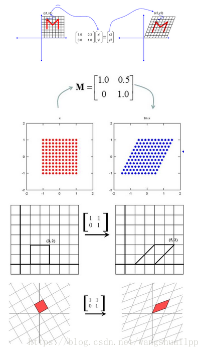
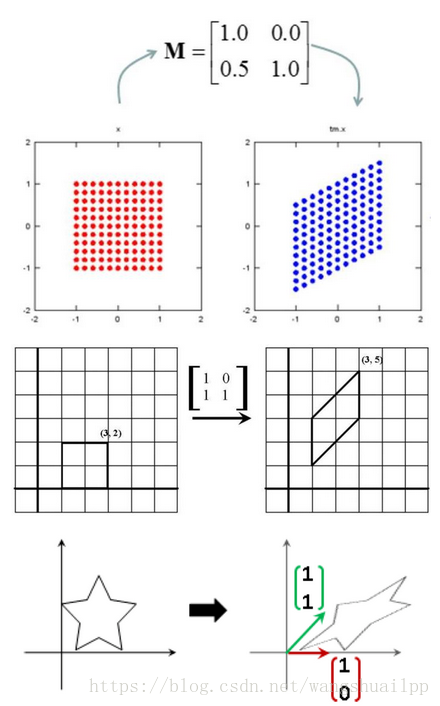

# SLAM基础——常见矩阵以及矩阵分解

https://blog.csdn.net/wangshuailpp/article/details/80209863

## 1、 $\bf{AX=B}$ 解的情况

(1) $ r(A)<r(A \mid B) $, 方程组无解

(2) $ r(A)=r(A \mid B)=n $, 方程组有唯一解

(3) $ r(A)=r(A \mid B)<n $, 方程组有无穷解

(4) $ r(\mathrm{~A})>\mathrm{r}(\mathrm{A} \mid \mathrm{B}) $, 这种情况不存在

其中 $r()$ 代表矩阵的秩, $ A \mid B $ 是增广矩阵, $ n $ 是 $X$ 末知数个数。通过下面的例子理解下这个结论, 假设 $ x=  [x1,x2]$, 其实就便成了一个二元一次方程组求解问题。
(1) $ \mathrm{A}[1,1 ; 0,0], \mathrm{B}=[1,1], \mathrm{AX}=\mathrm{B} $ 方程组变成了下式, 这自然没有解, 因为方程组的第二个式子是的 $ 0=1 $, 与事实不符。
$$
\mathrm{x} 1+\mathrm{x} 2=1
\\
0 * \mathrm{x} 1+0 * \mathrm{x} 2=1
$$
(2) $ \mathrm{A}[1,1 ; 0,1], \mathrm{B}=[1,1], \mathrm{AX}=\mathrm{B} $ 方程组变成了下式, 这自然有唯一解, 解为 $ \mathrm{X}=[0,1] $.
$$
\begin{array}{c}
\mathrm{x} 1+\mathrm{x} 2=1 \\
0 * \mathrm{x} 1+1 * \mathrm{x} 2=1
\end{array}
$$
(3) $ \mathrm{A}[1,1 ; 0,0], \mathrm{B}=[1,0], \mathrm{AX}=\mathrm{B} $ 方程组变成了下式, 这自然有无穷解, 因为第二项消掉了, 方程只剩下第一项，一个方程式，两个末知量。
$$
\begin{array}{c}
x 1+x 2=1 \\
0 * x 1+0 * x 2=0
\end{array}
$$


这里就引出最小二乘问题，最小二乘问题就是用来解决第二、三种情况求最优解。当出现第二种情况下（也就是A满秩下，称为满秩最小二乘问题），为了提高效率通常使用QR分解、LTLD分解、Cholesky分解和SVD分解（奇异分解）等。当出现第三种情况时（也就是A秩亏，称为亏秩最小二乘问题），只能使用SVD分解方法，其他方法将失效。

- 当A满秩时，为了提高效率通常采用QR分解、LTLD分解、Cholesky分解和SVD分解（奇异分解）等。
- 当A亏秩时，只能使用SVD分解方法，其他方法将失效。

## 2、 **线性最小二乘问题**

$$
\min \|A x-b\|_{2}^{2}
\\
 A \in R^{m^{*} n} \quad x \in R^{n} \quad b \in R^{m} 
$$


$ \mathrm{~m} $ 个方程求解 $ \mathrm{n} $ 个末知数，有三种情况:

1. $ \mathrm{m}=\mathrm{n} $ 且A为非奇异，则有唯一解， $ x=A^{-1} b $
2. $ \mathrm{m}>\mathrm{n} $ ，约束的个数大于末知数的个数，称为超定问题 (overdetermined)
3. $ \mathrm{m}<\mathrm{n} $ ，负定/欠定问题 (underdetermined)

通常我们遇到的都是超定问题，此时Ax=b的解是不存在的，从而转向解最小二乘问题: $ J(x)=\|A x-b\| $
 $J(x)$ 为凸函数，一阶导数为 0 ，得到: $ A^{T} A x-A^{T} b=0 $,称之为正规方程
一般解: $ x=\left(A^{T} A\right)^{-1} A^{T} b $

可见一般在视觉SLAM中后端优化就是约束项大于未知数的个数（超定问题），采用最小二乘问题求解

## 3、 **视觉SLAM中常用矩阵**

### 3.1 **正交矩阵**

有一种经典的矩阵，叫正交矩阵, 什么叫正交矩阵呢？其实某种意义上，正交矩阵也是通过矩阵乘法来定义的。 如果一个矩阵和它的转置矩阵的乘积为单位矩阵， 那么这个矩阵就是正交矩阵。李群中旋转矩阵就是一种正交阵，所以一般其逆的形式直接写成转置，因为转置计算简单。 


为什么叫正交矩阵呢？因为如果我们把这个矩阵写成向量的形式， 那么这些向量除了自己和自己的点积为1，其他任意两个不同向量之间的点积全部为0.而向量点积为0的情况叫正交。正交矩阵是因此得名的，其实就可以理解成一组基，也就是坐标系。为什么要讲正交矩阵呢？还记得在矩阵的加法分解里面，有求逆矩阵的情况么？试想一下，如果不要求逆矩阵了，而是求解转置矩阵的话，那是不是异常方便？对的，这就是正交矩阵的强大的优势，因此下面的矩阵分解中都希望直接转换成正交矩阵相乘的形式。


我们可以看到正交矩阵，并不改变物体的形状，但是进行了旋转。 


### 3.2 **对角矩阵**

乘以一个对角矩阵，好比对每个坐标轴进行缩放，包括方向，和压缩。正数的乘法：正数好比在原方向上的缩放， 大于1，表示伸长，小于1，表示缩小。负数的乘法：负数表示反反向。零的乘法：零表示空间压缩。 
$$
\left(\begin{array}{lll}x & y & z\end{array}\right)\left(\begin{array}{lll}a & 0 & 0 \\ 0 & b & 0 \\ 0 & 0 & c\end{array}\right)=\left(\begin{array}{lll}x a & y b & z c\end{array}\right)
$$


### 3.3 **三角矩阵**

和对角矩阵相比，三角矩阵要多一些角上的元素，那么这些元素有什么作用呢？上三角矩阵：上三角矩阵的作用好比进行右上的切变，水平的斜拉。下三角矩阵：同样是切边，不过是往左下切边，垂直方向的下拉。 





<font color="PineGreen">**矩阵分解就是分解成上面三种形式，综上所述，矩阵分解的几何意义就是把一个线性变换分解开来，分别是缩放，切边和旋转。矩阵因子的作用就是要把缩放，切边和旋转分解出来理解一个矩阵的作用。**</font>

## 4、 矩阵分解

为什么需要矩阵分解
个人认为，

首先，当数据量很大时，将一个矩阵分解为若干个矩阵的乘积可以大大<font color="Red">降低存储空间</font>；

其次，可以<font color="Red">减少真正进行问题处理时的计算量</font>，毕竟算法扫描的元素越少完成任务的速度越快，这个时候矩阵的分解是对数据的一个预处理；

再次，矩阵分解可以<font color="Red">高效和有效的解决某些问题</font>；

最后，矩阵分解可以<font color="Red">提高算法数值稳定性</font>，关于这一点可以有进一步的说明。

例如方程：
$$
\begin{array}{c}
\left\{\begin{array}{l}
5 x_{1}+7 x_{2}=0.7 \\
7 x_{1}+10 x_{2}=1
\end{array}\right. \\
A=\left(\begin{array}{cc}
5 & 7 \\
7 & 10
\end{array}\right), x=\left(\begin{array}{c}
x_{1} \\
x_{2}
\end{array}\right), b=\left(\begin{array}{c}
0.7 \\
1
\end{array}\right)
\end{array}
$$
直接对方程组求解可以得到:
$$
\mathrm{x}=\left(\begin{array}{l}
0.0 \\
0.1
\end{array}\right)
$$
现在对方程中的 $ b $ 最微小扰动:
$$
\begin{array}{c}
\mathrm{b}=\left(\begin{array}{c}
0.69 \\
1.01
\end{array}\right) \text {, 其中扰动项为 }\left(\begin{array}{c}
-0.01 \\
0.01
\end{array}\right) \\
\mathrm{x}=\left(\begin{array}{c}
-0.17 \\
0.22
\end{array}\right) \text {, }
\end{array}
$$
结果变成了上式，可以看出当方程组中的常数矩阵发生微小的扰动时，会导致最终的结果发生较大的变化，<font color="Red">这种结果的不稳定不是因为方程求解的方法，而是方程组矩阵本身的问题</font>。这会给我们带来很大的危害，例如像上面的情况，计算机求解出现舍入误差，矩阵本身不好的话会直接导致结果失败。

当对矩阵A或者b进行小扰动的时候，最后影响结果的是 $||A||||A^{-1} ||$，与矩阵病态性成正相关。定义矩阵的条件数 $cond(A)= ||A||||A^{-1} ||$ 来描述矩阵的病态程度，一般认为小于100的为良态，条件数在100到1000之间为中等程度的病态，条件数超过1000存在严重病态。以上面的矩阵A为例，采用2范数的条件数 $cond(A)=222.9955$ , 矩阵处于中等病态程度。

矩阵其实就是一个给定的线性变换，<font color="Red">特征向量描述了这个线性变换的主要方向</font>，而<font color="Red">特征值描述了一个特征向量的长度在该线性变换下缩放的比例</font>，对开篇的例子进一步观察发现，A是个对称正定矩阵，A的特征值分别为 $\lambda 1：14.93303437$  和 $\lambda 2：0.06696563$ ，两个特征值在数量级上相差很大，这意味着b发生扰动时，向量x在这两个特征向量方向上的移动距离是相差很大的——对于  $\lambda 1$ 对应的特征向量只需要微小的移动就可到达b的新值，而对于  $\lambda 2$ ，由于它比起 $\lambda1$ 太小了，因此需要x做大幅度移动才能到达b的新值，于是悲剧就发生了.

### 4.1 QR分解

当A是<font color="PineGreen">非奇异的实方阵</font>（满秩，只有方阵才存在奇异性，奇异矩阵秩亏，行列式为0，非奇异矩阵满秩，行列式不为0），实方阵A能够表示成一个正交矩阵 $Q（Q^TQ=I）$ 与上三角矩阵R的积，QR分解的实际计算有很多方法，例如 Givens 旋转、Householder 变换，以及 Gram-Schmidt正交化等等。$A=Q*R$ 称为A的QR分解。如下图所示 


前面我们提到单位矩阵也是正交矩阵， 所以正交矩阵可以看成是坐标系的转换。所以有时候，QR分解也可以表示成如下形式。 


#### 4.1.1 **QR分解的意义**

从几何上QR分解，就是先进行旋转，然后再进行切变的过程。


#### 4.1.2 **QR分解解满秩最小二乘问题**

设  A  有  $\mathrm{QR}$  分解:
$$
A=Q\left(\begin{array}{l}
R \\
0
\end{array}\right)=Q_{1} R
$$


其中  $Q \in R^{m \times m}$  是正交矩阵,  $Q_{1}$  是  $Q$  的前  $n$  列组成的矩阵, 即  $Q=\left(Q_{1} \mid Q_{2}\right)$, $R \in R^{m \times n}$  是对角线上元 素均为正数的上三角矩阵。
由于<font color="Red">正交矩阵保持范数不变</font>, 所以问题(14)等价于
$$
\left\|Q^{T}(A x-b)\right\|_{2}=\min \left\{\left\|Q^{T}(A v-b)\right\|_{2}: v \in R^{n}\right\}
$$
记
$$
\boldsymbol{d}=Q^{T} \boldsymbol{b}=\left(\begin{array}{l}
Q_{1}^{T} \\
Q_{2}^{T}
\end{array}\right) \boldsymbol{b}=\left(\begin{array}{l}
\boldsymbol{d}_{1} \\
\boldsymbol{d}_{2}
\end{array}\right)
$$
则有
$$
\left\|Q^{T}(A x-b)\right\|_{2}^{2}=\left\|\left(\begin{array}{l}
R \\
0
\end{array}\right) x-\left(\begin{array}{l}
d_{1} \\
d_{2}
\end{array}\right)\right\|_{2}^{2}=\left\|R x-d_{1}\right\|_{2}^{2}+\left\|d_{2}\right\|_{2}^{2}
$$


因此,  $x$  是(14)的解当且仅当  $x$  是方程  $R x=d_{1}$ 的解。这样 (14)的解可由上三角方程组  $R x=d_{1} $ 求得。
$ \mathrm{QR}$ 分解方法的基本步骤如下:
(1)求  A  的  $\mathrm{QR}$  分解;
(2) 计算  $\boldsymbol{d}_{1}=Q_{1}^{T} \boldsymbol{b} $;
(3) 解方程组  $R x=d_{1}$  。
值得指出的是, $ Q R $ 分解方法比正规化方法有较好的数值檍定性, 并且计算结果比正规化方法 要精确。当然,  $Q R $ 方法比正规化方法会付出更大的计算代价。

### 4.2 LDLT分解

<font color="PineGreen">**对称**矩阵A</font>可以分解成一个下三角矩阵L（Lower下）和一个对角矩阵D（Diagonal对角线）以及一个下三角矩阵L的转置LT三个矩阵相乘的形式。如下式 


由 $A$ 的分解可知 $A^T=A$，即 $A$ 的转置等于 $A$ 矩阵本身。

#### 4.2.1 **LDLT分解解满秩最小二乘问题**

一般无法得到满足对称矩阵 $A$，因此需要使对 $A^TA$（满足对称）进行分解。将求解问题转换成下面的式子 
$$
A^TAx=A^Tb
$$
由于 $ r(A)=n $, 所以 $A^TA$ 是对称 (正定) 矩阵, 式子有唯一解, 使用LDLT分解的步骤是:
(1) 定义矩阵 $ \mathrm{C}=\mathrm{A^T} * \mathrm{~A}, \mathrm{~d}=\mathrm{A^T} * \mathrm{~b} $;
(2) 对C进行 $LDLT$ 分解 $C=LDL^T$, 原式变成 $LDL^T * x=d$ 
(3) 令 $ y=L^T * x $, 原式变成 $ L D * y=d $, 求解此方程得到 $ y $, 然后求解 $ y=L^T * x $ 得到 $ x $

<font color="Red">LDLT分解速度要快于QR分解</font>。

### 4.3 **Cholesky分解**

Cholesky分解是LDLT分解的一种特殊形式，也就是其中的D是单位矩阵。<font color="PineGreen">**正定对称矩阵** </font>A可以分解成一个下三角矩阵L和这个下三角矩阵L的转置 $L^T$ 相乘的形式。如下式 


#### 4.3.1 **Cholesky分解解满秩最小二乘问题**

一般无法得到满足对称矩阵 $A$，因此需要使对 $A^TA$（满足对称）进行分解。将求解问题转换成下面的式子 
$$
A^TAx=A^Tb
$$
由于 $ r(A)=n $, 所以 $A^TA$ 是对称 (正定) 矩阵, 式子有唯一解, 使用cholesky分解的步骤是:
(1) 定义矩阵 $ \mathrm{C}=\mathrm{A^T} * \mathrm{~A}, \mathrm{~d}=\mathrm{A^T} * \mathrm{~b} $;
(2) 对C进行cholesky分解 $C=GG^T$, 原式变成 $GG^T * x=d$ 
(3) 令 $ y=G^T * x $, 原式变成 $ G * y=d $, 求解此方程得到 $ y $, 然后求解 $ y=G^T * x $ 得到 $ x $

<font color="Red">Cholesky分解要快于LDLT分解</font>。

### 4.4 SVD分解

矩阵的奇异值分解（SVD）在最优化问题、特征值问题、最小二乘问题及广义逆问题中有巨大作用，奇异值分解将QR分解推广到任意的实矩阵，不要求矩阵式可逆，也不要求是方阵。奇异值和特征值相似的重要意义，都是为了提取出矩阵的主要特征。

假设 $A$ 是一个 $m∗n$ 阶矩阵，如此则存在一个分解 $m$ 阶正交矩阵 $U$、非负对角阵 $Σ$和 $n$ 阶正交矩阵 $V$ 使得 
$$
A=U
\begin{pmatrix}
\sum & 0 \\
0 & 0
\end{pmatrix}
V^T
$$
$\sum$ 对角线上的元素 $\sum_{i,i}$, $i$ 即为 $A$ 的奇异值。而且一般来说，我们会将 $\sum$ 上的值按从大到小的顺序排列。
通过上面对SVD的简单描述，不难发现，SVD解决了特征值分解中只能针对方阵而没法对更一般矩阵进行分解的问题。所以在实际中，SVD的应用场景比特征值分解更为通用与广泛。将将上面的SVD分解用一个图形象表示如下。 


截止到这里为止，很多同学会有疑问了：你这不吃饱了撑得。好好的一个矩阵A，你这为毛要将他表示成三个矩阵。这三个矩阵的规模，一点也不比原来矩阵的规模小好么。而且还要做两次矩阵的乘法。

要知道，矩阵乘法可是个复杂度为O(n3)的运算。如果按照之前那种方式分解，肯定是没有任何好处的。矩阵规模大了，还要做乘法运算。

<font color="Red">关键是**奇异值**有个牛逼的性质：在大部分情况下，当我们把矩阵 $\sum$ 里的**奇异值按从大到小的顺序呢排列**以后，很容易就会发现，**奇异值 $\sigma$减小的速度特别快**。在很多时候，**前10%甚至前1%的奇异值的和就占了全部奇异值和的99%以上**</font>。

换句话说，大部分奇异值都很小，基本没什么卵用。。。既然这样，那我们就可以<font color="Red">用前面r个奇异值来对这个矩阵做近似</font>。于是，SVD也可以这么写： 
$$
A_{m \times n} = U_{m \times r} \sum _{r \times r}V_{r \times n}
$$
其中，$r\ll m，r \ll n$。如果用另外一幅图描述这个过程，如下图：


看了上面这幅图，同学们是不是就恍然大悟：原来的那个大矩阵 $A$，原来可以用右边的那三个小矩阵来表示。

<font color="Red">当然如果 $r$ 越大，跟原来的矩阵相似度就越高。如果 $r=n$，那得到的就是原来的矩阵 $A$ 。但是这样存储与计算的成本就越高</font>。

所以，实际在使用SVD的时候，需要我们根据不同的业务场景与需求还有资源情况，合理选择 $r$ 的大小。本质而言，就是<font color="Red">在计算精度与空间时间成本之间做个折中</font>。


#### 4.4.1 **SVD分解意义**

按照前面给出的几何含义，SVD 分解可以看成先旋转，然后进行分别缩放，然后再旋转的过程。 


#### 4.4.2 **SVD分解解满秩（亏秩）最小二乘问题**

SVD分解不仅可以解决满秩最小二乘问题，最重要的是可以解决亏秩最小二乘问题（$r（A）< n$，理解下其实就相当于这里取 $r < n$ 的情况），而前面的方法在秩亏的时候都会失效。 
 设A的SVD分解为： 
$$
A=U
\begin{pmatrix}
\sum_r & 0 \\
0 & 0
\end{pmatrix}
V^T
$$

$$
x = A^{-1}b = V 
\begin{pmatrix}
\sum_r^{-1} & 0  \\
0  & 0
\end{pmatrix}
U^Tb
$$

#### 4.4.3 **SVD分解证明**

https://blog.csdn.net/oldmao_2001/article/details/103614310

(1) 设 $ A \in C_{r}^{m \times n}(r>0), \quad $ (这里m和n代表矩阵的行列, $ \mathrm{r} $ 是矩阵的秩) 则 $ A^{H} A $ 是Hermite矩阵,
(<font color="Red">如果矩阵A不包含复数, 那么 $ A^{H}=A^{T} $</font> ) 且其特征值均是非负实数;

$ A^{T} A $ 写为: $ x^{T} A^{T} A x=(A x)^{T} A x $
这里x是向量, $ \mathrm{A} $ 是矩阵, 那么 $ \mathrm{Ax} $ 就是一个向量, 令 $ z=A x $, 上面就 $ =z^{T} z=\|z\|^{2} \geq 0 $
因此可以断定 $ A^{T} A $ 是半正定的, 他的特征值 $ \lambda_{i} \geq 0 $

(2) $ \operatorname{rank}\left(A^{H} A\right)=\operatorname{rank}(A) $;
证明：这里只要证明两者的解空间是一样的即可, 因为上节讲解空间的时候有下面的结论
$$
R(A)+N(A)=n
$$
解空间 $ N(A) $ 一样, 那么秩 $ R(A) $ 也就一样了, 也就是要证明
$ A^{T} A x=0 $ 和 $ A x=0 $ 的解一样, 就是 $ \mathrm{x} $ 是前者的解也是后者的解。
分两种情况看:
第一种: $ x=0 $ 的时候, 肯定是两个方程的解
第二种: 对于 $ \forall x \neq 0 $, 有:
$ A^{T} A x=0 $, 要把 $ A^{T} $ 去掉, 不能两边同时乘 $ A^{T} $ 的逆矩阵, 因为 $ A^{T} $ 不一定有逆矩阵。所以我们方程 两边同时乘 $ x^{T} $, 得: $ x^{T} A^{T} A x=0 $, 即 $ (A x)^{T} A x=0 $, 这里, 由于 $ \mathrm{x} $ 是向量, $ \mathrm{A} $ 是矩阵, $ \mathrm{Ax} $ 是一个 向量 $ x^{T} A^{T} A x $ 相当于求 $ A x $ 的模长, 模长等于 0 就意味着向量 $ A x $ 中的每一项都是 0 , 也就是 $ A^{T} A x=0 $ 与 $ A x=0 $ 解是一样的（解空间一样）, 因此秩也就一样。

(3) 设 $ A \in C_{r}^{m \times n} $, 则 $ A=0 $ 的充要条件是 $ A^{H} A=0 $.

(4) 奇异值的定义

定义4.11: $ A \in C_{r}^{m \times n}(r>0), A^{H} A $ 的特征值为 $ \lambda_{1} \geq \lambda_{2} \geq \ldots \geq \lambda_{r}>\lambda_{r+1}=\ldots=\lambda_{n}=0 $ 则称 $ \sigma_{i}=\sqrt{\lambda_{i}}(i=1,2, \ldots, n) $ 为 $ \mathrm{A} $ 的奇异值; 当 $ \mathrm{A} $ 为零矩阵时, 它的奇异值都是 0 。

根据定义可以得到 $A^HA$ 的特征值有r个是大于0的，其他都是等于0的。于是有下面定理：

<font color="Red">定理4.16: 设 $ A \in C_{r}^{m \times n}(r>0) $, 则存在m阶正交矩阵 $ \mathrm{U} $ 和 $ n $ 阶正交矩阵 $ \mathrm{V} $, 使得</font>
$$
U^{H} A V=\left[\begin{array}{ll}
\Sigma & 0 \\
0 & 0
\end{array}\right]
$$
<font color="Red">其中 $ \Sigma=\operatorname{diag}\left(\sigma_{1}, \sigma_{2}, \ldots, \sigma_{r}\right) $, 而。 $ \sigma_{i}(i=1,2, \ldots, r) $ 为矩阵A的全部非零奇异值。注意这里的 矩阵shape, $ U^{H} $ 是 $ \mathrm{n} \times \mathrm{m} $ 的, $ \mathrm{A} $ 是 $ \mathrm{m} \times \mathrm{n}, \mathrm{V} $ 是 $ \mathrm{n} \times \mathrm{n}, U^{H} A V $ 是 $ \mathrm{n} \times \mathrm{n} $ 的</font>。

证明：

$ A^{H} A $  是对称阵, 所以可以满足对角化的操作（一个对称阵A，可以找到正交方阵 $ \mathrm{P} $, 使 得 $ P^{T} A P= $ 对角阵)。

当然由于 $ P $ 是正交方阵, 所以有 $ P^{T}=P^{-1} $, 故 $ P^{-1} A P= $ 对角阵也成立）。

所以可以有下面的等式 (为了和前面的不一样, 这里就不用 $ P $, 用 $ V $ 来表示咯, 为什么, 因为定 理里面用的是V撒, V当然是正交矩阵了, 复矩阵就叫酉矩阵）:
$$
V^{H}\left(A^{H} A\right) V=\left[\begin{array}{ccc}
\lambda_{1} & & \\
& \ddots & \\
& & \lambda_{n}
\end{array}\right]=\left[\begin{array}{cc}
\Sigma^{2} & 0 \\
0 & 0
\end{array}\right]
$$
根据奇异值的定理可知, 从 $ \lambda_{1}, \ldots, \lambda_{n} $ 这些个特征值中, 有一些个是大于 0, 一些个是等于 0 的, 即: $ \lambda_{1} \geq \lambda_{2} \geq \ldots \geq \lambda_{r}>\lambda_{r+1}=\ldots=\lambda_{n}=0 $, 上式中的
$$
\Sigma^{2}=\left[\begin{array}{lll}
\sigma_{1}^{2} & & \\
& \ddots & \\
& & \sigma_{r}^{2}
\end{array}\right]=\left[\begin{array}{lll}
\lambda_{1} & & \\
& \ddots & \\
& & \lambda_{r}
\end{array}\right]
$$
$ \Sigma $ 的shape是 $ r * r $ 的。
接下来将 $ \mathrm{n} \times \mathrm{n} $ 的方阵 $ \mathrm{V} $ 分两块: $ V=\left[V_{1} \vdots V_{2}\right] $, 其中 $ V_{1} \in C_{r}^{n \times r}, V_{2} \in C_{r}^{n \times(n-r)} $ 等式 (21) 两边同时乘上V, 由于V是正交 $ V V^{H}=E $, 改写为:
$$
A^{H} A V=V\left[\begin{array}{cc}
\Sigma^{2} & 0 \\
0 & 0
\end{array}\right]
$$
由于 $ V=\left[V_{1} \vdots V_{2}\right] $, 等式23可以写为:
$$
A^{H} A\left[V_{1} \vdots V_{2}\right]=\left[V_{1} \vdots V_{2}\right]\left[\begin{array}{cc}
\Sigma^{2} & 0 \\
0 & 0
\end{array}\right]
$$
两边展开:
$$
\left[A^{H} A V_{1} \vdots A^{H} A V_{2}\right]=\left[V_{1} \Sigma^{2}: 0\right]
$$
等式25 中 $\vdots$ 两边的东西都应该对应相等, 所以有:
$$
A^{H} A V_{1}=V_{1} \Sigma^{2}
$$
$$
A^{H} A V_{2}=0
$$
等式 26左右两边分别乘上 $ V_{1}^{H} $ 得:
$$
V_{1}^{H} A^{H} A V_{1}=\Sigma^{2}
$$
等式 28 左右两边同时乘上 $ \Sigma^{-1} $
$$
\Sigma^{-1} V_{1}^{H} A^{H} A V_{1} \Sigma^{-1}=\Sigma^{-1} \Sigma^{2} \Sigma^{-1}
$$
这里 $ \Sigma=\left[\begin{array}{lll}\sigma_{1} & & \\ & \ddots & \\ & & \sigma_{r}\end{array}\right] $ 是对角阵, 所以 $ \Sigma^{-1}=\left[\begin{array}{ccc}\sigma_{1}^{-1} & & \\ & \ddots & \\ & & \sigma_{r}^{-1}\end{array}\right] $ 也是是对角阵, 对角 阵的转置和它本身一样 $ \left(A^{T}=A\right) $, 所以:
$$
\Sigma^{-1}=\left(\Sigma^{-1}\right)^{T}=\left(\Sigma^{-1}\right)^{H}
$$
根据公式 30, 等式29 可以写为:
$$
\left(\Sigma^{-1}\right)^{T} V_{1}^{H} A^{H} A V_{1} \Sigma^{-1}=\Sigma^{-1} \Sigma^{2} \Sigma^{-1}
$$
把前面几个的转置提取到括号外（位置要变化）, $ \Sigma^{-1} \Sigma^{2} \Sigma^{-1}=E $, 这里写为 $ I_{r} $ ( $ ( $ 是维度 $ ) $, 得:
$$
\left(A V_{1} \Sigma^{-1}\right)^{T}\left(A V_{1} \Sigma^{-1}\right)=I_{r}
$$
等式27 左右两边分别乘上 $ V_{2}^{H} $ 得:
$$
V_{2}^{H} A^{H} A V_{2}=0
$$
$$
\left(A V_{2}\right)^{H} A V_{2}=0
$$

等式 (34) 可以看做是一个矩阵 $ \left(A V_{2}\right) $ 的转置乘以矩阵本身等于 0 的形式。根据开篇的结论三（设 $ A \in $ $ C_{r}^{m \times n} $, 则 $ A=0 $ 的充要条件是 $ A^{H} A=0 $.) 可知:
$$
A V_{2}=0
$$
到这个地方, 我们分别得到了两个等式 (32) (35)。 

对于等式 (32) , 令 $ U_{1}=A V_{1} \Sigma^{-1} $, 则有:
$$
U_{1}^{H} U_{1}=I_{r}
$$
再次看shape, $ A $ 是 $ m \times n, V_{1} $ 是 $ n \times r, \Sigma^{-1} $ 是 $ r \times r $ 的, 所以 $ U_{1} $ 是 $m\times r$ 的。如果记 $ U_{1} $ 是由 $ r $ 个向量 $ u_{1}, u_{2}, \ldots, u_{r} $ 构成, 上式 (36) 可以写成:
$$
U_{1}^{H} U_{1}=\left[\begin{array}{c}
u_{1}^{T} \\
\vdots \\
u_{r}^{T}
\end{array}\right]\left[\begin{array}{lll}
u_{1} & \cdots & u_{r}
\end{array}\right]=I_{r}
$$
等式 (37) 中的左边展开后的每一项 $ u_{i}^{T} u_{j} $ 满足:
$$
\left\{\begin{array}{ll}
u_{i}^{T} u_{j}=1 & i=j \\
u_{i}^{T} u_{j}=0 & i \neq j
\end{array}\right.
$$
因此说构成的 $ U_{1} $ 的 $ \mathrm{r} $ 向量是两两正交的单位向量。由于 $ U_{1} $ 的shape是 $ \mathrm{m} \times \mathrm{r} $, 这 $ \mathrm{r} $ 个向量 $ u_{i} \in \Re^{m} $ （说 人话: r是m维的列向量)，这里可以根据定理，直接把 $r$ 维向量扩充到 m 维上。

---

定理可视化实例补充:
二维向量 $ \left[\begin{array}{l}1 \\ 0 \\ 0\end{array}\right]\left[\begin{array}{l}0 \\ 1 \\ 0\end{array}\right] $ 可以扩充为三维向量: $ \left[\begin{array}{l}1 \\ 0 \\ 0\end{array}\right]\left[\begin{array}{l}0 \\ 1 \\ 0\end{array}\right]\left[\begin{array}{l}0 \\ 0 \\ 1\end{array}\right] $

---

$ U_{1} $ 扩充为 $ C^{m} $ (说人话: $ \mathrm{m} $ 维) 的标准正交基, 把后来扩展的向量记为: $ u_{r+1}, \ldots, u_{m} $, 并构造成矩阵: $ U_{2}=\left(u_{r+1}, \ldots, u_{m}\right) $, 则:
$$
U=\left[U_{1} \vdots U_{2}\right]=\left(u_{1}, u_{2}, \cdots, u_{r}, u_{r+1}, \cdots, u_{m}\right)
$$
$ \mathrm{U} $ 是m阶酉（正交）矩阵, 且有:
$$
U_{1}^{H} U_{1}=I_{r}, U_{2}^{H} U_{1}=0
$$
下面U构造好后, 就可以开始验证要证明的定理 $ U^{H} A V $ 啦, 因为 $ V=\left[V_{1}: V_{2}\right] $ :
$$
U^{H} A V=U^{H}\left[A V_{1} \vdots A V_{2}\right]
$$
由 $ U=\left[U_{1} \vdots U_{2}\right] $ 可以知道: $ U^{H}=\left[\begin{array}{l}U_{1}^{H} \\ U_{2}^{H}\end{array}\right] $;

由 $ U_{1} $ 的设定 $ U_{1}=A V_{1} \Sigma^{-1} $, 两边的右边同时乘以 $ \Sigma $, 得 $ U_{1} \Sigma=A V_{1} $; 

由等式 (35) ;
以上三个东西带入等式 (41)
$$
U^{H} A V=\left[\begin{array}{l}
U_{1}^{H} \\
U_{2}^{H}
\end{array}\right]\left[U_{1} \Sigma \vdots 0\right]=\left[\begin{array}{ll}
U_{1}^{H} U_{1} \Sigma & 0 \\
U_{2}^{H} U_{1} \Sigma & 0
\end{array}\right]
$$
把等式 (40) 带入
$$
U^{H} A V=\left[\begin{array}{cc}
\Sigma & 0 \\
0 & 0
\end{array}\right]
$$
到这里证明就好了, 但是上面的等式还可以在等式的两边左右分别乘以 $ U, V^{H} $ 。
$$
U U^{H} A V V^{H}=U\left[\begin{array}{cc}
\Sigma & 0 \\
0 & 0
\end{array}\right] V^{H}
$$
单位阵退散后变成:
$$
A=U\left[\begin{array}{cc}
\Sigma & 0 \\
0 & 0
\end{array}\right] V^{H}
$$

# SLAM基础——聊一聊信息矩阵

## 1、 信息矩阵

> 本小节参考: [信息矩阵在图优化slam里面的作用](https://blog.csdn.net/fly1ng_duck/article/details/101236559) 表示感谢

> The Information matrix is the negative of the expectation of the Hessian.

信息矩阵是Hessian期望的负值。

### 1.1 信息矩阵是什么？有什么作用？

信息矩阵是一个scalar 表达不确定性
$$
e_{i}(\mathbf{x})=\mathbf{e}_{i}(\mathbf{x})^{T} \mathbf{\Omega}_{i} \mathbf{e}_{i}(\mathbf{x})
$$
Described by information matrix $ \Omega $
$$
\Omega=\Sigma^{-1}
$$
and information vector $ \xi $
$$
\xi=\Sigma^{-1} \mu
$$
那为什么需要信息矩阵呢?
$$
\begin{aligned}
\mathbf{x}^{*} &=\underset{\mathrm{x}}{\operatorname{argmin}} F(\mathrm{x})-----\quad \text { global error }(\text { scalar }) \\
&=\underset{\mathrm{x}}{\operatorname{argmin}} \sum_{i} e_{i}(\mathrm{x})-----\text { squared error terms (scalar) } \\
&=\underset{\mathrm{x}}{\operatorname{argmin}} \sum_{i} \mathrm{e}_{i}^{T}(\mathrm{x}) \Omega_{i} \mathrm{e}_{i}(\mathrm{x})---\text { error terms (vector) }
\end{aligned}
$$
系统可能有很多传感器，传感器精度越高，对应的information matrix里面的系数会很大（这里是越大越好，因为它是协方差矩阵的逆矩阵），系数越大代表权重越高，表达的信息越多，在优化的过程中就越会被重视。用一个形象的数学表达式表达就是：

```c++
const int INT_MAX=1e9;
argmin( INT_MAX*(x-3)^2+1/INT_MAX*(x-1)^2)) 
```

那么INT MAX就代表我们的精确传感器，那么优化的结果肯定是 $x=3$;也就是说，我们更加相信我们好的传感器

### 1.2 信息矩阵与Hessian矩阵的关系

> 本小节参考链接：
> 文章
> [SLAM的滑动窗口算法中，在边缘化时，高斯牛顿法的信息矩阵为什么是 优化变量协方差的逆？]
>
> [Why is the observed Fisher information defined as the Hessian of the log-likelihood?]
> PDF
> Maximum Likelihood Estimation (MLE).pdf

先放出结论：

Hessian矩阵在最大似然（Maximum Likelihood Estimation,MLE）问题中被认为约等于信息矩阵，所以一般也会将Hessian矩阵直接当做信息矩阵对待。

协方差的逆=信息矩阵，这个结论是建立在假设分布是高斯分布这个前提下，计算最大后验概率（MAP）优化问题得出来的

#### 1.2.1 Hessian矩阵和H矩阵的关系

Hessian矩阵平时接触的可能不多, 但是Hessian矩阵的近似矩阵H矩阵就比较多了, 因为总是在求解优化问题，必不可少的就会接触到优化问题的 $H$ 矩阵, 通常我们见到的都是最小二乘问题中的 $H$ 矩阵, 如下有：
$$
 \begin{aligned} E &=\|z-f(x)\|_{w}^{2}=\|z-f(x)+J \delta x\|_{w}^{2} \\ &=(e+J \delta x)^{T} W(e+J \delta x) \\ &=e^{T} w e+\delta x^{T} J^{T} W e+e^{T} W J \delta x+\delta x^{T} J^{T} W J \delta x \end{aligned} 
$$
其中 $ J^{T} W J $ 就称为 $ \mathrm{H} $ 矩阵。

Hessian矩阵其实说白了就是 $ E $ 对于状态变量 $ x $ 的二阶偏导数。而 $ \mathrm{H} $ 矩阵是对Hessian矩阵的近似, 主要是为了加速计算。

#### 1-2-2 Hessian或H矩阵和信息矩阵的关系

**结论**：在最大似然估计问题中，Hessian矩阵通常被用来表示Information矩阵。(结论所参考的资料如下)

> [Why is the observed Fisher information defined as the Hessian of the log-likelihood?]
> 注意：我们的最小二乘就是建立在最大似然估计的基础上的，这也是为什么在一些SLAM框架中，直接将Hessian矩阵当做了信息矩阵。而在最大似然估计中，就是将Hessian矩阵近似为了信息矩阵
>
> Maximum Likelihood Estimation (MLE).pdf
> 里面的公式(68)， The Information matrix is the negative of the expectation of the Hessian. 信息矩阵是Hessian期望的负值。

**根据参考资料得出**：

1. <font color="Red">对于似然分布$p(y|x) $ 而言，Information矩阵就是负对数似然问题的Hessian矩阵的期望</font>；
2. <font color="Red">对于分布 $p(x)$ 而言，负对数似然问题的协方差矩阵的逆就是Hessian矩阵</font>；

VINS-mono应该就是采用这样的思路，直接将hessian矩阵作为了信息矩阵(information)（原因写在下面了）


**问题**：信息矩阵=协方差的逆，但是为什么有的还说Hessian矩阵在高斯牛顿中被近似认为是信息矩阵？哪一个是对的？

答：都对，信息矩阵就是协方差的逆，这个不是非线性优化推导出的，是假设分布是高斯分布，计算最大后验估计得到的一个优化问题。（**参考后面信息矩阵与最小二乘的关系，就会发现推导过程中，假设分布属于高斯分布**）

## 2、 信息矩阵与最小二乘的关联

### 2.1 先谈一谈常规的最小二乘

残差函数 $ \mathbf{f}(\mathbf{x}) $ 为非线性函数, 对其一阶泰勒近似有:
$$
\mathbf{f}(\mathbf{x}+\Delta \mathbf{x}) \approx \ell(\Delta \mathbf{x}) \equiv \mathbf{f}(\mathbf{x})+\mathbf{J} \Delta \mathbf{x}
$$
请特别注意, <font color="Blue">这里的 $ \mathrm{J} $ 是残差函数 $ \mathrm{f} $ 的雅克比矩阵</font>。代入损失函数:
$$
\begin{aligned}
F(\mathbf{x}+\Delta \mathbf{x}) \approx L(\Delta \mathbf{x}) & \equiv \frac{1}{2} \ell(\Delta \mathbf{x})^{\top} \ell(\Delta \mathbf{x}) \\
&=\frac{1}{2} \mathbf{f}^{\top} \mathbf{f}+\Delta \mathbf{x}^{\top} \mathbf{J}^{\top} \mathbf{f}+\frac{1}{2} \Delta \mathbf{x}^{\top} \mathbf{J}^{\top} \mathbf{J} \Delta \mathbf{x} \\
&=F(\mathbf{x})+\Delta \mathbf{x}^{\top} \mathbf{J}^{\top} \mathbf{f}+\frac{1}{2} \Delta \mathbf{x}^{\top} \mathbf{J}^{\top} \mathbf{J} \Delta \mathbf{x}
\end{aligned}
$$
这样损失函数就近似成了一个二次函数, 并且如果雅克比是满秩的, 则 $ \mathbf{J}^{\top} \mathbf{J} $ 正定, 损失函数有最小 值。
另外, 易得: $ F^{\prime}(\mathbf{x})=\left(\mathbf{J}^{\top} \mathbf{f}\right)^{\top} $, 以及 $ F^{\prime \prime}(\mathbf{x}) \approx \mathbf{J}^{\top} \mathbf{J} $.

### 2.2 包含信息矩阵的最小二乘

> **本小节主要回答下面问题**：
>
> 有时候我们不写中间的协方差的逆，**为什么？？多出来的协方差的逆是怎么多出来的？？**
>
> 没有写那是假设其为1了。

### 2.3 **SLAM问题建模**

考虑某个状态 $ \boldsymbol{\xi} $, 以及一次与该变量相关的观测 $ \mathbf{r}_{i \circ} $ 由于噪声的存在, 观测服从概率分布 $ p\left(\mathbf{r}_{i} \mid \boldsymbol{\xi}\right) $ 。 多次观测时, 各个测量值相互独立, 则多个测量相互独立, 则多个测量 $ \mathbf{r}=\left(\mathbf{r}_{1}, \ldots, \mathbf{r}_{n}\right)^{\top} $ 构建的似 然概率为:
$$
p(\mathbf{r} \mid \boldsymbol{\xi})=\prod_{i} p\left(\mathbf{r}_{i} \mid \boldsymbol{\xi}\right)
$$
如果知道机器人状态的先验信息 $ p(\boldsymbol{\xi}) $, 如 GPS, 车轮码盘信息等, 则 根据 Bayes 法则, 有后验概率:
$$
p(\boldsymbol{\xi} \mid \mathbf{r})=\frac{p(\mathbf{r} \mid \boldsymbol{\xi}) p(\boldsymbol{\xi})}{p(\mathbf{r})}
$$
通过最大后验估计, 获得系统状态的最优估计:
$$
\boldsymbol{\xi}_{\mathrm{MAP}}=\arg \max _{\xi} p(\boldsymbol{\xi} \mid \mathbf{r})
$$
后验公式中分母跟状态量无关, 舍弃。最大后验变成了:
$$
\boldsymbol{\xi}_{\mathrm{MAP}}=\arg \max _{\xi} \prod_{i} p\left(\mathbf{r}_{i} \mid \boldsymbol{\xi}\right) p(\boldsymbol{\xi})
$$
即
$$
\boldsymbol{\xi}_{\mathrm{MAP}}=\arg \min _{\xi}\left[-\sum_{i} \log p\left(\mathbf{r}_{i} \mid \boldsymbol{\xi}\right)-\log p(\boldsymbol{\xi})\right]
$$
如果假设观测值服从多元高斯分布:
$$
p\left(\mathbf{r}_{i} \mid \boldsymbol{\xi}\right)=\mathcal{N}\left(\boldsymbol{\mu}_{i}, \boldsymbol{\Sigma}_{i}\right), p(\boldsymbol{\xi})=\mathcal{N}\left(\boldsymbol{\mu}_{\xi}, \boldsymbol{\Sigma}_{\xi}\right)
$$
则有:
$$
\boldsymbol{\xi}_{\mathrm{MAP}}=\underset{\boldsymbol{\xi}}{\operatorname{argmin}} \sum_{i}\left\|\mathbf{r}_{i}-\boldsymbol{\mu}_{i}\right\|_{\Sigma_{i}}^{2}+\left\|\boldsymbol{\xi}-\boldsymbol{\mu}_{\xi}\right\|_{\Sigma_{\xi}}^{2}
$$

> 注意右下角的 $ \|..\|_{\Sigma_{\xi}}^{2} $ 表示 $ \|. .\|^{2} $ 需要除以 $ \Sigma_{\xi} $, 这也是为什么高斯牛顿中出现中间的协方差的逆的原因。不过有时候我们假设其为 $ 1 了 $, 也就是省略不写

这个最小二乘的求解为：(下面结果如何推导出的, 看下面的细节说明)
$$
\mathbf{J}^{T} \mathbf{\Sigma}^{-1} \mathbf{J} \delta \boldsymbol{\xi}=-\mathbf{J}^{T} \mathbf{\Sigma}^{-1} \mathbf{r}
$$

> **这里对上面省略掉的推导细节进行说明**：
>
> **前期基础**：
>
> 考虑一个任意的高维高斯分布 $ \boldsymbol{x} \sim N(\boldsymbol{\mu}, \boldsymbol{\Sigma}) $ 它的概率密度函数展开形式为:
> $$
> P(x)=\frac{1}{\sqrt{(2 \pi)^{N} \operatorname{det}(\boldsymbol{\Sigma})}} \exp \left(-\frac{1}{2}(x-\mu)^{T} \boldsymbol{\Sigma}^{-1}(x-\mu)\right)
> $$
> 取它的负对数, 则变为:
> $$
> -\ln (P(x))=\frac{1}{2} \ln \left((2 \pi)^{N} \operatorname{det}(\boldsymbol{\Sigma})\right)+\frac{1}{2}(x-\boldsymbol{\mu})^{T} \boldsymbol{\Sigma}^{-1}(\boldsymbol{x}-\boldsymbol{\mu}) .
> $$
> 对原分布求最大化相当于对负对数求最小化。在最小化上式的 $ x $ 时, 第一项与 $ x $ 无关, 可以略 去。于是, 只要最小化右侧的二次型项, 就得到了对状态的最大似然估计。相当于在求:
> $$
> \boldsymbol{x}^{*}=\arg \min \left((x-\boldsymbol{\mu})^{T} \Sigma^{-1}(x-\boldsymbol{\mu})\right)
> $$
> 推昌
> 对于某一次观测:
> $$
> z_{k, j}=h\left(x_{k}， y_{j}\right)+v_{k, j}
> $$
> 我们假设了噪声项 $ \boldsymbol{v}_{k} \sim N\left(0, \boldsymbol{\Sigma}_{k, j}\right) $, 所以观测数据的条件概率为:
> $$
> P\left(z_{j, k} \mid x_{k}, y_{j}\right)=N\left(h\left(x_{k}, y_{j}\right), \Sigma_{k, j}\right)
> $$
> 根据上面【前期基础】知识, 我们相当于在求:
> $$
> \boldsymbol{x}^{*}=\arg \min \left(\left(\boldsymbol{z}_{k, j}-h\left(\boldsymbol{x}_{k}, \boldsymbol{y}_{j}\right)\right)^{T} \boldsymbol{\Sigma}_{k, j}^{-1}\left(\boldsymbol{z}_{k, j}-h\left(\boldsymbol{x}_{k}, \boldsymbol{y}_{j}\right)\right)\right)
> $$
> 最终最小二乘 $ F(x) $ 为:
> $$
> \begin{aligned}
> F(x+\Delta x) &=\|z-h(x)\|_{w}^{2}=\|z-h(x)+J \delta x\|_{w}^{2} \\
> &=(e+J \delta x)^{T} \Sigma^{-1}(e+J \delta x) \\
> &=e^{T} \Sigma^{-1} e+2 \delta x^{T} J^{T} \Sigma^{-1} e+\delta x^{T} J^{T} \Sigma^{-1} J \delta x \\
> &=F(x)+2 \delta x^{T} J^{T} \Sigma^{-1} e+\delta x^{T} J^{T} \Sigma^{-1} J \delta x
> \end{aligned}
> $$
> 根据解析求导, 容易得出(求上式关于 $\Delta x$ 的导数):
> $$
> \mathbf{J}^{T} \boldsymbol{\Sigma}^{-1} \mathbf{J} \delta \boldsymbol{\xi}=-\mathbf{J}^{T} \boldsymbol{\Sigma}^{-1} \mathbf{e}
> $$
> 


## 3、 信息矩阵如何更新的？

### 3.1 舒尔补介绍

https://blog.csdn.net/jdy_lyy/article/details/119258928

#### 3.1.1 舒尔补定义

给定任意的矩阵块 $ \mathbf{M} $, 如下所示:
$$
\mathbf{M}=\left[\begin{array}{ll}
\mathbf{A} & \mathbf{B} \\
\mathbf{C} & \mathbf{D}
\end{array}\right]
$$
- 如果, 矩阵块 $ \mathrm{D} $ 是可逆的, 则 $ \mathrm{A}-\mathrm{BD}^{-1} \mathrm{C} $ 称之为 $ \mathrm{D} $ 关于 $ \mathrm{M} $ 的舒尔补。
- 如果, 矩阵块 $ \mathbf{A} $ 是可逆的, 则 $ \mathrm{D}-\mathrm{CA}^{-1} \mathrm{~B} $ 称之为 $ \mathrm{A} $ 关于 $ \mathrm{M} $ 的舒尔补。

#### 3.1.2 舒尔补的定理推导

将 $ \mathrm{M} $ 矩阵分别变成上三角或者下三角形:
$$
\begin{aligned}
\left[\begin{array}{cc}
\mathbf{I} & \mathbf{0} \\
-\mathbf{C A}^{-1} & \mathbf{I}
\end{array}\right]\left[\begin{array}{cc}
\mathbf{A} & \mathbf{B} \\
\mathbf{C} & \mathbf{D}
\end{array}\right] &=\left[\begin{array}{cc}
\mathbf{A} & \mathbf{B} \\
\mathbf{0} & \Delta_{\mathbf{A}}
\end{array}\right] \\
\left[\begin{array}{ll}
\mathbf{A} & \mathbf{B} \\
\mathbf{C} & \mathbf{D}
\end{array}\right]\left[\begin{array}{cc}
\mathbf{I} & -\mathbf{A}^{-1} \mathbf{B} \\
\mathbf{0} & \mathbf{I}
\end{array}\right] &=\left[\begin{array}{cc}
\mathbf{A} & 0 \\
\mathbf{C} & \Delta_{\mathbf{A}}
\end{array}\right]
\end{aligned}
$$
其中: $ \Delta_{\mathrm{A}}=\mathrm{D}-\mathbf{C A}^{-1} \mathbf{B} $ 。联合起来, 将 $ \mathbf{M} $ 变形成对角形:
$$
\left[\begin{array}{cc}
\mathbf{I} & \mathbf{0} \\
-\mathbf{C A}^{-1} & \mathbf{I}
\end{array}\right]\left[\begin{array}{ll}
\mathbf{A} & \mathbf{B} \\
\mathbf{C} & \mathbf{D}
\end{array}\right]\left[\begin{array}{cc}
\mathbf{I} & -\mathbf{A}^{-1} \mathbf{B} \\
\mathbf{0} & \mathbf{I}
\end{array}\right]=\left[\begin{array}{cc}
\mathbf{A} & \mathbf{0} \\
\mathbf{0} & \Delta_{\mathbf{A}}
\end{array}\right]
$$
反过来, 我们又能从对角形恢复成矩阵 $ \mathbf{M} $ :
$$
\left[\begin{array}{cc}
\mathbf{I} & \mathbf{0} \\
\mathbf{C A}^{-1} & \mathbf{I}
\end{array}\right]\left[\begin{array}{cc}
\mathbf{A} & \mathbf{0} \\
\mathbf{0} & \Delta_{\mathbf{A}}
\end{array}\right]\left[\begin{array}{cc}
\mathbf{I} & \mathbf{A}^{-1} \mathbf{B} \\
\mathbf{0} & \mathbf{I}
\end{array}\right]=\left[\begin{array}{cc}
\mathbf{A} & \mathbf{B} \\
\mathbf{C} & \mathbf{D}
\end{array}\right]
$$

#### 3.1.3 用途：快速求矩阵的逆

矩阵 $ \mathrm{M} $ 可写为:
$$
\mathrm{M}=\left[\begin{array}{cc}
\mathbf{A} & \mathbf{B} \\
\mathbf{C} & \mathbf{D}
\end{array}\right]=\left[\begin{array}{cc}
\mathbf{I} & \mathbf{0} \\
\mathbf{C A}^{-1} & \mathbf{I}
\end{array}\right]\left[\begin{array}{cc}
\mathbf{A} & \mathbf{0} \\
\mathbf{0} & \Delta_{\mathbf{A}}
\end{array}\right]\left[\begin{array}{cc}
\mathbf{I} & \mathbf{A}^{-1} \mathbf{B} \\
\mathbf{0} & \mathbf{I}
\end{array}\right]
$$
所以
$$
\mathbf{M}^{-1}=\left[\begin{array}{ll}
\mathbf{A} & \mathbf{B} \\
\mathbf{C} & \mathbf{D}
\end{array}\right]^{-1}=\left[\begin{array}{cc}
\mathbf{I} & -\mathbf{A}^{-1} \mathbf{B} \\
\mathbf{0} & \mathbf{I}
\end{array}\right]\left[\begin{array}{cc}
\mathbf{A}^{-1} & \mathbf{0} \\
\mathbf{0} & \Delta_{\mathbf{A}}^{-1}
\end{array}\right]\left[\begin{array}{cc}
\mathbf{I} & \mathbf{0} \\
-\mathbf{C A}^{-1} & \mathbf{I}
\end{array}\right]
$$
> 依据提示:
> $$
> \left[\begin{array}{cc}
> \mathbf{I} & -\mathbf{A}^{-1} \mathbf{B} \\
> \mathbf{0} & \mathbf{I}
> \end{array}\right]\left[\begin{array}{cc}
> \mathbf{I} & \mathbf{A}^{-1} \mathbf{B} \\
> \mathbf{0} & \mathbf{I}
> \end{array}\right]=\mathbf{I}
> $$
> 

最终结果:
$$
\mathrm{M}^{-1}=\left[\begin{array}{cc}
A^{-1}+A^{-1} B \Delta_{\mathrm{A}}^{-1} C A^{-1} & -A^{-1} B \Delta_{\mathrm{A}}^{-1} \\
-\Delta_{\mathrm{A}}^{-1} C A^{-1} & \Delta_{\mathrm{A}}^{-1}
\end{array}\right]
$$

#### 3.1.4 用途：舒尔补在信息矩阵求解中的使用

假设我们已知信息矩阵：

另外，根据舒尔补公式可知，协方差矩阵各块和信息矩阵之间的关系有：

协方差矩阵:
$$
\boldsymbol{\Sigma}=\left[\begin{array}{ll}
A & C^{\top} \\
C & D
\end{array}\right]
$$
对应的信息矩阵
$$
\boldsymbol{\Sigma}^{-1}=\left[\begin{array}{cc}
A & C^{\top} \\
C & D
\end{array}\right]^{-1}=\left[\begin{array}{cc}
A^{-1}+A^{-1} C^{\top} \Delta_{\mathrm{A}}^{-1} C A^{-1} & -A^{-1}C^T \Delta_{\mathrm{A}}^{-1} \\
-\Delta_{\mathrm{A}}^{-1} C A^{-1} & \Delta_{\mathrm{A}}^{-1}
\end{array}\right] \triangleq\left[\begin{array}{cc}
\Lambda_{a a} & \Lambda_{a b} \\
\Lambda_{b a} & \Lambda_{b b}
\end{array}\right]
$$

> 注意:
> 中间那一步是利用舒尔补求逆的过程, 这里直接使用了上一小结的结论带入, , 具体过程参考上 一小结。
> 其中:
> $$
> \Delta_{\mathrm{A}}=\mathrm{D}-\mathbf{C A}^{-1} \mathbf{C}^{\top}
> $$

根据对应关系, 不难得出：
$$
\begin{array}{c}
\Delta_{A}^{-1}=\Lambda_{b b} \\
A^{-1}=\Lambda_{a a}^{-1}-\Lambda_{a b} \Lambda_{b b}^{-1} \Lambda_{b a}
\end{array}
$$
或者:
$$
D^{-1}=\Lambda_{b b}-\Lambda_{b a} \Lambda_{a a}^{-1} \Lambda_{a b}
$$
这里的 $ A^{-1} $ 或者 $ D^{-1} $ 就是在下一次优化会使用的先验信息矩阵（又名：边际概率的信息矩阵）。
其他
关于边际概率和条件概率的使用, 有兴趣的可以参考下一小节 (先给出下一小节的结论)
$$
P(\boldsymbol{a}, \boldsymbol{b})=\mathcal{N}\left(\left[\begin{array}{l}
\boldsymbol{\mu}_{a} \\
\boldsymbol{\mu}_{b}
\end{array}\right],\left[\begin{array}{cc}
\boldsymbol{\Sigma}_{a a} & \boldsymbol{\Sigma}_{a b} \\
\boldsymbol{\Sigma}_{b a} & \boldsymbol{\Sigma}_{b b}
\end{array}\right]\right)=\mathcal{N}^{-1}\left(\left[\begin{array}{l}
\eta_{a} \\
\eta_{b}
\end{array}\right],\left[\begin{array}{ll}
\boldsymbol{\Lambda}_{a a} & \boldsymbol{\Lambda}_{a a} \\
\boldsymbol{\Lambda}_{b a} & \boldsymbol{\Lambda}_{b b}
\end{array}\right]\right)
$$
关于边际概率和条件概率的使用，有兴趣的可以参考下一小节（先给出下一小节3.1.5的结论）
$$
P(\boldsymbol{a}, \boldsymbol{b})=\mathcal{N}\left(\left[\begin{array}{l}\boldsymbol{\mu}_{a} \\ \boldsymbol{\mu}_{b}\end{array}\right],\left[\begin{array}{cc}\boldsymbol{\Sigma}_{a a} & \boldsymbol{\Sigma}_{a b} \\ \boldsymbol{\Sigma}_{b a} & \boldsymbol{\Sigma}_{b b}\end{array}\right]\right)=\mathcal{N}^{-1}\left(\left[\begin{array}{l}\eta_{a} \\ \eta_{b}\end{array}\right],\left[\begin{array}{cc}\boldsymbol{\Lambda}_{a a} & \boldsymbol{\Lambda}_{a a} \\ \boldsymbol{\Lambda}_{b a} & \boldsymbol{\Lambda}_{b b}\end{array}\right]\right)
$$
以及

|            | 边际概率<br />$p(a) = \int p(a,b)db$                         | 条件概率<br />$p(a|b) = p(a,b)/p(b)$                         |
| ---------- | ------------------------------------------------------------ | ------------------------------------------------------------ |
| 协方差矩阵 | $\mu &= &\mu_a \\ \Sigma &= &\Sigma_{aa}$                    | $\mu^{\prime} &= &\mu_a + \Sigma_{ab}\Sigma_{bb}^{-1}(b-\mu_b) \\ \Sigma^{\prime} &= &\Sigma_{aa} - \Sigma_{ab}\Sigma_{bb}^{-1}\Sigma_{ba}$ |
| 信息矩阵   | $\boldsymbol{\eta} &=&\boldsymbol{\eta}_{a}-\Lambda_{a \beta} \Lambda_{b b}^{-1} \boldsymbol{\eta}_{b} \\  \Lambda&=&\Lambda_{a a}-\Lambda_{a b} \Lambda_{b b}{ }^{-1} \Lambda_{b a}  $ | $ \boldsymbol{\eta}^{\prime}&=&\boldsymbol{\eta}_{a}-\Lambda_{a b} \boldsymbol{b} \\  \Lambda^{\prime}&=&\Lambda_{a a}  $ |

#### 3.1.5 用途： 舒尔补应用于多元高斯分布

##### 3.1.5.1 通过舒尔补分解多元高斯分布

假设多元变量 $ \mathrm{x} $ 服从高斯分布, 且由两部分组成: $ \mathrm{x}=\left[\begin{array}{l}a \\ b\end{array}\right] $, 变量之间构成的协方差矩阵为:
$$
\mathbf{K}=\left[\begin{array}{cc}
A & C^{\top} \\
C & D
\end{array}\right]
$$
其中 $ A=\operatorname{cov}(a, a), D=\operatorname{cov}(b, b), C=\operatorname{cov}(a, b) $. 由此变量 $ \mathrm{x} $ 的概率分布为:
$$
P(a, b)=P(a) P(b \mid a) \propto \exp \left(-\frac{1}{2}\left[\begin{array}{l}
a \\
b
\end{array}\right]^{\top}\left[\begin{array}{cc}
A & C^{\top} \\
C & D
\end{array}\right]^{-1}\left[\begin{array}{l}
a \\
b
\end{array}\right]\right)
$$
利用舒尔补一节公式, 对高斯分布进行分解, 得
$$
\begin{array}{l}
P(a, b) \\
\propto \exp \left(-\frac{1}{2}\left[\begin{array}{l}
a \\
b
\end{array}\right]^{\top}\left[\begin{array}{cc}
A & C^{\top} \\
C & D
\end{array}\right]^{-1}\left[\begin{array}{l}
a \\
b
\end{array}\right]\right) \\
\propto \exp \left(-\frac{1}{2}\left[\begin{array}{l}
a \\
b
\end{array}\right]^{\top}\left[\begin{array}{cc}
I & -A^{-1} C^{\top} \\
0 & I
\end{array}\right]\left[\begin{array}{cc}
A^{-1} & 0 \\
0 & \Delta_{\mathrm{A}}^{-1}
\end{array}\right]\left[\begin{array}{cc}
I & 0 \\
-C A^{-1} & I
\end{array}\right]\left[\begin{array}{l}
a \\
b
\end{array}\right]\right) \\
\propto \exp \left(-\frac{1}{2}\left[a^{\top} \quad\left(b-C A^{-1} a\right)^{\top}\right]\left[\begin{array}{cc}
A^{-1} & 0 \\
0 & \Delta_{\mathrm{A}}^{-1}
\end{array}\right]\left[\begin{array}{c}
a \\
b-C A^{-1} a
\end{array}\right]\right) \\
\propto \exp \left(-\frac{1}{2}\left(a^{\top} A^{-1} a\right)+\left(b-C A^{-1} a\right)^{\top} \Delta_{\mathbf{A}}^{-1}\left(b-C A^{-1} a\right)\right) \\
\propto 
\underbrace{\exp \left(-\frac{1}{2} a^{\top} A^{-1} a\right)}_{p(a)} \underbrace{\exp \left(-\frac{1}{2}\left(b-C A^{-1} a\right)^{\top} \Delta_{\mathbf{A}}^{-1}\left(b-C A^{-1} a\right)\right)}_{p(b|a)}
\end{array}
$$
这意味着我们能从多元高斯分布 $ \mathrm{P}(\mathrm{a}, \mathrm{b}) $ 中分解得到边际概率 $ \mathrm{p}(\mathrm{a}) $ 和 条件概率 $ \mathrm{p}(\mathrm{b} \mid \mathrm{a}) $ 。

##### 3.1.5.2 边际概率和条件概率的信息矩阵

假设我们已知信息矩阵：
$$
\left[\begin{array}{cc}
A & C^{\top} \\
C & D
\end{array}\right]^{-1}=\left[\begin{array}{cc}
\Lambda_{a a} & \Lambda_{a b} \\
\Lambda_{b a} & \Lambda_{b b}
\end{array}\right]
$$
另外, 由舒尔补矩阵求逆公式可知, 协方差矩阵各块和信息矩阵之间有:
$$
\left[\begin{array}{cc}
A & C^{\top} \\
C & D
\end{array}\right]^{-1}=\left[\begin{array}{cc}
A^{-1}+A^{-1} C^{\top} \Delta_{\mathrm{A}}^{-1} C A^{-1} & -A^{-1} C^{\top} \Delta_{\mathrm{A}}^{-1} \\
-\Delta_{\mathrm{A}}^{-1} C A^{-1} & \Delta_{\mathrm{A}}^{-1}
\end{array}\right] \triangleq\left[\begin{array}{cc}
\Lambda_{a a} & \Lambda_{a b} \\
\Lambda_{b a} & \Lambda_{b b}
\end{array}\right]
$$
由条件概率 $ P(b \mid a) $ 的协方差为 $ \Delta_{A} $ 以及公式, 易得其信息矩阵为
$$
\Delta_{A}^{-1}=\Lambda_{b b}
$$
由边际概率 $ P(a) $ 的协方差为 $ A $ 以及公式, 易得其信息矩阵为：
$$
A^{-1}=\Lambda_{a a}-\Lambda_{a b} \Lambda_{b b}^{-1} \Lambda_{b a}
$$

##### 3.1.5.3 总结

关于 $ \mathbf{P}(\mathbf{a}) $
$$
\begin{array}{l}
P(a)=\int_{b} P(a, b) \\
P(a) \propto \exp \left(-\frac{1}{2} a^{\top} A^{-1} a\right) \sim \mathcal{N}(0, A)
\end{array}
$$
启示: <font color="Red">边际概率的协方差就是从联合分布中取对应的矩阵块</font>就行了。

关于 $ \mathbf{P}(\mathbf{b} \mid \mathbf{a}) $
$$
P(b \mid a) \propto \exp \left(-\frac{1}{2}\left(b-C A^{-1} a\right)^{\top} \Delta_{\mathbf{A}}^{-1}\left(b-C A^{-1} a\right)\right)
$$
启示: $ P(b \mid a) \sim \mathcal{N}\left(C A^{-1} a, \Delta_{A}\right) $ 。协方差变为 $ a $ 对应的舒尔补, 均值也变了。

最后
$$
P(\boldsymbol{a}, \boldsymbol{b})=\mathcal{N}\left(\left[\begin{array}{l}\boldsymbol{\mu}_{a} \\ \boldsymbol{\mu}_{b}\end{array}\right],\left[\begin{array}{cc}\boldsymbol{\Sigma}_{a a} & \boldsymbol{\Sigma}_{a b} \\ \boldsymbol{\Sigma}_{b a} & \boldsymbol{\Sigma}_{b b}\end{array}\right]\right)=\mathcal{N}^{-1}\left(\left[\begin{array}{l}\eta_{a} \\ \eta_{b}\end{array}\right],\left[\begin{array}{cc}\boldsymbol{\Lambda}_{a a} & \boldsymbol{\Lambda}_{a a} \\ \boldsymbol{\Lambda}_{b a} & \boldsymbol{\Lambda}_{b b}\end{array}\right]\right)
$$

|            | 边际概率<br />$p(a) = \int p(a,b)db$                         | 条件概率<br />$p(a|b) = p(a,b)/p(b)$                         |
| ---------- | ------------------------------------------------------------ | ------------------------------------------------------------ |
| 协方差矩阵 | $\mu &= &\mu_a \\ \Sigma &= &\Sigma_{aa}$                    | $\mu^{\prime} &= &\mu_a + \Sigma_{ab}\Sigma_{bb}^{-1}(b-\mu_b) \\ \Sigma^{\prime} &= &\Sigma_{aa} - \Sigma_{ab}\Sigma_{bb}^{-1}\Sigma_{ba}$ |
| 信息矩阵   | $\boldsymbol{\eta} &=&\boldsymbol{\eta}_{a}-\Lambda_{a \beta} \Lambda_{b b}^{-1} \boldsymbol{\eta}_{b} \\  \Lambda&=&\Lambda_{a a}-\Lambda_{a b} \Lambda_{b b}{ }^{-1} \Lambda_{b a}  $ | $ \boldsymbol{\eta}^{\prime}&=&\boldsymbol{\eta}_{a}-\Lambda_{a b} \boldsymbol{b} \\  \Lambda^{\prime}&=&\Lambda_{a a}  $ |

### 3.2 在滑窗中信息矩阵的更新（以及矩阵块的变化）

为什么 SLAM 需要滑动窗口算法?

> - 随着 VSLAM 系统不断往新环境探索，就会有新的相机姿态以及看到新的环境特征，最小二乘残差就会越来越多，信息矩阵越来越大，计算量将不断增加。
> - 为了保持优化变量的个数在一定范围内，需要使用滑动窗口算法动态增加或移除优化变量。

滑动窗口算法大致流程？

> - 增加新的变量进入最小二乘系统优化
> -  如果变量数目达到了一定的维度，则移除老的变量。
> -  SLAM 系统不断循环前面两步

#### 3.2.1 回顾附录A的结论

**这里先拿出舒尔补里面的部分结论**（在滑窗中计算的是边际概率的信息矩阵）

由舒尔补矩阵求逆公式可知，协方差矩阵各块和信息矩阵之间有：
$$
\left[\begin{array}{cc}
A & C^{\top} \\
C & D
\end{array}\right]^{-1}=\left[\begin{array}{cc}
A^{-1}+A^{-1} C^{\top} \Delta_{A}^{-1} C A^{-1} & -A^{-1} C^{\top} \Delta_{A}^{-1} \\
-\Delta_{A}^{-1} C A^{-1} & \Delta_{A}^{-1}
\end{array}\right] \triangleq\left[\begin{array}{cc}
\Lambda_{a a} & \Lambda_{a b} \\
\Lambda_{b a} & \Lambda_{b b}
\end{array}\right]
$$
由条件概率 $ P(b \mid a) $ 的协方差为 $ \Delta_{A} $ 以及公式, 易得其信息矩阵为
$$
\Delta_{A}^{-1}=\Lambda_{b b}
$$
由边际概率 $ P(a) $ 的协方差为 $ A $ 以及公式, 易得其信息矩阵为:
$$
A^{-1}=\Lambda_{a a}-\Lambda_{a b} \Lambda_{b b}^{-1} \Lambda_{b a}
$$
或者：
$$
D^{-1}=\Lambda_{b b}-\Lambda_{b a} \Lambda_{a a}^{-1} \Lambda_{a b}
$$
这里的 $ A^{-1} $ 或者 $ D^{-1} $ 就是在下一次优化会使用的先验信息矩阵 (又名: 边际概率的信息矩阵)。


#### 3.2.2 划窗过程中的信息矩阵变化

使用边际概率移除变量 $\xi_{1}$, 信息矩阵的变化过程如下


> 注意这里的矩阵要保留的是右下角
>
> 思考：如果是直接丢弃，信息矩阵如何变化？用边际概率来操作又会带来什么问题？

如下图优化系统中，随着 $ x_{t+1}$ 的进入，变量 $x_{t}$ 被移除


#### 3.2.3 步骤详解

总体流程是：先移除旧的变量，再加入新变量

**最开始的状态**：


> - 红色为被 marg 变量以及测量约束。
> - 绿色为跟 marg 变量有关的保留变量。
> - 蓝色为和 marg 变量无关联的变量。


**marg老变量之后的状态**：


> - STEP 1 新的变量 $\xi_{7}$跟老的变量 $ \xi_{2} $之间存在观测信息，能构建残差  $\mathbf{r}_{27}$。
> - STEP 2 新的残差加上之前marg留下的信息，构建新的最小二乘系统，对应的信息矩阵变化如下图所示
>
> 
>
> 注意：
>
> 这里的 $\xi_{2}$自身的信息矩阵由两部分组成（与 $\xi_{1}$有关并在marg之后形成的，第二部分是新添加观测后形成的），这会使得系统存在潜在风险。
>
> 这两部分计算雅克比时的线性化点不同。这可能会导致信息矩阵的零空间发生变化，从而在求解时引入错误信息。
> 

**步骤总结**：

- (1) 在 $ t \in[0, k] \mathrm{s} $ 时刻, 系统中状态 量为 $ \xi_{i}, i \in[1,6] $ 。第 $ k^{\prime} $ 时刻, 加入新的观 测和状态量 $ \xi_{7} $
- (2) 在第 $ \mathrm{k} $ 时刻, 最小二乘优化完以后, marg 掉变量 $ \xi_{1} $ 。被 marg 的状态量记为 $ \mathbf{x}_{m} $, 剩余的变 量 $ \xi_{i}, i \in[2,5] $ 记为 $ \mathbf{x}_{r} $.
- (3) marg 发生以后, $ \mathbf{x}_{m} $ 所有的变量以及对应的 测量将被丟弃。同时, 这部分信息通过 marg 操作传递给了保留变量 $ \mathrm{x}_{r \circ} $ marg 变量的信息跟 $ \xi_{6} $ 不相关。
- (4) 第 $ k^{\prime} $ 时刻, 加入新的状态量 $ \xi_{7} $ ( 记作 $ \mathbf{x}_{n} $ ) 以及对应的观测, 开始新一轮最小二乘优化。

**谈一谈新测量信息和旧测量信息构建新的系统的细节**

在 $ k^{\prime} $ 时刻, 新残差 $ \mathbf{r}_{27} $ 和先验信息 $ \mathbf{b}_{p}(k), \boldsymbol{\Lambda}_{p}(k) $ 以及残差 $ \mathbf{r}_{56} $ 构建新的最小二乘问题:
$$
\begin{array}{c}
\mathbf{b}\left(k^{\prime}\right)=\boldsymbol{\Pi}^{\top} \mathbf{b}_{p}(k)-\sum_{(i, j) \in \mathcal{S}_{a}\left(k^{\prime}\right)} \mathbf{J}_{i j}^{\top}\left(k^{\prime}\right) \boldsymbol{\Sigma}_{i j}^{-1} \mathbf{r}_{i j}\left(k^{\prime}\right) \\
\mathbf{\Lambda}\left(k^{\prime}\right)=\boldsymbol{\Pi}^{\top} \boldsymbol{\Lambda}_{p}(k) \boldsymbol{\Pi}+\sum_{(i, j) \in \mathcal{S}_{a}\left(k^{\prime}\right)} \mathbf{J}_{i j}^{\top}\left(k^{\prime}\right) \boldsymbol{\Sigma}_{i j}^{-1} \mathbf{J}_{i j}\left(k^{\prime}\right)
\end{array}
$$
> - $ \boldsymbol{\Pi}=\left[\begin{array}{ll}\mathbf{I}_{\mathrm{dim}} \mathbf{x}_{r} & \mathbf{0}\end{array}\right] $ : 用来将矩阵的维度进行扩张。
> - $ \mathcal{S}_{a} $ : 用来表示除被marg 掉的测量以外的其他测量, 如 $ r_{56}, r_{27} $ 。


#### 3.2.4 marg之后留下信息介绍（先验）

变量命名声明

> - $x_r$：marg之后的保留变量
> - $x_m$：被 marg的变量

marg 前, 变量 $ \mathbf{x}_{m} $ 以及对应测量 $ \mathcal{S}_{m} $ 构建的最小二乘信息矩阵为:
$$
\begin{array}{l}
\mathbf{b}_{m}(k)=\left[\begin{array}{c}
\mathbf{b}_{m m}(k) \\
\mathbf{b}_{m r}(k)
\end{array}\right]=-\sum_{(i, j) \in \mathcal{S}_{m}} \mathbf{J}_{i j}^{\top}(k) \boldsymbol{\Sigma}_{i j}^{-1} \mathbf{r}_{i j} \\
\boldsymbol{\Lambda}_{m}(k)=\left[\begin{array}{cc}
\boldsymbol{\Lambda}_{m m}(k) & \boldsymbol{\Lambda}_{m r}(k) \\
\boldsymbol{\Lambda}_{r m}(k) & \boldsymbol{\Lambda}_{r r}(k)
\end{array}\right]=\sum_{(i, j) \in \mathcal{S}_{m}} \mathbf{J}_{i j}^{\top}(k) \boldsymbol{\Sigma}_{i j}^{-1} \mathbf{J}_{i j}(k)
\end{array}
$$
marg 后, 变量 $ \mathbf{x}_{m} $ 的测量信息传递给了变量 $ \mathbf{x}_{r} $ :
$$
\mathbf{b}_{p}(k)=\mathbf{b}_{m r}(k)-\boldsymbol{\Lambda}_{r m}(k) \boldsymbol{\Lambda}_{m m}^{-1}(k) \mathbf{b}_{m m}(k)
$$
$$
\boldsymbol{\Lambda}_{p}(k)=\boldsymbol{\Lambda}_{r r}(k)-\boldsymbol{\Lambda}_{r m}(k) \boldsymbol{\Lambda}_{m m}^{-1}(k) \boldsymbol{\Lambda}_{m r}(k)
$$

> 下标 p 表示 prior. 即这些信息将构建一个关于 $\mathrm{x}_{r}$ 的先验信息。

**谈一谈先验**

我们可以从 $ \mathbf{b}_{p}(k), \boldsymbol{\Lambda}_{p}(k) $ 中反解出一个残差 $ \mathbf{r}_{p}(k) $ 和对应的雅克比矩 阵 $ \mathbf{J}_{p}(k) $. 需要注意的是, 随 着变量 $ \mathbf{x}_{r}(k) $ 的后续不断优化变化, 残差 $ \mathbf{r}_{p}(k) $ 或者 $ \mathbf{b}_{p}(k) $ 也将跟着变化, 但雅克比 $ \mathbf{J}_{p}(k) $ 则固定 不变了。


**说一说关于先验理解的一家之言**：

> 并不能简简单单的理解为把新的信息矩阵传递到下一帧作为先验约束。从更深层面理解，是相互之间的约束关系变了，新的信息矩阵在图的表示上改变了，也就是说新的信息矩阵表达着一种新的图的关系（如上面图最后两个信息矩阵关系图的变化），这种新的关系是把本来不相关的两个变量关联起来了，这种新的关联，就是所谓的先验约束（一家之言）

### 3.3 滑窗带来的问题，以及信息矩阵的零空间变化

**回顾上节**

> **谈一谈新测量信息和旧测量信息构建新的系统的细节**
>
> 在 $ k^{\prime} $ 时刻, 新残差 $ \mathbf{r}_{27} $ 和先验信息 $ \mathbf{b}_{p}(k), \boldsymbol{\Lambda}_{p}(k) $ 以及残差 $ \mathbf{r}_{56} $ 构建新的最小二乘问题:
> $$
> \begin{array}{c}
> \mathbf{b}\left(k^{\prime}\right)=\boldsymbol{\Pi}^{\top} \mathbf{b}_{p}(k)-\sum_{(i, j) \in \mathcal{S}_{a}\left(k^{\prime}\right)} \mathbf{J}_{i j}^{\top}\left(k^{\prime}\right) \boldsymbol{\Sigma}_{i j}^{-1} \mathbf{r}_{i j}\left(k^{\prime}\right) \\
> \mathbf{\Lambda}\left(k^{\prime}\right)=\boldsymbol{\Pi}^{\top} \boldsymbol{\Lambda}_{p}(k) \boldsymbol{\Pi}+\sum_{(i, j) \in \mathcal{S}_{a}\left(k^{\prime}\right)} \mathbf{J}_{i j}^{\top}\left(k^{\prime}\right) \boldsymbol{\Sigma}_{i j}^{-1} \mathbf{J}_{i j}\left(k^{\prime}\right)
> \end{array}
> $$
>
> > - $ \boldsymbol{\Pi}=\left[\begin{array}{ll}\mathbf{I}_{\mathrm{dim}} \mathbf{x}_{r} & \mathbf{0}\end{array}\right] $ : 用来将矩阵的维度进行扩张。
> > - $ \mathcal{S}_{a} $ : 用来表示除被marg 掉的测量以外的其他测量, 如 $ r_{56}, r_{27} $ 。

**出现的问题**

- 由于被 $ \operatorname{marg} $ 的变量以及对应的测量已被丢弃, 先验信息 $ \boldsymbol{\Lambda}_{p}(k) $ 中关于 $ \mathrm{x}_{r} $ 的雅克比在后续求解中没法更新。
- 但 $ \mathbf{x}_{r} $ 中的部分变量还跟其他残差有联系, 如 $ \xi_{2}, \xi_{5} $ 。这些残差如 $ \mathbf{r}_{27} $ 对 $ \xi_{2} $ 的雅克比会随着 $ \xi_{2} $ 的迭代更新而不断在最新的线性化点处计算。

滑动窗口算法优化的时候，信息矩阵如上述公式变成了两部分，且这两部分计算雅克比时的**线性化点不同**。这可能会导致**信息矩阵的零空间发生变化，从而在求解时引入错误信息**。

> 比如: 求解单目 SLAM 进行 Bundle Adjustment 优化时, 问题对应的 信息矩阵 $ \boldsymbol{\Lambda} $ 不满秩, 对应的零空间为 $ \mathbf{N} $, 用高斯牛顿求解时有
> $$
> \begin{aligned}
> \Lambda \delta \mathbf{x} &=\mathbf{b} \\
> \Lambda \delta \mathbf{x}+\mathbf{N} \delta \mathbf{x} &=\mathbf{b}
> \end{aligned}
> $$
> 增量 $ \delta x $ 在零空间维度下变化, 并不会改变残差。这意味着系统可以有多个满足最小化损失函数的解 $ \mathbf{x}_{0} $
>
> 如下图所示，多个解的问题，变成了一个确定的解。不可观的量，变成了可观的。
>
> 
>
> 我们的观测不是一下子全部到齐的, 有着先后顺序的, 在第一个观测到达的时候我们在 $ (0.5,1.4) $ 周围进行雅可比求解析如图 2 的 $ E_{1}^{\prime} $, 第二个观测再来的时候我们这次是在 $ (1.2,0.5) $ 周围求解雅可比如图3的 $ E_{2}^{\prime} $, 将新的和老的观测求解合并成图4.对比图4和图1, 不可观的问题变得可观了。

### 3.4 滑窗问题的解决（FEJ）

**滑动窗口中的问题**

滑动窗口算法中，对于同一个变量，不同残差对其计算雅克比矩阵时线性化点可能不一致，导致信息矩阵可以分成两部分，相当于在信息矩阵中多加了一些信息，使得其零空间出现了变化

**解决办法： First Estimated Jacobian**

FEJ 算法：不同残差对同一个状态求雅克比时，线性化点必须一致。这样就能避免零空间退化而使得不可观变量变得可观。

> 比如: 计算 $ \mathbf{r}_{27} $ 对 $ \xi_{2} $ 的雅克比时, $ \xi_{2} $ 的线性话点必须和 $ \mathbf{r}_{12} $ 对其求导时一致。
> 所谓线性化点一致, 也就是新老观测在求导的时候, 求导变量数值不变（即使新观测来的时候, 求导变量被优化了, 也要使用变量优化之前的值求解雅可比）。
> 在边缘化的时候, FEJ的表现就是, 一旦完成了marg, 那么旧的雅可比矩阵就被固定住了, 不能再变了。至于新来的观测残差求导雅可比就无所谓了。（简言之, 同意误差对同一变量的 雅可比求导必须保证线性化点一致。不能误差，或者不同变量之间没有要求线性化点必须一 致。）

## 参考文献

[信息矩阵在图优化slam里面的作用](https://blog.csdn.net/fly1ng_duck/article/details/101236559) 【推荐】

[OrbSLAM的Optimizer函数用到的信息矩阵如何理解？](https://www.zhihu.com/question/58762862/answer/403510216)

[SLAM的滑动窗口算法中，在边缘化时，高斯牛顿法的信息矩阵为什么是 优化变量协方差的逆？](https://www.zhihu.com/question/388238460/answer/1282075969)

[Why is the observed Fisher information defined as the Hessian of the log-likelihood?](https://stats.stackexchange.com/questions/495033/why-is-the-observed-fisher-information-defined-as-the-hessian-of-the-log-likelih)

[Maximum Likelihood Estimation (MLE).pdf](http://www.sherrytowers.com/mle_introduction.pdf)

深蓝学院–手写vio课程

《视觉SLAM14讲》

