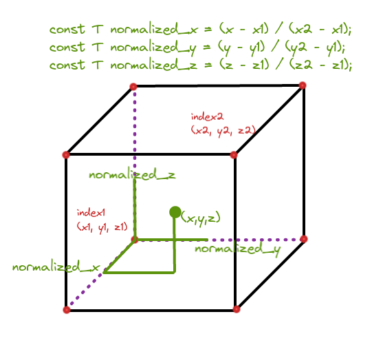
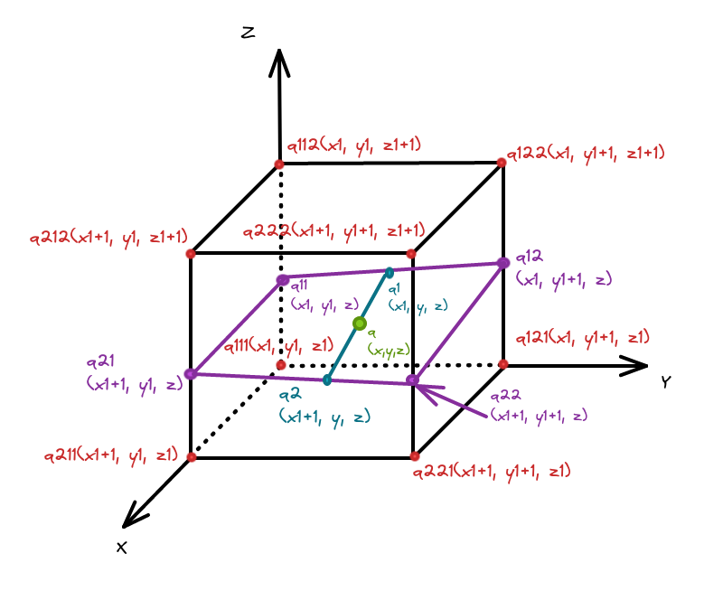

已知(x,y,z)和三维栅格地图hybrid_grid_

先求出(x,y,z)在地图中的一个栅格索引(x1, y1, z1),其中 $x1 < x,y1 < y,z1 < z,$ 

再找到该索引右上方的栅格索引( x2, y2, z2),其中 $x2 = x1 + 1,y2 = y1 + 1,z2 = z1 + 1,$ 


```c++
*x1 = lower.x();
*y1 = lower.y();
*z1 = lower.z();
*x2 = lower.x() + hybrid_grid_.resolution();
*y2 = lower.y() + hybrid_grid_.resolution();
*z2 = lower.z() + hybrid_grid_.resolution();
```


将(x,y,z)归一化



1. 用t来表示normalized_x或者normalized_y或者normalized_z
2. 栅格索引(a1, b1, c1)处的概率值为g1；
3. 栅格索引(a2, b2, c2)处的概率值为g2；

对概率值进行三次插值，已知条件：
$$
\begin{cases}
f(t) = g_{1} &\text{if t = 0}\\
f(t) = g_{2} &\text{if t = 1}\\
f(t)' = 0 &\text{if t = 0,分段函数需要在端点处连续}\\
f(t)' = 0 &\text{if t = 1,分段函数需要在端点处连续}
\end{cases}
$$
那么，根据泛函分析(变分法)可以得知， $f(t)$为三次多项式是最优解
$$
f(t) = a_0 \times t^3 + a_1 \times t^2 + a_2 \times t + a_3
$$
将(2)式代入(1)式可得,
$$
\begin{cases}
g_{1} &= a_3 \\
g_{2} &= a_0 + a_1 + a_2 + a_3 \\
0 &= a_2 \\
0 &= 3 \times a_0 + 2 \times a_1 + a_2
\end{cases}
$$


解得
$$
f(t) = (g_1 - g_2) \times 2 \times t^3 - (g_1 - g_2) \times 3 \times t^2 + g_1
$$


计算(x1, y1, z1),( x2, y2, z2)相邻的共8个栅格的概率值：

q111(x1, y1, z1)

q112(x1, y1, z1+1)

q121(x1, y1+1, z1)

q122(x1, y1+1, z1+1)

q211(x1+1, y1, z1)

q212(x1+1, y1, z1+1)

q221(x1+1, y1+1, z1)

q222(x1+1, y1+1, z1+1)



```c++
const Eigen::Array3i index1 =
    hybrid_grid_.GetCellIndex(Eigen::Vector3f(x1, y1, z1));
const double q111 = hybrid_grid_.GetProbability(index1);
const double q112 =
    hybrid_grid_.GetProbability(index1 + Eigen::Array3i(0, 0, 1));
const double q121 =
    hybrid_grid_.GetProbability(index1 + Eigen::Array3i(0, 1, 0));
const double q122 =
    hybrid_grid_.GetProbability(index1 + Eigen::Array3i(0, 1, 1));
const double q211 =
    hybrid_grid_.GetProbability(index1 + Eigen::Array3i(1, 0, 0));
const double q212 =
    hybrid_grid_.GetProbability(index1 + Eigen::Array3i(1, 0, 1));
const double q221 =
    hybrid_grid_.GetProbability(index1 + Eigen::Array3i(1, 1, 0));
const double q222 =
    hybrid_grid_.GetProbability(index1 + Eigen::Array3i(1, 1, 1));
```

保持x,y一致，先对z进行插值，利用计算得到的8个索引的概率值：q111、q112、q121、q122、q211、q212、q221、q222可以计算得到：

q11(x1, y1, z)

q12(x1, y1 + 1, z)

q21(x1 + 1, y1, z)

q22(x1 + 1, y1 + 1, z)

处的概率值

```c++
// q111为g1, q112为g2，可以得到q11
const T q11 = (q111 - q112) * normalized_zzz * 2. +
    (q112 - q111) * normalized_zz * 3. + q111;
// 以下同理
const T q12 = (q121 - q122) * normalized_zzz * 2. +
    (q122 - q121) * normalized_zz * 3. + q121;
const T q21 = (q211 - q212) * normalized_zzz * 2. +
    (q212 - q211) * normalized_zz * 3. + q211;
const T q22 = (q221 - q222) * normalized_zzz * 2. +
    (q222 - q221) * normalized_zz * 3. + q221;
```

然后利用q11、q12、q21、q22可以得到：

q1(x1, y, z)

q2(x1 + 1, y, z)

处的概率值

```c++
const T q1 = (q11 - q12) * normalized_yyy * 2. +
    (q12 - q11) * normalized_yy * 3. + q11;
const T q2 = (q21 - q22) * normalized_yyy * 2. +
    (q22 - q21) * normalized_yy * 3. + q21;
```

最后利用q1、q2得到q(x, y, z)处的概率值

```c++
return (q1 - q2) * normalized_xxx * 2. + (q2 - q1) * normalized_xx * 3. +
           q1;
```

