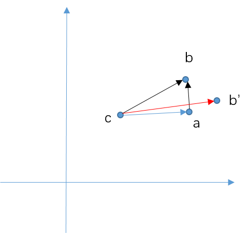

原文：[cartographer 3D scan matching 理解](https://www.cnblogs.com/mafuqiang/p/10885616.html)

生成直方图的过程描述如下，

1）首先将输入点云按照Z轴方向切成n个切片；

2）将每个slice中的点进行排序：

​	a. 计算该slice中点云的均值；

​	b. 并求每个point与质心连线与x轴所成的角度；	

​	c. 按照角度排序所有点。

3）将每个slice中的点映射到histogram直方图中：

a. 计算每个slice的质心 c（其实可以理解为laser的位置，因为360°扫描）；

b. 设置第一个点为参考点 a，因为排过序，所以第一个点应为与x轴角度最小的点；

c. 连接当前点 b（参考点的下一个点）和参考点 a，并计算它与x轴的夹角，按照夹角映射到直方图；

d. 计算该点的权重，即ab与bc的垂直程度，直方图元素即为权重的累加值。

理解：

需要注意，当当前点和参考点超出一定距离时，需要重置参考点，因此当前点可以认为是参考点的临点，处于一个邻域内；

另外，需要格外注意的是，匹配过程中通常需要先将点云按照角分辨率和角度搜索窗口进行旋转，生成所有候选scan，然后在每个角度scan内匹配xyz窗口，而这里的这种匹配方法刚好对距离并不敏感，如对于同一个视角，c点距离ab的远近并不影响ab和bc的角度，同样不影响权重大小的计算，所以我觉得这种计算方法有一定道理，事实上它也是先通过这种方法筛选角度搜索窗口内的一些scan，然后在进行xyz平移的遍历，获得最优的位移；

权重的计算思想，当ab和bc*乎垂直时，说明ab可能是一个垂直于激光扫描线束的*面，这时探测结果应该是比较准确的，相反，如果ab'与b‘c*乎*行时，说明扫描线束平行于障碍物，这时可能探测误差较大（可能由传感器引起，也有可能是孔洞、玻璃等），因此权重应该降低。

