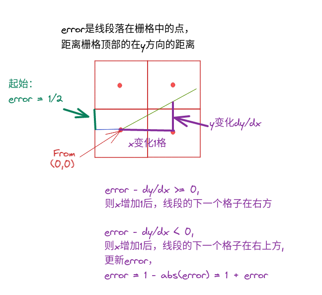
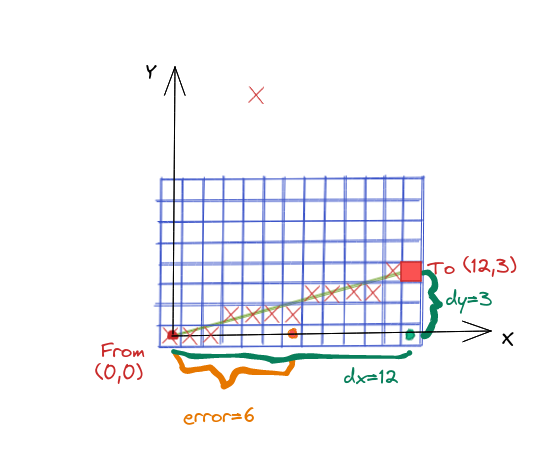

```c++
void UpdateFreeSpaceFromSegment(const RaySegment& segment,
                                const std::vector<uint16>& miss_table,
                                mapping_2d::ProbabilityGrid* result) {
  Eigen::Array2i from = result->limits().GetXYIndexOfCellContainingPoint(
      segment.from.x(), segment.from.y());
  Eigen::Array2i to = result->limits().GetXYIndexOfCellContainingPoint(
      segment.to.x(), segment.to.y());
  bool large_delta_y =
      std::abs(to.y() - from.y()) > std::abs(to.x() - from.x());
  // 保证δx比δy大
  if (large_delta_y) {
    std::swap(from.x(), from.y());
    std::swap(to.x(), to.y());
  }
  // 保证x递增
  if (from.x() > to.x()) {
    std::swap(from, to);
  }
  const int dx = to.x() - from.x();
  const int dy = std::abs(to.y() - from.y());
  // 利用error来判断是否超过一格，除以dx比较好理解，error' = 1/2
  int error = dx / 2;
  // 若to的y比from的y大,y依次加1，若to的y比from的y小,y依次减1
  const int direction = (from.y() < to.y()) ? 1 : -1;

  for (; from.x() < to.x(); ++from.x()) {
    if (large_delta_y) { // 前面互换了x,y，所以需要再换回来
      result->ApplyLookupTable(Eigen::Array2i(from.y(), from.x()), miss_table);
    } else {
      result->ApplyLookupTable(from, miss_table);
    }
    // 更新from
    // 即error' = 1/2 - dy/dx，即x方向挪动一格，y方向增加了多少
    error -= dy;
    if (error < 0) {
      from.y() += direction;
      error += dx;
    }
  }
}
```

算法：

前提：

1、dx比dy大

2、to的x比from的x大

3、若to的y比from的y大,y依次加1

若to的y比from的y小,y依次减1

4、error'= error /dx



error' * dx，则

```c++
// 利用error来判断是否超过一格，除以dx比较好理解，error' = 1/2
int error = dx / 2;
// 即error' = 1/2 - dy/dx，即x方向挪动一格，y方向增加了多少
error -= dy;
if (error < 0) {
    from.y() += direction;
    error += dx;
}
```




假设from为(0,0)，to为(12，3)

则freespace更新过程如下：

1. from（0，0）处为freespace；

   error=6-3=3;

2. (1，0）处为freespace；

   error=3-3=0;

3. (2，0）处为freespace；

   error=0-3=-3;

   y+1 = 1;

   error + 12 = 9;

4. (3，1）处为freespace；

   error=9-3=6;

5. (4，1）处为freespace；

   error=6-3=3;

6. (5，1）处为freespace；

   error=3-3=0;

7. (6，1）处为freespace；

   error=0-3=-3;

   y+1 = 2;

   error + 12 = 9;

8. (7，2）处为freespace；

   error=9-3=6;

9. (8，2）处为freespace；

   error=6-3=3;

10. (9，2）处为freespace；

    error=3-3=0;

11. (10，2）处为freespace；

    error=0-3=-3;

    y+1 = 1;

    error + 12 = 9;

12. (11，3）处为freespace；

    error=9-3=6;

    